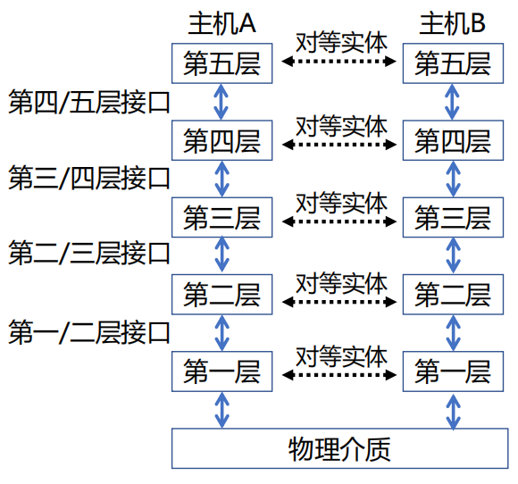
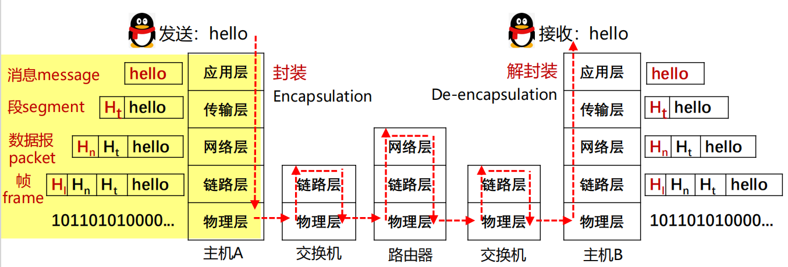
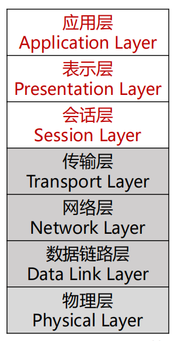
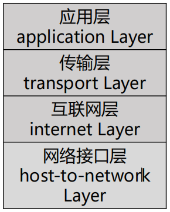
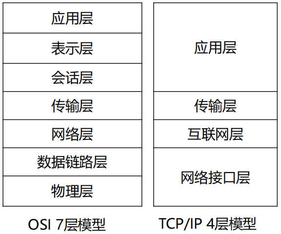
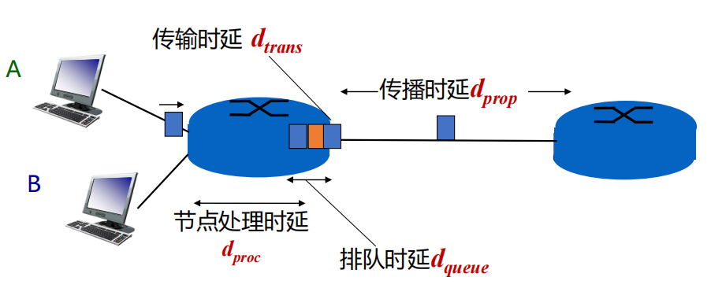

# <i class="fa-solid fa-network-wired"></i> 计算机网络
协议、公式、概念

::: card summary
::: note Summary
1. 了解计算机网络在经济生活中的应用范围及其重要性
2. 了解网络的基本概念，**掌握典型交换方式及其优缺点**
3. **掌握分层结构和网络协议（核心内容）**
4. **掌握网络参考模型（核心内容）**
5. 掌握计算机网络主要度量的含义
6. 了解网络安全与威胁
7. 了解制定网络协议的标准化组织
8. 了解国内外互联网发展史，以史为鉴
:::
:::

::: card concept
## 网络核心

**目标**：将海量的端系统互联起来

**两大功能：**

1. **路由**：确定数据分组从源到目标所使用的路径（<mark>全局操作</mark>）
    1. 需要路由协议和路由算法，产生**路由表**
2. **转发**：路由器或交换机将接收到的数据分组转发出去（<mark>局部操作</mark>）
    1. 确定转发出去的接口/链路：根据从“入接口”收到分组头中的目的地址，**查找本地路由表**，确定“出接口”

:::

::: card exam
## 典型交换方式
**电路交换 Circuit Switching**：通常采用<mark>面向连接方式</mark>

1. 先呼叫建立连接，实现端到端的资源**预留**
2. 电路交换连接建立后，<mark>物理通路被通信双方**独占**，资源专用，**即使空闲也不与其他连接共享**</mark>

::: note
- **优点**：传输性能好
- **缺点**：**无法应对互联网中广泛存在的“突发”（Burst）流量**；但如果传输中发生设备故障，则传输被中断
:::
:::

::: card exam
**存储转发的报文交换 Message 
Switching**

1. **存储转发机制**：路由器需要<mark>接收到完整的整个数据报文后</mark>，才能开始向下一跳发送
2. **缺点**：存储转发带来报文的<mark>传输延迟</mark>

**分组交换 Packet Switching**：将大报文拆分成多个小分组，通信双方<mark>以**分组**为数据传输单元、使用**存储-转发机制**</mark>，实现数据交互的通信方式

1. 每个分组的首部都含有**地址（目的地址和源地址）等<mark>控制信息</mark>**
2. 每个分组在互联网中**<mark>独立</mark>地选择传输路径**
3. 支持灵活的统计多路复用

    > 主机A和B的报文分组**按需**共享带宽，称为统计多路复用
:::

::: card summary
::: note 典型交换方式的比较
1. 电路交换需要建立连接并预留资源，**难以实现灵活复用**
2. 报文交换和分组交换**较灵活，抗毁性高，在传送突发数据时可提高网络利用率**
3. 由于分组长度小于报文长度，分组交换比报文交换的**时延小，也具有更好的灵活性**
:::
::: note summary Summary
**分组交换适合有大量突发数据传输需求的互联网**
:::
:::

::: card exam
## 协议与分层结构
### 网络协议
为进行网络中的数据交换而建立的规则、标准或约定，即**网络协议(network protocol)**

**设计目的**：可靠性、资源分配、拥塞问题、自适应性、安全问题

### 协议分层结构
层次栈 (a stack of layers)：为降低网络设计的复杂性，<mark>网络使用层次结构的协议栈，每一层都使用其下一层所提供的服务，并为上层提供自己的服务</mark>
:::

::: card exam
::: columns 2
对等实体 (peers)：不同机器上构成相应层次的实体成为对等实体

接口 (interface)：在每一对相邻层次之间的是接口；接口定义了下层向上层提供哪些<mark>服务原语</mark>

网络体系结构 (network architecture)：层和协议的集合为网络体系结构
> 一个特定的系统所使用的一组协议，即每层的协议，称为**协议栈**

|||

:::
:::

::: card exam
::: note 发送端：层层封装；接收端：层层解封装

:::
:::

::: card exam
### 服务原语 (Service Primitives)
1. **面向连接的服务**：每个“请求”或“响应”后，都在对方产生一个“指示”或“确认”动作
2. **无连接的服务**：邮件携带了完整的目标地址，<mark>传输过程不需要应答</mark>

::: note 服务与协议的关系：协议是“水平”的，服务是“垂直”的
1. 实体使用协议来实现其定义的服务
2. 上层实体通过接口使用下层实体的服务
:::
:::

::: card example
::: note Example
A protocol is an agreement between the ________ on how communication is to proceed.

A. network layers on the same machine

B. network nodes

C. adjacent entities

D. peers on different nodes

**Answer:** D
:::
:::

::: card exam
## 参考模型
::: columns 2 (5:1)
### OSI 参考模型
1. 物理层：定义如何在信道上传输 0、1
2. 数据链路层：实现**相邻**网络实体间的数据传输
3. 网络层：将数据包**跨越网络**（不在同一个局域网）从源设备发送到目的设备
4. 传输层：将数据从源端口发送到目的端口**（进程到进程）**
|||

:::
:::

::: card exam
5. **会话层**：利用传输层提供的服务在<mark>应用程序</mark>之间建立和维持会话，并能使会话获得同步
6. **表示层**：关注所传递信息的<mark>语法和语义</mark>，管理数据的表示方法，传输的数据结构
7. **应用层**：通过应用层协议，提供应用程序便捷的<mark>网络服务调用</mark>

::: columns 2 (3:1)
### TCP/IP 模型
1. 链路层（Link Layer）
2. 互联网层（Internet Layer）
3. **传输层**：允许源主机与目标主机上的**对等实体**，进行端到端的数据传输
4. 应用层（Application Layer）
|||

:::

:::

::: card exam
::: note OSI 模型与 TCP/IP 模型比较
::: columns 2 (3:2)
1. OSI 模型网络层能够支持无连接和面向连接通信；TCP/IP 模型的网络层**仅支持无连接通信（IP）**
2. **不足**
    1. OSI 模型**从未真正被实现**
    2. TCP/IP 模型欠缺完整性，**未包含物理层与数据链路层**
|||

:::
:::
:::

::: card
## 计算机网络度量单位
**包转发率 (PPS)**：全称是Packet Per Second(包/秒)，表示交换机或路由器等网络设备以包为单位的转发速率

**时延带宽积** = 传播时延 $\times$ 带宽，即按比特计数的链路长度

::: note
若发送端连续发送数据，则在发送的第一个 bit 即将达到终点时，发送端就已经发送了<mark>时延带宽积个 bit</mark> ，而这些 bit 都在链路上向前移动
:::

**吞吐量 (throughput)**：单位时间内通过某个网络(或信道、接口)的数据量，**单位是 b/s**

**有效吞吐量 (goodput)**：单位时间内目的地正确接收到的有用信息的数目，**以 bit 为单位**
:::

::: card
**时延 (Delay)**

- 传输时延(transmission)：数据从结点进入到传输媒体所需要的时间，又称为发送时延
- 传播时延(propagation)：电磁波在信道中需要传播一定距离而花费的时间
- 处理时延(processing)：主机或路由器在收到分组时，为处理分组所花费的时间
- 排队时延(queueing)：分组在路由器输入输出队列中排队等待处理所经历的时延

(50)

:::