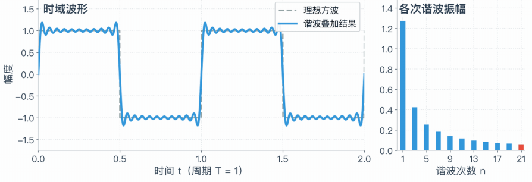
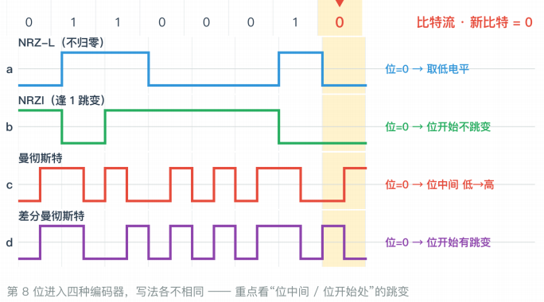

# 物理层

::: card concept
## 物理层基本概念
**位置：**网络体系结构中的最低层

**功能：**如何在连接各计算机的传输媒体上<mark class="green">**传输数据比特流**</mark>

- 数据链路层将<mark>数据比特流</mark>传送给物理层
- 物理层将比特流按照传输媒体的需要<mark>进行编码</mark>
- 然后将信号通过传输媒体传输到<mark>下一个节点的物理层</mark>

**作用：**尽可能地屏蔽掉不同传输媒体和通信手段的差异，为数据链路层提供一个统一的数据传输服务
:::

::: card
### 物理层常用标准
1. **点对点通信线路**：用于直接连接两个节点
    1. EIA RS-232-C 标准（用的比较多）
    2. EIA RS-449 标准
2. **广播通信线路**：一条公共通信线路连接多个节点
    1. 传统以太网、快速以太网、千兆以太网、万兆以太网
    2. 无线局域网
:::

::: card exam
## 数据通信基本概念
### 傅立叶分析

$$
g(t)=c+\sum_{n=1}^{\infty} a_n\sin(2\pi nft)
+\sum_{n=1}^{\infty} b_n\cos(2\pi nft)
$$

::: note 系数的求解：已知 \(g(t)\)，求 \(c,\ a_n,\ b_n\)

- 将等式两边从 \(0\) 到 \(T\) 积分，可得 $c=\frac{2}{T}\int_0^T g(t)\,dt$
- 等式两边乘 \(\sin(2\pi nft)\)，并从 \(0\) 到 \(T\) 积分，得 $a_n=\frac{2}{T}\int_0^T g(t)\sin(2\pi nft)\,dt$
- 等式两边乘 \(\cos(2\pi nft)\)，并从 \(0\) 到 \(T\) 积分，得 $b_n=\frac{2}{T}\int_0^T g(t)\cos(2\pi nft)\,dt$
:::
:::

::: card exam
**傅立叶合成**：方波 = 基波 + 奇次谐波叠加

1. <mark>谐波次数越多，波形越逼真</mark>
2. 理想的方波的陡沿需要无线带宽，而现实信道带宽有限，信号必然会失真

(80)
:::

::: card concept
### 有限带宽信号
#### **相关概念**
1. **频谱**：一个信号所包含的频率的范围
2. **信号的绝对带宽**：频谱的宽度
3. **有效带宽（带宽）**：信号的主要能量集中在相对窄的频带内
::: note
带宽越宽，信息承载能力越强
:::
:::

::: card exam
#### 信号在信道上传输时的特性
1. <mark>因为对不同傅立叶分量的衰减不同，引起输出失真</mark>
2. 信道有<mark>截止频率 $f_c$</mark>（主要由信道的物理特性决定）
    1. 0 ~ $f_c$ 的振幅衰减较弱（0 ~ $f_c$ 是信道的有限带宽）
    2. $f_c$ 以上的振幅衰减厉害
3. 实际使用时，可以接入滤波器，限制用户的带宽
4. 通过信道的谐波次数越多，信号越逼真
:::

::: card example
::: note Example
对于比特率为 \(B\) bps 的信道，发送 8 位所需的时间为 $T=\frac{8}{B}$ 秒

若 8 位作为一个周期 \(T\)，则一次谐波的频率为 $f_1=\frac{1}{T}=\frac{B}{8}\ \text{Hz}$ 

<mark>能通过信道的最高次谐波数目</mark>为 $N=\frac{f_c}{f_1}$ 

> 其中 \(f_c\) 为信道截止频率，\(f_1\) 为基频，即一次谐波频率

若音频线路的截止频率为 3000 Hz，则 $N=\frac{f_c}{f_1}=\frac{24000}{B}$

**所以传输速率越高，能够保留下来的谐波越少，信号越难准确恢复。**
:::
:::

::: card exam
### 信道的最大数据传输速率
#### **奈奎斯特定理**
<mark>无噪声</mark>有限带宽信道的最大数据传输速率为  

$$
2H\log_2(V)
$$

> 其中 $H$ 为信道带宽，$V$ 为信号电平的级数

::: note 符号率（Symbol rate / 波特率（Baud rate））与数据率（Data rate）
Data rate = Symbol rate × bits per symbol
:::
:::

::: card exam
#### **香农定理**
带宽为 $H$ 赫兹，信噪比为 $S/N$ 的<mark>任意信道</mark>的最大数据传输率为：

$$
H\log_2(1 + S/N) (bps)
$$

> 这只是上限，难以达到

::: note
1. 随机噪声出现的大小用<mark>**信噪比** $S/N$</mark> 来衡量：$10\log_{10}(S/N)$ （单位：分贝）
2. **信息量**：$I = -log_a p$

    > 其中 $p$ 为消息所表示的事件发生的概率， $a$ 为进制，单位是 bit
:::

:::

::: card example
::: note Example
**A noiseless channel is 8 MHz wide. How many bits per second can be sent if 8-level digital signals are used?**

A) 16 Mbps  B) 24 Mbps  C) 64 Mbps  D) 48 Mbps

**Answer:** D

**Analysis:** 代入公式即可
:::
:::

::: card
### 传输方式
::: columns 2 (3:4)
1. **单工、半双工和全双工**
    1. **单工**：只能沿一个指定的方向
    2. **半双工**：间可以在两个方向上传送数据信号，<mark>但不能同时进行</mark>
    3. **全双工**：可以在两个方向上同时传送
|||
2. **基带传输和频带传输**：是否搬其频谱
    1. **频带传输 Passband**：<mark>搬移频谱的目的是为了适应信道的频率特性</mark>
3. **数字通信和模拟通信**
4. **串行传输和并行传输**
5. **点到点传输/点到多点传输**
:::
:::

::: card 
#### 数据编码技术（Baseband）
::: columns 2 (3:4)
- **NRZ**: 负电平表示“0” ，正电平表示“1”
    - **缺点**：难以分辨一位的结束和另一位的开始
- **曼彻斯特码**（相位编码）: 从低跳到高表示“0”，从高跳到低表示“1”
- **NRZI**: 逢“1”电平跳变，逢“0”电平不跳变
|||

:::
:::

::: card 
#### Passband

**定义**：用基带信号对载波进行调制，使其变为适合于线路传送的信号

- **调制（Modulation）**：用基带脉冲对载波信号的某些参量进行控制，使这些参量**随基带脉冲变化**
- **解调（Demodulation）**：调制的反变换

::: note
**三种调制技术**：可以分别调整幅度、频率和相位

**实现**：分为 I、Q 两组信号，<mark>只需要改变 I、Q 组信号的幅度</mark>，就可以实现这些调制
:::

:::

::: card mistake
:::
::: card example
:::
::: card summary
:::
::: card question
:::