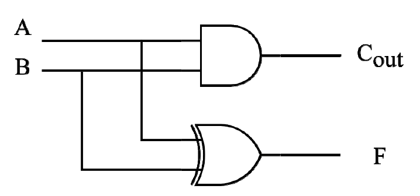
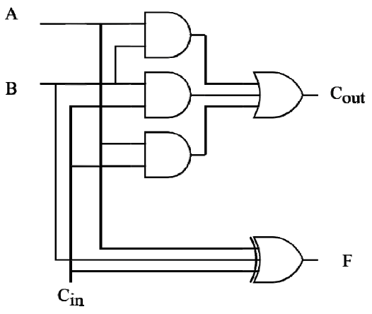
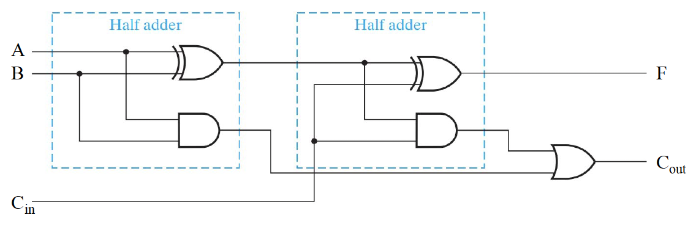
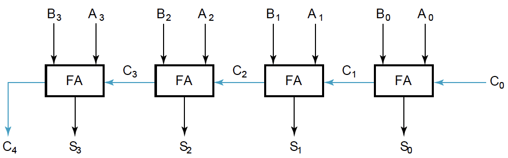
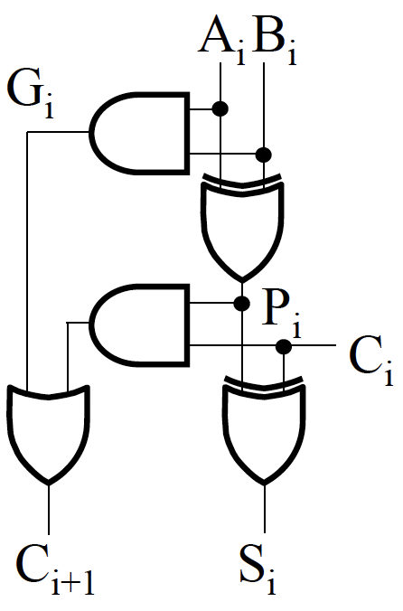
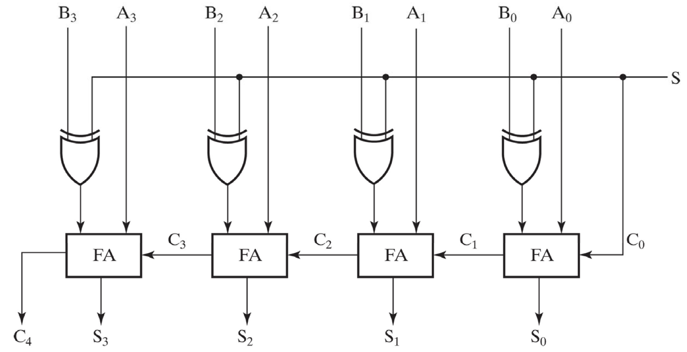
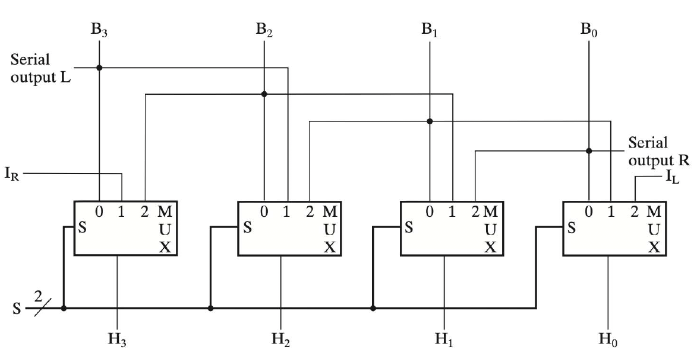

# ALU

## 加法器
### 单比特加法器
#### 半加器
Half Adder

1. **真值表**

|Input||Output||
|:--:|:--:|:--:|:--:|
|**$A$**|**$B$**|**$F$**|**$C$**|
|0|0|0|0|
|0|1|1|0|
|1|0|1|0|
|1|1|0|1|

2. **逻辑函数**

$$C_{out} = AB$$

$$F = A \oplus B$$

3. **电路图**

{style="width:40%;display: block;margin: 20px auto"}

---
#### 全加器
Full Adder

1. **真值表**

|Input|||Output||
|:--:|:--:|:--:|:--:|:--:|
|**$A$**|**$B$**|**$C_{in}$**|**$F$**|**$C_{out}$**|
|0|0|0|0|0|
|0|0|1|1|0|
|0|1|0|1|0|
|0|1|1|0|1|
|1|0|0|1|0|
|1|0|1|0|1|
|1|1|0|0|1|
|1|1|1|1|1|

2. **逻辑函数**

$$C_{out} = AB + (A \oplus B)C_{in}$$

$$F = A \oplus B \oplus C_{in}$$

3. **电路图**

{style="width:40%;display: block;margin: 20px auto"}

!!! note "Note"
    也可以利用两个半加器组成一个全加器。

    {style="width:80%;display: block;margin: 20px auto"}

### 多比特加法器
#### 行波进位加法器
Ripple-Carry Adder(RCA)

1. **组成**：串联多个`1 bit`加法器

2. **电路图** 

{style="width:70%;display: block;margin: 20px auto"}

3. **缺点**：运算速度慢

---
#### 超前进位加法器
**Carry-Lookahead Adder(CLA)**

1. **原理**：提前计算进位

2. **逻辑函数**

- $P_i = A_i \oplus B_i$：$P_i = 1$ 表示 $A_i$ 和 $B_i$ 其中有一个为`1`
- $Q_i = A_iB_i$：$Q_i = 1$ 表示 $A_i$ 和 $B_i$ 均为`1`
- $S_i = P_i \oplus C_i$
- $C_{i+1} = G_i + P_iC_i$

3. **电路图**

{style="width:20%;display: block;margin: 20px auto"}

---
## 减法器
### 无符号数减法
1. **公式**

$$A - B = A + \bar{B} +1$$

2. **结果修正**

- 进位为`1`：表示结果正确
- 进位为`0`：结果为负数，取反加一得到正确结果

---
### 加减法器
1. **电路图**

{style="width:60%;display: block;margin: 20px auto"}

2. **原理**

- 通过控制信号 $S$ 来控制加减法
    - $S = 0$：加法
    - $S = 1$：减法
- **公式**：

    $$A + (B \oplus C_0 ...(n位)) + C$$

---
## ALU
**原理**：

- 通过选择信号选择需要进行的运算
- 利用多路选择器实现

### 移位操作
1. **逻辑移位**

- $A<<N = A \times 2^N$
- 移位后补`0`

2. **算术移位**

- $A>>>N = A \div 2^N$
- 移位后，高位补符号位，低位补`0`

3. **循环移位**

- `11001 ROR 2 = 01110`
- `11001 ROL 2 = 00111`

??? abstract "移位器电路图"
    {style="width:80%;display: block;margin: 20px auto"}

---
## 乘法器

### 无符号乘法
#### 分离存储（方法1）
1. **数据长度**：

- `Multiplier`:32 bits  
- `Multiplicand`:64 bits  
- `Product`:64 bits
- `ALU`:64 bits

2. **计算步骤**：
  
- 若`multiplier[0]=1`，则`product = product + multiplicand`  
- `multiplier`右移1位  
- `multiplicand`左移1位  

??? example "Example"
    **e.g.** 0010 × 0110 (2 × 6)

    | 序号 | 操作  | Multiplier | Multiplicand   | Product       |
    |:--:|:--|:--:|:--:|:-------:|
    | 0 | 初始值  | 0110 |  0000 0010  | 0000 0000     |
    | 1    | 1: multiplier[0]=0 → 无操作       | 0110       | 0000 0010      | 0000 0000     |
    |      | 2: multiplier右移/multiplicand左移| 011        | 0000 0100      | 0000 0000     |
    | 2    | 1: multiplier[0]=1 → product + multiplicand  | 011        | 0000 0100      | 0000 0100     |
    |      | 2: multiplier右移/multiplicand左移                 | 01         | 0000 1000      | 0000 0100     |
    | 3    | 1: multiplier[0]=1 → product + multiplicand  | 01         | 0000 1000      | 0000 1100     |
    |      | 2: multiplier右移/multiplicand左移            | 0          | 0001 0000      | 0000 1100     |
    | 4    | 1: multiplier[0]=0 → 无操作       | 0          | 0001 0000      | 0000 1100     |
    |      | 2: multiplier右移/multiplicand左移            | -          | 0010 0000      | -             |

    **Product**：0000 1100 (12)

---

#### 分离存储（方法2）
1. **数据长度**：

- `Multiplier`:32 bits  
- `Multiplicand`:32 bits  
- `Product`:64 bits
- `ALU`:32 bits

2. **计算步骤**：
  
- 若`multiplier[0]=1`，则`product的高位 += multiplicand` 
- `product`右移1位  
- `multiplier`右移1位  

??? example "Example"
    **e.g.** 0010 × 0110 (2 × 6)

    | 序号 | 操作  | Multiplier | Multiplicand   | Product       |
    |:--:|:--|:--:|:--:|:------:|
    | 0    | 初始值      | 0110       | 0010         | 0000 ****|
    | 1    | 1: multiplier[0]=0 → 无操作       | 0110       | 0010         | 0000 **** |
    |      | 2: multiplier/product右移         | *011        | 0010         | 0000 0**\*     |
    | 2    | 1: multiplier[0]=1 → product的高位 += multiplicand  | *011        | 0010         | 0010 0**\*     |
    |      | 2: multiplier/product右移            | **01         | 0010         | 0001 00**    |
    | 3    | 1: multiplier[0]=1 → product的高位 += multiplicand  | **01         | 0010         | 0011 00**    |
    |      | 2:multiplier/product右移                 | **\*0          | 0010         | 0001 100*   |
    | 4    | 1: multiplier[0]=0 → 无操作       | **\*0          | 0010         | 0001           | 100*****   |
    |      | 2: multiplier/product右移               | ****          | 0010         | 0000 1100 |

    **Product**：0000 1100 (12)

---
#### 合并存储
1. **数据长度**：

- `multiplicand`:32 bits
- `product + multiplier`:64 bits  
- `ALU`:32 bits

2. **计算步骤**：

- 若`multiplier[0]=1`，则`product的高位 += multiplicand` 
- 将 `product + multiplier` 整体右移1位  

??? example "Example"
    **e.g.** 0010 × 0110 (2 × 6)

    | 序号 | 操作  | Multiplier | Multiplicand   | Product$\|$Multiplier       |
    |:--:|:--|:--:|:--:|:----:|
    |        0          | 初始值    | 0110    | 0010     | 0000 0110  |  
    |        1          | 1:multiplier[0]=0 → 无操作         | 0110               | 0010                   | 0000 0110                                |  
    |                   | 2: product + multiplier整体右移 | *011          | 0010                   | 0000 0011                                |  
    |        2          | 1: multiplier[0]=1 → product的高位 += multiplicand |*011           | 0010                   | 0010 0011                                |  
    |                   | 2: product + multiplier整体右移 | **01      | 0010                   | 0001 0001                                |  
    |        3          | 1:multiplier[0]=1 → product的高位 += multiplicand | **01      | 0010                   | 0011 0001                                |  
    |                   | 2: product + multiplier整体右移 | ***0      | 0010                   | 0001 1000                                |  
    |        4          | 1: multiplier[0]=0 → 无操作      | ***0       | 0010                   | 0001 1000                                |  
    |                   | 2: product + multiplier整体右移 | **** | 0010                   | 0000 1100                                |  

---
### 有符号乘法
**Booth算法（合并存储）**

1. **数据长度**：

- `Multiplicand`:32 bits  
- `Product + Multiplier`:65 bits（加一位附加位：开始时为`0`）
- `ALU`:32 bits  

2. **计算步骤**：

- 检查最后两位（`Multiplier[0]`和附加位）：  
  - `10` → `Product高位 -= Multiplicand`  
  - `01` → `Product高位 += Multiplicand`  
  - `00`/`11` → 无操作  
- `Product`整体右移1位（补符号位）  

??? example "Example"
    **e.g.** 0010 × 1101 (2 × -3)  

    | 序号 | 操作                            | Multiplicand | Product$\Vert$Multiplier |  
    |:----:|:--------------------------------------|:------------:|:------------------------:|  
    | 0    | 初始值（附加位=0）                    | 0010         | 0000 1101 0              |  
    | 1    | 1:10 → Product高位 -= Multiplicand      | 0010         | 1110 1101 0              |  
    |      | 2:`Product`算术右移1位                           |              | 1111 0110 1              |  
    | 2    | 1:01 → Product高位 += Multiplicand      | 0010         | 0001 0110 1              |  
    |      | 2:`Product`算术右移1位                           |              | 0000 1011 0              |  
    | 3    | 1:10 → Product高位 -= Multiplicand      | 0010         | 1110 1011 0              |  
    |      | 2:`Product`算术右移1位                           |              | 1111 0101 1              |  
    | 4    | 1:11 → 无操作                           | 0010         | 1111 0101 1              |  
    |      | 2:`Product`算术右移1位                           |              | 1111 1010 1              |  

    **Product**：1111 1010 (-6的补码表示)  

---
## 除法器
### 无符号除法
#### 方法 1

1. **数据长度**：

- `Divisor`:64 bits（初始高32位为除数，低32位为0）  
- `Dividend + Remainder`:64 bits（初始高32位为0，低32位为被除数）  
- `Quotient`:32 bits  
- `ALU`:64 bits  

2. **计算步骤**：

- 判断`Remainder - Divisor`  
    - 负：`Remainder`不变，`Quotient[0] = 0`  
    - 非负：`Remainder = Remainder - Divisor`，`Quotient[0] = 1`  
- `Divisor`右移1位  
- `Quotient`左移1位  

!!! tip "Tips"
    其余方法不再赘述（好像没考过🤭）

---
### 有符号除法

!!! tip "Tips"
    只能将符号拿出来单独讨论，不再赘述！