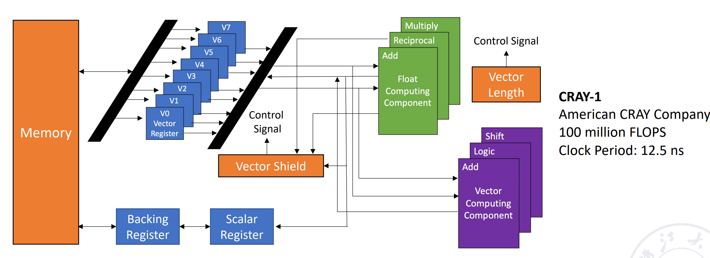
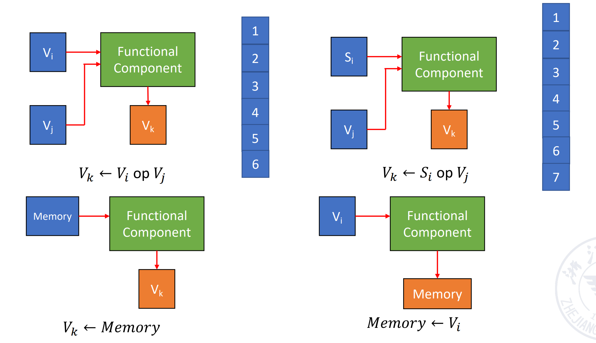
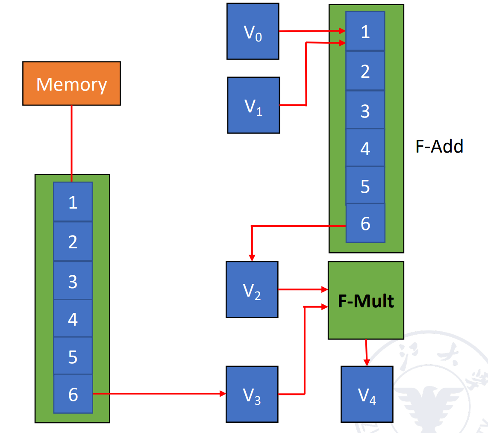
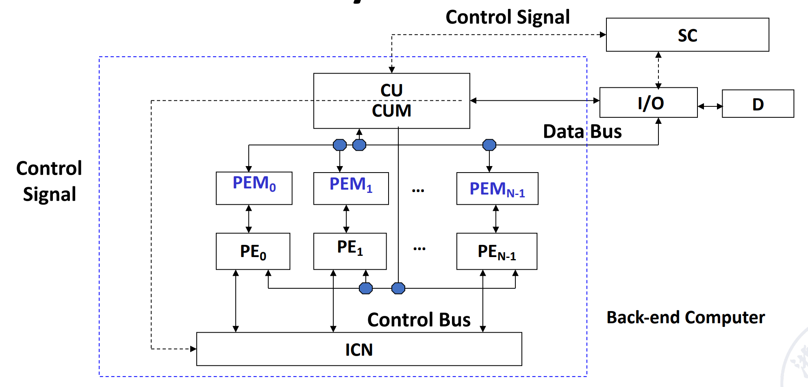
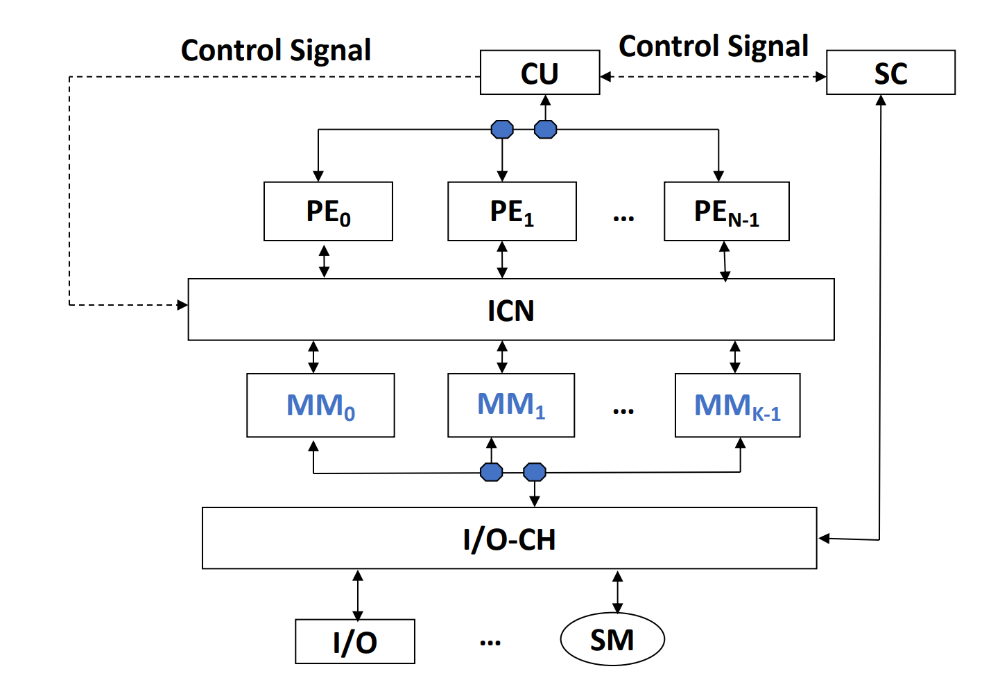
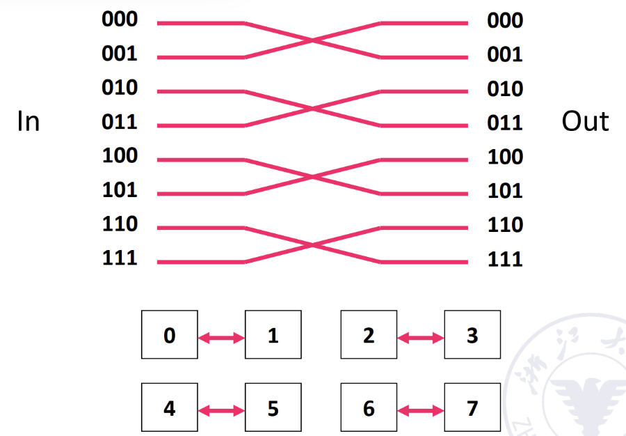
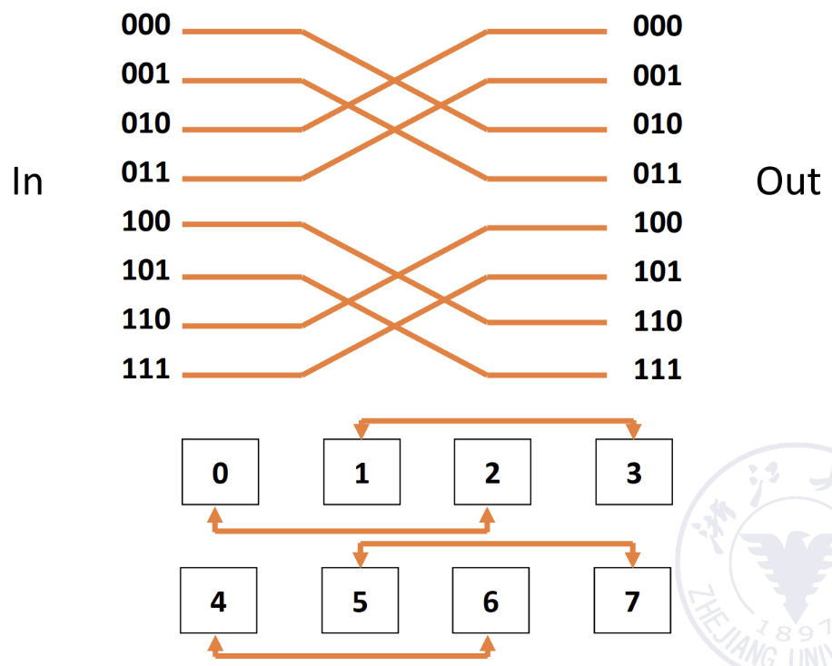
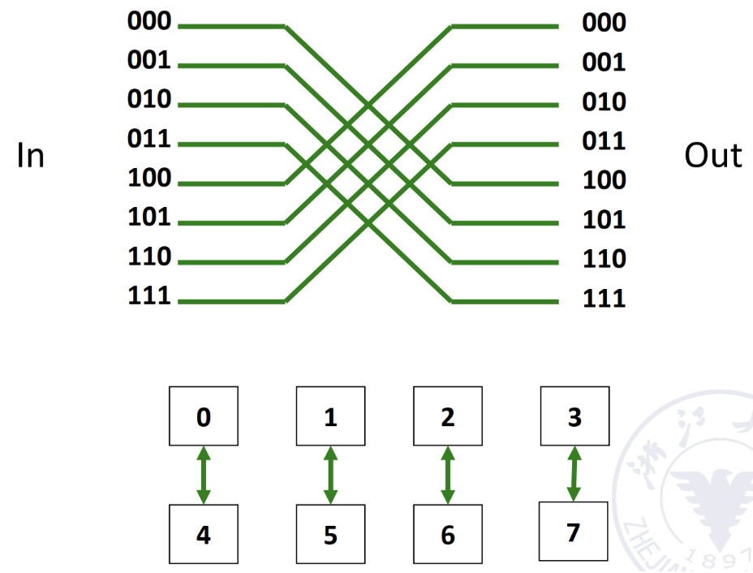
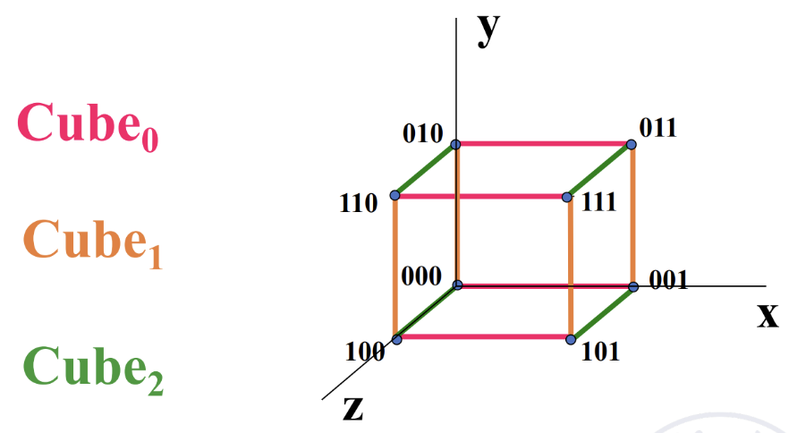

# 数据级并行 DLP

## SIMD: vector processor

1. 向量处理器（**vector processor**）：一种流水线处理器，采用向量数据表示方式并配备相应的向量指令
2. 标量处理器（**scalar processor**）：一种流水线处理器，不采用向量数据表示方式，也没有相应的向量指令

### 处理方式
!!! example "Example"
    D = A × (B + C) 其中 A、B、C、D 均为长度为 N 的向量

1. **Horizontal processing method**：向量计算按行进行，从左到右逐个计算

    !!! example "Example"
        首先计算 \(d_1 \leftarrow a_1 \times (b_1 + c_1)\) ，接着计算 \(d_2 \leftarrow a_2 \times (b_2 + c_2)\)，以此类推，循环程序如下：
        
        $$
        \begin{aligned}
        k_i &\leftarrow b_i + c_i \\
        d_i &\leftarrow a_i \times k_i
        \end{aligned}
        $$
        
        **循环里的两个语句存在数据相关，因此有 N 个数据相关，需要进行 2N 次功能切换（每次计算都切换）。**

        !!! warning "缺点"
            1. 在计算每个分量时，会产生 **RAW 相关**，因此流水线效率较低
            2. 如果采用**静态多功能流水线**，流水线必须频繁切换功能，其**吞吐率甚至低于顺序串行执行**
            3. 因此，**水平处理方式不适合向量处理器**

2. **Vertical processing method**
    1. **处理器要求**：Memory-Memory Structure
    2. 向量指令的源向量和目标向量都存放在存储器中，运算产生的中间结果也需要送回存储器

    !!! example "Example"
        先计算加法，B+C 得到一个向量 K，再计算乘法，A*K 得到 D

        **只有 1 次数据相关，2 次功能切换**

3. **Group (Horizontal and vertical) processing method**：将向量划分为若干组，**组内做纵向运算，组间做横向运算**
    1. **处理器要求**：Register-Register Structure

    !!! example "Example"
        设 N = S × n + r，其中 N 为向量长度，S 为分组数，n 为每组长度，r 为余数
        
        如果剩余的 r 个元素也单独作为一组处理，则总共有 **S + 1 组**

        **总共有数据相关：S+1 次，功能切换：2(S+1) 次**

### CRAY-1


1. **CRAY-1**：寄存器-寄存器型（Register-Register）向量流水线处理机
2. **支持的4类基本向量指令**：
    1. 向量-向量运算、向量-标量运算、Load、Store
    2. 向量加法需要 6 拍；向量乘法需要 7 拍；读写需要 6 拍

    {style="width:80%;display: block;margin: 20px auto"}

3. **结构**：
    1. 有 12 条**可并行工作的单功能流水线**，能够以流水线方式执行各种地址运算、向量运算和标量运算
    2. 有 8 个**向量寄存器**，每组向量寄存器有 64 位
    3. 每个向量寄存器 Vi 都有一条**独立总线**，与 6 个**向量功能部件**相连接
    4. 每个向量功能部件也都有一条总线，用于将运算结果返回到向量寄存器总线

#### 冲突

!!! success "Success"
    只要不存在 Vi 冲突和功能部件冲突，那么各个向量寄存器 Vi 与各个功能部件**都可以并行工作，从而大幅提高向量指令的处理速度。**

1. **Vi conflict**：并行工作的各条向量指令，其源向量或结果向量使用了同一个向量寄存器 Vi
     
    !!! example "Example"
        1. **写后读**

            ```asm
            V0 ← V1 + V2
            V3 ← V0 × V4
            ```

        2. **只读数据**：**如果寄存器端口数量不足，就会发生寄存器访问竞争**

            ```asm
            V0 ← V1 + V2
            V3 ← V1 × V4
            ```

2. **Functional conflict**：并行工作的各条向量指令使用同一个功能部件

    !!! example "Example"
        假设机器只有一个乘法流水线

        ```asm
        V3 ← V1 × V2
        V5 ← V4 × V6
        ```

#### **性能提升方法**
1. 设置多个功能部件并使它们**并行工作**
2. 使用**向量链接技术**（Vector Chaining），加速一串向量指令的执行
    1. 两条相关指令，**先写后读**
    2. 如果**功能部件之间以及源向量之间没有冲突**，可以将功能部件**链接**进行**流水线**处理，从而加快执行速度
    3. **本质**：将流水线思想引入向量执行过程中，使后续向量指令在前一条指令结果产生后即可开始处理，提高并行度和吞吐量
 
    !!! example "Example"
        **假设：**
        
        1. 向量长度为 N ≤ 64，向量元素均为浮点数，向量 B 和 C 已分别存放在向量寄存器 V0 和 V1 中
        2. 将一个向量元素送入向量功能部件、将运算结果写入向量寄存器、从主存向取数功能部件发送数据均需要 1 拍

        ```asm
        V3 <- memory    // access vector A
        V2 <- V0 ＋ V1  // Vector B and Vector C perform floating point addition
        V4 <- V2 * V3   // Floating point multiplication, the result is stored in V4
        ```

        **前两条指令没有冲突，可以并行完成；第三条指令需要等前两条指令完成，存在 RAW，不能并行但可以链接**

        {style="width:40%;display: block;margin: 20px auto"}

        **加法计算出一个元素之后，可以紧接着执行乘法，输出第一个元素；之后每一拍输出一个元素**

        !!! question "Question"
            计算以下三种方法**得到所有结果所需拍数**：
            
            1. **串行执行**：[(1+6+1)+N-1] + [(1+6+1)+N-1] + [(1+7+1)+N-1] = 3N+22
            2. **在 (1) 和 (2) 并行执行后执行 (3)**：max{[(1+6+1)+N-1], [(1+6+1)+N-1]} + [(1+7+1)+N-1] = 2N+15
            3. **使用向量链接技术**：max{(1+6+1), (1+6+1)} + (1+7+1)+N-1 = N+16


3. 采用**循环开采技术**（Recycling Mining Technology）/**分段向量技术**（Segmented Vector Technology）：将长向量划分为若干个固定长度的段，采用循环方式处理，每次循环只处理一个向量段
5. 使用**多处理器系统**，进一步提高性能 


## SIMD: Array Processor

1. 阵列处理器也称为并行处理器
    1. 由 **N 个处理元素（PE₀ ~ PEₙ₋₁）**组成
    2. 处理元素通过特定互连方式形成数组
2. 根据系统中**存储器的组成方式**，阵列处理器可以分为两种基本结构：
    1. **分布式存储器**（Distributed Memory）：
        1. PE 代表处理器，PEM 是其对应的内存，ICN 是一个**内部的互联网络**
        2. 每个处理元素（PE）拥有**独立**的本地存储器
        
        {style="width:60%;display: block;margin: 20px auto"}

    2. **集中共享存储器**（Centralized Shared Memory）
        
        {style="width:60%;display: block;margin: 20px auto"}

### ICN
1. **互连网络**是由交换单元按照一定的拓扑结构和控制方式组成的网络，用于实现计算机系统中**多个处理器或多个功能部件**之间的互连
2. 一般由以下五部分**组成**：CPU、存储器（Memory）、接口（Interface）、链路（Link）、交换节点（Switch Node）

    !!! abstract "Abstract"
        1. **接口**：一种从 CPU 和存储器获取信息，并将信息发送到其他 CPU 和存储器的设备
        2. **链路**（Link）：传输数据比特的物理通道
            1. 链路可以是电缆、双绞线或光纤
            2. 可以采用串行传输或并行传输
            3. 每条链路都有其最大带宽
            4. 链路可以是：单工、半双工、全双工
            5. 链路采用的时钟机制可以是：同步、异步
        3. **交换节点**（Switch Node）：互连网络中的信息交换中心和控制中心，是一种具有多个输入端口和多个输出端口的设备，能够完成：数据缓冲存储、路径选择

??? quote "Some Key Points"
    1. 互连网络的拓扑结构：静态拓扑、动态拓扑
    2. 互连网络的时序模式：
        1. 同步系统：使用统一时钟，例如 SIMD 阵列处理器
        2. 异步系统：没有统一时钟，系统中的每个处理器独立工作
    3. 互连网络的交换方式：电路交换、分组交换
    4. 互连网络的控制策略
        1. 集中控制模式：具有全局控制器
        2. 分布式控制模式：没有全局控制器

3. 互连网络的**分类**
    1. **静态网络**：指节点之间的连接路径固定不变的网络，在程序执行过程中这种连接关系保持不变
    2. **动态网络**：由交换开关组成，可以根据应用需求动态改变连接状态，例如总线、交叉开关、多级交换网络等
4. 互连网络的**目标**：通过**有限数量**的连接方式，使任意两个处理单元（PE）能够**在一步或少数几步内**完成信息传输，从而实现特定问题求解算法
    1. **单级互连网络**：在唯一的一层网络中，通过有限数量的连接，实现任意两个处理单元之间的信息传输
    2. **多级互连网络**：由**多个单级网络串联**组成，以实现任意两个处理单元之间的连接
5. 输入 j 与输出 f(j) 通常采用**二进制编码**，其对应函数规律可以从二进制编码中推导出来，该规律即为**互连函数**
#### Cube 单级互联网络
1. N 个输入输出采用 n 位二进制编码（$n = \log_2 N$），表示为 $P_{n-1} \dots P_i \dots P_1 P_0$
2. **共有 n 个不同的互连函数**：第 i 位取反

    \[
    Cube_i(P_{n-1} \dots P_i \dots P_1 P_0) = P_{n-1} \dots \overline{P_i} \dots P_1 P_0
    \]

    !!! example  "Example"
        === "Cube 0"
            {style="width:50%;display: block;margin: 20px auto"}

        === "Cube 1"
            {style="width:50%;display: block;margin: 20px auto"}

        === "Cube 2"
            {style="width:50%;display: block;margin: 20px auto"}

3. 三维立方体（3D Cube）能够在**最多 3 次传输**内，实现任意两个处理单元之间的数据传输

    {style="width:50%;display: block;margin: 20px auto"}

    !!! success "超立方体网络"
        1. 当维度 n > 3 时，称为**超立方体网络（Hypercube Network）**
        2. 单级 n 维立方体网络的最大距离为 n，因此，任意两个处理单元（PE）之间的数据传输，**最多经过 n 次传递即可完成**
