# 数据级并行 DLP

!!! info "Flynn 分类法"
    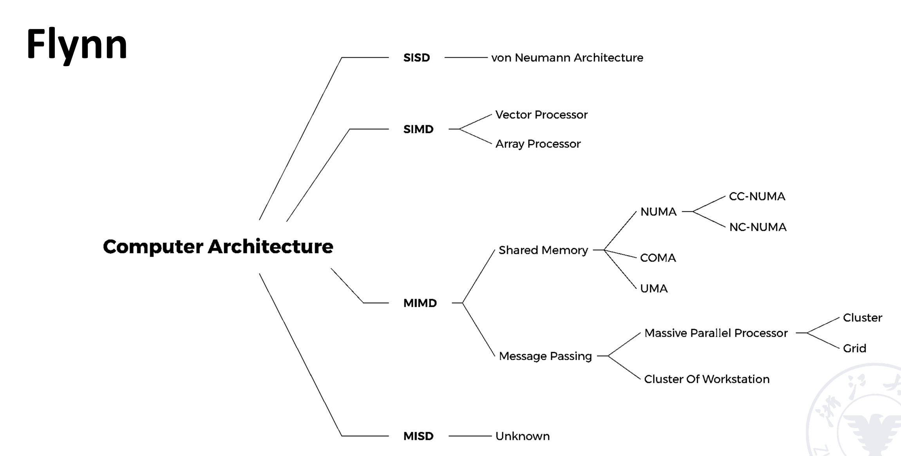

## SIMD: vector processor

1. 向量处理器（**vector processor**）：一种流水线处理器，采用向量数据表示方式并配备相应的向量指令
2. 标量处理器（**scalar processor**）：一种流水线处理器，不采用向量数据表示方式，也没有相应的向量指令

### 处理方式
!!! example "Example"
    D = A × (B + C) 其中 A、B、C、D 均为长度为 N 的向量

1. **Horizontal processing method**：向量计算按行进行，从左到右逐个计算

    !!! example "Example"
        首先计算 \(d_1 \leftarrow a_1 \times (b_1 + c_1)\) ，接着计算 \(d_2 \leftarrow a_2 \times (b_2 + c_2)\)，以此类推，循环程序如下：
        
        $$
        \begin{aligned}
        k_i &\leftarrow b_i + c_i \\
        d_i &\leftarrow a_i \times k_i
        \end{aligned}
        $$
        
        **循环里的两个语句存在数据相关，因此有 N 个数据相关，需要进行 2N 次功能切换（每次计算都切换）。**

        !!! warning "缺点"
            1. 在计算每个分量时，会产生 **RAW 相关**，因此流水线效率较低
            2. 如果采用**静态多功能流水线**，流水线必须频繁切换功能，其**吞吐率甚至低于顺序串行执行**
            3. 因此，**水平处理方式不适合向量处理器**

2. **Vertical processing method**
    1. **处理器要求**：Memory-Memory Structure
    2. 向量指令的源向量和目标向量都存放在存储器中，运算产生的中间结果也需要送回存储器

    !!! example "Example"
        先计算加法，B+C 得到一个向量 K，再计算乘法，A*K 得到 D

        **只有 1 次数据相关，2 次功能切换**

3. **Group (Horizontal and vertical) processing method**：将向量划分为若干组，**组内做纵向运算，组间做横向运算**
    1. **处理器要求**：Register-Register Structure

    !!! example "Example"
        设 N = S × n + r，其中 N 为向量长度，S 为分组数，n 为每组长度，r 为余数
        
        如果剩余的 r 个元素也单独作为一组处理，则总共有 **S + 1 组**

        **总共有数据相关：S+1 次，功能切换：2(S+1) 次**

### CRAY-1


1. **CRAY-1**：寄存器-寄存器型（Register-Register）向量流水线处理机
2. **支持的4类基本向量指令**：
    1. 向量-向量运算、向量-标量运算、Load、Store
    2. 向量加法需要 6 拍；向量乘法需要 7 拍；读写需要 6 拍

    {style="width:80%;display: block;margin: 20px auto"}

3. **结构**：
    1. 有 12 条**可并行工作的单功能流水线**，能够以流水线方式执行各种地址运算、向量运算和标量运算
    2. 有 8 个**向量寄存器**，每组向量寄存器有 64 位
    3. 每个向量寄存器 Vi 都有一条**独立总线**，与 6 个**向量功能部件**相连接
    4. 每个向量功能部件也都有一条总线，用于将运算结果返回到向量寄存器总线

#### 冲突

!!! success "Success"
    只要不存在 Vi 冲突和功能部件冲突，那么各个向量寄存器 Vi 与各个功能部件**都可以并行工作，从而大幅提高向量指令的处理速度。**

1. **Vi conflict**：并行工作的各条向量指令，其源向量或结果向量使用了同一个向量寄存器 Vi
     
    !!! example "Example"
        1. **写后读**

            ```asm
            V0 ← V1 + V2
            V3 ← V0 × V4
            ```

        2. **只读数据**：**如果寄存器端口数量不足，就会发生寄存器访问竞争**

            ```asm
            V0 ← V1 + V2
            V3 ← V1 × V4
            ```

2. **Functional conflict**：并行工作的各条向量指令使用同一个功能部件

    !!! example "Example"
        假设机器只有一个乘法流水线

        ```asm
        V3 ← V1 × V2
        V5 ← V4 × V6
        ```

#### **性能提升方法**
1. 设置多个功能部件并使它们**并行工作**
2. 使用**<span class="red">向量链接技术</span>**（Vector Chaining），加速一串向量指令的执行
    1. 两条相关指令，**先写后读**
    2. 如果**功能部件之间以及源向量之间没有冲突**，可以将功能部件**链接**进行**流水线**处理，从而加快执行速度
    3. **本质**：将流水线思想引入向量执行过程中，使后续向量指令在前一条指令结果产生后即可开始处理，提高并行度和吞吐量
 
    !!! example "Example"
        **假设：**
        
        1. 向量长度为 N ≤ 64，向量元素均为浮点数，向量 B 和 C 已分别存放在向量寄存器 V0 和 V1 中
        2. 将一个向量元素送入向量功能部件、将运算结果写入向量寄存器、从主存向取数功能部件发送数据均需要 1 拍

        ```asm
        V3 <- memory    // access vector A
        V2 <- V0 ＋ V1  // Vector B and Vector C perform floating point addition
        V4 <- V2 * V3   // Floating point multiplication, the result is stored in V4
        ```

        **前两条指令没有冲突，可以并行完成；第三条指令需要等前两条指令完成，存在 RAW，不能并行但可以链接**

        {style="width:40%;display: block;margin: 20px auto"}

        **加法计算出一个元素之后，可以紧接着执行乘法，输出第一个元素；之后每一拍输出一个元素**

        !!! question "Question"
            计算以下三种方法**得到所有结果所需拍数**：
            
            1. **串行执行**：[(1+6+1)+N-1] + [(1+6+1)+N-1] + [(1+7+1)+N-1] = 3N+22
            2. **在 (1) 和 (2) 并行执行后执行 (3)**：max{[(1+6+1)+N-1], [(1+6+1)+N-1]} + [(1+7+1)+N-1] = 2N+15
            3. **使用向量链接技术**：max{(1+6+1), (1+6+1)} + (1+7+1)+N-1 = N+16


3. 采用**循环开采技术**（Recycling Mining Technology）/**分段向量技术**（Segmented Vector Technology）：将长向量划分为若干个固定长度的段，采用循环方式处理，每次循环只处理一个向量段
5. 使用**多处理器系统**，进一步提高性能 

---
## SIMD: Array Processor

1. 阵列处理器也称为并行处理器
    1. 由 **N 个处理元素（PE₀ ~ PEₙ₋₁）**组成
    2. 处理元素通过特定互连方式形成数组
2. 根据系统中**存储器的组成方式**，阵列处理器可以分为两种基本结构：
    1. **分布式存储器**（Distributed Memory）：SIMD 阵列处理器的主流
        1. PE 代表处理器，PEM 是其对应的内存，ICN 是一个**内部的互联网络**
        2. 每个处理元素（PE）拥有**独立**的本地存储器
        
        {style="width:60%;display: block;margin: 20px auto"}

    2. **集中共享存储器**（Centralized Shared Memory）：多个 PE 通过互连网络访问共享存储模块
        
        {style="width:60%;display: block;margin: 20px auto"}

### <span class="red">ICN</span>
!!! warning "ICN 的重要性"
    若 n 个处理单元任意两两直连，需要连接数 n(n - 1) / 2，直连成本太高，因此需要通过互连网络实现“有限连接下的高效通信”。

1. **互连网络**是由交换单元按照一定的拓扑结构和控制方式组成的网络，用于实现计算机系统中**多个处理器或多个功能部件**之间的互连
2. 一般由以下五部分**组成**：CPU、存储器（Memory）、接口（Interface）、链路（Link）、交换节点（Switch Node）

    ??? abstract "定义"
        1. **接口**：一种从 CPU 和存储器获取信息，并将信息发送到其他 CPU 和存储器的设备
        2. **链路**（Link）：传输数据比特的物理通道
            1. 链路可以是电缆、双绞线或光纤
            2. 可以采用串行传输或并行传输
            3. 每条链路都有其最大带宽
            4. 链路可以是：单工、半双工、全双工
            5. 链路采用的时钟机制可以是：同步、异步
        3. **交换节点**（Switch Node）：互连网络中的信息交换中心和控制中心，是一种具有多个输入端口和多个输出端口的设备，能够完成：数据缓冲存储、路径选择

    ??? quote "Some Key Points"
        1. 互连网络的拓扑结构：静态拓扑、动态拓扑
        2. 互连网络的时序模式：
            1. 同步系统：使用统一时钟，例如 SIMD 阵列处理器
            2. 异步系统：没有统一时钟，系统中的每个处理器独立工作
        3. 互连网络的交换方式：电路交换、分组交换
        4. 互连网络的控制策略
            1. 集中控制模式：具有全局控制器
            2. 分布式控制模式：没有全局控制器

3. 互连网络的**分类**
    1. **静态网络**：指节点之间的连接路径固定不变的网络，在程序执行过程中这种连接关系保持不变
    2. **动态网络**：由**交换开关**组成，可以根据应用需求动态改变连接状态，例如总线、交叉开关、多级交换网络等
4. 互连网络的**目标**：通过**有限数量**的连接方式，使任意两个处理单元（PE）能够**在一步或少数几步内**完成信息传输，从而实现特定问题求解算法
    1. **单级互连网络**：在唯一的一层网络中，通过有限数量的连接，实现任意两个处理单元之间的信息传输
    2. **多级互连网络**：由**多个单级网络串联**组成，以实现任意两个处理单元之间的连接
5. 输入 j 与输出 f(j) 通常采用**二进制编码**，其对应函数规律可以从二进制编码中推导出来，该规律即为**互连函数**

#### 静态 ICN
##### Cube 单级互联网络

1. N 个输入输出采用 n 位二进制编码（$n = \log_2 N$），表示为 $P_{n-1} \dots P_i \dots P_1 P_0$
2. **共有 n 个不同的互连函数**：第 i 位取反

    \[
    Cube_i(P_{n-1} \dots P_i \dots P_1 P_0) = P_{n-1} \dots \overline{P_i} \dots P_1 P_0
    \]

    !!! example  "Example"
        === "Cube 0"
            {style="width:50%;display: block;margin: 20px auto"}

        === "Cube 1"
            {style="width:50%;display: block;margin: 20px auto"}

        === "Cube 2"
            {style="width:50%;display: block;margin: 20px auto"}

3. 三维立方体（3D Cube）能够在**最多 3 次传输**内，实现任意两个处理单元之间的数据传输

    {style="width:50%;display: block;margin: 20px auto"}

    !!! success "超立方体网络"
        1. 当维度 n > 3 时，称为**超立方体网络（Hypercube Network）**
        2. 单级 n 维立方体网络的最大距离为 n，因此，任意两个处理单元（PE）之间的数据传输，**最多经过 n 次传递即可完成**

##### PM2I 单级互联网络
**PM2I（Plus Minus 2^i）的互连函数**

\[
PM2_{+i}(j)=(j+2^i)\bmod N
\]

\[
PM2_{-i}(j)=(j-2^i)\bmod N
\]

1. 其中 N 为互连网络中的节点数，j 为节点编号，且 $0 \le j \le N-1$，$0 \le i \le \log_2 N - 1$
2. 一共有 $2 \log_2 N - 1$ 个不同的互连函数（最后两个一样）

!!! example "Example: N = 8"
    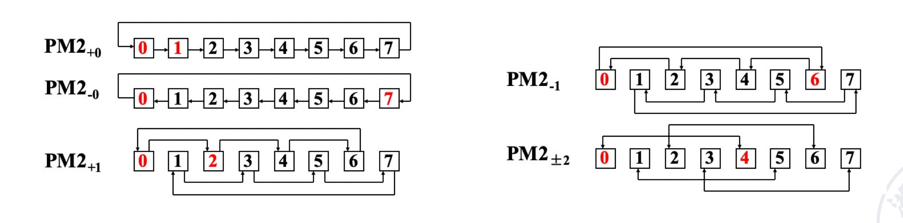{style="width:100%;display: block;margin: 20px auto"}

    可以通过两步实现互连。（0 可以一步到 1、2、4、6、7，再过一步可以到 3、5）

##### Shuffle exchange network
1. **由两部分组成**：shuffle 和 exchange
2. **N 维 shuffle 函数**：移位操作

    \[
    shuffle(P_{n-1}P_{n-2}...P_1P_0) = P_{n-2}...P_1P_0P_{n-1}
    \]

    其中 \(n = \log_2 N\), \(P_{n-1}P_{n-2}...P_1P_0\) 是输入编号的二进制编码

    !!! example "Example"
        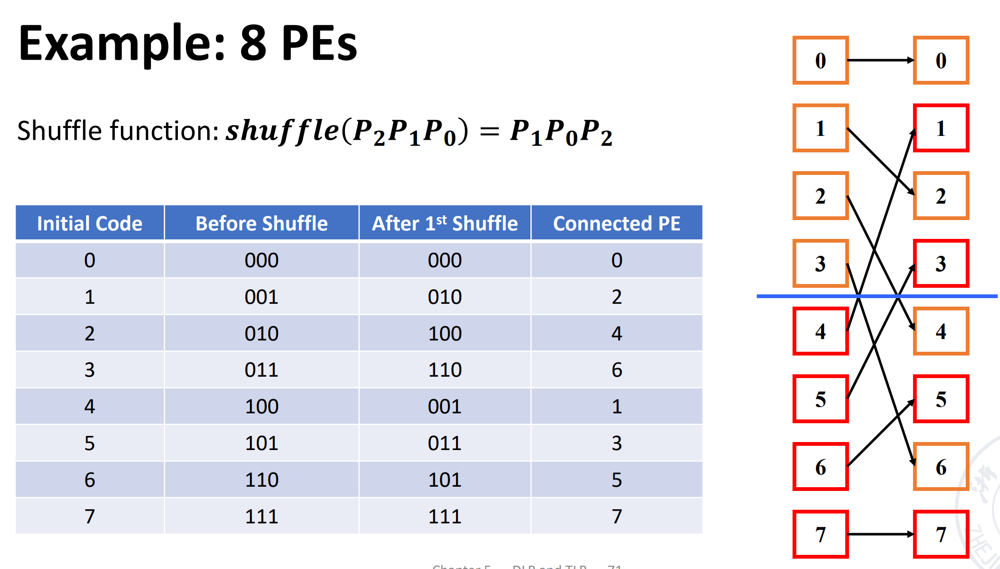{style="width:60%;display: block;margin: 20px auto"}

        经过 **3 次** shuffle 后其他点都回到了**原来的位置**，但是 000 和 111 并没有与其他点连接（不是连通图），因此我们在此的基础上加上 **exchange 的连线**

3. **exchange 的实现**：通过 Cube 0（红线部分）
    
    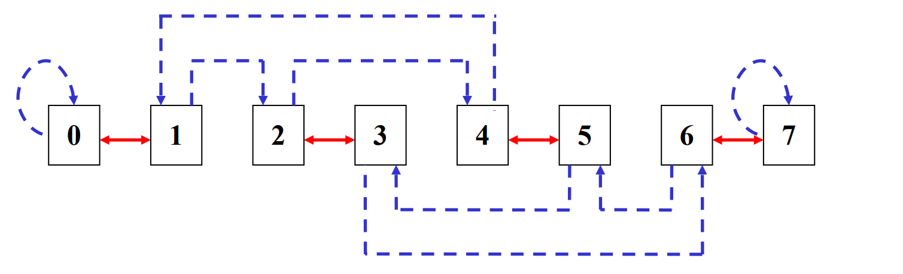{style="width:60%;display: block;margin: 20px auto"}

!!! success "Shuffle exchange network"
    上述例子任意两个节点相连最多需要 5 步，3 exchanges + 2 shuffles

    **推广**：数据传输最多需要经过 n** 次 exchange + n−1 次 shuffle**，因此最大距离 = 2n−1

!!! info "单级互联网络的特点"
    1. 结构简单，成本低
    2. 连接方式灵活，能够满足不同算法与应用需求
    3. 传输步骤较少，提高阵列运算速度
    4. 结构规则性与模块化程度高，有利于提升系统可扩展性
    5. 便于大规模集成

#### 常见静态拓扑图

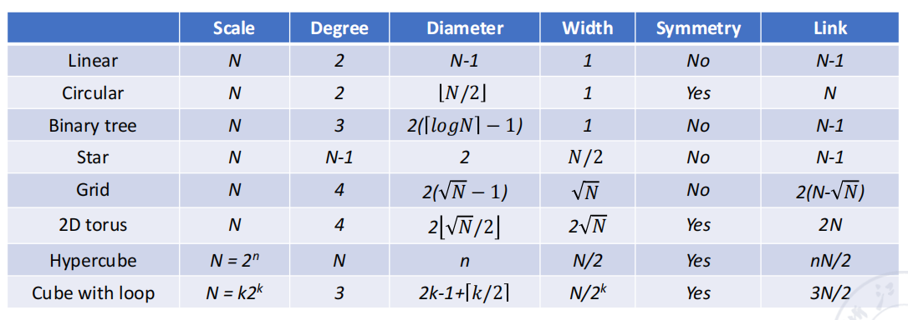{style="width:100%;display: block;margin: 20px auto"}

!!! info "静态拓扑图"
    具体图片请查看 PPT

#### 动态 ICN
1. **特性**：
    1. 动态网络中的**连接不是固定的**，可以在程序执行过程中按需要改变
    2. 网络中的**交换单元是主动的**，通过设置**开关状态**可以重构连接路径
    3. 只有位于**网络边界**的交换单元可以直接与**处理器**相连
2. 动态网络**主要包括**：总线（bus）、交叉开关（crossbar）、多级互连网络
3. 为了实现任意 PE 之间的连接，可以使用：
    1. **循环互连网络**：单级网络可以被重复使用多次进行循环连接
    2. **多级互连网络**：将多个单级互连网络串联起来使用
    3. **多级循环互连网络**：在多级互连网络基础上，再进行多次循环复用
4. **多级互连网络的差异**包括交换单元功能、交换控制方式、拓扑结构

##### 交叉开关
1. **交换单元**：具有 m 个输入和 m 个输出的交换单元被记为 m×m 的交换单元，其中 m = 2^k
2. **交换单元的状态**：直通（Straight）、交换（Exchange）、上广播（Upper broadcast）、下广播（Lower broadcast）
3. 根据交换单元的功能，2×2 交换单元可以分为**两功能和四功能交换单元** 

    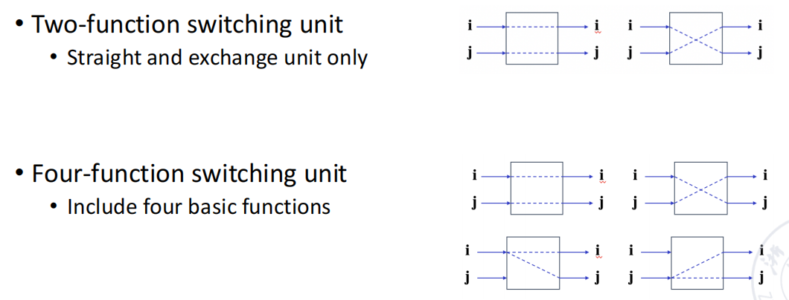{style="width:80%;display: block;margin: 20px auto"}

4. **多端交换单元**（Multi-end switching unit）：增加了广播（broadcast）和多播（multicast）模块
    
    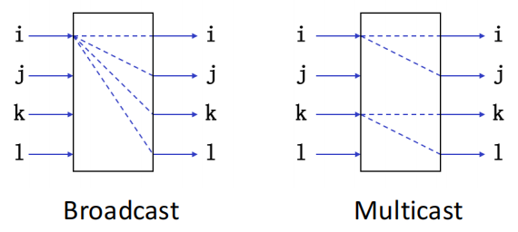{style="width:50%;display: block;margin: 20px auto"}

5. **拓扑**（Topology）：交换单元各级的**输入/输出端**之间相互连接的一种方式，**常见拓扑结构**：
    1. Multi-stage cube
    2. Multi-stage shuffle exchange
    3. Multi-stage PM2I
    4. 以上三种的组合结构

##### 多级 Cube ICN
1. **交换单元**：两功能交换单元
2. **控制方式**：分级控制、部分分级控制、单元控制
3. **拓扑结构**：立方体结构

!!! example "Example: 3D Cube ICN"
    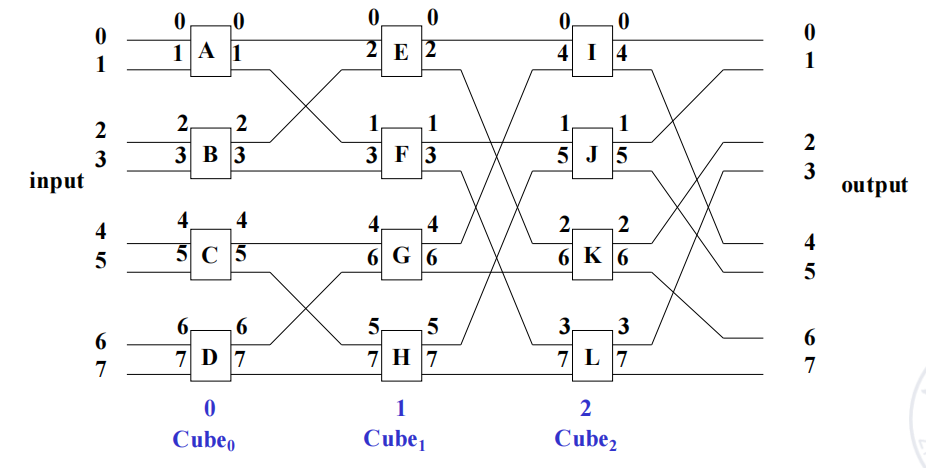{style="width:80%;display: block;margin: 20px auto"}

4. **N 维立方体 ICN**：
    1. 每一级包含 N/2 个两功能交换单元
    2. 网络级数 $n = \log_2 N$

!!! question "Question1"
    该并行处理器有 16 个处理器。**为了实现等效于以下功能**：4 组 4 元素交换、2 组 8 元素交换，以及 1 组 16 元素交换

    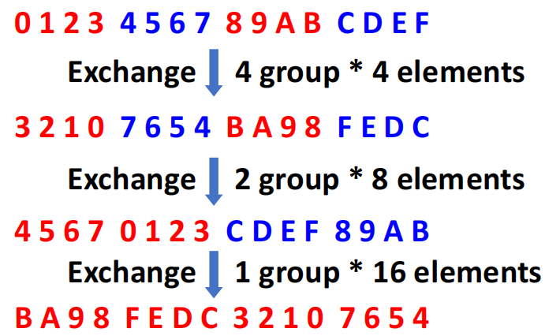{style="width:50%;display: block;margin: 20px auto"}

    !!! info "Info"
        1. cube 0 + cude 1 : 4 组 4 元素交换
        2. cube 0 + cube 1 + cube 2 : 2 组 8 元素交换
        3. cube 0 + cube 1 + cube 2 + cube 3 : 1 组 16 元素交换

!!! question "Question2"
    $$
    f(P_3 P_2 P_1 P_0) = \overline{P_3}\, P_2\, \overline{P_1}\, \overline{P_0}
    $$
    
    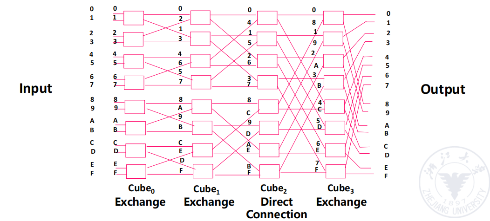{style="width:80%;display: block;margin: 20px auto"}

##### 多级 Shuffle exchange
1. 也称为 **Omega 网络**，是立方体网络的**逆网络**

    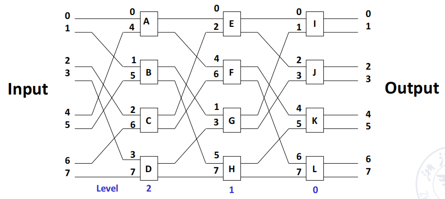{style="width:80%;display: block;margin: 20px auto"}

2. **特点**：
    1. 交换单元的**功能有四种**
    2. 网络拓扑结构采用 **Shuffle 连接结构 + 四功能交换单元**的形式
    3. 控制方式采用单元控制

!!! tip "Omega 网络和 n-cube 网络的区别"
    1. 级间数据流方向不同
        1. Omega 网络的数据流级次：n−1，n−2，…，1，0
        2. n-cube 网络的数据流级次：0，1，…，n−1
    2. 交换单元功能不同
        1. Omega 网络使用四功能交换单元
        2. n-cube 网络使用二功能交换单元
    3. 广播能力不同
        1. Omega 网络能够实现**一对多广播**功能
        2. n-cube 网络无法实现该功能


!!! success "SIMD **优点**"
    
    1. SIMD 架构可以在**数据级并行**方面充分利用优势，适用于面向矩阵的科学计算、面向多媒体的图像和音频处理器
    2. SIMD 比 MIMD **更节能**，每个数据操作只需获取一条指令
    3. SIMD 允许程序员继续按顺序思考 

---
## DLP in GPU
1. **基本思想**
    1. 异构执行模型：CPU 是主机（Host）；GPU 是设备（Device）
    2. 为 GPU 开发一种类似 C 语言的编程语言
    3. 将各种形式的 GPU 并行统一为 **CUDA 线程**
    4. 编程模型采用**单指令多线程**
2. **GPU 本质上就是多线程 SIMD 处理器**
3. **组织**
    1. 每个数据元素对应一个**线程**
    2. 多个线程组织成一个**线程块（Block）**
    3. 多个线程块组织成一个**网格（Grid）**
4. 线程管理由 **GPU 硬件**完成，而不是应用程序或操作系统负责
5. **GPU 存储结构**
    1. GPU Memory（全局内存）：所有 Grid 共享
    2. Local Memory（局部/共享内存）：同一个 Thread Block 内的所有线程共享
    3. Private Memory（私有内存）：每个 CUDA Thread 独享

??? abstract "NVIDIA GPU 与向量机"
    1. 与向量机的相似之处
        1. 适合处理**数据级并行**问题
        2. 支持 Scatter-Gather（分散-聚集） 数据传输
        3. 使用掩码寄存器
        4. 拥有大型寄存器文件
    2. 与向量机的不同之处
        1. 没有标量处理器
        2. 使用**多线程**来隐藏内存访问延迟
        3. 拥有大量功能单元，而向量处理器通常只有少量但深度流水化的功能单元
 
---
## LLP
**循环级并行**

```c
for (i = 0; i < 100; i = i + 1) {
A[i+1] = A[i] + C[i];      /* S1 */
B[i+1] = B[i] + A[i+1];   /* S2 */
}
```

!!! question "Question"
    ```c
    for (i=0; i<100; i=i+1) {
        A[i] = A[i] + B[i]; /* S1 */
        B[i+1] = C[i] + D[i]; /* S2 */
    }
    ```

    本轮的 S2 会影响下一轮的 S1：交换 S1 S2，随后把第一次和最后一次运算提出去，可以改为下面这样，就可以并行。

    ```c
    A[0] = A[0] + B[0];
    for (i=0; i<99; i=i+1) {
        B[i+1] = C[i] + D[i]; /* S2 */
        A[i+1] = A[i+1] + B[i+1]; /* S1 */
    }
    B[100] = C[99] + D[99];
    ```
