# 指令级并行 ILP

## <mark>**指令相关性**</mark>

1. **数据相关性**：后面的指令要读的寄存器，前面的指令正在写**（RAW）**
2. **名称相关性**
    - **输出相关性** (output-dependence)：两条指令写同一个寄存器**（WAW）**
    - **反相关性** (anti-dependence)：后面的指令要写的寄存器，前面的指令正在读**（WAR）**
3. **控制相关性**

!!! success "Instruction dependence VS Pipeline hazard"
    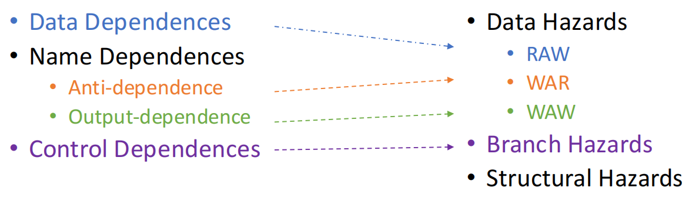{style="width:60%;display: block;margin: 20px auto"}

---
## 动态调度

!!! warning "Warning"
    ```asm
    FDIV.D F4, F0, F2
    FSUB.D F10, F4, F6
    FADD.D F12, F6, F14
    ```

    1. 前两条指令存在数据依赖，后边的指令需要等待出除法完成，才能继续执行
    2. 但是 `DIV` 语句的执行时间一般较长，这样就造成了浪费 

1. 为了克服延迟长的问题，需要引入**动态调度**
2. <mark>**动态调度的方法**：乱序执行 out-of-order execution</mark>

!!! warning "Warning"
    1. 在简单的五级流水线（按序执行）中，只有 **RAW 冒险**
    2. 但是<mark class="orange">当引入乱序执行（动态调度）后，出现了**两种新的冒险 WAR 和 WAW**</mark>
    3. **动态调度的算法**：Scoreboard 算法和 Tomasulo 算法

### Scoreboard 算法

1. **硬件结构**

    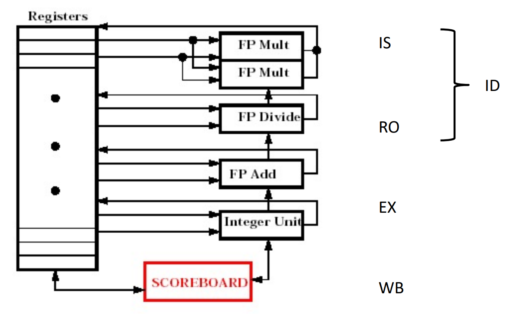{style="width:60%;display: block;margin: 20px auto"}

    - **`scoreboard`**：核心部件，用于记录指令的执行情况
    - **整数部件**：`load`、`store`、有效地址的运算等等
    - **两个乘法器**：使用频率较高，执行时间较长

2. <mark>**`ID`**阶段分为两个阶段</mark>
    - **`IS`**：指令译码，检查**结构**冲突**（按序发射）**
    - **`RO`**：等待直到没有**数据**冲突，读取操作数**（乱序执行）**

3. **Scoreboard 的三张核心表**

    ```asm
    FLD     F6, 34(R2)
    FLD     F2, 45(R3)
    FMUL.D  F0, F2, F4
    FSUB.D  F8, F2, F6
    FDIV.D  F10, F0, F6
    FADD.D  F6, F8, F2 
    ```

    - **指令状态表**：记录指令所在的阶段

        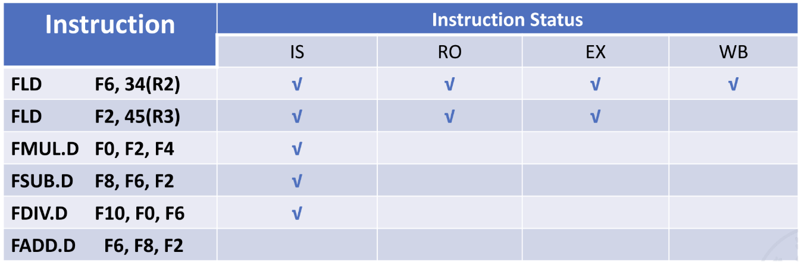{style="width:80%;display: block;margin: 20px auto"}

    - **功能部件状态表**

        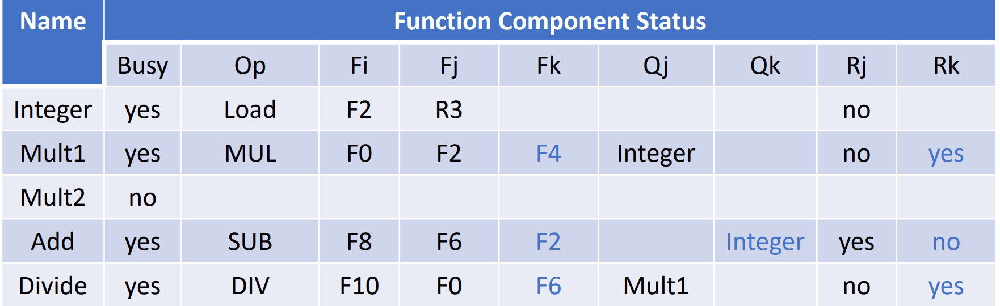{style="width:80%;display: block;margin: 20px auto"}

        - **`Busy`** 代表当前这个单元是否有指令正在使用
        - **`op`** 表示这个单元正在被哪类指令使用
        - **`Fi、Fj、Fk`** 代表源操作数和目的操作数（`Fi` 为结果寄存器，`Fj、Fk` 为源寄存器）
        - **`Qj、Qk`** 代表源操作数来自哪个部件
        - **`Rj、Rk`** 代表源操作数的状态
            - `yes`：操作数已经准备好但是还没有读（没读是因为其他的操作数还没有读）
            - `no & Qj=null`：操作数已经读取
            - `no & Qj!=null`：操作数还没有准备好（其他指令会修改这个操作数，而且还没有执行完毕）

    - **寄存器状态表**：记录每个寄存器将被哪个指令修改

        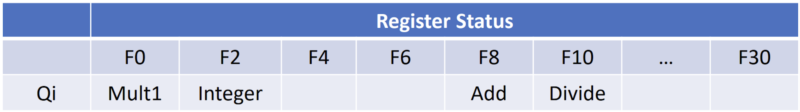{style="width:80%;display: block;margin: 20px auto"}

!!! success "乱序执行"
    1. 由于**乘法指令执行较慢**，`SUB` 指令比 `MUL` 指令先执行完，导致指令乱序执行
    2. 此时的 `ADD` 指令由于要写回 `F6` 寄存器，导致了 **`WAR` 冲突**，需要等待 `DIV` 指令读取后才能写回

    ??? example "此时的 Scoreboard"
        1. **指令状态表**

        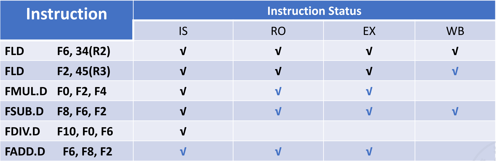{style="width:80%;display: block;margin: 20px auto"}

        2. **功能部件状态表**

        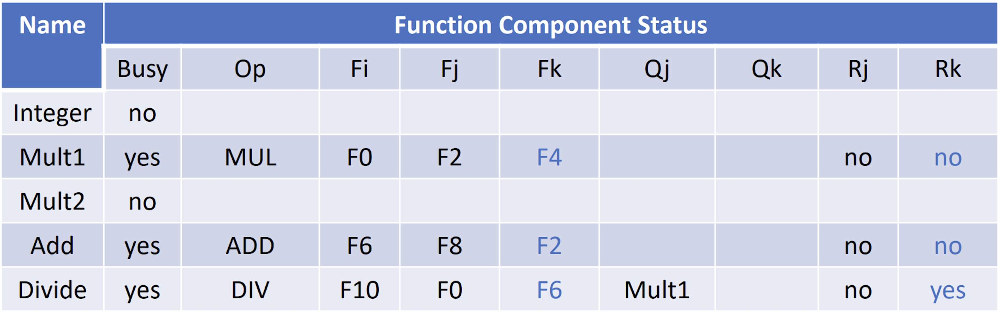{style="width:80%;display: block;margin: 20px auto"}

        3. **寄存器状态表**

        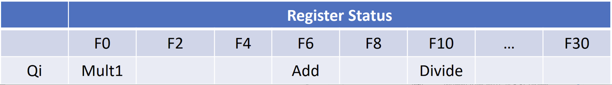{style="width:80%;display: block;margin: 20px auto"}

!!! warning "缺点"
    1. Scoreboard 算法<mark class="orange">可以检测出来冲突，**但没有解决冲突**，还是通过阻塞的方式来解决冲突</mark>
    2. scoreboard 上面的信息比较繁杂，效率不高

!!! question "Exercise"
    **假设：**加法、乘法、除法、加载指令分别需要 2 个时钟周期、10 个时钟周期、40 个时钟周期、1 个时钟周期

    ```asm
    FLD	    F6, 34(R2)
    FLD	    F2, 45(R3)
    FMUL.D	F0, F2, F4
    FSUB.D	F8, F6, F2
    FDIV.D	F10, F0, F6
    FADD.D	F6, F8, F2
    ```

    **使用记分牌算法，所有指令完成需要多少个时钟周期？**

    ??? success "Answer"
        |指令|IS|RO|EX|WB|Explanations|
        |:--|:--|:--|:--|:--|:--|
        |`FLD F6, 34(R2)`|1|2|3|4|指令进入流水线是**顺序的**|
        |`FLD F2, 45(R3)`|5|6|7|8|等待前一条 `FLD` 指令执行完，**整数部件空闲**时才能进入 `IS` 阶段|
        |`FMUL.D F0, F2, F4`|6|9|19|20|等待 `FLD` 写回 `F2` |
        |`FSUB.D F8, F6, F2`|7|9|11|12|等待 `FLD` 写回 `F2` |
        |`FDIV.D F10, F0, F6`|8|21|61|**62**|等待 `FMUL` 写回 `F0` |
        |`FADD.D F6, F8, F2`|13|14|16|22|等待 `FSUB` 执行完毕，**`ADD` 部件空闲**时才能进入 `IS` 阶段；</br>等待 `FDIV` 读取 `F6` 之后才能写回|

### Tomasulo 算法

1. **寄存器重命名**

    !!! example "Example"
        ```asm
        FDIV.D F0, F2, F4                           FDIV.D F0, F2, F4
        FADD.D F6, F0, F8                           FADD.D S, F0, F8
        FSD    F6, 0(R1)        /* 重命名 -> */      FSD    S, 0(R1)
        FSUB.D F8, F10, F14                         FSUB.D T, F10, F14
        FMUL.D F6, F10, F8                          FMUL.D F6, F10, T
        ```

        - 寄存器 `F8` 存在 WAR 冒险（2 & 4）
        - 寄存器 `F6` 存在 WAW 冒险（2 & 5）
        - 这些名称相关性可以通过**寄存器重命名技术**消除（本身的数据传递关系不能改变）

2. **硬件结构**

    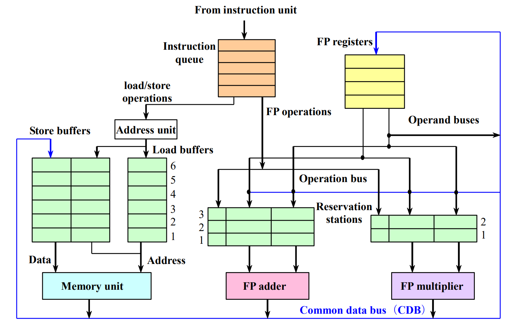{style="width:80%;display: block;margin: 20px auto"}

    - <mark>**保留站**</mark>：
        - 完成**重命名**：如果已经有正确的操作数值，直接填入保留站
        - **乱序执行：**指令操作数 ready 的指令先执行
    - <mark>**CDB**</mark>：将计算结果分布式的发往所有需要该结果的部件

3. **Tomasulo 算法的主要思想**

    - 能够追踪指令操作数的就绪状态，以**最大限度减少 RAW 冲突**
    - <mark>通过硬件实现寄存器重命名技术，**有效降低 WAW 和 WAR 冲突**</mark>
    
4. **Tomasulo 算法的三个阶段**

    - **Issue `IS`**：从 FIFO（先进先出队列）的头部获取下一条指令
        - 如果对应的保留站有空位，就将指令和对应的操作数**当前在寄存器中的值**放入保留站
        - 如果保留站**没有空位**，则指令阻塞等待
        - 如果操作数当前不在寄存器中，则需要追踪**将会产生这些操作数的功能单元**
    - **Execute `EX`**
        - 如果保留站里指令的操作数都 **ready**， 该指令就可以执行**（可能会乱序）**
        - <mark>**`Load/Store` 指令需要两步执行过程**</mark>
            - 基址寄存器就绪时，**计算有效地址**
            - 将计算出的有效地址放入加载缓冲区或存储缓冲区
    - **Write results `WB`**：通过 CDB 将执行结果写入**寄存器以及任何正在等待该结果的保留站**

    !!! tip "Store Buffer"
        存储指令的结果会缓存在存储缓冲区中，直到**待存储的数据值和存储地址**都准备就绪；一旦存储单元空闲，就立即将结果写入内存。

    ??? example "Example"
        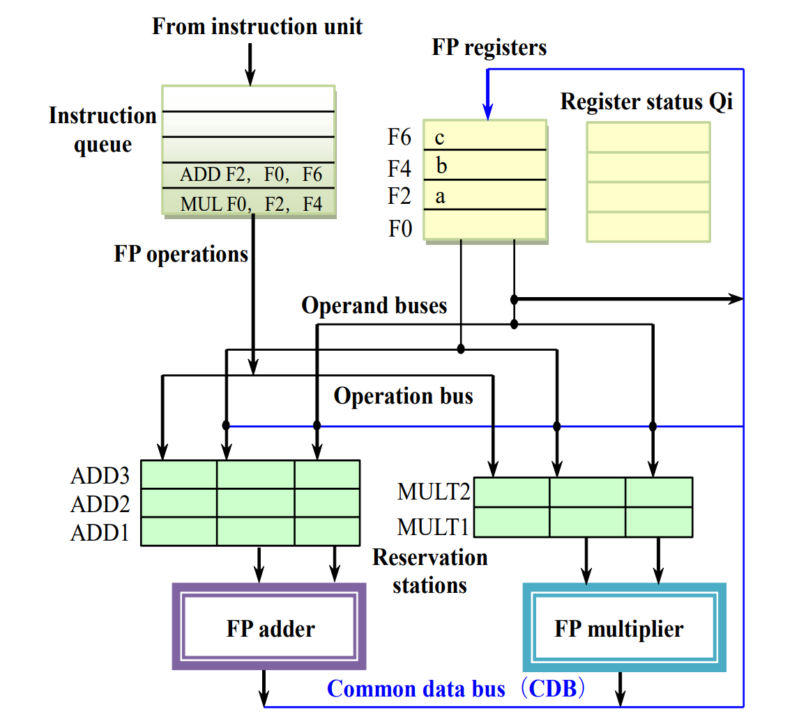{style="width:50%;display: block;margin: 20px auto"}

        对于上述两条指令，Tomasulo 算法的执行过程如下：

        ??? success "Answer"
            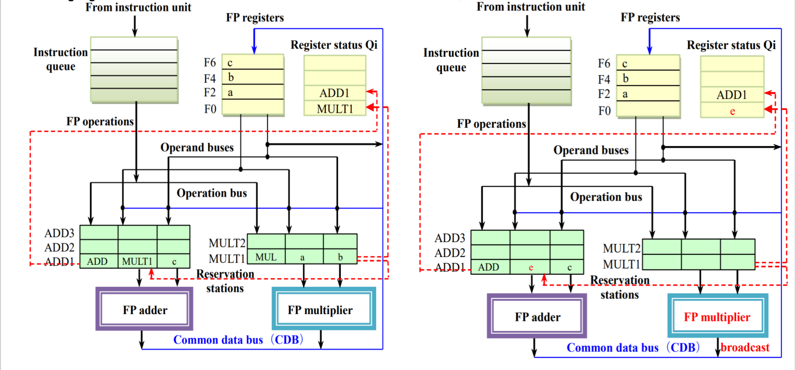

5. **Tomasulo 算法的三个表格**
    - **指令状态表**
    - **保留站状态表**
        - **`Op`**：执行的操作
        - **`Qj & Qk`**：产生相应源操作数的**保留站编号**
        - **`Vj & Vk`**：源操作数的**数值**（当操作数已就绪时）
        - **`Busy`**：是否被占用
        - **`A`**：加载或存储指令的内存地址计算信息
    - **寄存器状态表**：记录哪个保留站产生的运算结果应当存入该寄存器

!!! example "Example"
    ```asm
    FLD     F6, 34(R2)
    FLD     F2, 45(R3)
    FMUL.D  F0, F2, F4
    FSUB.D  F8, F6, F2
    FDIV.D  F10, F0, F6
    FADD.D  F6, F8, F2
    ```

    ??? abstract "状态表"
        - **指令状态表**

            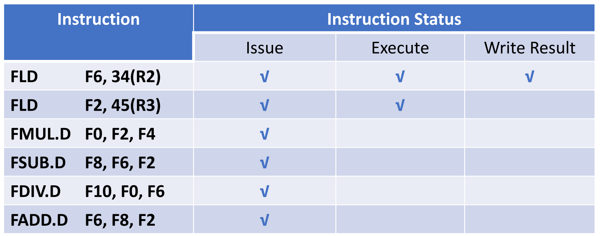{style="width:80%;display: block;margin: 20px auto"}

        - **保留站状态表 & 寄存器状态表**

            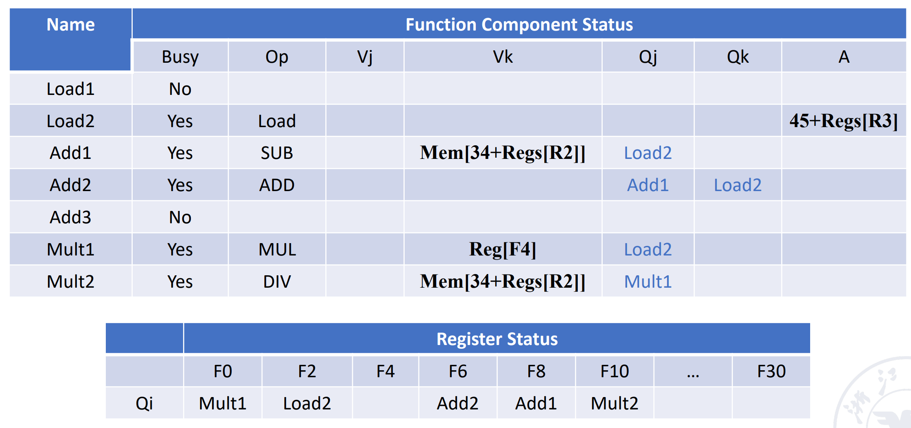{style="width:80%;display: block;margin: 20px auto"}

    !!! question "Exercise"
        **假设：**
        
        - 加法、乘法、除法分别需要 2 个时钟周期、10 个时钟周期、40 个时钟周期
        - 加载指令计算目标地址需要 1 个时钟周期，访问内存需要 1 个时钟周期

        **使用 Tomasulo 算法，所有指令完成需要多少个时钟周期？**

        ??? success "Answer"
            |指令|IS|EX|WB|Explanations|
            |:--|:--|:--|:--|:--|
            |`FLD F6, 34(R2)`    |1|2-3  |4 |指令进入流水线是**顺序的**|
            |`FLD F2, 45(R3)`    |2|3-4  |5 |计算有效地址和执行不是一个部件？|
            |`FMUL.D F0, F2, F4` |3|6-15 |16|等待 `FLD` 写回 `F2` |
            |`FSUB.D F8, F6, F2` |4|6-7  |8 |等待 `FLD` 写回 `F2` |
            |`FDIV.D F10, F0, F6`|5|17-56|**57**|等待 `FMUL` 写回 `F0` |
            |`FADD.D F6, F8, F2` |6|9-10 |11|等待 `FSUB` 执行完毕，**`adder` 空闲**时进入 `EX` 阶段；</br><mark>不需要等待 `FDIV` 读取 `F6` 之后写回，因为 `F6` 操作数已经**被重命名进入保留站**</mark>|


!!! abstract "Summary"
    1. **主要贡献**
        - 动态调度
        - **寄存器重命名：消除 WAW 和 WAR 冒险**
        - 加载/存储歧义消除
        - 优于记分牌算法
    2. **缺点**
        - 结构复杂
        - **性能被 CDB 总线限制**
        - 乱序执行的**安全性问题**：加载和存储指令在访问不同地址时可以安全地乱序执行；但如果访问相同地址，则存在**以下风险**：
            - 若程序中加载在前、存储在后，交换顺序会导致 WAR 冒险
            - 若程序中存储在前、加载在后，交换顺序会导致 RAW 冒险
            - 若两条存储指令访问相同地址，交换顺序会导致 WAW 冒险
    3. ILP 算法的限制直接推动了多核处理器的兴起

---
## 基于硬件的推测执行

!!! success "改进"
    为了让指令执行完成的顺序也是顺序的，我们添加了一个 **reorder buffer**：<mark class="green">结果先写到 ROB，再按照指令流出的顺序 **commit**，写回寄存器</mark>
    
    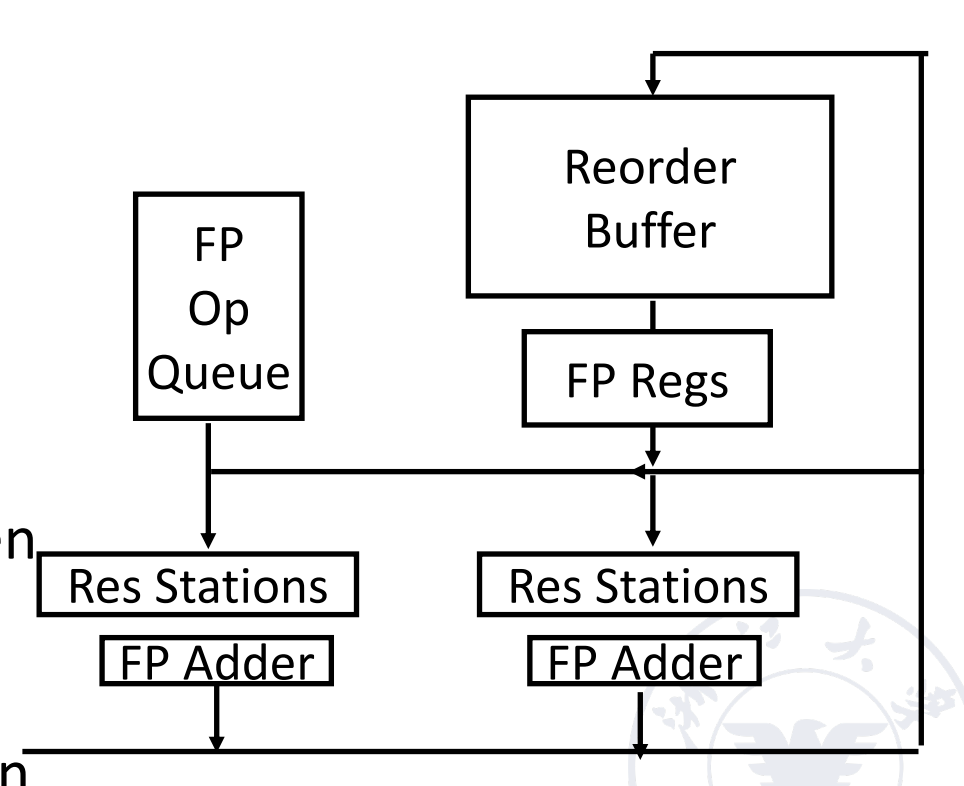{style="width:30%;display: block;margin: 20px auto"}

1. **硬件结构**：加入 ROB（重排序缓冲区）

    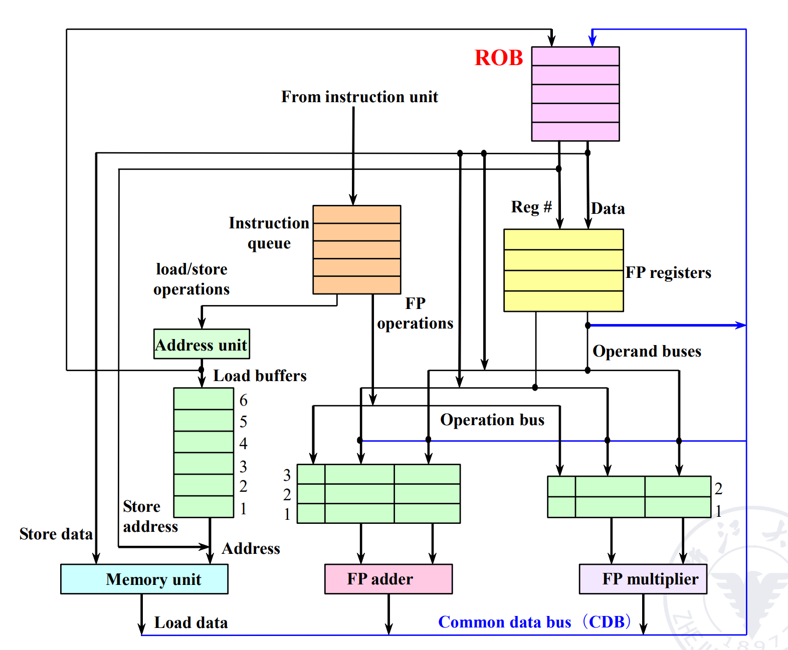{style="width:80%;display: block;margin: 20px auto"}

2. **执行阶段**：`IS`、`EX`、`WB`、`Commit`
    - **`WB`**：
        - 指令执行完成后结果**写回 ROB**
        - ROB 中还没提交的指令结果可以作为**后续指令的操作数**
    - <mark>**`Commit`**：按照指令进入的顺序更新寄存器</mark>

3. **三个关键思想**
    - 动态分支预测
    - <mark>**推测执行**：允许在有跳转结果之前执行后边指令（并能够撤销错误推测序列的影响）</mark>
    - **动态调度**：允许指令跨越跳转指令乱序执行

    !!! abstract "精确异常"
        1. **精确异常**：当异常发生时，处理器的状态必须看起来就像指令是严格按照程序顺序一条一条执行完的一样
        2. 原始 Tomasulo 中，指令可以乱序执行、乱序写回寄存器，但<mark>问题是：如果一条较早的指令发生异常，而后面的指令已经把结果写进寄存器或内存，处理器状态就乱了</mark>
        3. 而 ROB 可以解决**之前算法非精确异常的问题**，保证了精确异常

4. **三张状态表格**

    !!! tip "Tips"
        依旧使用前边六条指令，假设此时乘法指令已经准备好 `commit`

    - **保留站状态表**：
        - `Qj & Qk` 记录产生相应源操作数的**ROB 编号**
        - `Dest` 记录指令**对应的 ROB 编号**

        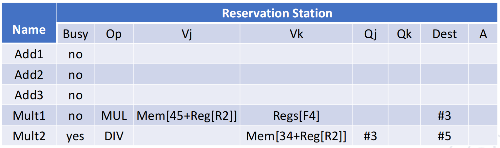{style="width:80%;display: block;margin: 20px auto"}

    - **ROB 状态表**

        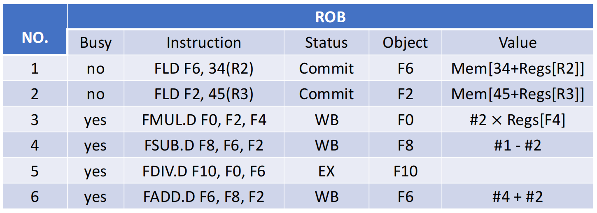{style="width:80%;display: block;margin: 20px auto"}

    - **寄存器状态表**

        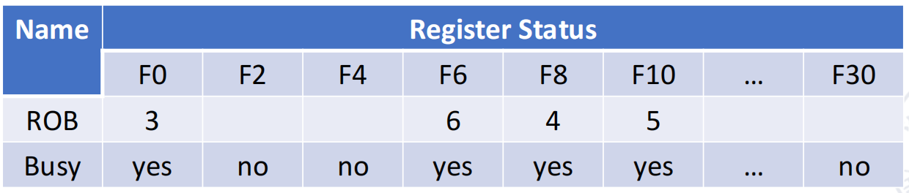{style="width:80%;display: block;margin: 20px auto"}

!!! question "Exercise"
    **假设不变**，使用 Tomasulo 算法和 ROB，所有指令完成需要多少个时钟周期？

    ??? success "Answer"
        在 Tomasulo 算法的基础上加入 `Commit` 阶段

        |指令|IS|EX|WB|Commit|
        |:--|:--|:--|:--|:--|
        |`FLD F6, 34(R2)`    |1|2-3  |4 |5|
        |`FLD F2, 45(R3)`    |2|3-4  |5 |6|
        |`FMUL.D F0, F2, F4` |3|6-15 |16|17|
        |`FSUB.D F8, F6, F2` |4|6-7  |8 |18|
        |`FDIV.D F10, F0, F6`|5|17-56|**57**|58|
        |`FADD.D F6, F8, F2` |6|9-10 |11|59|

!!! abstract "ROB Summary"
    1. 指令根据重排序缓冲 ROB 按顺序完成
    2. 可以实现精确异常
    3. **很容易扩展**到整数寄存器和整数功能单元
    4. **缺点**：但硬件过于复杂

---
## 多指令发射
!!! tip "Tips"
    这一部分在 计算机系统 II 课程中第一次讲解，计算机系统 III 课程又做了一些补充

1. **作用**：提高指令并行性（ILP）
2. **局限性**：主要受到以下三个方面的影响
    - 程序中固有的指令级并行性
    - 硬件实现的难度
    - 超标量和超长指令字处理器固有的技术限制

### 多发射处理器
1. **超标量处理器**
    - **特点**：每个时钟周期发射的**指令数量不固定**，取决于代码的具体情况（1～8条，有上限）
    - 假设此上限为 `n`，则该处理器称为 `n` 路发射
    - <mark>**指令调度**：可以通过**编译器**进行静态调度，或基于 **`Tomasulo` 算法**进行动态调度</mark>
    - **应用**：该方法是目前**通用计算**领域最成功的方法

2. **超长指令字 VLIW**
    - **特点**：每个时钟周期发射的指令数量是**固定的**（4-16条），构成一条长指令/指令包
    - 在指令包中，指令间的并行性通过**指令**显式表达
    - <mark>**指令调度**：只能通过**编译器**进行静态调度</mark>
    - **应用**：已成功应用于数字信号处理和多媒体应用
    - **问题**
        - 程序代码长度增加：
            - 需要大量**循环展开**来提高并行性
            - 指令字中的操作槽无法始终被填满
            - **解决方案**：共享立即数字段的命令，或采用指令压缩存储，在解码时传输到`Cache`或进行扩展
        - 机器代码不兼容
        - 步调一致机制：当任何一个操作部分暂停时，整个处理器必须暂停

    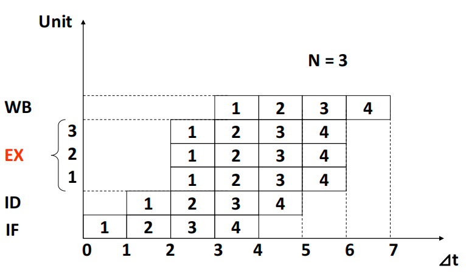{style="width: 50%;display: block;margin: 20px auto"}

3. **超流水线处理器**
    - **特点**：每个流水线阶段被进一步细分，多个指令可以在一个时钟周期内**分时**执行
    - 实际上，<mark>**超流水线处理器的流水线周期**是 `1/n` 个时钟周期</mark>：对于每个时钟周期能流出 `n` 条指令的超流水线，这 `n` 条指令不是同时流出的，而是每 `1/n` 个时钟周期流出一条指令

    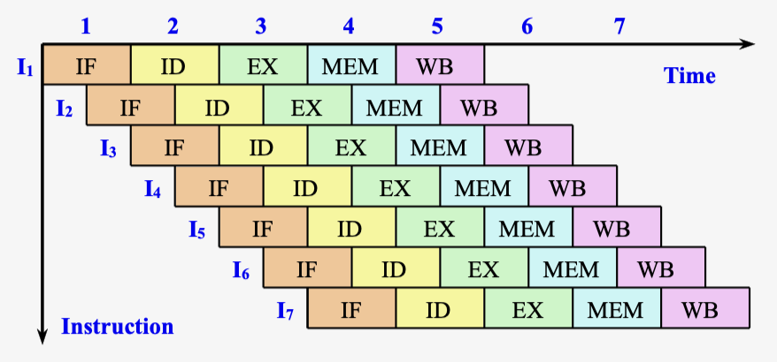{style="width:60%;display: block;margin: 20px auto"}

4. **对比**

    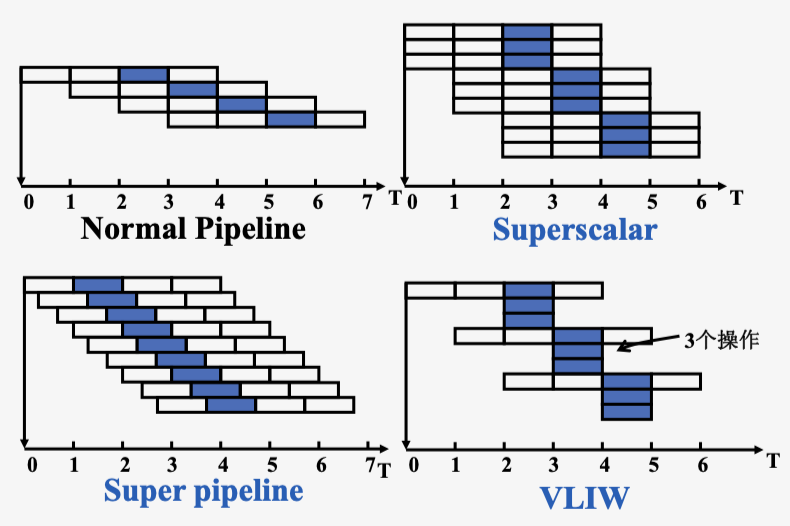{style="width:60%;display: block;margin: 20px auto"}

### 分类
#### 静态多发射
1. 利用**超标量处理器**/**超长指令处理器**，指令**按序**流出，**流出时**进行冲突检测
2. **指令调度**
    - **编译器**将需要同时发射的指令分组，将它们打包成“发射槽”
    - <mark>编译器**检测并避免冲突**</mark>，必要时用空操作指令填充
3. **冲突检测**
    - 第一阶段：**在流出包中**进行冲突检测，并初步选择可以流出的指令
    - 第二阶段：检查所选指令与**正在执行的指令**是否冲突
4. **硬件修改**：增加取指和译码带宽，增加功能单元，增加前递路径
5. **冲突缓解**：循环展开

!!! example "超标量 Example"
    1. 采用 **1条整数指令 + 1条浮点指令** 的并行流出方式
    2. 假设所有浮点指令都是加法指令，执行时间为两个时钟周期

    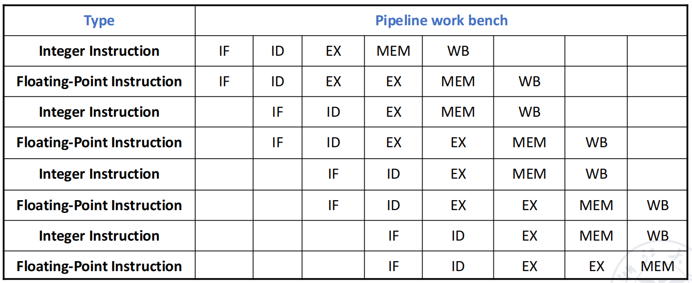{style="width:80%;display: block;margin: 20px auto"}

#### 动态多发射
1. 利用**超标量处理器**（基于 **Tomasulo 算法**）

    !!! example "Example"
        ```asm
        Loop: 
            FLD    F0, 0 (R1)   
            FADD.D F4, F0, F2   
            FSD    F4, 0 (R1)   
            ADDI   R1, R1, 8    
            BNE    R1, R2, Loop 
        ```
        
        ??? success "没有 ROB"
            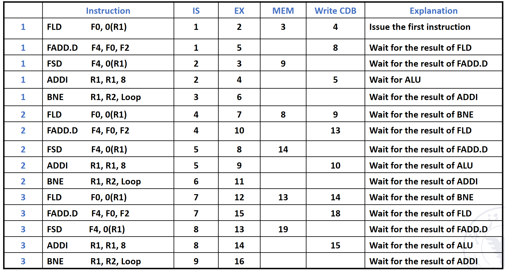{style="width:80%;display: block;margin: 20px auto"}

            虽然指令流出率较高，但执行效率不是很高
            
            - 19 个时钟周期内共执行了 15 条指令
            - **平均指令执行速度**为每时钟周期 15/19 = 0.79 条

        ??? success "有 ROB"
            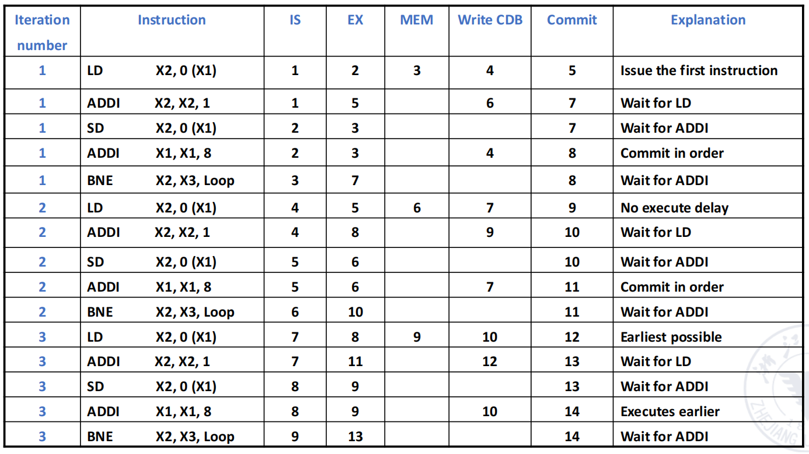{style="width:80%;display: block;margin: 20px auto"}

            因为**不需要等待跳转指令的结果**，直接可以乱序执行后边的指令，所以执行需要的周期数减少。

2. **指令调度**
    - **CPU**检查指令流并**选择**每个周期要发射的指令
    - <mark>**编译器**可以通过**重新排序指令**来提供帮助</mark>
    - CPU在运行时使用**先进技术**解决冲突
    - 允许CPU**乱序**执行指令以避免停顿，但按顺序将结果提交到寄存器

3. **需要动态调度的原因**
    - 并非所有停顿都是可预测的
    - 无法总是围绕分支进行调度，因为分支结果是动态确定的
    - 同一指令集架构的不同实现具有不同的延迟和冲突

### 关键技术
1. **推测执行**
    - **原理**：**“猜测”**执行指令（如分支方向、加载数值），并提前执行后续指令
    - 如果猜对，完成操作，大大提升性能；如果猜错，`roll-back` 清空流水线重新执行正确操作
    - **编译器/硬件推测**
        - **编译器**：重新排序指令，可包含“修复”指令以从错误猜测中恢复
        - **硬件**：前瞻查找要执行的指令，在错误推测时刷新缓冲区

2. **循环展开**
    - **原理**：复制循环体以体现更多并行性，减少循环控制开销

    - 每次复制使用不同的寄存器（**“寄存器重命名”**）
        - 避免循环携带的**“反依赖”**
            - 存储指令后跟对同一寄存器的加载，也称为“名称依赖”
            - 来源于寄存器名的重复使用

    ??? example "循环展开例题"
        **Problem:**
        
        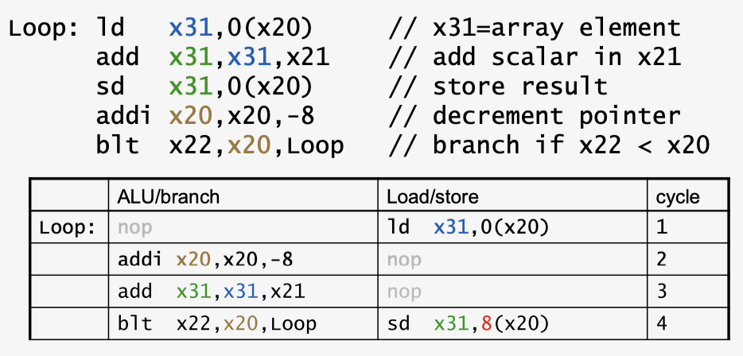{style="width:60%;display: block;margin: 20px auto"}

        **循环展开:**

        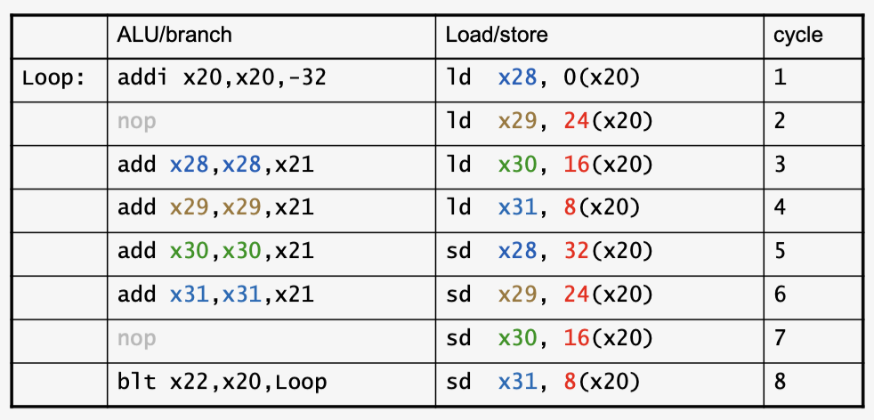{style="width:60%;display: block;margin: 20px auto"}

3. **寄存器重命名**
    - **保留站和重排序缓冲区**有效提供寄存器重命名功能
    - 当指令发射到保留站时：
        - 如果操作数在寄存器文件或重排序缓冲区中**可用**，则被复制到保留站，不再需要保留在寄存器中，可以被覆盖
        - 如果操作数尚**不可用**，则将由功能单元提供给保留站，可能不需要更新寄存器

4. **加载推测**
    - 预测分支并继续发射指令：在分支结果确定前不提交指令
    - **加载推测**
        - 避免加载和缓存未命中的延迟：
            - 预测有效地址
            - 预测加载值
            - 在完成未完成的存储操作前进行加载
            - 将存储的值旁路到加载单元
        - 在推测被清除前不提交加载操作

