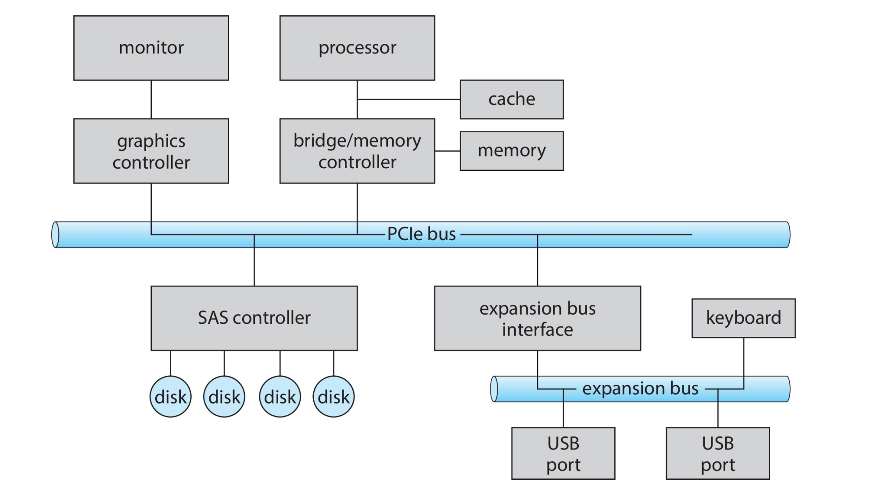
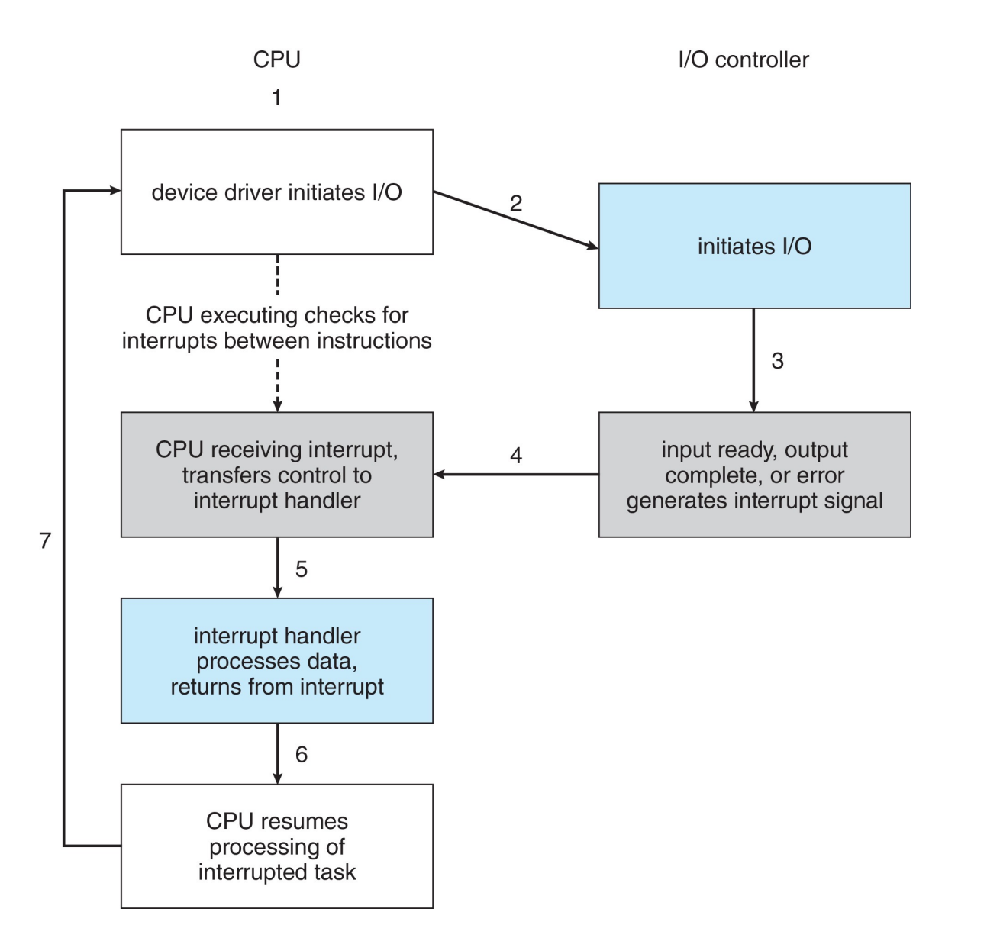
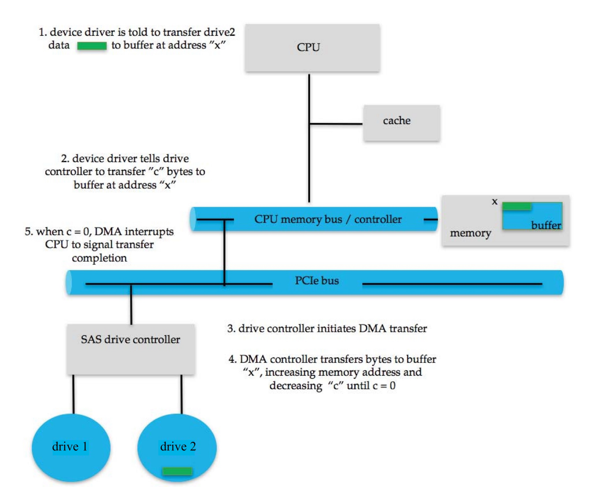
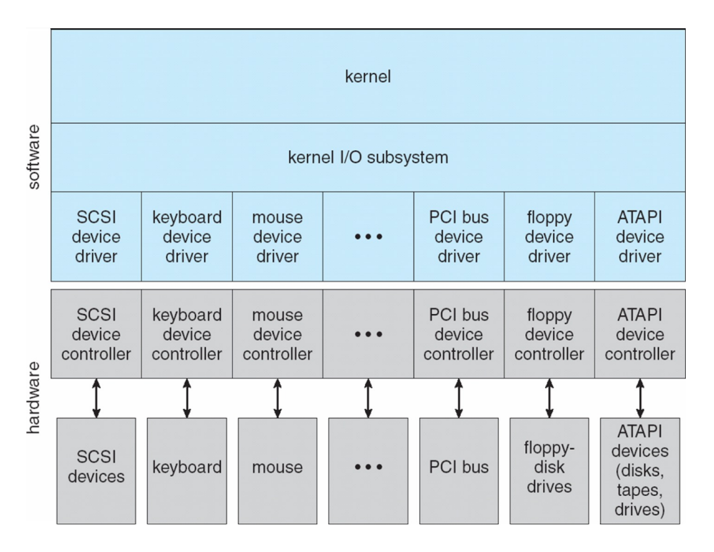

# I/O 系统
---
1. **I/O 管理**是操作系统设计和运行的核心组成部分
2. **I/O 设备**是计算机与用户及其他系统进行交互的方式

{style="width:60%;display: block;margin: 20px auto"}

---
## I/O Hardware
1. I/O 设备种类繁多 **e.g.** 网卡、鼠标键盘、显示器
2. <mark>**硬件组成**</mark>
    1. 总线 **Bus**：组件（包括 CPU）之间的互连通道
    2. 端口 **Port**：设备的连接点
    3. 控制器 **Controller**：控制设备的组件
        1. 可以集成到**设备中**或位于**独立的电路板**上
        2. 通常包含处理器、微代码、私有内存、总线控制器等

---
## I/O Access
1. 某些 CPU 架构具有**专用的 I/O 指令** 
    
    **e.g.** x86：in, out, ins, outs

    !!! info "**设备**通常提供用于**数据和控制设备 I/O** 的寄存器"
        1. 设备驱动程序将命令和数据（或其指针）放入寄存器
        2. **寄存器包括**数据输入/数据输出寄存器、状态寄存器、控制（或命令）寄存器
        3. 通常为 1-4 字节，或先进先出（FIFO）缓冲区

2. **I/O 寻址**：CPU 访问 I/O 设备寄存器的方式
    1. **Direct I/O instructions**：用于访问（绝大多数）寄存器
    2. **Memory-mapped I/O**：数据和命令寄存器被映射到**内存地址空间**，用于访问（**大量的**）片上内存（如显卡）

3. <mark>**I/O 访问方式**：轮询（polling）或中断（interrupt）</mark>

### Polling

1. **Polling：CPU 主动访问设备**
2. **步骤：对于每个 I/O 操作**：
    1. 如果设备处于忙碌状态，无法接受任何命令，则 **Busy-wait**（通过**状态寄存器**判断）
    2. 向设备 controller 发送命令（**命令寄存器**）
    3. 读取状态寄存器，直到其显示命令已执行完毕（期间 busy-wait）
    4. 读取执行状态，并可能**重置设备状态**
3. **缺点**：需要<mark>忙等待</mark>
    1. 如果设备速度快，是合理的
    2. 如果设备速度慢，则**CPU 资源使用效率低下**

### Interrupts
1. **优点**：中断可以避免忙等待
2. **步骤**：
    1. 设备驱动程序（**操作系统**）向控制器（**设备**）发送命令，然后返回
    2. 操作系统可以调度**其他**活动
    3. 当发送到设备上的命令执行完毕时，设备会**中断处理器**
    4. 操作系统**通过处理该中断来获取结果**

    {style="width:60%;display: block;margin: 20px auto"}

3. **缺点**：基于中断的 I/O 在开始和结束时需要 <mark>**context switch**</mark>
    1. 如果中断频率极高，上下文切换会**浪费 CPU 时间**
    2. **解决方案**：改用轮询

4. 多 CPU 系统可以**并发处理中断**
    1. 有时可以指定一个 CPU **专门用来处理中断**
    2. 中断也可以具有 **CPU affinity**（将特定中断请求分配给特定处理器（组）的能力）

!!! tip "中断也用于异常处理"
    1. protection error for access violation
    2. page fault for memory access error
    3. software interrupt for system calls

### DMA
1. <mark>DMA（Direct Memory Access）在 **I/O 设备和内存**之间直接传输数据</mark>
    1. 操作系统**只需要发出命令**，数据传输会绕过 CPU
    2. 不是 programmed I/O（一次一个字节），数据是以 **large blocks** 形式传输的
2. **DMA controller**：在设备或系统中配备，**操作系统**向 DMA 控制器发出命令
    1. 命令包括：操作、数据的内存地址、字节计数……
    2. 通常是将命令的指针写入**命令寄存器**
    3. 当完成后，设备会中断 CPU 以发出完成信号

!!! info "DMA 数据传输步骤"
    1. device driver ：CPU
    2. device controller ：disk

    {style="width:80%;display: block;margin: 20px auto"}

## I/O Devices
1. <mark>**分类维度**：</mark>
    
    | 维度 | 差异 | 示例 |
    | :--- | :--- | :--- |
    | **数据传输模式** | 字符 character 块 block | 终端、键盘、鼠标、串口 磁盘 |
    | **访问方式** | 顺序 sequential 随机 random | 调制解调器 modem 光盘只读存储器 (CD-ROM) |
    | **传输调度** | 同步 synchronous 异步 asynchronous | 磁带 键盘 |
    | **共享性** | 独占 dedicated 可共享 sharable | 磁带 键盘 |
    | **设备速度** | 延迟 latency 寻道时间 传输速率 操作间延迟 | |
    | **输入/输出方向** | 只读 只写 读写 | 光盘只读存储器 (CD-ROM) 图形控制器 磁盘 |

2. 广义上，**操作系统可以将 I/O 设备分为以下几组**
    1. **block I/O**：
        1. **操作**：支持读（read）、写（write）、寻道（seek） 
        2. **寻址方式**：文件系统访问、Raw/Direct I/O、Memory-mapped file
        3. **访问方式**：DMA
    2. **character I/O**（Stream）
    3. **Memory-mapped file access**
    4. **Network Devices**
        1. **常用接口**：socket interface（将网络协议与具体的网络操作细节分离）
    5. **Clocks and Timers**：可以被视为**字符设备**，提供当前时间、流逝的时间以及定时器功能

!!! tip "Tip"
    操作系统通常有一个后门/逃生通道（escape/back door），用于**将任何 I/O 命令从应用程序直接传递给设备**
    
    **e.g.** Linux 的 ioctl 调用，用于向设备驱动程序发送命令

## 同步/异步 I/O
1. **同步 I/O**（Synchronous I/O）
    1. **阻塞 I/O**（blocking I/O）：进程被挂起，直到 I/O 完成
        1. **优点**：易于使用和理解
        2. **缺点**：但效率可能较低，无法满足某些特定需求
    2. **非阻塞 I/O**（non-blocking I/O）：I/O 调用会立即返回
        1. 如果数据就绪则传输
        2. 如果未就绪，则返回一个**错误码**告知进程当前无数据
        3. **进程不会被挂起**，可以利用空隙执行其他任务，但需要**不断轮询查看状态**
        4. 使用 select 来查找数据是否就绪，然后使用 read 或 write 来传输数据
2. **异步 I/O**（Asynchronous I/O）：在 I/O 执行的同时，进程继续运行
    1. 当 I/O 完成时，I/O 子系统通过 **signal 或 callback** 向进程发送通知
    2. **优点**：效率极高
    3. **缺点**：使用难度较大

---
## Application I/O Interface
1. I/O system calls 将设备行为**封装在通用类中**
    1. 在 Linux 中，设备可以作为**文件**进行访问
    2. 使用 **`ioctl`** 进行底层访问（无法归类为标准读写的“非标准”硬件操作）
2. **设备驱动程序层**：内核与硬件之间的“翻译官”，向内核隐藏了不同 I/O 控制器之间的差异
3. 每个操作系统都有自己的 **I/O 子系统和设备驱动程序**框架

{style="width:60%;display: block;margin: 20px auto"}

### Kernel I/O Subsystem
1. **I/O scheduling**：通过每个设备专属的队列对 I/O 请求进行排队
2. **Buffering**：在**设备间**传输数据时将其**暂存在内存中**
    1. 应对设备速度不匹配
    2. 应对设备传输大小不匹配
3. **Caching**：保留数据的副本以实现快速访问
4. **假脱机（Spooling）**：如果设备一次只能服务一个请求，假脱机是一个保存输出（即设备的输入）的缓冲区 **e.g.** 打印
5. **设备预留（Device reservation）**：提供对设备的独占访问
    1. 用于分配（allocation）和释放（de-allocation）的系统调用
    2. 需要注意死锁（deadlock）

!!! abstract "I/O 保护"
    1. **操作系统需要保护 I/O 设备**
    2. <mark>为了保护 I/O 设备，**将所有 I/O 指令定义为特权指令，I/O 必须通过系统调用来执行**</mark>
    3. 内存映射 I/O (memory-mapped I/O) 和 I/O 端口也必须受到保护

## 性能
1. **I/O 是系统性能的一个主要因素**：
    1. CPU 需要执行设备驱动程序和内核 I/O 代码
    2. 中断引起的 context switches
    3. 数据缓冲与复制（网络流量带来的负载尤其大）
2. **提高性能**：
    1. 减少 context switches 的次数
    2. 减少数据复制
    3. 通过使用大块传输、智能控制器和 polling 来减少中断
    4. 使用 DMA
    5. 使用更智能的硬件设备
    6. 平衡 CPU、内存、总线和 I/O 性能以实现最高吞吐量
    7. 将用户模式进程/守护进程 (daemons) 移至内核线程