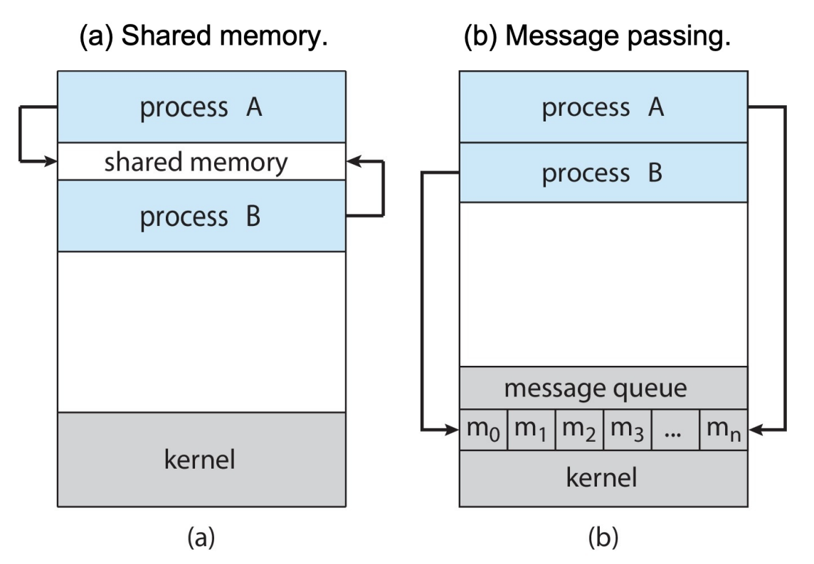
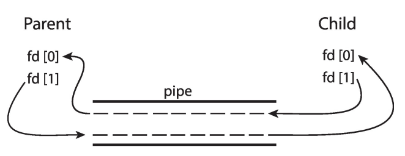

# 进程间通信
1. 同一台主机上的进程可以是相互独立的，也可以是**相互协作**的

!!! abstract "进程协作的原因"
    - 信息共享 **e.g.** 对共享文件进行协调访问
    - 计算加速 **e.g.** 在同一任务上进行多进程处理
    - 模块化
    - 便利性

2. **定义**：协作进程之间用于通信的机制称为进程间通信（IPC）

- 进程在设计上是**相互隔离**的，因此 IPC 并不容易

!!! example "Google Chrome 浏览器"
    1. 许多网页浏览器运行在**单进程模式**：如果某一个网站出问题，整个浏览器可能会卡死或崩溃
	
    2. Google Chrome 浏览器采用**多进程架构**，包含3种不同类型的进程：
	
    - 浏览器进程（Browser process）：管理用户界面、磁盘 I/O 和网络 I/O
	- 渲染器进程（Renderer process）
	 	- 渲染网页，处理 `HTML` 和 `JavaScript`
		- 每打开一个网站，就会创建**一个新的渲染器进程**
		- 在**沙箱**中运行，限制磁盘和网络 I/O，最大限度**降低安全漏洞的影响**
	- 插件进程（Plug-in process）：每种插件类型对应一个插件进程
	- **每一个标签页代表一个独立的进程**

## 通信模型
{style="width:60%;display: block;margin: 20px auto"}

!!! success "Notice"
    大多数操作系统**同时实现**这两种模型

1. **消息传递**（Message-passing）

- **优点**：
    - 适合交换**少量**数据
    - 在操作系统中**实现简单**
- **缺点**：
    - 对用户来说有时**比较繁琐**，因为代码中会大量出现 `send/recv` 操作
	- **开销较高**：每一次通信操作都需要一次**系统调用**

2. **共享内存**（Shared memory）

- **优点**：
    - **开销较低**：最开始需要少量系统调用，之后不再需要
	- 对用户来说**更方便**，因为我们已经习惯了直接进行内存读写
- **缺点**：在操作系统中**实现更困难**

### 共享内存
1. **步骤**

- 进程需要先建立一个**共享内存区域**
	- 由一个进程创建一个**共享内存段**
	- 其他进程随后可以将其附加到各自的地址空间
     
    !!! warning "Notice"
	    这实际上与多道程序设计中**以“内存保护”为核心**的思想是相违背的！

- 进程通过对共享内存区域**进行读/写**来通信
	- 进程自身负责避免**数据冲突**
	- 操作系统**完全不参与**通信过程

!!! example "producer/consumer example"
    伪代码（因为在同一个内存空间中）

    ```c
    #define BUFFER_SIZE 10     // 定义缓冲区大小为 10

    typedef struct {
        ...
    } item;                   // 定义缓冲区中存放的数据类型
    item buffer[BUFFER_SIZE]; // 共享缓冲区（环形队列）
    int in = 0;               // 生产者写入位置索引
    int out = 0;              // 消费者读取位置索引

    ```

    **生产者**

    ```c
    item next_produced;       // 即将被生产的数据
    while (true) {
        /* 在 next_produced 中生成一个数据项 */
        while (((in + 1) % BUFFER_SIZE) == out)
            ;                 /* 缓冲区满时忙等待（什么也不做） */
        buffer[in] = next_produced;   // 将数据写入缓冲区
        in = (in + 1) % BUFFER_SIZE;  // 更新写指针（环形）
    }
    ```

    **消费者**

    ```c
    item next_consumed;       // 即将被消费的数据
    while (true) {
        while (in == out)
            ;                 /* 缓冲区空时忙等待 */
        next_consumed = buffer[out];  // 从缓冲区取数据
        /* 消费 next_consumed 中的数据 */
        out = (out + 1) % BUFFER_SIZE; // 更新读指针（环形）
    }
    ```

2. **POSIX 共享内存**

- 进程是如何知道**共享内存段的ID**的？
    - 共享内存的 `id` 在 `fork()` **之前**创建
    - 因此父进程和子进程都知道这个 `id`
    - 但是这个解决方案并不通用，**通用的方案**	    
        - 通过命令行参数传递 `id`
        - 把 `id` 存储在文件中
        - **更好的方式**：使用**消息传递**来传递 `id`
- 在支持 POSIX 的系统上，可以使用 `ipcs -a` 命令查看 IPC 的状态

!!! warning "Warning"
    1. 共享内存的IPC**非常繁琐**，因为我们打破了操作系统的内存隔离
    2. 多个运行上下文之间的内存共享现在是通过**线程**来实现的

### 消息传递 

1. **消息传递**（Message Passing）：进程之间**不共享**任何用于通信的地址空间，保持内存隔离
2. **两个基本操作**：

- **`send`**：发送一条消息
- **`recv`**：接收一条消息
- 如果进程 P 和 Q 希望通信，它们会：
	- 在它们之间建立一条通信 `link`
	- 调用 `send()` 和 `recv()`
	- 关闭这条通信 `link`

!!! success "Notice"
    1. 消息传递是分布式计算的关键机制（位于不同主机上的进程不能共享物理内存）
	2. 但消息传递对**同一主机上的进程**也同样非常有用

3. **通信链路**的实现方式

- 物理层：共享内存、硬件总线、网络
- 逻辑层：直接或间接、同步或异步、自动缓冲或显式缓冲
- **直接通信**
    - 进程必须**显式地**指明对方 `send(P, message)`
    - 通信链路的**性质**：
    	- 链路会**自动**建立
    	- 一条链路**只**与一对正在通信的进程相关联
    	- 在每一对进程之间**恰好存在**一条链路
    	- 链路可以是单向的，但通常是双向的
  	- **缺点**：link 会非常多
- **间接通信**
    - 消息通过**mailbox**（也称为端口 port）来发送和接收
	    - 每个邮箱都有一个唯一的 ID
	    - 只有**共享同一个邮箱**的进程才能进行通信
	- 通信链路的**性质**
    	- 只有当进程**共享一个公共邮箱**时，链路才会建立
    	- 一条链路可以与**多个进程**相关联
    	- 每一对进程之间可能共享**多条**通信链路
    	- 链路可以是单向的，也可以是双向的
    
    !!! warning "Warning"
        当一个link与多个进程关联时，可能会出现**数据冲突**：一个进程发消息，不清楚消息应该被哪个进程接收
        
        **解决方案**：
        
        - 限制一条链路**最多只能与两个进程**关联
        - 任意时刻**只允许一个进程**执行接收操作
        - 允许系统**任意选择接收者**，并将接收者信息**通知发送方**

4. **阻塞方式**

!!! abstract "abstract"
    **消息传递可以是阻塞的，也可以是非阻塞的**
	
    1. **阻塞**被认为是同步
	
    - 阻塞发送：发送方会被阻塞，直到消息被接收
	- 阻塞接收：接收方会被阻塞，直到有消息可用
	
    2. **非阻塞**被认为是异步
	
    - 非阻塞发送：发送方发送消息后立即继续执行
	- 非阻塞接收：接收方接收到一条有效消息或者一个空消息

- 生产者只需调用**阻塞的** `send()` 并等待，直到消息被投递给接收者或邮箱
- 当消费者调用 `receive()` 时，如果没有消息可用，它会一直**阻塞**，直到消息到达

5. **缓冲**（Buffering）：附加在通信链路上的**消息队列**，有三种实现方式

- **零容量**：链路上不缓存任何消息；发送方**必须等待**接收方
- **有限容量**：缓冲区最多容纳 `n` 条消息；当链路满时，发送方**必须等待**
- **无限容量**（仅理论）：缓冲区长度无限；发送方**永远不需要等待**

### 其余模型
1. **`signal`**
2. **`pipe`**：管道充当一个通道，使两个进程能够通信

- **普通管道**：单向的
    - 不能被**创建它的进程之外**的进程访问
	- 通常由父进程创建，用于与它创建的子进程通信
	- 没有名字，只能通过 `fork()` 来传播
    
    !!! example "Example"
        `fd[0]` 是读端；`fd[1]` 是写端

        {style="width:60%;display: block;margin: 20px auto"}

- **命名管道**：双向的
    - **不需要父子进程关系**即可访问
    - 功能更强
	- 多个进程可以使用**同一个命名管道**进行通信

3. **客户端–服务器通信**（了解即可）

- **`socket`**
- **`RPCs`**
- **`Java RMI`**