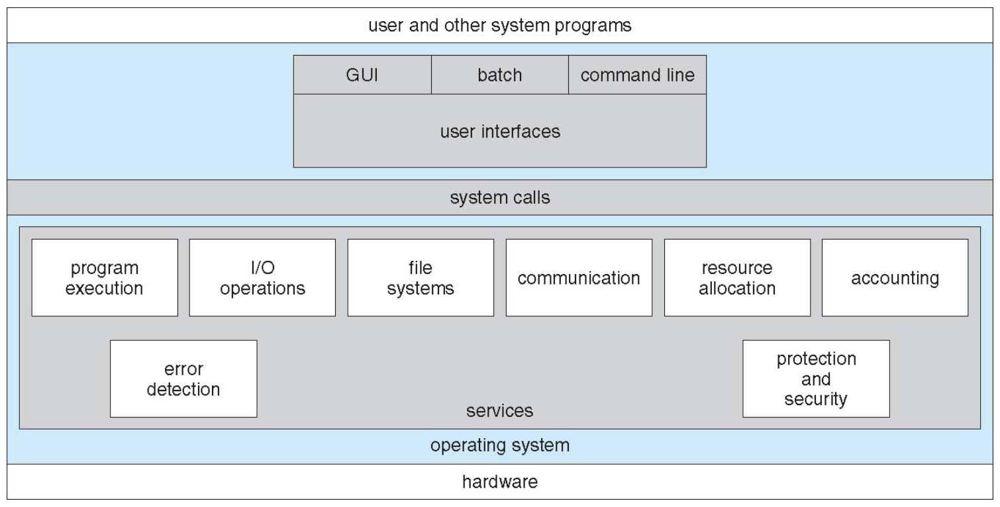
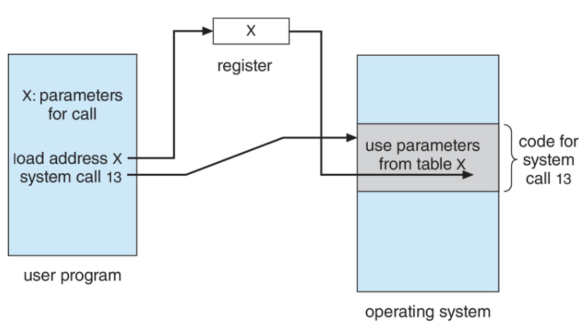
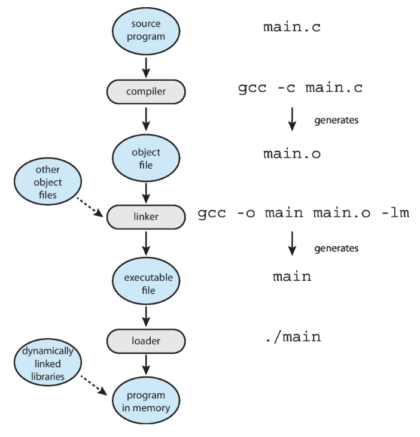
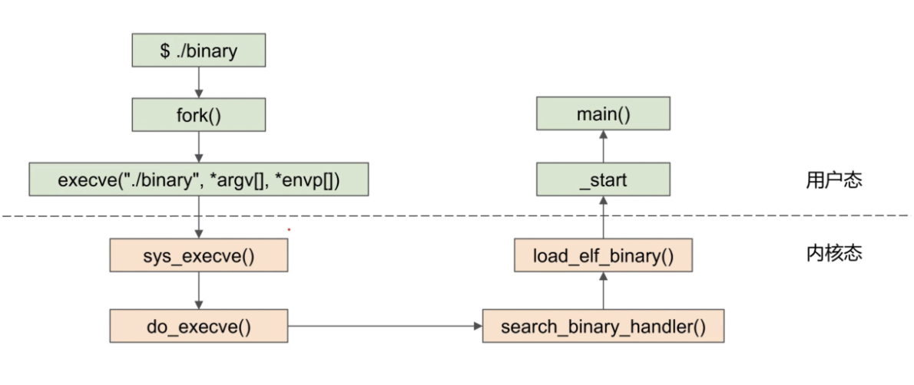
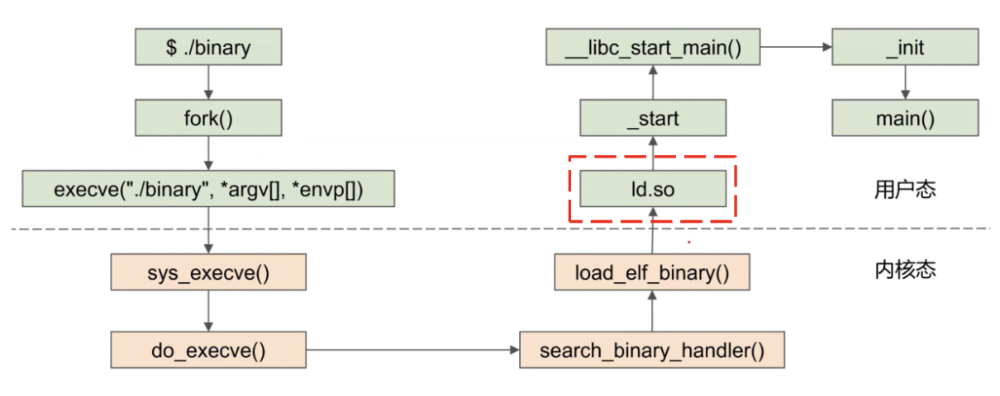

# 操作系统
1. **操作系统**：充当计算机用户和计算机硬件之间中介的程序（`a resource abstract and a resource allocator`）

- **资源分配器**
    - 管理所有资源
    - 在冲突的请求之间做出决定，以实现高效和公平的资源使用
- **控制程序**：控制程序的执行，以防止错误和不当使用计算机

2. **操作系统的目标**

- 执行用户程序并使解决用户问题更容易
- 使计算机系统便于使用
- 以高效的方式使用计算机硬件

3. **操作系统的操作**：终端驱动

- **硬件中断**：来自外部I/O设备
- **软件中断**：软件程序错误；系统服务请求；其他进程问题（如无限循环、非法修改内存）

## 任务

1. **进程管理**

- **进程**：一个正在执行的程序，是系统内的工作单元
- 程序是一个被动实体，进程是一个主动实体
- 进程需要**资源**来完成其任务：CPU、内存、I/O、文件；初始化数据
- 通常系统有**许多进程**（用户的/操作系统的），在一个或多个CPU上并发运行，通过在进程间**多路复用CPU**来实现**并发**

2. **内存管理**

- **执行程序**：所有/部分指令必须在内存中；程序需要的所有/部分数据必须在内存中
- **内存管理决定**：内存中存放什么；何时优化CPU利用率和计算机对用户的响应

3. **存储管理**

- **OS**提供统一且逻辑的信息存储视图
    - 将物理属性抽象为逻辑存储单元——**文件**
    - 每个介质由设备控制（即磁盘驱动器、磁带驱动器）

    !!! abstract "Abstract"
        **不同的属性**包括访问速度、容量、数据传输速率、访问方法（顺序或随机）

- **文件系统管理**
    - 文件通常组织成**目录**
    - 大多数系统上有**访问控制**，以确定谁可以访问什么

4. **I/O子系统**

- **OS的目的**：向用户隐藏硬件设备的特性
- **I/O子系统负责**
    - I/O的内存管理
        - 缓冲：在数据传输过程中临时存储数据
        - 缓存：将部分数据存储在更快的存储中以提高性能
        - 假脱机：将一个作业的输出与另一个作业的输入重叠
    - 通用设备驱动程序接口
    - 特定硬件设备的驱动程序

5. **保护与安全**

- **保护**：任何控制进程或用户对OS所定义资源的访问的机制
- **安全**：防御系统免受内部和外部攻击（范围广泛，包括拒绝服务、蠕虫、病毒、身份盗窃、服务窃取）
- 系统通常**首先区分用户**，以确定谁可以做什么


## 结构



### 操作系统服务

1. **用户**

- **程序执行**：加载并运行程序；允许程序以多种方式结束 **e.g.**带有错误代码
- **I/O 操作**：允许程序访问I/O设备
- **文件系统**：
    - 提供文件/目录摘要
    - 允许程序创建/删除/读取/写入文件
    - 实现文件的权限管理
- **通信**：支持进程间通信 **e.g.**共享内存、信息传递
- **错误检测**：在硬件、I/O或用户程序异常时提供保护机制并采取行动

2. **更好的效率/操作**

- **资源分配**：决定哪个进程何时获得哪个资源 **e.g.**CPU、内存、I/O设备
- **记账accounting**：跟踪记录每个用户对资源的使用情况
    - 可以施加限制
    - 对统计很有用
- **保护与安全**：
    - 控制对资源的访问
    - 强制所有用户进行身份验证
    - 允许用户保护他们的内容

### 用户与操作系统界面

1. **命令行界面 CLI**

- **定义**：也被称为命令解释器，允许直接输入命令
- 有时实现在内核中，有时以系统程序的形式存在
- 通常有多种不同的**形式**`shells` **e.g.** Linux: Bash/Zsh/Fish 
- **主要功能**：从用户那里获取命令并执行
- **命令的来源与扩展**
    - 有些命令内置于`shell`程序内部 **e.g.** `cd`
    - 有些是外部程序的文件名 **e.g.** `ls`、`gcc`
    - 如果是后者（调用外部程序），添加新功能时就不需要修改或重新编译`Shell`程序本身

2. **图形用户界面 GUI**

- 提供一个**用户友好**的桌面
    - 通常使用鼠标、键盘和显示器进行交互
    - 图标`icons`代表文件、程序、操作等系统实体
    - 在界面中对对象使用不同的鼠标按钮来触发各种动作
- 现在的许多系统**同时包含CLI和GUI**
    - `Windows`：以`GUI`为主，同时包含`CLI`外壳`command`
    - `macOS`：`Aqua GUI`界面，其底层是`UNIX`内核，并提供`Shell`命令行界面
    - `Unix`&`Linux`：以`CLI`为主，拥有可选的`GUI`界面（**e.g.**`CDE`、`KDE`、`GNOME`）

3. **触摸屏界面**：手势进行操作和选择，虚拟键盘进行文本输入，语音命令

### 系统调用
1. **定义**：操作系统所提供服务的编程接口
2. **特点**：

- 是用户程序与操作系统内核进行通信的**唯一途径**
- 通常使用高级语言编写 `C/C++`

3. **应用程序编程接口 API**

- 程序通常通过API来**访问系统服务**，而不是直接使用底层的系统调用
- **三种常见的API**
    - 用于 Windows 系统的 `Win32 API`
    - 用于基于 POSIX 标准的系统的 `POSIX API`（包括所有版本的 UNIX、Linux 和 Mac OS X）
    - 用于 Java 虚拟机 (JVM) 的 `Java API`

!!! example "Example"
    ```c
    // 使用标准I/O库
    #include <stdio.h>
    int main(){
        printf("Hello, world!\n");
        return 0;
    }
    // 使用底层系统调用
    #include <unistd.h>
    int main(){
        write(1, "Hello, world!\n", 14);
        return 0;
    }
    ```

    - `printf`是`write`系统调用的包装器
    - C语言程序调用`printf()`库函数，而这个库函数内部又会去调用`write()`系统调用

4. **实现**

- **系统调用表**
    - 每个系统调用都有一个唯一的系统调用号
    - 在**内核**中存储成**数组**，下标是系统调用号，内容是对应系统调用处理函数的**指针**
- **触发系统调用**
    - 准备参数：将**系统调用号**移动到寄存器`%eax`中
    - 执行`syscall`指令（x86_64架构）：CPU**从用户态切换到内核态**
- **内核处理**
    - `kernel_entry`：内核的入口代码（**保存**所有用户空间寄存器的值）
    - 内核根据系统调用号，在系统调用表中找到对应的处理函数并执行
    - `ret_to_user`：内核的出口代码（**恢复**用户空间寄存器的值，CPU**从内核态切换回用户态**）

!!! abtract "参数传递"
    1. **寄存器传递**：最简单（但是某些情况下参数可能多于寄存器）
    2. **内存块/表传递**：参数存储在内存中的一个块/表中，并将块的地址作为参数在寄存器中传递 **e.g.**`Linux`、`Solaris`

    {style="width:40%;display: block;margin: 20px auto"}
    
    3. **栈传递**：参数由程序放置或push到stack上，并由操作系统从栈中pop
    4. 后两种方法不限制传递参数的数量和长度

5. **使用和观察**

- `strace`（Linux）：追踪程序运行过程中发出的所有系统调用
    - **用途**：诊断程序卡死和出错的原因
    - `dtruss`（MacOSX）
- `time`：粗略测量程序运行时间
    - `real`：实际流逝的时间
    - `user`：程序在**用户态**花费的CPU时间
    - `sys`：程序在**内核态**（即执行系统调用）花费的CPU时间

6. **类型**

|**进程控制**|**文件管理**|**设备管理**|
|:---|:---|:---|
|1. 创建/终止进程<br>2. 加载/执行<br>3. 获取/设置进程属性<br>4. 等待时间、等待/通知事件<br>5. 分配/释放/出错时转储内存<br>6. 调试器：调试错误/单步执行<br>7. 锁：管理进程间共享数据的访问|1. 创建/删除文件<br>2. 打开/关闭文件<br>3. 读/写/重定位文件<br>4. 获取和设置文件属性|1. 请求/释放设备<br>2. 读取、写入、重定位<br>3. 获取和设置设备属性<br>4. 逻辑连接/断开设备|
|**信息维护**|**通信**|**保护**|
|1. 获取/设置时间或日期<br>2.获取/设置系统数据<br>3.获取和设置进程、文件或设备属性|1. 创建/删除通信连接<br>2. **消息传递模式**：<br>在主机名或进程名之间发送和接收；<br>从客户端到服务器<br>3. **共享内存模式**：创建内存区并获取访问权限|1. 控制对资源的访问<br>2. 获取和设置权限<br>3. 允许和拒绝用户访问|


!!! abstract "为何应用程序依赖于特定操作系统"
    1. **核心原因**：不同操作系统的**系统调用接口和可执行文件格式**不兼容
    2. **跨平台策略**：

    - 解释型语言：依赖跨平台的解释器
    - 虚拟机语言：依赖跨平台的虚拟机
    - 源代码移植：使用标准语言编写，但在每个目标平台重新编译


### 系统服务
1. **定义**：也称为**系统程序**，为程序开发和执行提供了便利环境
2. **分类**

- **文件操作**：创建、删除、复制、重命名、打印、转储、列出及文件目录的通常操作
- **文件修改**
    - 用于创建和修改文件的**文本编辑器**
    - 用于搜索文件内容或执行文本转换的**特殊命令**
- **状态信息**（有时存储在文件中）
    - 一些**向系统询问信息**——日期、时间、可用内存量、磁盘空间、用户数量
    - 其他**提供详细的性能、日志记录和调试信息**
    - 通常这些程序**格式化输出**并将其打印到终端或其他输出设备
    - **特殊机制**：一些系统（Windows）使用**注册表**来集中存储和检索配置信息
- **编程语言支持**：有时提供编译器、汇编器、调试器和解释器
- **程序加载与执行**：加载器和链接器
    - **包括**：绝对加载程序、可重定位加载程序、链接编辑器和覆盖加载程序，用于高级语言和机器语言的调试系统
- **通信**：提供在进程、用户和计算机系统之间**创建虚拟连接**的机制
    - 允许用户相互发送消息到屏幕
    - 浏览网页、发送电子邮件消息、远程登录
    - 从一台机器传输文件到另一台机器
- **后台服务**
    - 也称为服务、子系统、守护进程
    - 在系统启动时**自动启动**（有些用于系统启动，然后终止；有些从系统启动到关闭一直运行）
    - 提供如磁盘检查、进程调度、错误记录、打印等服务
    - 在**用户上下文**中运行，而不是内核上下文（意味着其崩溃了通常不会导致整个系统崩溃）
- **应用程序**
    - **与系统无关**，由用户运行，通常不视为操作系统的一部分
    - 通过命令行、鼠标点击、手指点击**启动**

### 链接器与加载器
{style="width:40%;display: block;margin: 20px auto"}

1. **作用**

- **编译器**：将高级语言翻译成机器代码，生成**目标文件**`main.o`
- **链接器**：将多个**目标文件和库**打包成一个**可执行文件**`main`
- **加载器**：将可执行文件从磁盘读入**内存**，并创建一个可以执行的进程

!!! tip "Tips"
    现代通用系统不将库链接到可执行文件中，而是**动态链接库**（在 Windows 中为 DLL）在需要时加载，所有使用相同版本相同库的程序**共享该库**（只加载一次）

2. **`ELF 文件格式`**

- **定义**：**可执行**与可链接格式`main`
- **组成** 
    - 程序头表和节头表
    - `.text`: 代码
    - `.rodata`: 已初始化的只读数据 **e.g.** 静态常量
    - `.data`: 已初始化的**全局变量和静态变量**
    - `.bss`: 未初始化的全局变量和静态变量（这个段在文件中**不占实际空间**，只是在程序加载时分配相应大小的内存并初始化为0）

    !!! abstract "note"
        ```c
        #include <stdio.h>
        int main(){
            int b;   //在栈中，因为不是静态变量和全局变量
        }
        ```

- `readelf -S a.out`：查看 `ELF` 文件的所有段
- `objdump -d a.out`：反汇编 `.text` 段，查看机器指令

3. **[链接类型](https://wsh-zju.github.io/notebook/Computer_Science/Computer_System/pipeline/#_24)**

4. **`ELF`文件运行**

- **静态链接**：不需要`loader`来加载库
    
    {style="width:60%;display: block;margin: 20px auto"}

- **动态链接**：需要`loader`来加载库

    {style="width:60%;display: block;margin: 20px auto"}

5. **[进程的内存布局](https://wsh-zju.github.io/notebook/Computer_Science/Language/C/structure/#_10)**（从低地址到高地址）

- **文本段**（Text Segment）：`.text` **只读**
- **数据段**（Data Segment）：`.data`+`.bss`
- **堆**（Heap）：用于动态内存分配（如`malloc`），向高地址增长
- **内存映射段**（Memory Mapping Segment）：映射了动态共享库以及用户创建的内存映射文件
- **栈**（Stack）：用于函数调用，存放局部变量等，向低地址增长
- **内核空间**（Kernel Space）：为内核保留，用户程序无法直接访问

!!! abstract "note"
    1. 设置 ELF 文件映射：内核
    2. 设置栈和堆：内核
    3. 设置库：加载器


操作系统的设计与实现

操作系统结构

构建与启动操作系统

操作系统调试


man,