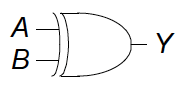
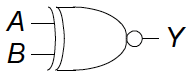
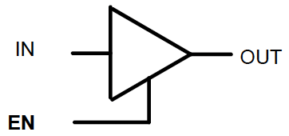
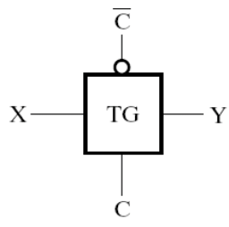

## 逻辑操作和逻辑门
1. **操作运算符**

|操作|AND|OR|NOT|
|:--:|:--:|:--:|:--:|
|**运算符**|$X·Y$|$X+Y$|$\bar{X}/X'/~X$|

2. **逻辑门**

!!! tip "Tips"
    只记录较容易遗忘的，其余不再赘述！

|逻辑门|XOR(异或)|XNOR(同或)|
|:--:|:--:|:--:|
|**运算**|$A \oplus B = A\bar{B}+\bar{A}B$|$\bar{A \oplus B} = AB+\bar{A}\bar{B}$|
|**电路符号**|||

!!! abstract "其余电路元件"
    1. **三态缓冲器**（3-state Buffer）

    - **电路符号**

        {style="width:50%;display: block;margin: 20px auto"}

    - **真值表**

        |EN|IN|OUT|
        |:--:|:--:|:--:|
        |0|X|Hi-Z|
        |1|0|0|
        |1|1|1|

    2. **传输门**（Transimission Gate）

    - **电路符号**

        {style="width:50%;display: block;margin: 20px auto"}

    - **真值表**

        |C|IN|OUT|
        |:--:|:--:|:--:|
        |0|X|Hi-Z|
        |1|0|0|
        |1|1|1|

    !!! tip "Tips"
        `Hi-Z`表示**高阻态**（相当于开关断开）

---
## 逻辑函数
1. **常用公式**

- **分配律**  
    - \( X \cdot (Y + Z) = X \cdot Y + X \cdot Z \)  
    - \( X + Y \cdot Z = (X + Y) \cdot (X + Z) \)  
- **吸收律**  
    - \( X + X \cdot Y = X \)  
    - \( X \cdot (X + Y) = X \)  
- **冗余律**  
    - \( X \cdot Y + X \cdot \overline{Y} = X \)  
    - \( (X + Y) \cdot (X + \overline{Y}) = X \)  
    - \( X \cdot Y + \overline{X} \cdot Z + Y \cdot Z = X \cdot Y + \overline{X} \cdot Z \)  
    - \( (X + Y) \cdot (\overline{X} + Z) \cdot (Y + Z) = (X + Y) \cdot (\overline{X} + Z) \)  
-  **幂等律**  
    - \( X + X + \ldots + X = X \)  
    - \( X \cdot X \cdot \ldots \cdot X = X \)  

2. **对偶式**

- 交换`+`与`·`、`0`与`1`得到对偶表达式
- 证明对偶式相当于证明原式

3. **表示**

- **最小项**（Minterm）：积之和**（SOP）**，e.g. $F = \sum m(1,2,4)$
- **最大项**（Maxterm）：和之积**（POS）**，e.g. $F = \prod M(0,3)$

4. **化简（卡诺图）**

- **相关定义**
    - **蕴含项**（Implicant）
        - 由文字（变量或其补）组成的乘积项
        - 代表卡诺图中任意一个由相邻1组成的矩形区域（无论大小）
    - **质蕴含项**（Prime Implicant）
        - 代表卡诺图中无法进一步扩大的蕴涵项（即覆盖最多相邻1的最大矩形）
    - **实质蕴含项**（Essential Prime Implicant）
        - 唯一覆盖某个最小项的质蕴涵项
        - 若删除它，该最小项将无法被其他质蕴涵项覆盖
- **卡诺图规则**
    - 每个圈的大小必须是**2的幂次**
    - 允许跨边界圈选
    - 仅当能帮助简化表达式时，才圈选“无关项（X）”

## 成本

1. **分类**

- **文字成本（L）**：
    - 布尔表达式中变量及其补码的出现总次数
    - e.g. $F = BD + ABC + A\bar{C}D$ 的 L=2+3+3=8
- **门输入成本（G）**：
    - 电路图中所有逻辑门的输入引脚总数（不计反相器）
    - e.g. $F = BD + ABC + A\bar{C}D$ 的 G=L+3=11
- **含反相器的门输入成本（GN）**：
    - GN = G + 反相器输入数
    - e.g. $F = BD + ABC + A\bar{C}D$ 的 GN=G+1=12

2. **优化原则**

- 成本优先：选择`G/GN`最小的实现方案
- 平衡策略：多级电路可能比两级电路更节省门输入（但增加延迟）
- 终止条件：当连续优化无法进一步降低成本时停止