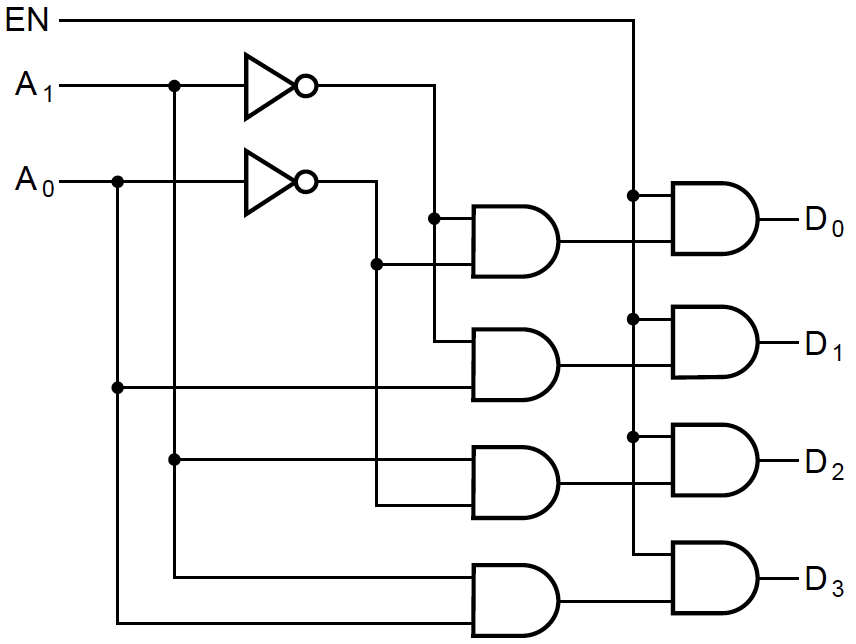
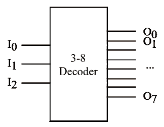
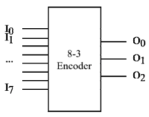
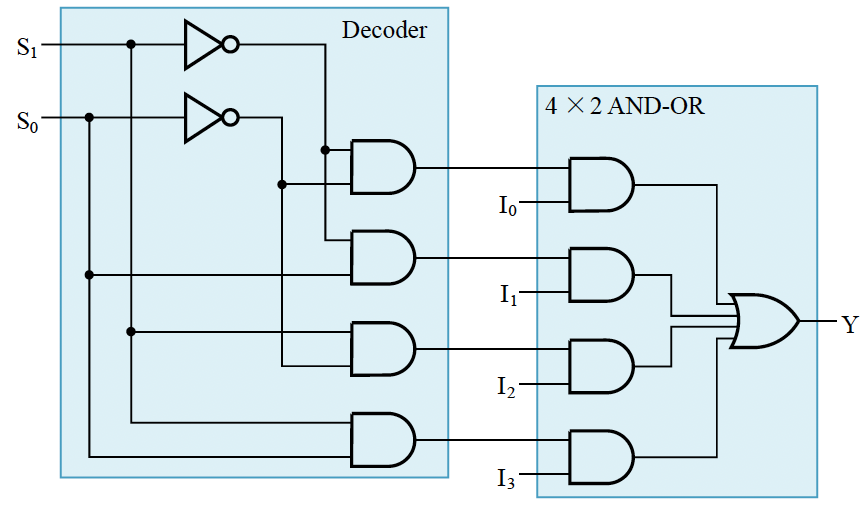
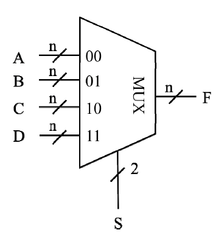

## 经典组合电路设计
### 译码器(Decoder)
1. **工作原理**

- 将 $n$ 位输入转换为 $2^n$ 位输出
- 输入二进制编码，由对应的十进制数字端口输出
- 可以加入使能（EN）信号：`EN=1`表示译码器工作

2. **真值表**

| Input ||| Output ||||||||
|:--:|:--:|:--:|:--:|:--:|:--:|:--:|:--:|:--:|:--:|:--:|
| $A_2$ | $A_1$ | $A_0$ | $D_0$ | $D_1$ | $D_2$ | $D_3$ | $D_4$ | $D_5$ | $D_6$ | $D_7$ |
| 0 | 0 | 0 | **1** | 0 | 0 | 0 | 0 | 0 | 0 | 0 |
| 0 | 0 | 1 | 0 | **1** | 0 | 0 | 0 | 0 | 0 | 0 |
| 0 | 1 | 0 | 0 | 0 | **1** | 0 | 0 | 0 | 0 | 0 |
| 0 | 1 | 1 | 0 | 0 | 0 | **1** | 0 | 0 | 0 | 0 |
| 1 | 0 | 0 | 0 | 0 | 0 | 0 | **1** | 0 | 0 | 0 |
| 1 | 0 | 1 | 0 | 0 | 0 | 0 | 0 | **1** | 0 | 0 |
| 1 | 1 | 0 | 0 | 0 | 0 | 0 | 0 | 0 | **1** | 0 |
| 1 | 1 | 1 | 0 | 0 | 0 | 0 | 0 | 0 | 0 | **1** | 

3. **组合逻辑电路**

{style="width:50%;display: block;margin: 20px auto"}

4. **电路元件符号**

{style="width:30%;display: block;margin: 20px auto"}

5. **应用**：加法器、七段数码管

---
### 编码器(Encoder)
1. **工作原理**

- 将 $2^n$ 位输入转换为 $n$ 位输出
- 由对应的十进制数字端口输入，输出二进制编码

2. **真值表**

| Input |||||||| Output |||
|:--:|:--:|:--:|:--:|:--:|:--:|:--:|:--:|:--:|:--:|:--:|
| $I_0$ | $I_1$ | $I_2$ | $I_3$ | $I_4$ | $I_5$ | $I_6$ | $I_7$ | $O_2$ | $O_1$ | $O_0$ |
| **1** | 0 | 0 | 0 | 0 | 0 | 0 | 0 | 0 | 0 | 0 |
| 0 | **1** | 0 | 0 | 0 | 0 | 0 | 0 | 0 | 0 | 1 |
| 0 | 0 | **1** | 0 | 0 | 0 | 0 | 0 | 0 | 1 | 0 |
| 0 | 0 | 0 | **1** | 0 | 0 | 0 | 0 | 0 | 1 | 1 |
| 0 | 0 | 0 | 0 | **1** | 0 | 0 | 0 | 1 | 0 | 0 |
| 0 | 0 | 0 | 0 | 0 | **1** | 0 | 0 | 1 | 0 | 1 |
| 0 | 0 | 0 | 0 | 0 | 0 | **1** | 0 | 1 | 1 | 0 |
| 0 | 0 | 0 | 0 | 0 | 0 | 0 | **1** | 1 | 1 | 1 | 
 

3. **电路元件符号**

{style="width:30%;display: block;margin: 20px auto"}

---
### 多路选择器(Multiplexer)
1. **工作原理**

- 利用`Decoder`将 $n$ 个控制信号转换为对应端口的控制信号
- 控制m个输入的其中一个输出

2. **真值表**

| Input || Output |
|:--:|:--:|:--:|
| $S_1$ | $S_0$ | $Y$ |
| 0 | 0 | $I_0$|
| 0 | 1 |$I_1$|
| 1 | 0 |$I_2$|
| 1 | 1 | $I_3$|

3. **组合逻辑电路**

{style="width:60%;display: block;margin: 20px auto"}

!!! note "Note"
    可以将与门替换为三态门或传输门。

4. **电路元件符号**

{style="width:30%;display: block;margin: 20px auto"}

5. **应用**：利用多个多路选择器进行位扩展，1位加法器（和`case`语法的实现思路类似）

!!! tip "Tips"
    **可以实现任何一个逻辑函数的方法：**

    1. **Decoder + OR Gates**：Decoder每个输出端口代表一个最小项
    2. **多路选择器**：将输入信号固定为常量（0或1）或变量，通过控制信号控制输出的端口
