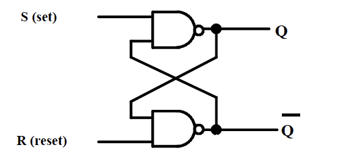
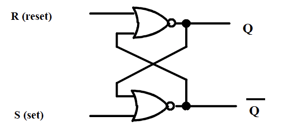
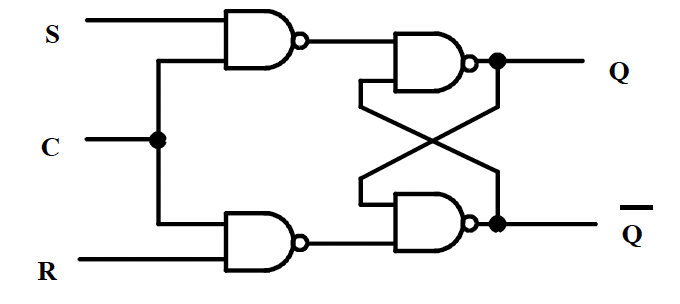
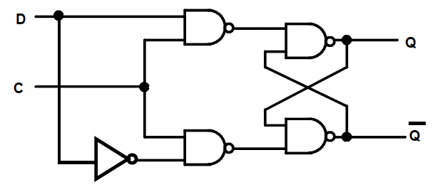
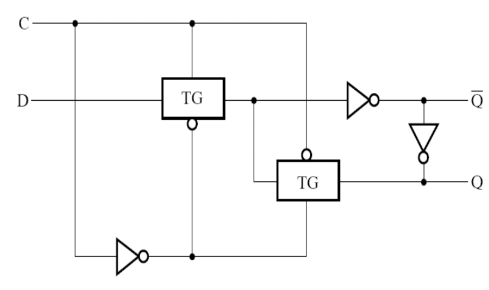
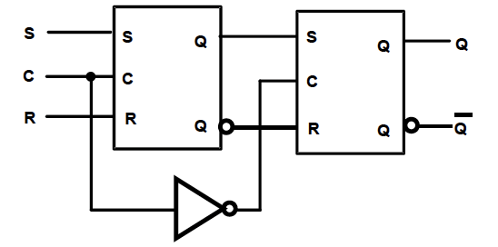
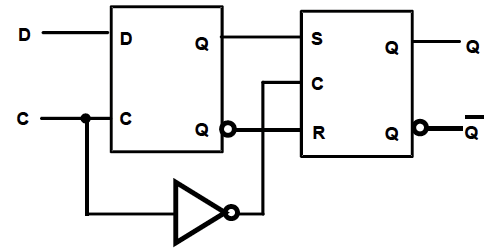
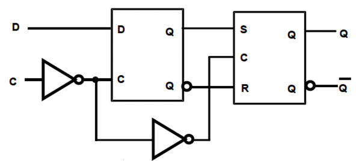
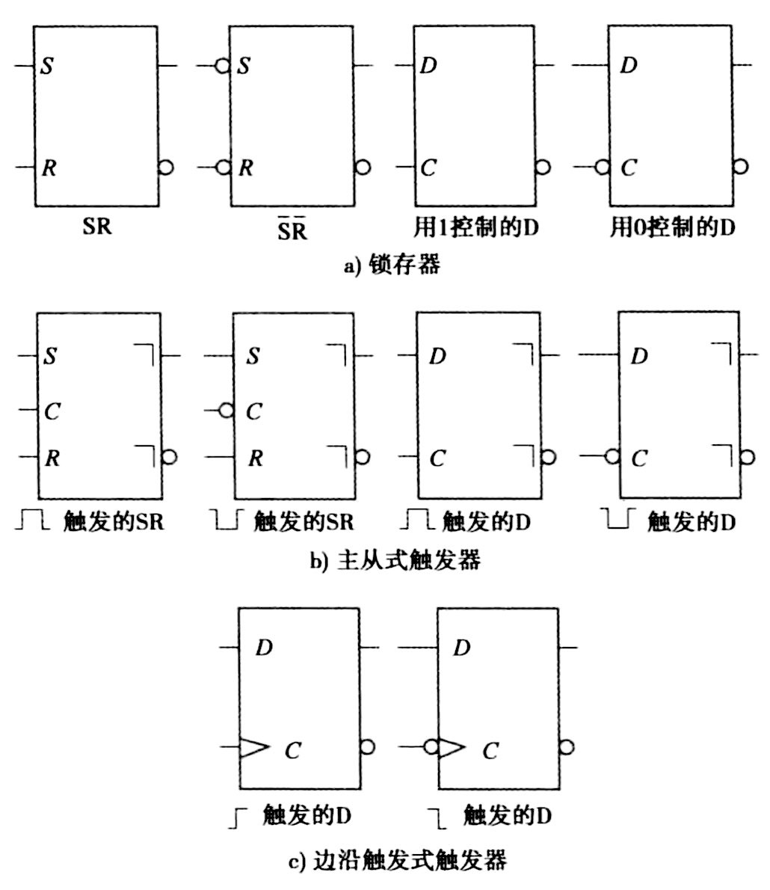

## 时序电路
1. **组成部分**

- **储存元件**：锁存器/触发器
- **组合逻辑**：
    - 输入：来自外部
    - 输出：输出到外部
        - Mealy型：取决于输入和当前状态
        - Moore型：仅取决于当前状态
    - 当前状态：来自储存元件
    - 状态输出：下一个状态**（取决于当前状态和输入）**，作为储存元件的输入

2. **时序电路类型**

- 取决于存储元件观察输入信号的时刻，以及存储元件状态改变的时机
- **同步电路**：仅在时序信号（时钟脉冲）的触发下观察输入并改变状态
- **异步电路**：由任意时刻的输入状态及输入变化的连续时间顺序决定

## 状态存储元件
!!! tip "输入信号的含义"
    - $S$：表示set输出$Q$为1
    - $R$：表示reset输出$Q$为0

### 锁存器
=== "(NAND) $\bar{S}-\bar{R}$ 锁存器"
    - **组成**：两个与非门

        { style="width: 50%;display: block;margin: 20px auto" }

    - **真值表**：

        |$R$|$S$|$Q$|$\bar{Q}$|
        |:--:|:--:|:--:|:--:|
        |0|0|禁止|禁止|
        |1|0|1|0|
        |0|1|0|1|
        |1|1|保持不变|保持不变|

    !!! danger "注意"
        - $S=0,R=0$ 不允许作为输入！
        - 当上一个输入为 $S=0,R=0$ 时，之后输入 $S=1,R=1$，信号不稳定 

=== "(NOR) $S-R$ 锁存器"
    - **组成**：两个或非门

        { style="width: 50%;display: block;margin: 20px auto" }
    
    - **真值表**：

        |$R$|$S$|$Q$|$\bar{Q}$|
        |:--:|:--:|:--:|:--:|
        |0|0|保持不变|保持不变|
        |1|0|0|1|
        |0|1|1|0|
        |1|1|禁止|禁止|

    !!! danger "注意"
        - $S=1,R=1$ 不允许作为输入！
        - 当上一个输入为 $S=1,R=1$ 时，之后输入 $S=0,R=0$，信号不稳定 

=== "时钟 $S-R$ 锁存器"
    - 设计思路：在(NAND) $\bar{S}-\bar{R}$ 锁存器的基础上加一个控制信号
    - **组成**：两个与非门+一个(NAND) $\bar{S}-\bar{R}$ 锁存器

        { style="width: 50%;display: block;margin: 20px auto" }
    
    - **行为**
        - $C$ 相当于控制信号或者信号
        - 当 $C=1$ 时，与(NAND) $\bar{S}-\bar{R}$ 锁存器功能相同
        - 当 $C=0$ 时，输出状态保持不变

=== "$D$ 锁存器"
    - 设计思路：改进时钟 $S-R$ 锁存器
        - 合并两种输出保持不变的情况
        - 利用信号变化时，两个输入 $S$ 和 $R$ 永远反相
        - 避免输入信号都为1的情况
    - **组成**：一个非门+一个时钟 $\bar{S}-\bar{R}$ 锁存器
        
        { style="width: 50%;display: block;margin: 20px auto" }

    - **真值表**

        |$C$|$D$|$Q$|$\bar{Q}$|
        |:--:|:--:|:--:|:--:|
        |0|X|保持不变|保持不变|
        |1|0|0|1|
        |1|1|1|0|

    ??? note "由传输门组成的D锁存器"
        { style="width: 50%;display: block;margin: 20px auto" }

### 触发器
=== "$S-R$ 主从触发器"
    **$S-R$ Master-Slave Flip-Flop**

    - **组成**：两个时钟 $S-R$ 锁存器，和一个非门
        - 主锁存器：接受外部输入信号
        - 从锁存器：输出最终结果

        { style="width: 50%;display: block;margin:20px auto;"}

    - **工作过程**
        - $C=1$：主锁存器接受外部输入；从锁存器锁定
        - $C=0$：主锁存器锁定；从锁存器输出主锁存器的状态
    - **缺点**
        - 可能发生`1s catching`问题
            - 当 $C=1$ 期间，若输入信号发生跳变，主锁存器会错误地"捕获"这些中间变化，导致从锁存器最终输出非预期状态
        - 改进方法：使用边沿触发

=== "边沿 $D$ 触发器"
    **Edge-Triggered D Flip-Flop**

    - **组成**：一个时钟 $S-R$ 锁存器+一个 $D$ 锁存器
    - **负边沿触发器**
        
        {style="width:50%;display: block;margin: 20px auto"}
        
        - 当 $C$ 信号由1变成0（负边沿）的时候，从锁存器开放，接受主锁存器输入，从而改变输出

    - **正边沿触发器**

        {style="width:50%;display: block;margin: 20px auto"}

        - 满足 $Q(t+1)=D(t)$

!!! abstract "状态存储元件的电路符号"
    {style="width:60%;display: block;margin: 20px auto"}