# 线程级并行 TLP

---
1. **TLP**（线程级并行）意味着存在多个程序计数器
2. TLP 主要通过 来实**MIMD 架构**实现
3. **多处理器系统**可以分为两大类：
    1. **shared memory**：系统中只有唯一的地址空间，所有进程共享
        1. 并不代表只有一个物理上的内存，实际上可以通过一块物理共享的内存实现，也可以通过分布式的内存实现
    2. **message passing**：每个处理器都有自己的地址空间，通过消息传递来通信、传送数据

## MIMD: Shared Memory
1. **MIMD 多处理器系统的不同内存访问模型** 
    1. Uniform Memory Access (**UMA**)：一致性存储访问
    2. Non Uniform Memory Access (**NUMA**)：非一致性存储访问
    3. Cache Only Memory Access (**COMA**)：仅缓存存储访问
2. **MIMD 多计算机系统的进一步分类**
    1. 大规模并行处理机（Massively Parallel Processors, **MPP**）
    2. 工作站集群（Cluster of Workstations, **COW**）

### UMA
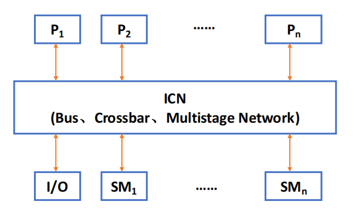{style="width:40%;display: block;margin: 20px auto"}

1. 也称为对称（共享存储）多处理器系统（SMP）或集中式共享存储多处理器系统
2. **特点**：
    1. 物理存储器由所有处理器**统一共享**
    2. **一致性：所有处理器访问任意存储单元所需时间相同**
    3. 每个处理器都可以配置**私有缓存或私有存储器**

        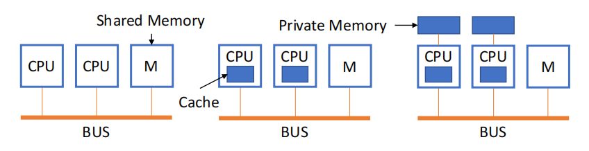{style="width:60%;display: block;margin: 20px auto"}

### NUMA
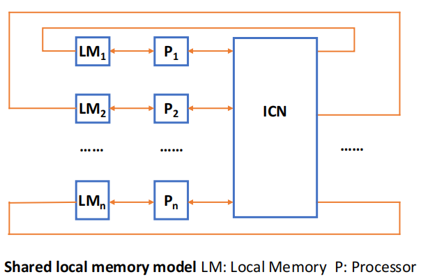{style="width:40%;display: block;margin: 20px auto"}

1. 也称为分布式共享存储多处理器系统（DSP）
2. **特点**：
    1. 所有 CPU 共享统一地址空间
    2. 使用 LOAD 和 STORE 指令访问远程存储器
    3. **访问远程存储器比访问本地存储器更慢**
    4. NUMA 系统中的处理器**可以使用缓存**
3. **分类**
    1. **NC-NUMA**：无缓存

        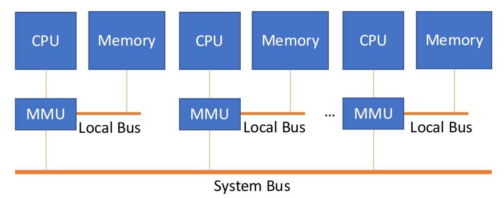{style="width:50%;display: block;margin: 20px auto"}

    2. **CC-NUMA**：有缓存

        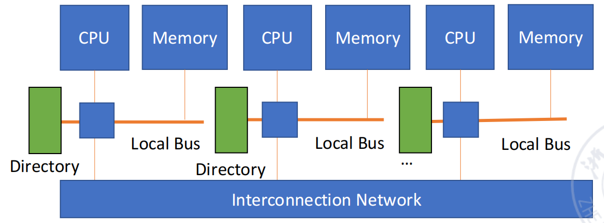{style="width:50%;display: block;margin: 20px auto"}

### COMA
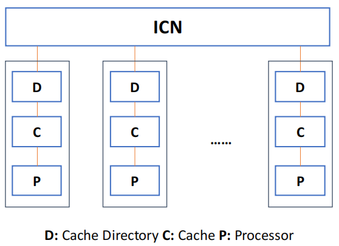{style="width:40%;display: block;margin: 20px auto"}

1. COMA 是 NUMA 的一种特殊情况
2. 在每个处理器节点中没有固定的存储层次结构，所有缓存共同形成一个统一的地址空间
3. **使用分布式缓存目录来支持远程缓存访问**
4. 数据在初始时可以任意分配，因为它最终会在运行时被移动到实际使用它的地方

### MPP
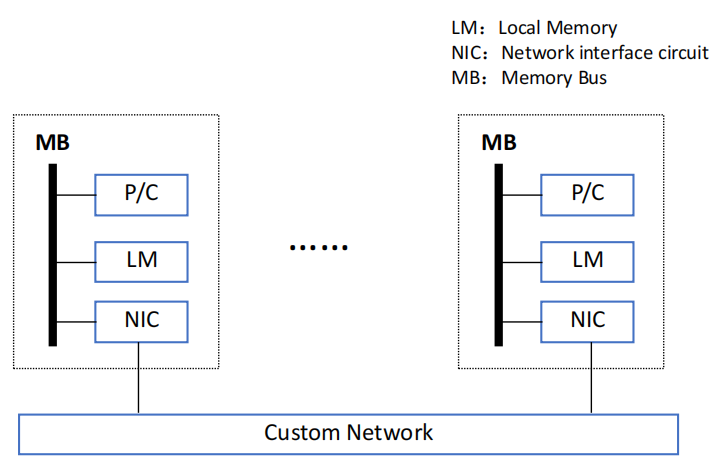{style="width:40%;display: block;margin: 20px auto"}

1. 大规模并行处理系统是一种由数百个处理器组成的**并行计算机系统**
2. **应用**：
    1. 在过去，主要用于计算密集型场景，如科学计算和工程仿真
    2. 但现在也广泛用于商业和网络应用
3. MPP 的**开发难度较高，成本昂贵，市场规模有**限，但它是一个国家综合实力的象征
4. **MPP 的特性**
    1. 通常使用标准的商用 CPU 作为处理器
    2. 使用高性能专用互连网络，可以提供低延迟和高带宽的消息传输
    3. 具有强大的输入/输出能力
    4. 具备专门的容错处理能力

### COW
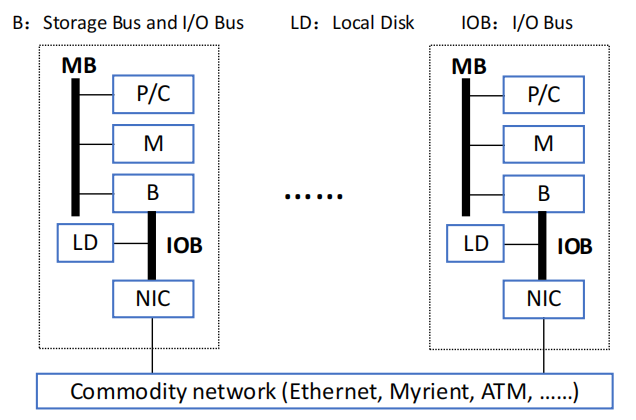{style="width:40%;display: block;margin: 20px auto"}

1. 工作站集群系统由大量 PC 或工作站组成，这些节点通过**商业网络**连接在一起
2. COW 可以完全使用商业现成组件构建，这些商业组件通常是大规模生产的产品，因此具有较高的性价比
3. COW 主要分为两种**类型**：集中式和分布式

!!! warning "并行处理的挑战"
    多处理器系统的应用范围很广：从运行彼此独立、几乎不需要通信的任务，到运行需要相互通信才能完成任务的并行程序。
    
    1. 第一个障碍来自于程序中可利用的**并行性有限**
    2. 第二个障碍来自于**通信开销相对较高**

---

## Cache Coherence
!!! info "**内存一致性**（Memory Consistency）：需要内存一致性模型，写和读的顺序（如果先读再写则破坏）"

1. **缓存一致性**（Cache Coherence）：需要缓存一致性协议
2. **缓存一致性问题产生的原因**：在现代并行计算机中，处理器通常都配有缓存；内存中的数据可能在整个系统中存在多个副本

    !!! warning "Cache 不一致"
        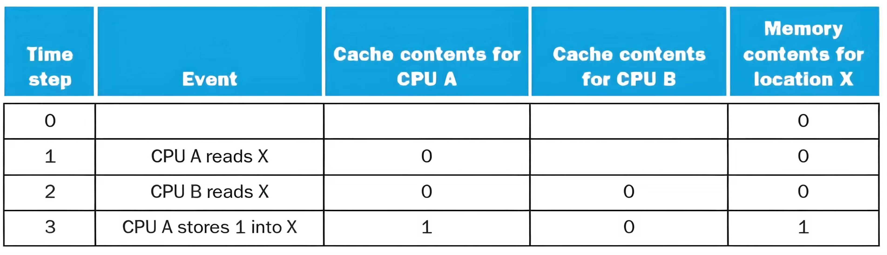{style="width:80%;display: block;margin: 20px auto"}

3. **相关操作**：
    1. **迁移**（Migration）：数据项可以被移动到本地缓存中使用，并对程序透明
        1. 降低远程共享数据访问延迟
        2. 降低共享内存带宽压力
    2. **复制**（Replication）：当共享数据被多个处理器同时读取时，会在各自缓存中复制数据
        1. 降低读取延迟
        2. 降低共享数据访问竞争

### 缓存一致性协议
1. **Cache 一致性协议**：缓存、CPU 和内存共同实现的一组规则，用于防止同一数据的不同版本同时出现在多个缓存中
2. **常见的缓存一致性协议**：
    1. **总线监听协议**（Bus Snooping Protocol）：适合 UMA 架构
        1. 所有处理器都会监听总线
        2. 当某个处理器修改私有缓存中的数据时，会**通过总线广播失效信息或更新数据**
        3. 其他处理器据此使自己的缓存副本失效或更新
    2. **基于目录的协议**（Directory-Based Protocol）：适合 NUMA 架构
        1. 使用**目录**记录哪些处理器缓存中保存了某个内存块
        2. 当某处理器要写某个共享数据块时：通过目录查找所有持有该块副本的处理器，向这些处理器发送**点对点失效消息**
        3. 其他缓存副本被**统一失效**，从而保持一致性

### 总线监听协议

1. **缓存按照该协议执行读写操作时的四种情况**

    | 请求类型             | 本地请求 | 远程请求 |
    | ---------------- | ------------------- | -------------------- |
    | **Read Miss**  | 从内存访问数据             | —                    |
    | **Read Hit**    | 使用本地缓存数据            | —                    |
    | **Write Miss** | 修改内存中的数据            | —                    |
    | **Write Hit**   | 修改缓存和内存             | **使其他缓存中的该数据项失效**        |

2. **缓存一致性基本协议的变化**
    1. 远程写命中：使用 **更新策略（Update Strategy）** 或 **失效策略（Invalidate Strategy）**
    2. 写未命中发生时：是否将对应数据块调入缓存取决于 **写分配策略（Write-allocate Policy）**
3. **写更新/写广播协议**（Write Update / Write Broadcast Protocol）：当某个数据项被写入时，更新该数据的所有缓存副本

#### 写失效协议
1. **写失效协议**（Write Invalidate Protocol）：在写操作发生时，使其他缓存中的副本失效
2. **三种块状态（MSI 协议）**
    1. I（Invalid，无效）：该缓存块无效
    2. S（Shared，共享）：表示该缓存块在私有缓存中可能被多个处理器共享
    3. **M（Modified，已修改）**：表示该缓存块已在私有缓存中被修改，**该块是独占的（exclusive），与内存中的数据不同步**

    !!! info "write-back 状态转换"
        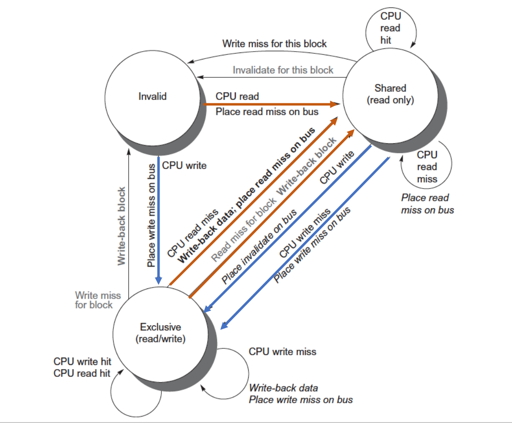{style="width:80%;display: block;margin: 20px auto"}
        
        
    !!! question "Question"
        === "(1)"
            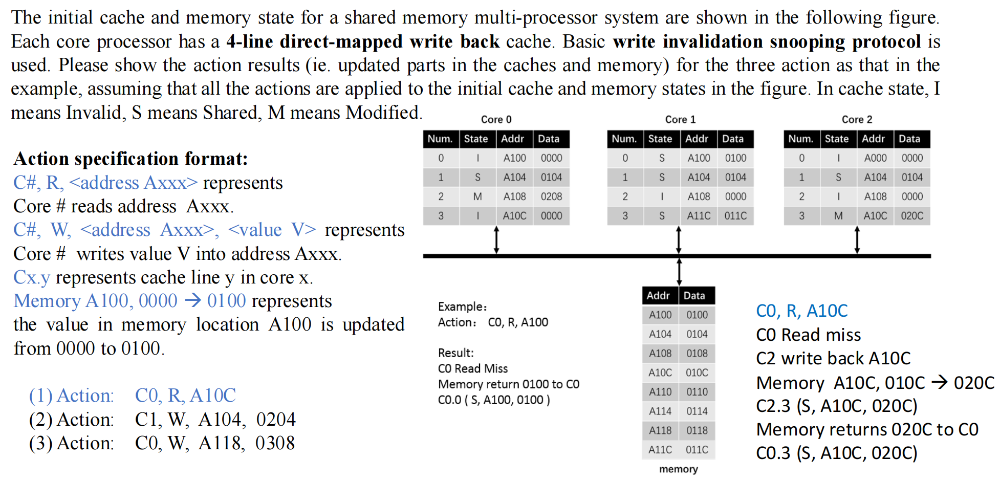{style="width:100%;display: block;margin: 20px auto"}
        
        === "(2)"
            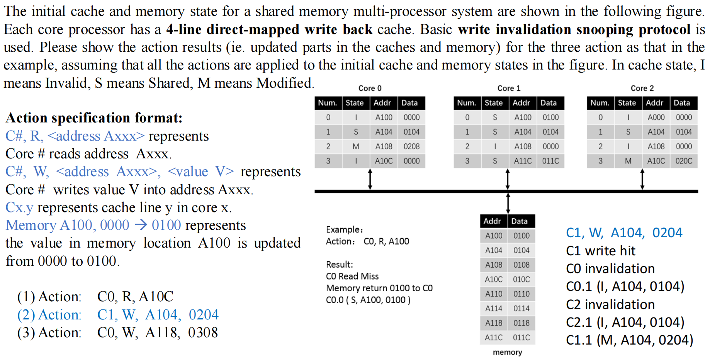{style="width:100%;display: block;margin: 20px auto"}

        === "(3)"
            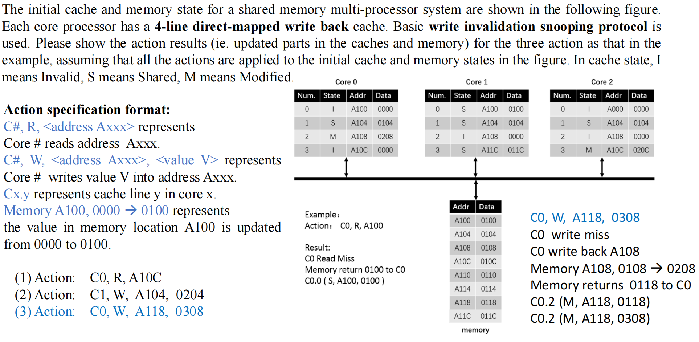{style="width:100%;display: block;margin: 20px auto"}

3. **MESI 协议**：
    1. **Exclusive（独占）状态**：表示某个缓存块**只存在于一个缓存中，但该数据与内存一致，内存中的数据是最新的**
    2. **状态转换**：
        1. Exclusive → 被其他处理器读取 → Shared
        2. Exclusive → 写操作 → Modified
    3. **MESI 优化点**：当从 Exclusive 写入变为 Modified 时，可以静默执行，**无需在总线上广播**

    !!! info "状态转换"
        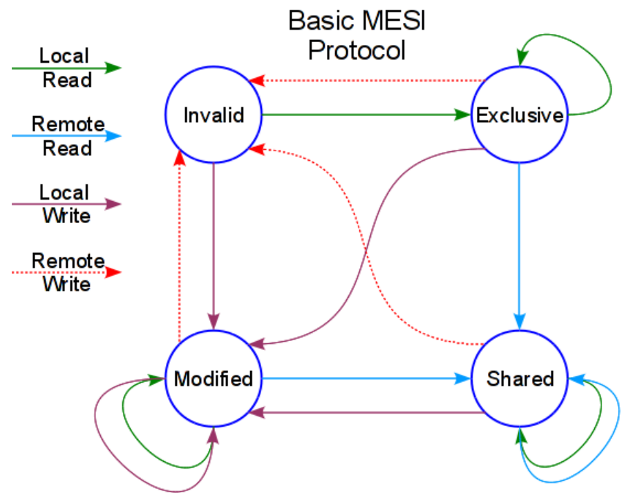{style="width:60%;display: block;margin: 20px auto"}

