# Cache
---
1. <mark>**Cache 定义**：用于改善慢速存储器平均访问时间的**“小而快”**的存储</mark>

    !!! tip "Tip"
        1. 缓存是一个通用概念，广泛应用于处理器、操作系统、文件系统和应用程序中
        2. <mark>**万物皆缓存**：</mark>
            1. Registers 是变量的 cache
            2. L1 cache 是 L2 cache 的 cache
            3. L2 cache 是 memory 的 cache
            4. Memory 是 disk 的 cache，即 virtual memory
            5. TLB 是 page table 的 cache
            6. Branch predictor 可看作预测信息的 cache

2. **相关定义**
    - **Cache Hit/Miss**：处理器能够/无法在缓存中找到所请求的数据项
    - **Cache Block/Line**：一个**固定大小**的数据集合，包含所请求的字，从主存中检索并放入缓存中
    - **局部性原理**

3. **Cache Miss**
    - 处理缓存未命中**所需的时间取决于**：
        - **延迟** (Latency)： 获取数据块中**第一个字**所需的时间
        - **带宽** (Bandwidth)： 获取该数据块**剩余部分**所需的时间
    - <mark>**原因**</mark>
        - **强制性未命中** (Compulsory)： **首次**访问某个数据块
        - **容量未命中** (Capacity)： 数据块因**缓存满**被丢弃后，再次被访问
        - **冲突未命中** (Conflict)： 程序反复访问多个不同的数据块，而这些数据块映射到**缓存中的同一位置**
            - 解决方案：增大缓存大小、提高相联度

4. **性能提高**：充分利用**局部性原理**（大多数程序不会均匀地访问所有代码或数据）
    - 时间局部性：将最近访问过的数据项保留在更靠近处理器的位置
    - 空间局部性：将最近访问过的**连续字组**（数据块）移动到更靠近处理器的位置

??? abstract "关于 cache 的 36 个名词"
    | English | Chinese | English | Chinese | English | Chinese |
    | :--- | :--- | :--- | :--- | :--- | :--- |
    | **Cache** | 高速缓存 | **Full associative** | 全相联 | **Write allocate** | 写分配 |
    | **Virtual memory** | 虚拟存储器 | **Dirty bit** | 脏位 | **Unified cache** | 统一缓存 |
    | **Memory stall cycles** | 存储停顿周期 | **Block** | 块 / 行 | **Block offset** | 块内偏移 |
    | **Misses per instruction** | 每指令缺失数 | **Direct mapped** | 直接映射 | **Write back** | 写回 |
    | **Valid bit** | 有效位 | **Data cache** | 数据缓存 | **Locality** | 局部性 |
    | **Block address** | 块地址 | **Hit time** | 命中时间 | **Address trace** | 地址轨迹 |
    | **Write through** | 写直达 | **Cache miss** | 缓存缺失 | **Set** | 组 |
    | **Instruction cache** | 指令缓存 | **Page fault** | 缺页中断 | **Miss rate** | 缺失率 |
    | **Random replacement** | 随机替换 | **Index field** | 索引段 | **Cache hit** | 缓存命中 |
    | **Average memory access time** | 平均访存时间 | **Page** | 页 | **Tag field** | 标志段 |
    | <mark>**n-way set associative**</mark> | n 路组相联 | **No-write allocate** | 非写分配 | **Miss penalty** | 缺失惩罚 |
    | **Least-recently used** | 最近最少使用 | **Write buffer** | 写缓冲 | **Write stall** | 写停顿 |

---
## Cache 设计
1. **多级缓存组织**

    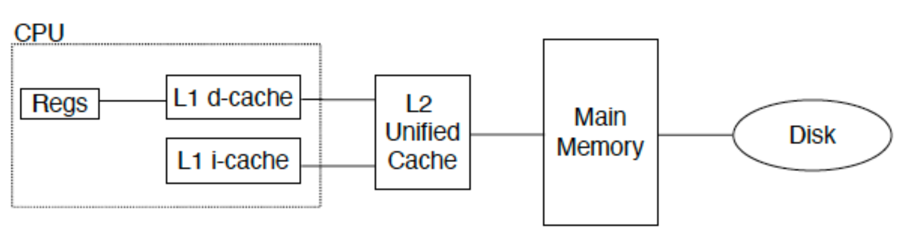{style="width:80%;display: block;margin: 20px auto"}

    - **统一缓存**：
        - 所有内存请求都通过同一个缓存
        - 硬件需求较少，但性能较低 
    - **分离 I & D 缓存**：
        - CPU 中指令和数据使用独立的缓存
        - 需要额外的硬件，但也有简化之处（**e.g.** I-cache 是只读的）

2. **设计的四个问题**
    - Q1：数据块可以放在高级别存储/主存的什么位置？（块放置：全相联、组相联、直接映射）
    - Q2：如果数据块在高级别存储/主存中，如何找到它？（块识别：标志位/数据块）
    - Q3：在 Cache/主存缺失时，应该替换哪一块？（块替换：随机算法、最近最少使用、先进先出）
    - Q4：写入时会发生什么？（写策略：回写或配合写缓冲器直写）

### 块放置
1. **直接映射**：通常**利用块地址<mark>取模</mark>**的方式，将数据块映射到缓存中（容易冲突）
2. **全相联**：块可以放置在<mark>**任意**</mark>一个空的位置（寻找不方便）
3. **组相联**：
    - <mark>结合上述两种方法</mark>
        - 将缓存分组，利用**取模**的方式将数据块映射到组中
        - 在组内，块可以放置在**任意**一个空位置
    - <mark class="blue">如果每个组包含 $n$ 个数据块，则称该 Cache 为 **$n$ 路组相联**</mark>
        - 大多数情况下， $n \leq 4$ 
        - <mark>相联度越高，Cache 空间的利用率就越高，数据块碰撞的概率越低，缺失率也就越低</mark>

    !!! tip "Tip"
        1. Direct mapped 相当于 1-way set associative
        2. Fully associative 相当于 m-way set-associative (m blocks)

### 块识别

1. 每个块都有一个**地址标签 `Tag`**，用于存储该块中数据的**内存地址**

    - 检查缓存时，处理器会将请求的内存地址与缓存标签进行比较
    - 如果两者相等，则发生**缓存命中**，数据存在于缓存中

2. 通常，每个缓存块还有一个**有效位**，用于指示缓存块的内容**是否有效**

3. <mark class="orange">**物理地址的格式**</mark>

    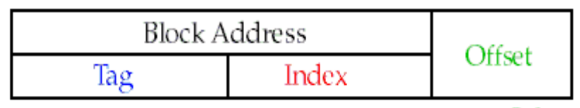{style="width:50%;display: block;margin: 20px auto"}

    - **`Index`**：
        - **组相联**：用于选择缓存中的<mark>组</mark>，位数为 $\log_2(\#sets)$
        - **直接映射**：用于选择缓存中的<mark>块</mark>，位数为 $\log_2(\#blocks)$
    - **`Byte offset`**：用于选择缓存块中的<mark>字节</mark>，位数为 $\log_2(size\_of\_block)$ （字节数）
    - **`Tag`**：用于在组内或缓存中查找匹配的块（<mark>判断是不是目标 block</mark>），位数为除去索引和字节偏移的剩余位数

    !!! abstract "cache 大小计算"
        **地址长度**：64 位
        
        **映射方式**：直接映射
        
        **缓存大小**：$2^n$ 个块（因此 Index 需要 $n$ 位）
        
        **块大小**：$2^m$ 个字 ($2^{m+2}$ 字节 = $2^{m+5}$ 位)

        - Word Offset：使用 $m$ 位定位块内的字
        - Byte Offset：使用 2 位定位字内的字节（因为 1 字 = 4 字节）
        
        **关键公式计算**：
        
        - 标签位数：$64 - (n + m + 2)$
        
        - 总缓存占用空间：<mark>每个条目包含：数据位 + 标签位 + 有效位</mark>
            
            $$
            \text{Total bits} 
            = 2^n \times (\text{block size} + \text{tag size} + \text{valid bit}) \\
            = 2^n \times (2^m \times 32 + (64 - n - m - 2) + 1) \\
            = 2^n \times (2^m \times 32 + 63 - n - m)
            $$

        ??? question "Exercise 1"
            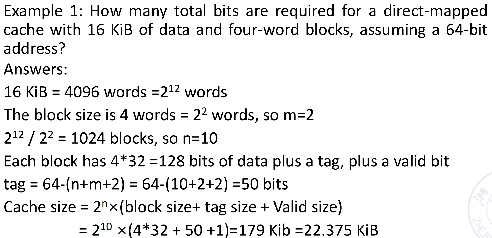{style="width:80%;display: block;margin: 20px auto"}

        ??? question "Exercise 2"
            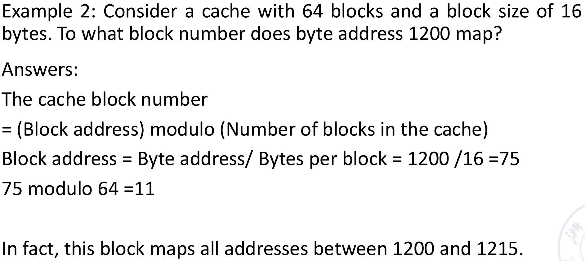{style="width:80%;display: block;margin: 20px auto"}

4. **查找步骤**
    - **直接映射**
        - 是否**有效**
        - 缓存行中的标签位是否与地址中的**标签位匹配**
        - 如果均满足，则缓存命中，利用块偏移读取块中数据
    - **组相联**
        - 是否**有效**
        - 组其中一块的标签位是否与地址中的**标签位匹配**
        - 如果均满足，则缓存命中，利用块偏移读取对应块中数据

??? abstract "Cache 有限状态机"
    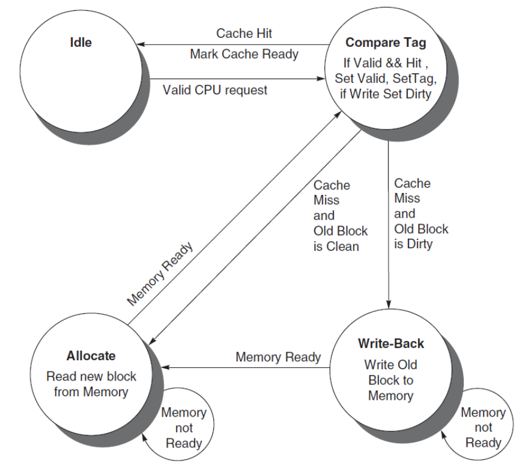{style="width:50%;display: block;margin: 20px auto"}

### 块替换
!!! abstract "**在指令缓存缺失时采取的步骤**"
    1. 将原始的 PC 值发送到内存（PC-4）
    2. 指示**主存执行读取**操作，并等待内存完成访问
    3. **写入缓存条目**：将来自内存的数据放入该条目的数据部分，将地址的高位（来自 ALU）写入标记字段，并将有效位置为开启
    4. 从第一步重新开始指令执行，这将**重新取指**，而这一次将在缓存中找到该指令

1. **随机替换**：随机选择任何一个数据块
    - **在硬件上易于实现**，只需要一个随机数生成器
    - 将**<mark>均匀</mark>地分布**在整个缓存中
    - 可能会驱逐一个**即将被访问**的数据块

2. **最近最少使用（LRU）**：选择缓存中**最近使用最少**的块进行替换
    - 假设最近被访问过的数据块**更有可能再次被引用**
    - 这需要在缓存中**增加额外的位数**来追踪访问情况

    ??? example "Example"
        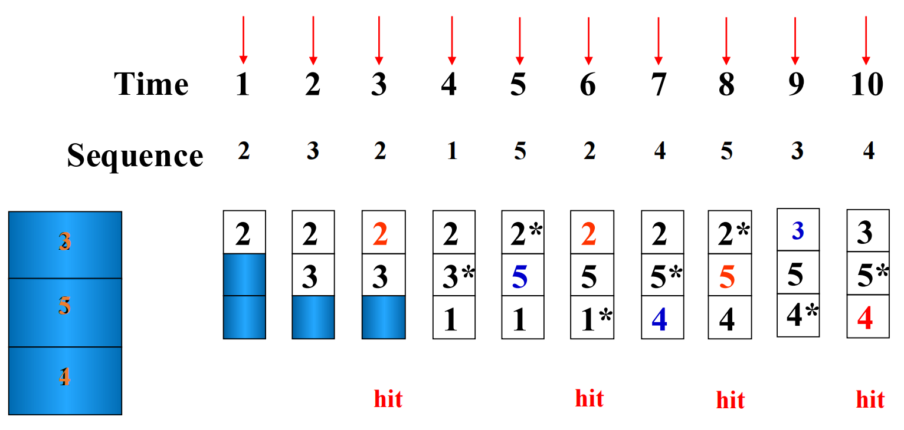{style="width:60%;display: block;margin: 20px auto"}

3. **先进先出（FIFO）**：选择缓存中**进入最早**的块进行替换（不管是否命中）
    
    ??? example "Example"
        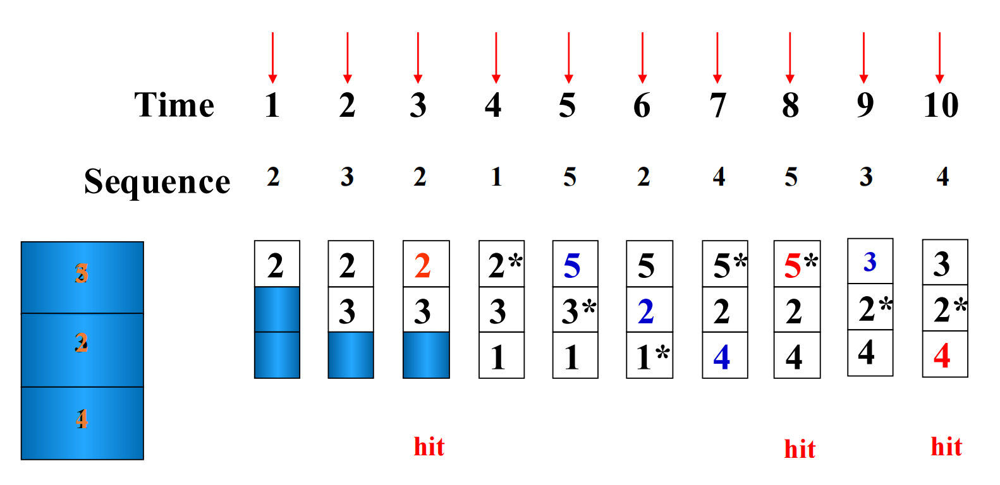{style="width:60%;display: block;margin: 20px auto"}

4. **最优替换算法（OPT）**：理论上的模拟算法，选择**未来最长时间不会访问**的块进行替换
        
    ??? example "Example"
        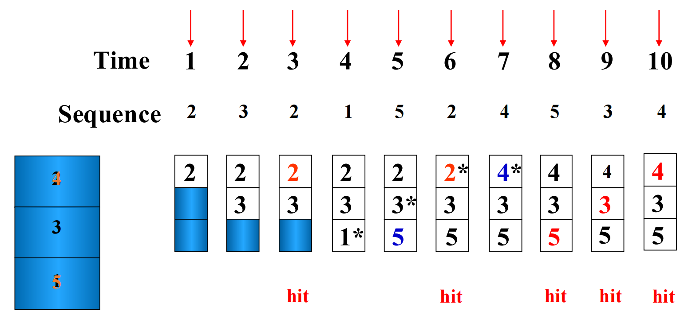{style="width:60%;display: block;margin: 20px auto"}

!!! tip "命中率的影响因素"
    1. 命中率与**替换算法**有关
    2. 命中率与**访问序列**有关

        ??? warning "thrashing 颠簸现象"
            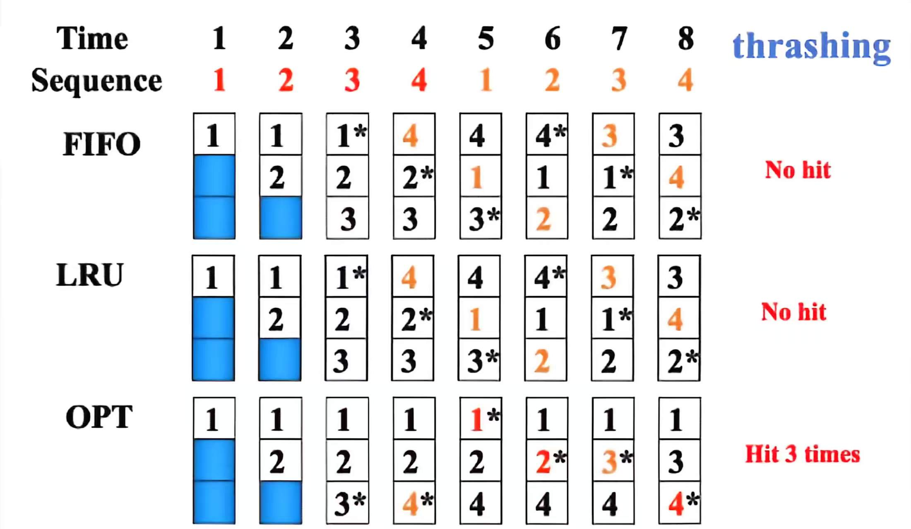{style="width:60%;display: block;margin: 20px auto"}

    3. 命中率与**块的大小**有关

        ??? example "Example"
            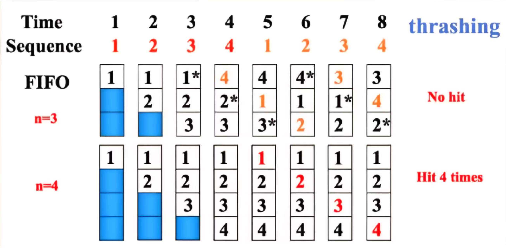{style="width:60%;display: block;margin: 20px auto"}

#### 栈替换算法
1. **$B_t(n)$**：表示在时刻 $t$，容量为 $n$ 个数据块的缓存中所包含的页面（或数据块）集合
2. **包含性质**：$B_t(n) \subseteq B_{t}(n+1)$
3. <mark>**LRU 算法是栈替换算法，但是 FIFO 算法不是**</mark>（因为不满足包含性质）

!!! example "Using LRU"
    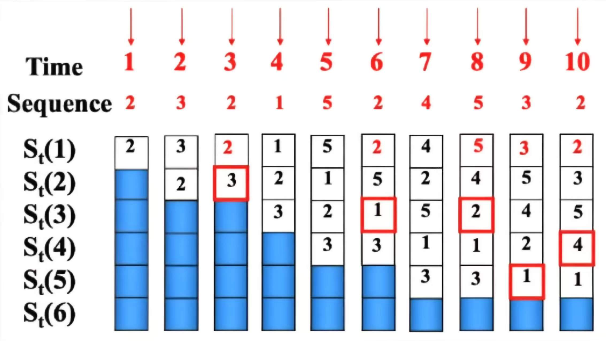{style="width:60%;display: block;margin: 20px auto"}

    当 cache 块的数目为 N = 4 时，一共会命中 4 次

#### LRU 比较对法
1. **比较对法**：仅使用**普通的逻辑门和触发器**来实现 LRU 替换算法
2. **基本思想**： 
    - 让每个缓存块**两两组合**
    - 使用一个**比较对触发器**来记录该比较对中两个缓存块**被访问的顺序**
    - 然后利用**门电路**组合每个比较对触发器的状态，就可以根据 LRU 算法找到需要被替换的块

!!! example "Example"
    假设有三个缓存块 A、B、C，有三对组合 AB、AC、BC
    
    每一对的访问顺序分别由比较对触发器 $T_{AB}$、$T_{AC}$ 和 $T_{BC}$ 表示

    - $T_{AB}=1$ 表示 A 比 B 最近被访问过
    - $T_{AB}=0$ 表示 B 比 A 最近被访问过

    ??? question "**Exercise**"
        1. 如果最近访问的块是 A，而 C 是最久未被访问的块：$T_{AB}=1$，$T_{AC}=1$，$T_{BC}=1$
        2. 如果最近访问的块是 B，而 C 是最久未被访问的块：$T_{AB}=0$，$T_{AC}=1$，$T_{BC}=1$

    **公式**（用来判断谁应该被替换）：$C_{LRU} = T_{AC} \cdot T_{BC}$、$B_{LRU} = T_{AB} \cdot \overline{T_{BC}}$、$A_{LRU} = \overline{T_{AB}} \cdot \overline{T_{AC}}$

    **结构**：每进行一次访问都会改变触发器的状态

    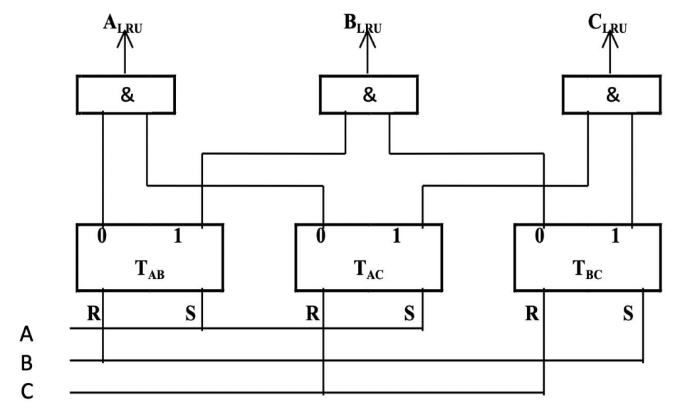{style="width:50%;display: block;margin: 20px auto"}

    ??? abstract "硬件使用分析"
        假设 $p$ 是缓存块的数量
        
        1. 由于每个缓存块都可能被替换，其信号需要通过一个**与门**来生成，因此与门的数量将等于 $p$。
        2. 与门的**输入端**数量为 $p - 1$
        3. **比较对触发器的数量**是 $C_p^2$，即 $p \cdot (p-1) / 2$

        当 $p$ 超过 8 时，需要的触发器过多，这个算法就不适用了

### <mark>写策略</mark>
1. **Write Hit**：
    - **write-through**：发生写命中时，数据被**同时写入缓存和主存**
        - 确保**强数据一致性**；每一次写入都会立即到达主存，内存始终拥有最新数据
        - **缓存控制位**：仅需一个有效位
        - **典型应用场景**：对数据完整性要求极高的实时系统
    - **write-back**：发生写命中时，数据被**写入缓存**，但**不会写入主存**
        - 只有当被修改的脏数据块从缓存中被驱逐时，主存才会被更新，**减少了内存带宽**的使用
        - **缓存控制位**：<mark>同时包含有效位和脏位</mark>（用来跟踪修改情况）
        - **典型应用场景**：以性能为优先的通用处理器

        !!! abstract "Dirty Bit"
            1. **脏位**：与缓存行相关联的一个状态位
            2. 用于指示缓存中的数据是否已被修改但尚未写回主存
            3. 对写回策略至关重要，用于在驱逐缓存行时确定**是否需要执行写回操作**

2. **Write Miss**：
    - **Write allocate**：<mark>发生写缺失时，将缺失的数据块从主存加载到缓存中，然后**在缓存中执行写操作**</mark>（dirty bit = 1）
        - 利用空间局部性和时间局部性来优化未来的访问
        - <mark>对应 **write-back** 策略</mark>
    - **No Write Allocate（Write around）**：<mark>发生写缺失时，数据**直接写入主存**</mark>，而不将数据块加载到缓存中
        - 数据不存储在缓存中，可以防止一次性或低频次写入造成的**缓存污染**
        - <mark>对应 **write-through** 策略</mark>
        - **典型应用场景**：日志系统或流媒体数据（写入的数据很少会被再次读取）

3. **写停顿** (Write stall)：在执行 **write-through** 过程中，CPU 必须等待写入操作完成时发生的现象

4. **写缓冲** (Write buffer)：用于 **write-through** 优化
    - 一个小型缓冲区，用于临时保存 **write-through** 数据，允许 CPU 在**无需等待内存写入完成**的情况下继续执行指令
    - 减轻了 **write-through** 策略带来的性能损失，在写入操作密集时非常有帮助

    !!! warning "Warning"
        写缓冲区**并不能完全消除停顿**，因为如果突发写入量大于缓冲区容量，缓冲区仍有可能被填满

!!! tip "Tip"
    这里补充了 Cache 安全相关知识，请参照 PPT

---
## 缓存性能
1. **CPU Execution Time** = (CPU clock cycles + Memory stall cycles) × Clock cycle time
2. **Memory stall cycles** = IC × MemAccess refs per instructions × Miss rate × Miss penalty

    !!! info "翻译"
        MemAccess refs per instructions    每条指令的存储器访问引用次数
        
        Memory stall cycles                存储器停顿周期

3. **CPU Time** 综合公式

    $$
    CPUtime = IC \times \left( CPI_{Execution} + \frac{MemAccess}{Inst} \times MissRate \times MissPenalty \right) \times CycleTime
    $$

    $$
    CPUtime = IC \times \left( CPI_{Execution} + \frac{MemMisses}{Inst} \times MissPenalty \right) \times CycleTime
    $$

    !!! info ""
        其中的 **CPI 执行** 包含 ALU 指令和内存指令

4. **平均内存访问时间**
    - <mark class="orange">**AMAT = HitTime + MissRate × MissPenalty**</mark>
        - **Miss penalty**: 发生缺失时，将数据从主存加载到缓存所需的时间
    - AMAT = AMAT_inst × Inst% + AMAT_data × Data%

!!! success "执行时间"
    $$
    CPUtime = IC \times \left( \frac{ALUOps}{Inst} \times CPI_{AluOps} + \frac{MemAccess}{Inst} \times AMAT \right) \times CycleTime
    $$

### 性能提高基础方法

#### 减少 MissRate

1. **方法一**：增加**缓存块**的大小
    - **核心原理**：利用空间局部性，**一次加载更多连续数据**，减少首次访问的强制性失效次数
    - **主要优点**：显著降低失效率，尤其对具备良好空间局部性的程序效果明显
    - **潜在缺点**：<mark>增大 **Miss penalty**</mark>（传输更多数据），且可能因映射冲突增加冲突失效概率
    - **适用场景**：数据访问具有强空间局部性的应用
2. **方法二**：增加**缓存**的大小
    - **原理**：提供更大空间容纳数据，减少容量失效与冲突失效的发生
    - **优点**：显著降低缓存失效率，优化效果通常直观且明显
    - **缺点**：<mark>**Hit Time 延长**</mark>，同时增加硬件成本与功耗开销
    - **场景**：处理大型数据集的应用
3. **方法三**：增加**相联度**
    - **原理**：允许内存块映射到缓存中的**多个位置**，而非单一固定位置，从而分散冲突风险
    - **优点**：<mark>显著降低 **Conflict Miss**</mark>，在数据访问模式复杂或存在大量共享数据时效果尤为明显
    - **缺点**：
        - 硬件复杂度提升（需并行比较多个标签）
        - <mark>可能导致 **Hit Time** 和 **Miss penalty** 略有增加</mark>
        - 功耗和面积占用增加
    - **适用场景**：适用于数据访问模式易引发冲突失效的程序
    - 必须在**更高的相联度与硬件成本之间**取得平衡

    !!! abstract "2:1 缓存规则"
        大小为 $N$ 的直接映射缓存的缺失率 $\approx$ 大小为 $N/2$ 的 2 路组相联缓存的缺失率

        **意义**：更高的相联度可以减少冲突缺失，有助于以更小的缓存容量实现相同的缺失率

!!! success "其余方法"
    1. **方法四**：way prediction 会预测目标 block 在哪一路
    2. **方法五**：pseudo-associativity 伪相联
    3. **方法六**：compiler optimizations 编译器优化（通过代码和数据布局优化局部性，减少 miss）

#### 减少 MissPenalty

1. **方法一**：<mark>多级缓存</mark>
    - **核心原理**：在 CPU 和主存之间添加 **L1/L2/L3 缓存**；当 L1 发生缺失时，先检查速度较快的 L2/L3，以避免缓慢的主存访问
    - **优点**：<mark>显著减少 **Miss Penalty**</mark>；是现代处理器的标准配置
    - **缺点**：增加了硬件复杂性和制造成本
    - **应用**：所有现代高性能处理器和计算系统

2. **方法二**：<mark>读失效优先于写操作</mark>
    - **核心原理**：写操作入缓冲区等待，读失效时优先处理读请求，减少 CPU 等待读数据的阻塞时间
    - **主要优点**：显著降低有效失效开销，在读取密集型场景下性能提升尤为明显
    - **潜在缺点**：可能会增加**写操作的延迟**（但由于写操作通常对实时性不敏感，此影响较小）
    - **适用场景**：读操作频率远高于写操作的应用程序

    !!! warning ""
        导致的 RAW 的冲突需要解决！

!!! abstract "其他方法"
    1. **方法三**：Critical Word First（Cache miss 时，优先返回 CPU 当前急需的 word，而不是等整个 block 都传完）
    2. **方法四**：Merging Write Buffers（把多个相邻或相同 block 的写合并，减少内存写次数）
    3. **方法五**：Victim Cache（小型全相联 Cache，放在主 Cache 和下一级之间，主 Cache 被替换出去的 block 先放入 victim cache）

#### 减少 HitTime

1. **方法一**：小而简单的缓存 
2. **方法二**：在缓存索引期间避免地址转换
    - **核心原理**：使用<mark>虚拟地址</mark>而非物理地址进行缓存索引，从而绕过关键路径上的 TLB 查找
    - **优点**：显著减少缓存命中时间，并由于延迟降低而允许更高的 CPU 时钟频率
    - **缺点**：存在**缓存别名**风险（多个虚拟地址映射到同一个物理地址），需要特殊的硬件解决方案
    - **应用场景**：高性能处理器设计，其中为了实现峰值效率，必须将每一周期的延迟降至最低

3. **方法三**：流水线化缓存访问（把 Cache 访问拆成多个流水级）
4. **方法四**：trace caches（存储已经解码过的动态指令序列）

#### 并行化
<mark>Reduce the miss penalty and miss rate via parallelism</mark>

1. 非阻塞缓存 (non-blocking caches)：miss 正在处理时，允许 CPU 继续执行其他可执行指令
2. 硬件预取 (hardware prefetching)：硬件自动检测访问模式并提前取数据
3. 编译器预取 (compiler prefetching)：编译器插入 prefetch 指令

### 性能提高先进方法

1. 采用**虚拟索引和组相联**结构的**流水线化** L1 缓存

    - **核心原理**：将缓存访问（译码、比较、读取）拆分为流水线阶段，允许 CPU 每个周期发起新请求，提升带宽
    - **主要优势**：显著增加缓存带宽，支持更高的 CPU 时钟频率，提升连续访问的吞吐量
    - **潜在代价**：增加了单次访问的命中时间（延迟），数据需流经多个流水线阶段才能返回
    - **适用场景**：适用于高频率、高带宽需求的现代高性能处理器架构

2. 通过**多存储体与多端口**增加一级数据缓存带宽

    - 核心原理：将缓存划分为多个独立存储体 (Banks)，各 Bank 拥有独立读写端口，支持 CPU 并行访问以提升总带宽
    - 技术优势：显著增加缓存带宽，完美适配多核处理器或乱序执行 CPU 的高并发数据访问需求
    - 潜在挑战：引入了更复杂的硬件控制逻辑，增加了芯片设计与验证的复杂度
    - 适用场景：高性能多核处理器架构、图形处理单元 (GPU) 及其它需要极高内存带宽的应用

3. 通过**优化替换策略**降低失效率

    - 核心原理：使用 LRU（最近最少使用）或 LFU（最不经常使用）等智能算法预测未来访问模式，优先替换无用数据，优于简单的 FIFO 策略
    - 优点：显著降低缓存失效率
    - 缺点：增加硬件复杂度与实现开销
    - 适用场景：缓存容量受限，且数据访问模式具有较强局部性与可预测性的场景。
