# 死锁
**定义**：一组被阻塞的进程，每个进程都占有一个资源，并且在等待获取该集合中另一个进程**所持有**的资源

!!! example "Example"
    一个系统有2个磁盘驱动器，P1和P2各自占有一个磁盘驱动器，并且都需要另一个磁盘驱动器

    信号量`A`和`B`，初始值都为`1`

    ```c
    P1            P2
    wait(A);      wait(B);
    wait(B);      wait(A);
    ```

!!! tip "Tip"
    **注意**：大多数操作系统并不会预防或处理死锁

!!! example "程序死锁"
    ??? abstract "code"
        ```c
        // 创建并初始化了两个互斥锁
        pthread_mutex_t first_mutex;
        pthread_mutex_t second_mutex;

        pthread_mutex_init(&first_mutex, NULL);
        pthread_mutex_init(&second_mutex, NULL);

        /* 线程一执行此函数 */
        void *do_work_one(void *param) {
            pthread_mutex_lock(&first_mutex);
            pthread_mutex_lock(&second_mutex);
            
            /* 执行一些工作 */
            
            pthread_mutex_unlock(&second_mutex);
            pthread_mutex_unlock(&first_mutex);
            pthread_exit(0);
        }

        /* 线程二执行此函数 */
        void *do_work_two(void *param) {
            pthread_mutex_lock(&second_mutex);
            pthread_mutex_lock(&first_mutex);
            
            /* 执行一些工作 */
            
            pthread_mutex_unlock(&first_mutex);
            pthread_mutex_unlock(&second_mutex);
            pthread_exit(0);
        }
        ```

    如果线程1获得了 `first_mutex` 锁，线程2获得了 `second_mutex` 锁，接着线程1等待 `second_mutex` 锁，线程2等待 `first_mutex` 锁，则可能会发生死锁


## 系统模型

1. **死锁的四个必要条件**

- **互斥**（Mutual exclusion）：一种资源在同一时刻只能被一个进程使用
- **占有并等待**（Hold and wait）：一个进程至少占有一个资源，同时又在等待获取其他进程所占有的额外资源
- **不可抢占**（No preemption）：资源只能由持有它的进程在完成任务后**自愿**释放，**不能被强制抢占**
- **循环等待**（Circular wait）：存在一组处于循环等待状态的进程 $\{P_0, P_1, …, P_n\}$
    
    !!! info "循环等待"
        - $P_0$ 正在等待一个由 $P_1$ 持有的资源
    	- $P_1$ 正在等待一个由 $P_2$ 持有的资源
	    - ......
      	- $P_{n-1}$ 正在等待一个由 $P_n$ 持有的资源
  	    - $P_n$ 正在等待一个由 $P_0$ 持有的资源

2. **资源分配图**

- **组成**
    - 两种类型的**节点**：
    	- 系统中所有进程的集合 $P = {P_1, P_2, …, P_n}$
	    - 系统中所有资源类型的集合 $R = {R_1, R_2, …, R_m}$
	- 两种类型的**边**：请求边、分配边

!!! example "资源分配图"
    **Example 1**
    
    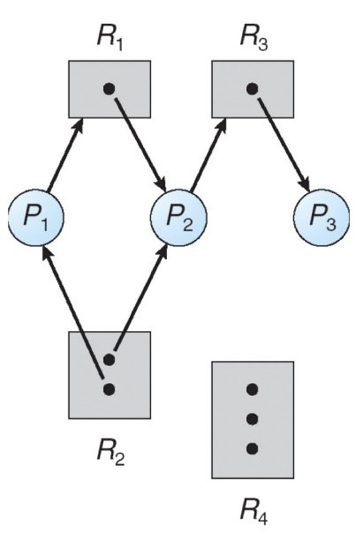{style="width:30%;display: block;margin: 20px auto"}

    - $P_1$ 持有 $R_2$，并等待 $R_1$
	- $P_2$ 持有 $R_1$ 和 $R_2$，并等待 $R_3$
	- $P_3$ 持有 $R_3$
	- **结论**：不存在死锁

    **Example 2**

    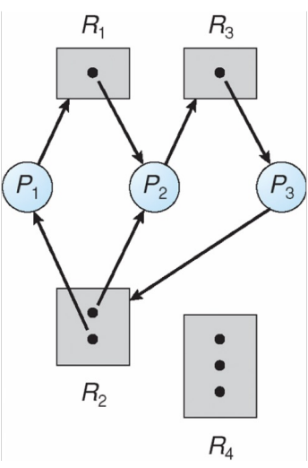{style="width:30%;display: block;margin: 20px auto"}

    - **结论**：存在死锁（存在环）

    **Example 3**

    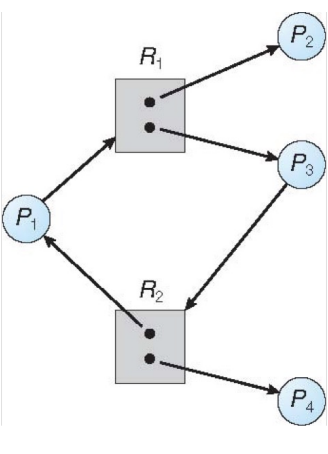{style="width:30%;display: block;margin: 20px auto"}

    - $P_4$ 和 $P_2$ 释放资源后，$P_1$ 和 $P_3$ 就可以获取资源
    - **结论**：不存在死锁

    !!! success "Notice"
        1. 如果图中**没有循环**，则没有死锁
	    2. 如果图中有循环
        
        - 如果每种资源类型**只有一个实例**，则死锁
        - 如果每种资源类型有**多个实例**，则可能存在死锁（**循环等待不一定导致死锁！**）

## 解决方法

**分类**

1. 确保系统永远不会进入死锁状态

- 预防（Prevention）
- 避免（Avoidance）

2. **允许系统进入死锁状态**，然后再进行恢复：死锁检测与恢复（Deadlock detection and recovery）

### 死锁预防
1. **基本思路**：从系统设计上**破坏死锁产生的四个必要条件中的至少一个**，让死锁根本不可能发生

!!! info "检查死锁的条件"
    1. 防止**互斥**（mutual exclusion）
    
    - 对于可共享资源，不需要互斥
	- 对于**不可共享资源**，必须满足互斥条件
	- **结论**：互斥条件**一般无法被破坏**，只能在可共享资源上避免
    
    2. 防止**占有并等待**（hold and wait）
    
    - 当一个进程请求资源时，它不能持有任何其他资源
    	- 在开始执行前**一次性请求**进程所需的全部资源
    	- 只允许进程**在不持有任何资源时**请求资源
	- **缺点**：资源利用率低；可能发生饥饿
	- **结论**：破坏占有并等待**可以防止死锁**，但**存在代价**

    3. 处理**不可抢占**（no preemption）
    
    - 系统可以打断进程，回收资源
	- 如果一个进程请求的**资源不可用**
	    - **释放**当前持有的所有资源，被抢占的资源会加入该进程等待的资源列表
	    - 只有当**进程能够获得其所有等待的资源**时，才会重新启动该进程
    - **结论**：但是有的资源不能被强占，不可行

3. **解决方案**：处理循环等待（circular wait）

- 对所有资源类型施加一个**全局顺序**
- 要求每个进程**按照资源顺序递增**的方式请求资源
- 许多操作系统在某些锁机制中采用了这种策略

!!! warning "Warning"
    **对于动态获取锁不适用**：
    
    这两个锁依赖**不确定的两个参数**`from`和`to`，所以获取的两个锁的先后顺序是**不确定的**，不一定满足按照资源顺序递增的条件

    ```c
    void transaction(Account from, Account to, double amount){
        mutex lock1, lock2;
        lock1 = get_lock(from);
        lock2 = get_lock(to);

        acquire(lock1);
            acquire(lock2);

                withdraw(from, amount);
                deposit(to, amount);

            release(lock2);
        release(lock1);
    }
    ```

### 死锁避免
1. **要求**：需要额外的信息来描述资源的请求方式

- 每个进程声明它可能需要的**最大资源数**
- 死锁避免算法确保系统**永远不会出现循环等待**的情况

2. **安全状态**

- 当一个进程请求一个可用资源时，系统需要判断分配该资源后系统**是否仍处于安全状态**
- **定义**：系统中存在一个进程执行顺序 $<P_1, P_2, …, P_n>$，每个进程 $P_i$ 所需的资源**可以**通过当前可用资源和其他进程已经持有的资源来满足

!!! info "Notice" 
    安全状态可以**保证没有死锁**！！！
	
    如果 $P_i$ 的资源需求不能立即满足：
	
    - 等待其他进程完成资源的使用，直到**所有进程都完成**
    - 一旦某个进程完成，其他进程可以按顺序获得资源，系统依然可以顺利执行


!!! success "基本事实"
    1. 如果系统处于安全状态，则**没有**死锁
	2. 如果系统处于不安全状态，则**有可能**有死锁
	3. 死锁避免要求确保系统**永远不进入不安全状态**

!!! example "Example"
    **Example 1**：
    
    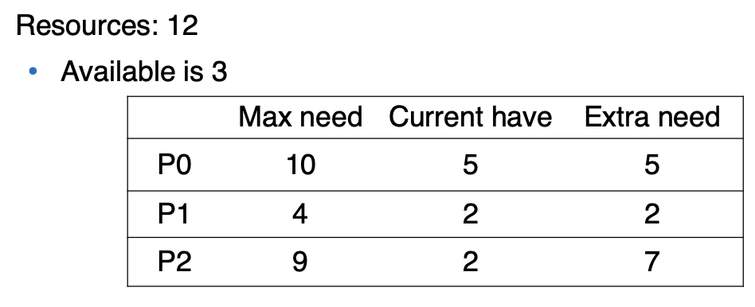{style="width:60%;display: block;margin: 20px auto"}

    **系统状态**：安全状态
    
    **进程执行的顺序**：$P_1, P_0, P_2$

    **Example 2**

    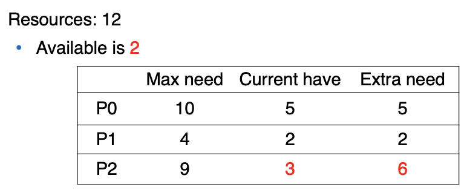{style="width:60%;display: block;margin: 20px auto"}

    **系统状态**：不安全状态

    **进程不能全部执行完**

3. **死锁避免算法**

- 每种资源类型**只有一个实例**：使用资源分配图
- 每种资源类型有**多个实例**：使用银行家算法（banker’s algorithm）

#### 资源分配图
1. **新增的边类型**：声明边（claim edge）
	
- 声明边 $p_i \rightarrow r_j$ 表示进程 $p_i$ **可能会请求**资源 $r_j$
- 声明边用**虚线**表示
- 资源必须在系统中**预先声明**（即在请求资源之前进行声明）

2. **边之间的转换**

- 当进程**请求**资源时，声明边转换为请求边
- 当资源**分配**给进程时，请求边转换为分配边
- 当进程**释放**资源时，分配边转换为声明边

3. **解决死锁的方法**：只有在将**请求边转换为分配边**后，不会形成一个循环，请求才可以被批准

!!! example "Example"
    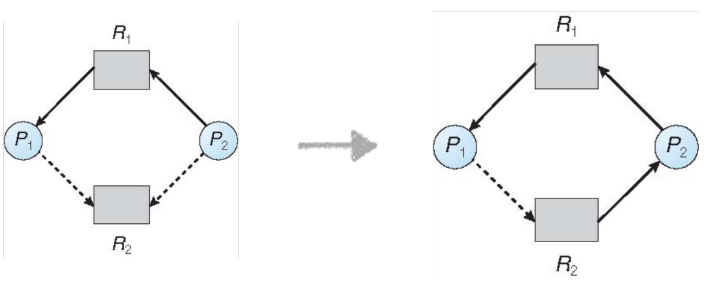{style="width:60%;display: block;margin: 20px auto"}

#### 银行家算法
1. **要求**：

- 每个进程必须事先声明它对每种资源类型的**最大使用量**
- 当一个进程请求资源时，**可能需要等待**
- 当一个进程获得了它所需的全部资源后，必须**在有限时间内**释放这些资源

2. **数据结构**

- 系统中有 `n` 个进程，`m` 种资源类型
- `available`：长度为 `m` 的数组，表示**可用资源的实例数量**
    - **e.g.** `available[j] = k`：表示资源类型 `R_j` 还有 `k` 个实例可用
- `max`：一个 `n × m` 的矩阵
	- **e.g.** `max[i, j] = k`：表示进程 `P_i` **最多可能请求** `k` 个 `R_j` 资源实例
- `allocation`：一个 `n × m` 的矩阵
	- **e.g.** `allocation[i, j] = k`：表示进程 `P_i` 当前**已经分配**了 `k` 个 `R_j` 实例
- `need`：一个 `n × m` 的矩阵
	- **e.g.** `need[i, j] = k`：表示进程 `P_i` **还需要** `k` 个 `R_j` 实例才能完成任务
	- `need[i, j] = max[i, j] − allocation[i, j]`

!!! example "Example"
    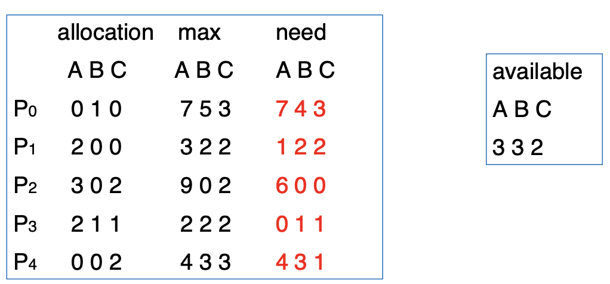{style="width:60%;display: block;margin: 20px auto"}

    **系统状态**：安全状态

    **第一个执行的可以是** $P_1$ 或 $P_3$ （`need < available`）

    !!! warning "Warning"
        **处于不安全状态！！！**

        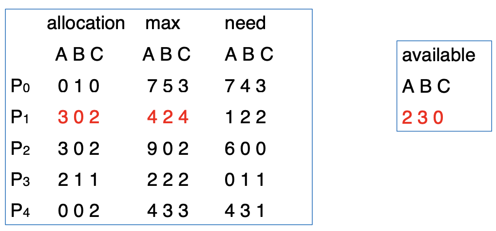{style="width:60%;display: block;margin: 20px auto"}

### 死锁检测
**定义**：允许系统进入死锁状态，但必须能够检测并从中恢复
#### 单实例

1. **等待图**：

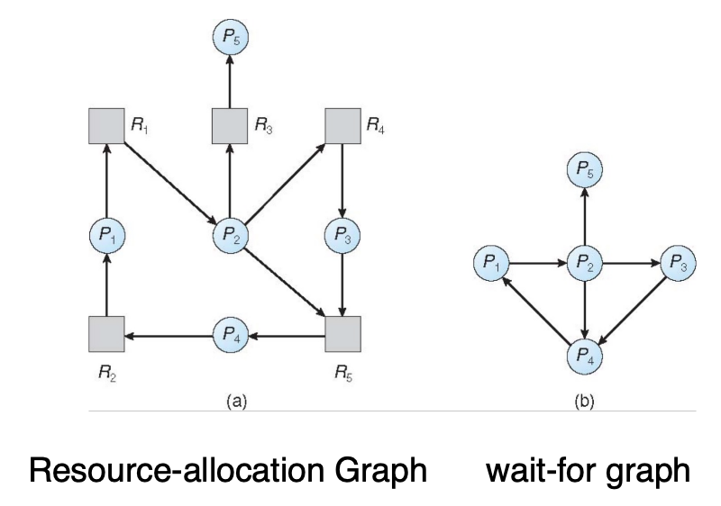{style="width:60%;display: block;margin: 20px auto"}

- 节点是进程
- 如果进程 $P_i$ 正在等待进程 $P_j$，则表示图中有一条边 $P_i \rightarrow P_j$

2. **解决方案**：**定期**调用一个算法来搜索图中的循环

- 如果图中**存在循环**，则说明系统处于死锁状态
- 检测图中循环的算法需要进行大约 **$n^2$ 次操作**，其中 $n$ 是图中顶点的数量

#### 多实例
**跟银行家算法类似**

!!! example "Example"
    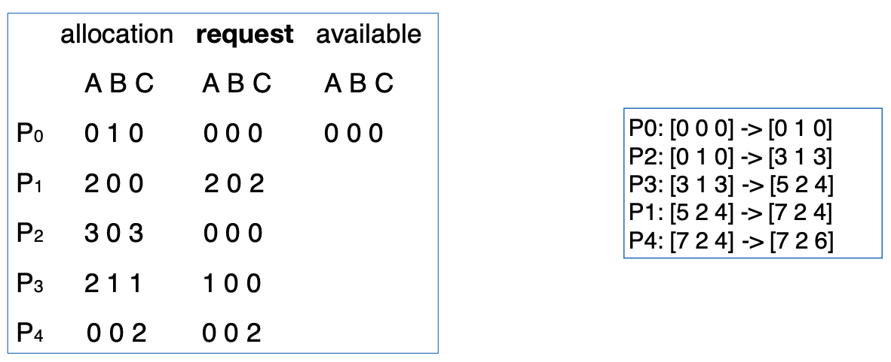{style="width:60%;display: block;margin: 20px auto"}

    **系统状态**：安全状态

    !!! warning "Warning"
        **处于不安全状态，导致死锁！！！**

        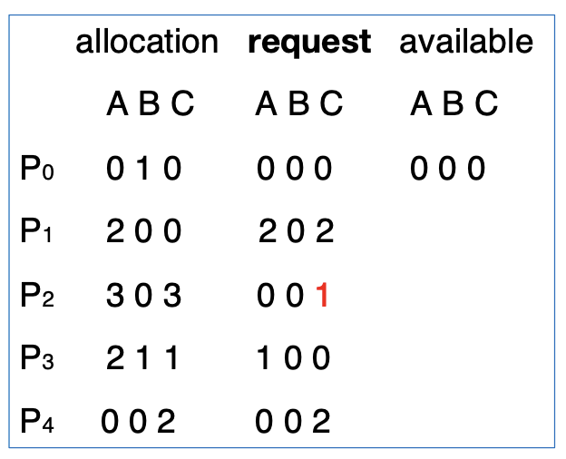{style="width:30%;display: block;margin: 20px auto"}


### 死锁恢复
1. **选择 1：终止死锁进程**

- 终止死锁进程的**选项**：
	- 终止**所有**死锁进程
	- 一次终止**一个进程**，直到死锁循环被消除
- 终止进程时的**考虑因素**：
	- 进程的优先级
	- 进程已计算的时间以及完成所需时间
	- 进程已使用的资源
	- 进程完成所需的剩余资源
	- 需要终止的进程数量
	- 进程是交互式还是批处理

2. **选择 2：资源抢占**

- 选择一个要终止的进程
- **回滚**（Rollback）：恢复进程到先前的状态
- **饥饿**（Starvation）