# 文件系统
---
1. <mark>**文件系统是 disk 的抽象，文件是磁道/扇区的抽象**</mark>
2. 文件系统提供了一组文件的连贯视图

!!! info "Info"
    1. CPU 抽象成**进程**
    2. memory 抽象成**地址空间**
    3. storage 抽象成**文件系统**                                           
---                                
## 文件
1. **文件**：用于存储信息的**连续逻辑空间** **e.g.** 数据库、音频、视频、网页
2. **类型**：
    1. **数据**：文本（字符）、二进制以及特定于应用程序的数据
    2. **程序**
    3. **特殊文件**：`proc` 文件系统（使用文件系统接口来获取系统信息）

### 文件属性
1. 名称 (**Name**)：唯一以人类可读形式保留的信息
2. 标识符 (**Identifier**)：在文件系统内**唯一**标识文件的标签（数字）用，于在用户空间中指代一个文件对象
3. 类型 (**Type**)：支持多种类型的系统需要此属性
4. 位置 (**Location**)：指向设备上文件位置的**指针**
5. 大小 (**Size**)：文件的当前大小
6. 保护 (**Protection**)：控制谁可以进行读**取、写入和执行**
7. 时间、日期和用户标识 (**Time, date, and user identification**)：用于保护、安全和使用情况监控的数据

!!! tip "Tip"
    1. 关于文件的信息保存在**目录结构**中，该结构维护在**磁盘**上
    2. 有许多变体，包括**扩展文件属性**（例如文件校验和）
    3. **`file` 命令**：查看文件类型
    4. **`stat` 命令**：查看文件详细状态

### 文件操作
1. **create**：必须在文件系统中寻找空间，并且必须在目录中分配一个条目
2. **open**：大多数操作需要先打开文件；为其他操作返回一个**句柄**(handler)
3. **read/write**：需要维护一个**指针**
4. **seek**：文件内重新定位
5. **close**：关闭文件
6. **delete**：释放文件空间
7. **Hardlink**：维护一个**计数器**（直到最后一个链接被删除才真正删除文件）
8. **truncate（截断）**：清空文件内容，但保留其属性

!!! info "Info"
    其他操作可以通过这些基本操作来实现

    **e.g.** 复制 (Copying)：创建并进行读/写

### 打开的文件
1. **管理打开的文件需要<mark>若干数据</mark>**：
    1. **Open-file table**：追踪所有打开的文件
    2. **File pointer**：指向最后一次读/写的位置，**每个打开该文件的进程都各有一个**
    3. **File-open count**：文件被打开次数的计数器，以便在最后一个进程关闭它时，将数据从打开文件表中移除
    4. **disk location**：缓存文件数据位置信息
    5. 访问权限 (**Access rights**)：**每个**进程的访问模式信息
2. 某些文件系统提供**文件锁 (file lock)**来调解对文件的访问
    1. **类型**：
        1. 共享锁 (**Shared lock**)：多个进程可以并发获取该锁**（读取操作）**
        2. 排他锁 (**Exclusive lock**)：只有一个进程可以获取该锁**（写入操作）**
    2. **机制**：
        1. 强制锁 (**mandatory lock**)：根据已持有和请求的锁，内核直接拒绝访问
        2. 劝告锁 (**advisory lock**)：进程可以查找锁的状态并自行决定如何处理

### 文件类型
1. **文件扩展名**：作为文件名的一部分 `.c`
2. <mark>**magic number**</mark>：在文件开始部分放一些 magic number 来表明文件类型

    **e.g.** 7f45 4c46 是 ASCII 字符，表示 ELF，代表 elf 文件格式

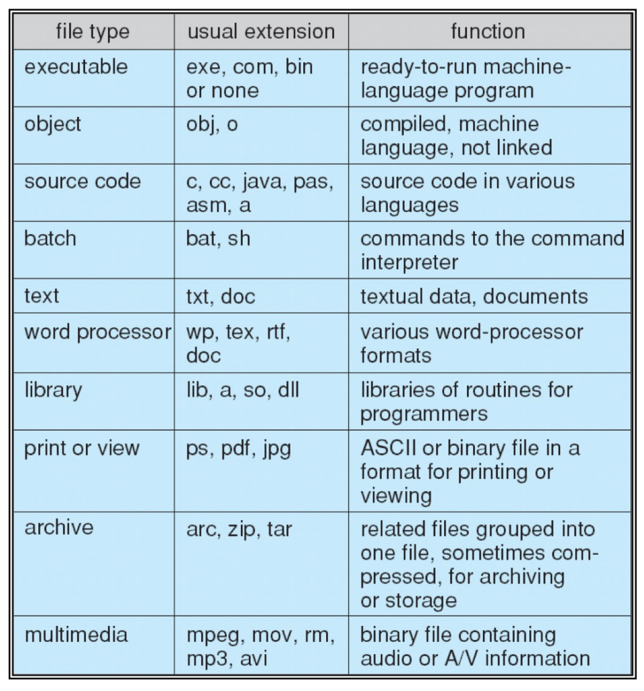{style="width:60%;display: block;margin: 20px auto"}

### 文件结构
1. 文件可以有不同的结构，由**操作系统或程序**决定
2. **类型**：
    1. 无结构 (**No structure**)：**字节或字**构成的流 **e.g.** Linux 里的转储文件 dumps
    2. 简单记录结构 (**Simple record structure**)：**按行**排列的记录，可以是固定长度或可变长度 **e.g.** 数据库
    3. 复杂结构 (**Complex structures**)：**e.g.** Word 文档、可重定位的程序文件
3. 通常由**用户程序**负责识别文件结构

### 文件共享
1. **文件共享**：普遍用于多用户系统
2. **实现**：通过**保护**方案 (Protection Scheme)
    1. **User IDs**：唯一标识用户，允许针对单个用户进行保护控制
    2. **Group IDs**：允许将用户划分到不同的组中，从而赋予**组级别的访问权限**
3. 在**分布式系统 (Distributed Systems)**中，文件可以通过**网络**进行共享
    1. **网络文件系统 (NFS)** 是一种常见的分布式文件共享机制
    2. **客户机-服务器模型 (Client-Server Model)** 允许客户机从服务器挂载远程文件系统

    !!! info "远程文件共享"
        1. 标准的操作系统文件调用会被转换成远程调用 (Remote Calls)
        2. NFS 是标准的 UNIX 文件共享协议，CIFS（通用因特网文件系统）是标准的 Windows 文件共享协议

4. <mark class="orange">**共享文件的方式**：硬链接、软链接</mark>

!!! info "软链接 vs 硬链接"
    1. **硬链接**：与文件相关联的一个<mark>**目录条目**</mark>，没有单独创建文件
        1. 目录中的文件名 `.` 是指向该目录自身的硬链接
        2. 文件名 `..` 是指向其父目录的硬链接
    2. **软链接/符号链接**：本身是一个<mark>特殊**文件**</mark>，其数据块中**包含目标文件的路径名**，有自己**独立的 `inode` 和数据块**
        1. <mark>**不增加目标 hard link count**</mark>
        2. 与硬链接不同，软链接**可以指向目录，并且可以跨越文件系统边界**
        3. 如果删除了目标文件，该软链接将会失效

---
## 访问方式
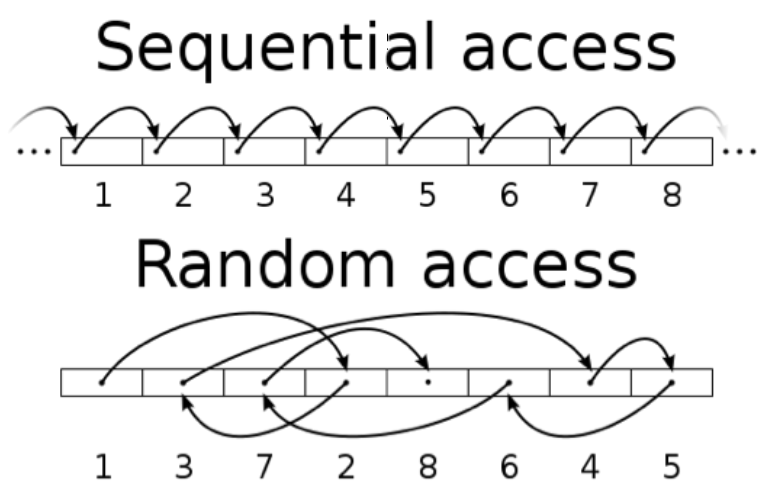{style="width:30%;display: block;margin: 20px auto"}

1. **顺序访问 (Sequential access)**
    1. 按**预先确定的顺序**访问一组元素
    2. 对于某些介质类型，这是**唯一**的访问模式 **e.g.** 磁带
2. **直接访问 (Direct access)/随机访问 (random access)**
    1. 可以在**（大致）相等的时间内**访问序列中任意位置的元素，与序列大小无关
    2. 在磁带上也可以**模拟随机访问**，但访问时间会有所不同（倒带）

!!! abstract "其他访问方式：索引"
    1. 基于直接访问方法，**文件的索引**指向各个块
    2. 要在文件中寻找一条记录，首先检索索引，然后利用**指针**访问对应的物理块
    3. 可以使用**多层索引**

---
## 目录
1. <mark>**目录**是包含所有文件信息的**节点集合**</mark>
2. <mark>目录结构和文件本身都常驻在**磁盘**上</mark>

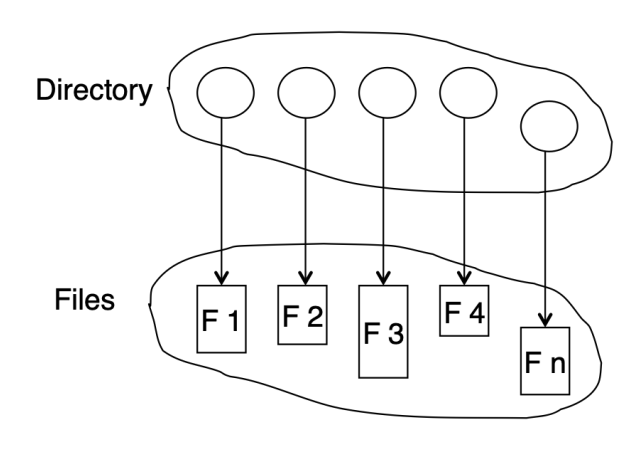{style="width:40%;display: block;margin: 20px auto"}

### 目录操作
1. 创建文件 (Create a file)：需要创建新文件并添加至目录
2. 删除文件 (Delete a file)：从目录中移除一个文件
3. 列出目录 (List a directory)：列出目录中的所有文件
4. 搜索文件 (Search for a file)：模式匹配
5. 遍历文件系统 (Traverse the file system)：访问目录内的每一个目录和文件
### 目录结构
**组织目录需要实现**：

1. 高效性 (**Efficiency**)：快速定位一个文件
2. 命名方便 (**Naming**)：组织目录结构使其对用户而言非常便利
    1. 两个用户可以让不同的文件拥有相同的名字
    2. 同一个文件可以拥有几个不同的名字

#### 单级目录
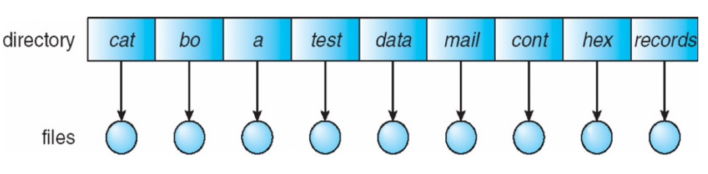{style="width:60%;display: block;margin: 20px auto"}

1. 所有用户**共用**一个单一的目录
2. **缺点**：存在命名问题和分组问题
    **e.g.** 当两个用户想给各自的文件起**相同的名字**时会发生冲突

#### 多级目录
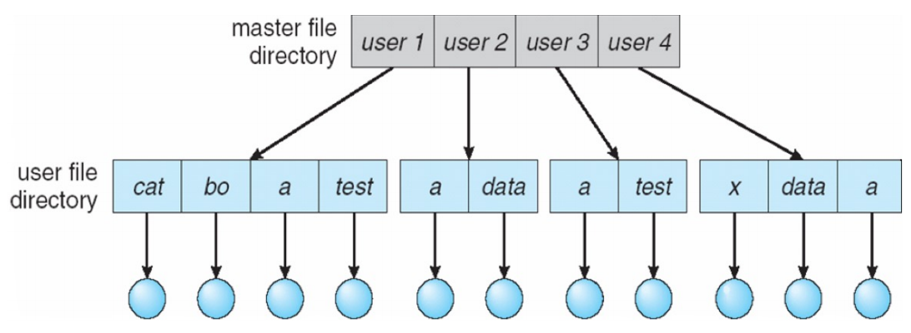{style="width:60%;display: block;margin: 20px auto"}

1. 为每个用户设立**独立**的目录
2. 不同的用户可以让不同的文件拥有相同的名字
    1. 每个用户都有自己的**用户文件目录** (UFD)，它们包含在**主文件目录** (MFD) 中
3. **优点**：搜索效率高

!!! question "思考"
    **如何在不同用户之间共享文件？** $\rightarrow$ 引入**路径**

#### 树状结构目录
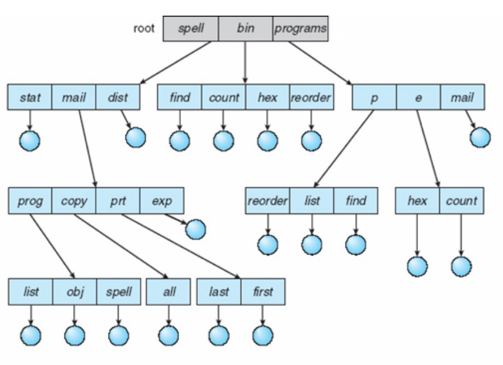{style="width:60%;display: block;margin: 20px auto"}

1. **优点**：搜索高效、可以对文件进行分组、命名方便
2. **访问文件**：绝对路径或相对路径

!!! warning "注意"
    树状结构目录**不允许共享文件和目录**（如果共享则说明多个指针指向同一个文件，这会变成图而不是树）

!!! abstract "相关命令"
    1. `mkdir <dir>` 创建目录
    2. `rmdir <dir>` 删除目录（空目录）
    3. `rm -r <dir>` 删除目录（非空目录）
    4. `sudo rm -rf /` 从根目录删除所有文件
    5. `rm <file>` 删除文件
    6. `touch <file>` 创建文件
    7. `pwd` 显示当前目录路径

#### 无环图目录
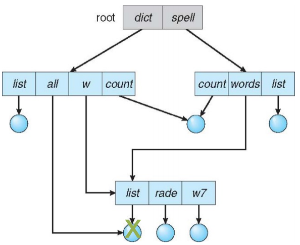{style="width:60%;display: block;margin: 20px auto"}

1. 将目录组织成**有向无环图**
2. **实现别名**：允许创建指向某个目录条目或文件的链接 (**Links**)
3. <mark>**悬空指针问题 (Dangling Pointer Problem)**</mark>
    1. **e.g.** 如果删除了文件 `/dict/all`，那么 `/dict/w/list` 和 `/spell/words/list` 就会变成悬空指针
    2. **解决方法**：
        1. 反向指针 (**Back Pointers**)：记录所有指向该实体的指针（大小可变）
        2. 引用计数器 (**Reference Counter**)：统计指向该实体的链接数量，只有当计数器归零时，才进行（物理上的）真正删除


#### 通用图目录
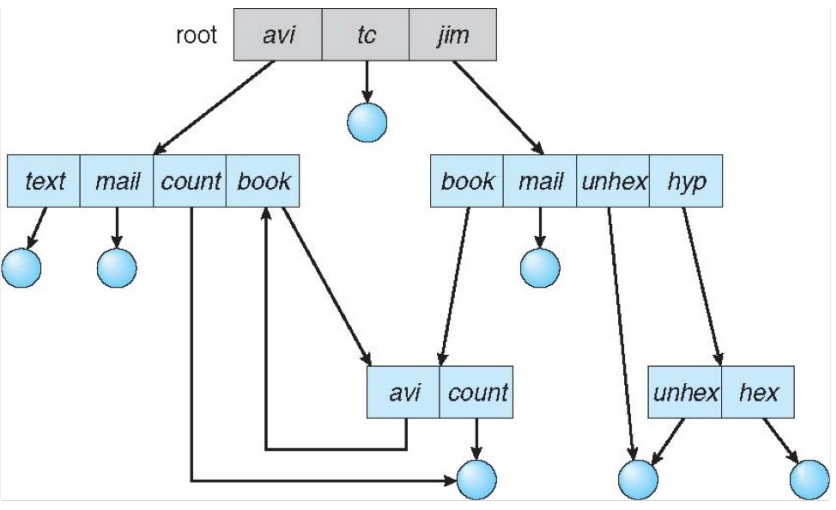{style="width:60%;display: block;margin: 20px auto"}

1. 允许任意链接可能会在目录结构中**产生环**
2. <mark>**问题**：可能会导致无法回收磁盘空间</mark>（两个指针互相指向，引用计数一直不归零）
3. **解决方案**：
    1. 允许环的存在，但使用**垃圾回收**机制来回收磁盘空间
    2. 每次添加新链接时，运行**环检测算法**

### 目录实现
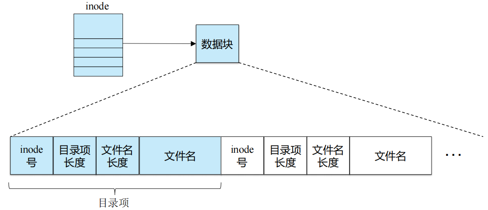{style="width:60%;display: block;margin: 20px auto"}

1. <mark>目录是一个特殊的的文件（linux），**存储文件名到 `inode` 的映射**</mark>

    !!! quote "Quote"
        1. Unix：目录被视为包含特殊数据的特殊文件
        2. Windows：目录的处理方式与文件不同，需要一组单独的系统调用来创建、操作等

2. **目录项**：
    1. `inode`：编号，文件名
    2. `rec_len`：目录项的长度，为 4 的倍数（用于**复用**目录项的目的）
    3. `name_len`：文件名的长度
    
    ```c
    struct ext2_dir_entry {
        __le32 inode;        /* Inode 编号 */
        __le16 rec_len;      /* 目录项长度 */
        __le16 name_len;     /* 文件名长度 */
        char   name[];       /* 文件名，最大为 EXT2_NAME_LEN */
    };
    ```

3. **实现**：
    1. **Linear list**：带有指向文件元数据的指针
        1. 编程简单，但搜索费时（线性搜索）
        2. 可以通过链表保持文件按字母顺序排列，或者使用 **B+ 树**
    2. **Hash table**：带有哈希数据结构的线性列表，以减少搜索时间（可能会发生冲突）


---
## Protection
1. **访问类型**：读、写、追加、执行、删除、列出
2. **访问控制列表（ACL）**：为每个文件和目录分配一个
    1. **优点**：细粒度控制 (Fine-grained Control)
    2. **缺点**：如何构建该列表；如何将列表存储在目录条目中

!!! example "Unix 访问控制"
    1. 三种访问模式：读、写、执行（使用 3 位编码 `RWX`）
    2. 三类用户：所有者 (Owner)、用户组 (Group) 和 其他用户 (Others)
        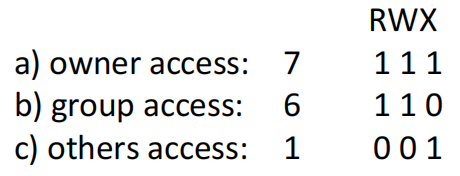{style="width:30%;display: block;margin: 20px auto"}
    3. 若要向用户授予访问权限，可以创建一个组并更改其访问模式（在 Linux 中，使用 `chmod` 和 `chgrp` 命令）

--- 
## 磁盘与文件系统
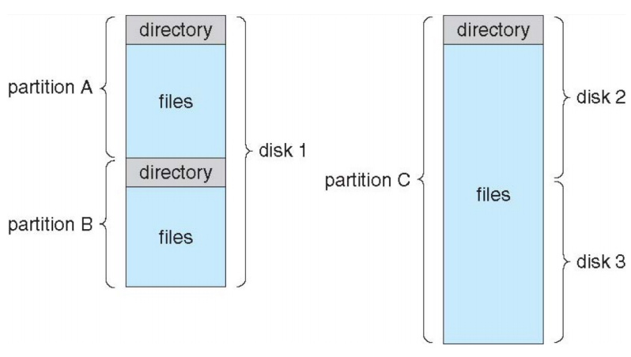{style="width:60%;display: block;margin: 20px auto"}

1. 磁盘可以细分为 **partitions**（也被称为微型磁盘（minidisks）或切片（slices））
2. <mark>不同的分区可以有**不同的文件系统**</mark>
    1. **volume**：包含文件系统的分区
    2. 每个 volume 通过 volume's table of contents 追踪文件系统信息
    3. 文件系统可以是通用目的或特殊目的
3. 磁盘或分区也可以裸用（**raw**）（不建立文件系统）
    **e.g.** 数据库一类的应用程序更倾向于使用裸磁盘（raw disks）

---
## 文件系统挂载
1. 文件系统在被访问之前必须先进行**挂载** (Mounted)
2. <mark>**挂载**：将一个文件系统连接到整个系统，通常形成一个**单一的命名空间**</mark>
3. **挂载点 (Mount Point)**：被挂载的文件系统所在的**位置**

!!! tip "Tips"
    1. 挂载文件系统后，挂载点原有的旧目录将会**被隐藏（不可见）**
    2. **`mount` 命令**：查看已挂载的文件系统

---
## 文件系统结构
1. <mark>**操作系统可以同时支持多种文件系统**</mark>
2. 文件系统放在**辅助存储（磁盘）**上
    1. 磁盘驱动程序提供**读/写磁盘块的接口**
    2. 文件系统为用户/程序**提供存储接口**，实现逻辑块到物理块的映射
3. 文件系统通常采用<mark class="orange">**分层结构**</mark>来实现和组织
    1. **优点**：有利于降低复杂度和减少冗余
    2. **缺点**：会引入额外的调用开销并可能降低性能
    
    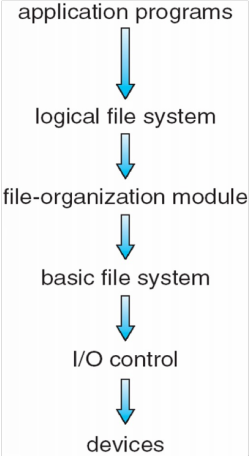{style="width:20%;display: block;margin: 20px auto"}

### 逻辑文件系统
1. **功能**：维护文件系统所需的所有元数据（**meta-data**），即除实际文件内容以外的所有数据
2. <mark>**存储内容**</mark>
    1. **目录结构**
    2. **文件控制块（FCB）**：由文件相关描述信息构成的存储结构
        
        !!! info "FCB 存储内容"
            1. 命名、所有权、权限
            2. 引用计数、时间戳、指向其他 FCB 的指针
            3. 指向磁盘上数据块的指针
            
            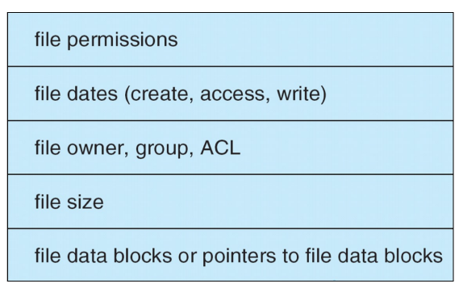{style="width:40%;display: block;margin: 20px auto"}

3. **上层输入**：打开/读取/写入的指定文件路径（filepath）
4. **下层输出**：读取/写入的逻辑块（logical blocks）
### 文件组织模块
1. **功能**：
    1. 负责进行**地址转换**（<mark>把逻辑块映射到物理块</mark>）
    2. 负责管理**空闲空间**
2. **上层输入**：逻辑块号
3. **下层输出**：物理块号
### 基本文件系统
1. 在 **Linux** 中对应“块 I/O 子系统”（block I/O subsystem）
2. **功能**：分配和维护包含文件系统、目录以及数据块的各种**缓冲区**（充当 Cache，用于提升系统性能）
3. **输入/输出**：物理块号
### I/O 控制
1. **组成**：设备驱动程序（Device drivers）和中断处理程序（Interrupt handlers）
2. **上层输入**：物理块号
3. **下层输入**：
    1. 写入设备控制器的内存中，以触发**实际的磁盘读写操作**
    2. 响应并处理相关的**硬件中断**

---
## 文件系统数据结构
1. **On-disk structures**（存储的内容更少）
    1. A **Boot Control Block**（可选）：存储操作系统的 volume 的第一块
    2. A **volume control block**
    3. A **directory**
    4. A per-file File Control Block (**FCB**)
2. **In-memory structures**
    1. 挂载表（**Mount table**）：每个已挂载的 volume 在其中占有一项
    2. 目录缓存（**Directory cache**）：用于加速路径转换（提升性能）
    3. 全局打开文件表（**Global open-file table**）：整个系统公用
    4. 进程打开文件表（**Per-process open-file table**）：针对每个进程独立维护（在 PCB 中）
    5. 各类**缓冲区**：暂存在传输中的磁盘块（提升性能）

!!! info "Info"
    在 UNIX 中，FCB 被称为 **`inode`**

    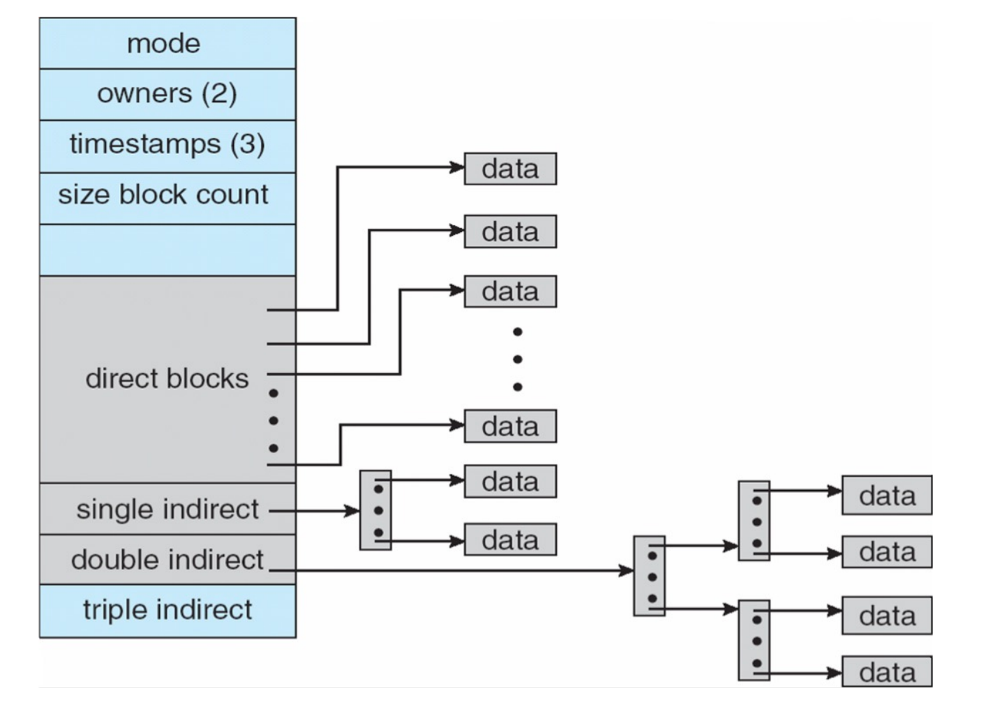{style="width:40%;display: block;margin: 20px auto"}

---
## 文件系统操作   
### 创建文件
1. 应用程序进程发出创建新文件的请求
2. **逻辑文件系统**分配一个新的 FCB（Linux 中的 `inode`）
3. 更新相应的**目录**，将新的文件名称**与对应的 FCB 关联**
### <mark>打开文件</mark>
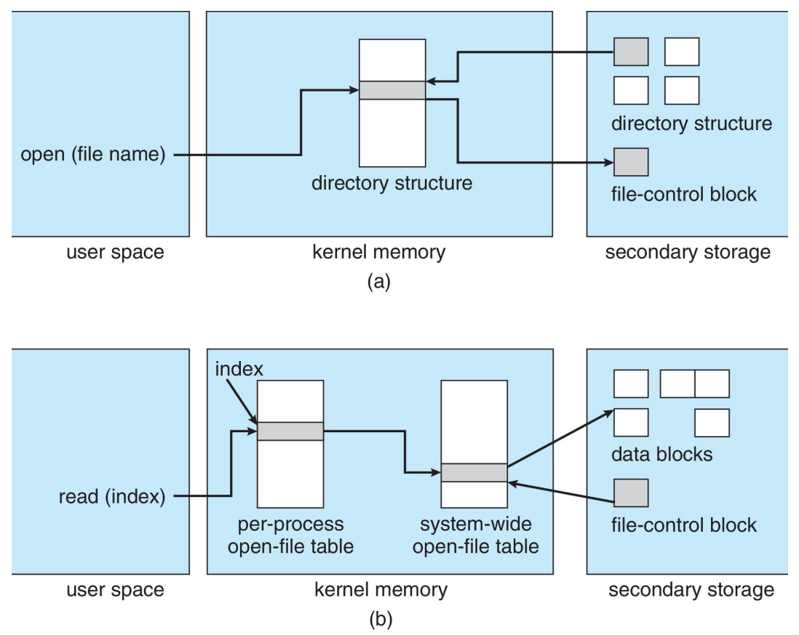{style="width:60%;display: block;margin: 20px auto"}

1. **检查全局打开文件表**，看该文件当前是否正被其他进程使用
    1. **如果在用**：在该进程的**进程打开文件表**中创建一个新表项，并让其指向**现有的**全局打开文件表项
    2. **如果未在用**：
        1. 在目录结构中检索该文件名
        2. 找到之后将该文件的 **FCB 从磁盘加载到内存中**，并将其放入**全局打开文件表**中
        3. 在**进程打开文件表**中新建一个表项，包含指向**全局打开文件表**中对应表项的指针
2. 递增**全局打开文件表**中的打开计数
3. 系统向调用者返回一个指向**进程打开文件表项**的指针（所有后续的文件读写操作都通过该指针进行）

### 关闭文件
1. 移除对应的**进程打开文件表项**，全局打开**计数递减**
2. **如果所有进程都关闭了该文件**：将内存中的**目录信息**复制写回磁盘，并从内存中销毁该**全局打开文件表项**

!!! info "Unix文件系统"
    1. 系统级打开文件表 (System-Wide Open-File Table) 保存有文件、目录、设备和网络连接的 `inode`
    2. **`inode` 编号在给定的文件系统内是唯一的**

---
## VFS
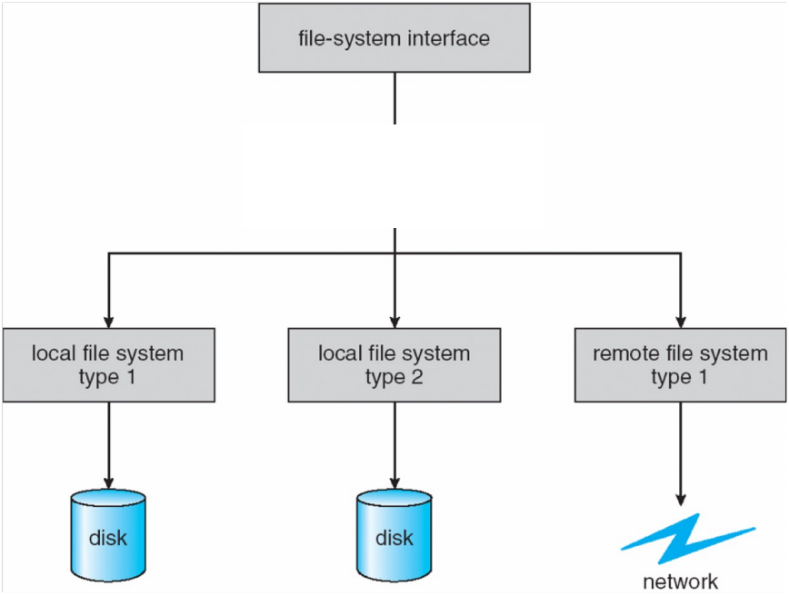{style="width:40%;display: block;margin: 20px auto"}

1. **VFS**：提供了一种面向对象的方法来实现文件系统，将文件系统的通用操作与其具体实现细节分离开来
2. 操作系统为文件系统定义了一个**通用接口**，所有文件系统都实现该接口
    1. **系统调用基于此通用接口实现**
    2. 允许在不同类型的文件系统中使用**相同的系统调用 API**

!!! abstract "Linux 定义了四种 VFS 对象类型"
    1. 超级块 (**superblock**)：定义**文件系统**的类型、大小、状态和其他元数据
    2. 索引节点 (**inode**)：包含关于**文件**的元数据（位置、访问模式、所有者……）
    3. 目录项 (**dentry**)：将名称与索引节点相关联，并定义目录布局
    4. 文件 (**file**)：文件的实际数据

!!! example "VFS 实现"
    1. **实现通用接口**： `struct file_operations`

        ```c
        struct file_operations {
            struct module *owner;
            loff_t (*llseek) (struct file *, loff_t, int);
            ssize_t (*read) (struct file *, char __user *, size_t, loff_t *);
            ssize_t (*write) (struct file *, const char __user *, size_t, loff_t *);
            ssize_t (*read_iter) (struct kiocb *, struct iov_iter *);
            ssize_t (*write_iter) (struct kiocb *, struct iov_iter *);
            ...
        };
        ```
    
    2. **调用链**：`Write` 系统调用 $\rightarrow$ `vfs_write` $\rightarrow$ 间接调用 $\rightarrow$ `ext4_file_write_iter`

        ```c
        ssize_t vfs_write(struct file *file, const char __user *buf, size_t count, loff_t *pos) {
            ...
            else if (file->f_op->write_iter)
            ...
        }
        const struct file_operations ext4_file_operations = {
            ...
            .write_iter     = ext4_file_write_iter,
            ...
        };
        ```
    
    3. **`file->f_op`** 是在什么时候设置的？
        在 `open` 系统调用时，VFS 将 `inode->i_fop` 赋值给 `file->f_op`

---
## 磁盘块分配  
1. 需要给**文件**分配磁盘块来存储文件数据
2. **分配策略**：连续分配、链式分配、索引分配

!!! success "**最佳分配方法取决于文件访问类型**"
    1. 连续分配非常适合顺序和随机访问
    2. 链式分配适合顺序访问，不适合随机访问
    3. 索引分配（混合方案）更复杂

### 连续分配
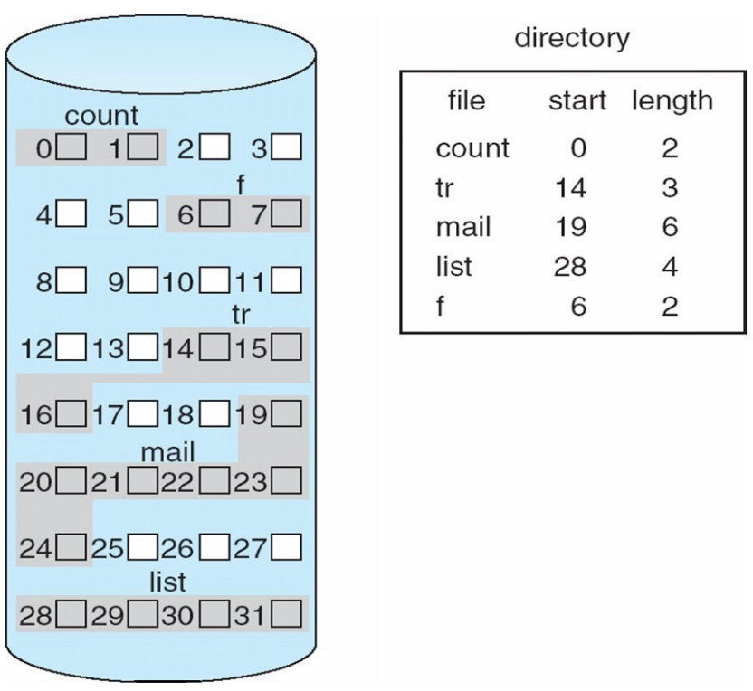{style="width:40%;display: block;margin: 20px auto"}

1. **连续分配**：每个文件占用一组连续的块
2. **目录记录**每个文件的起始块地址及其占用的块数（长度）
3. **好处**：顺序访问时，磁头移动次数较少，寻道时间较短
4. **缺点**：
    1. 寻找空闲空间困难
    2. 外部碎片
    3. 文件增长困难

### 链式分配
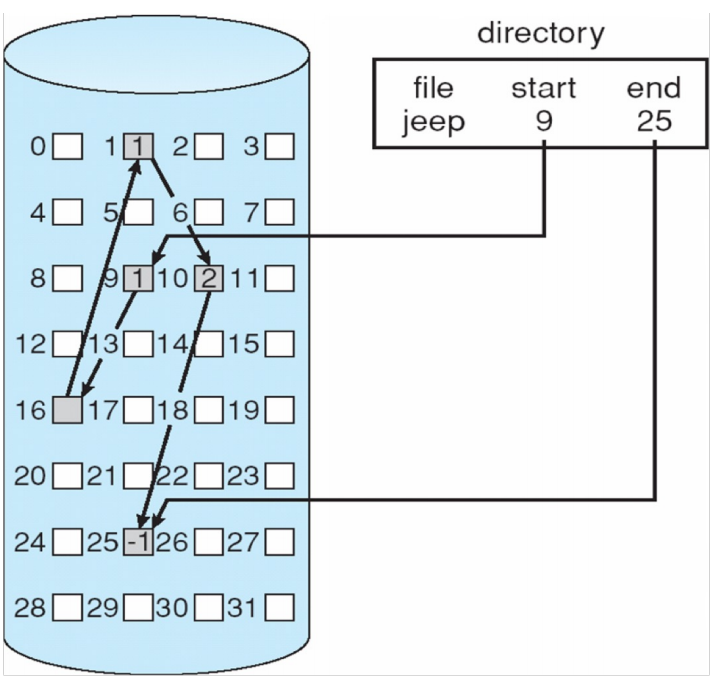{style="width:40%;display: block;margin: 20px auto"}

1. **链式分配**：每个文件都是一个磁盘块的链表
    1. 每个磁盘块都包含指向下一个块的指针
    2. 文件以**空指针**结束
2. **优点**：磁盘块可以分散在磁盘的任何地方（无外部碎片，无需紧凑/碎片整理）
3. **缺点**：
    1. 定位一个文件块可能需要**多次 I/O 操作和磁盘寻道**
    2. **空间浪费**：指针占用存储空间
    3. 可靠性不高（指针可能损坏）
4. **解决方案**：
    1. 将磁盘块聚合成簇 **e.g.** 4 个块为一个簇
    2. **缺点**：会产生内部碎片

!!! example "FAT"
    File Allocation Table：使用链式分配

    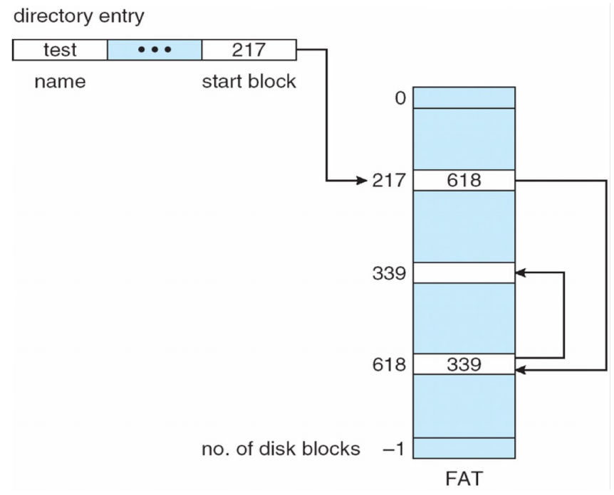{style="width:40%;display: block;margin: 20px auto"}

### 索引分配   
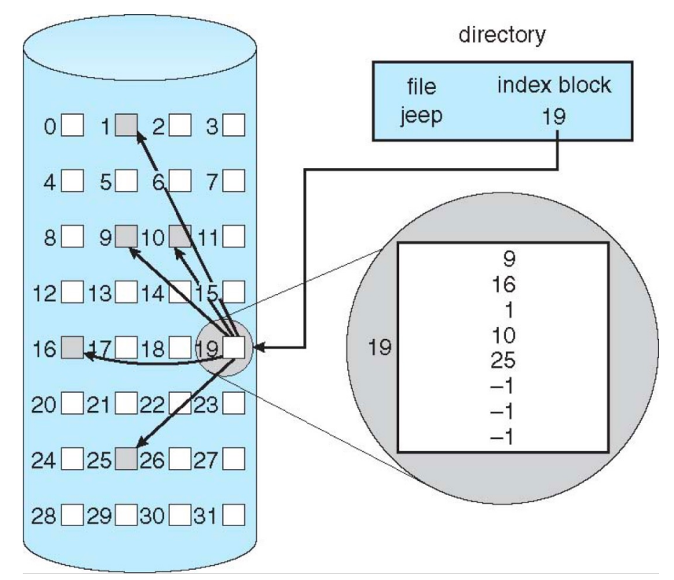{style="width:40%;display: block;margin: 20px auto"}

1. **索引分配**：每个文件都有自己独立的**索引块**，其中包含指向其数据块的**指针**
2. **优点**：索引表提供了对文件数据块的**随机/直接访问**；没有外部碎片；允许文件中存在空洞 (holes)
3. **缺点**：索引块需要**占用空间**（对小文件来说是一种浪费）
4. **索引块分配的方法**：索引块不能太大也不能太小
    1. **链式**索引块：将多个索引块链接起来以支持超大文件
    2. **多级**索引块

    !!! example "UNIX Combined Scheme"
        1. UNIX 的 FCB：inode
        2. 15 个指针包含在 inode 中：12 个直接块指针 + 3 个间接块指针（一/二/三级间接块指针）

        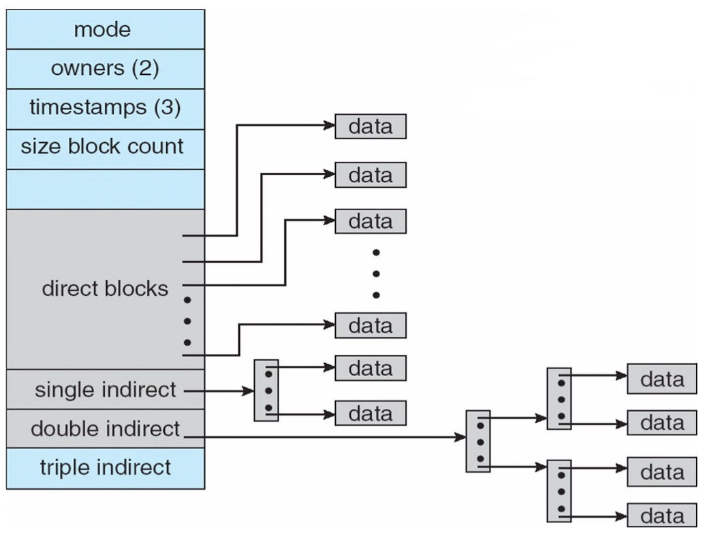{style="width:40%;display: block;margin: 20px auto"}

        !!! question "Question"
            1. Block Size = 512 Bytes, Pointer Size = 4 Bytes 则 每一块可以包含 128 个指针
                
                Max file size = 12 $\times$ 512 + 128 $\times$ 512 + 128<sup>2</sup> $\times$ 512 + 128<sup></sup> $\times$ 512 Bytes

            2. Block Size = 4 KB, Pointer Size = 4 Bytes 则 每一块可以包含 1 K 个指针
                
                Max file size = 4 TB + 4 GB + 4 MB + 48 KB

---
## 空闲空间管理   
1. **Bitmap**：为每个块使用一个位，**跟踪其分配状态**
    1. **优点**：寻找**连续**的块相对容易
    2. **缺点**：Bitmap 需要占用额外的空间
2. **Linked Free Space**
    1. **优点**：不会浪费空间
    2. **缺点**：
        1. 难以分配**连续的空闲块**
        2. 分配一个空闲块需要增加一次额外的磁盘 I/O
        3. 分配多个空闲块需要遍历链表
    
    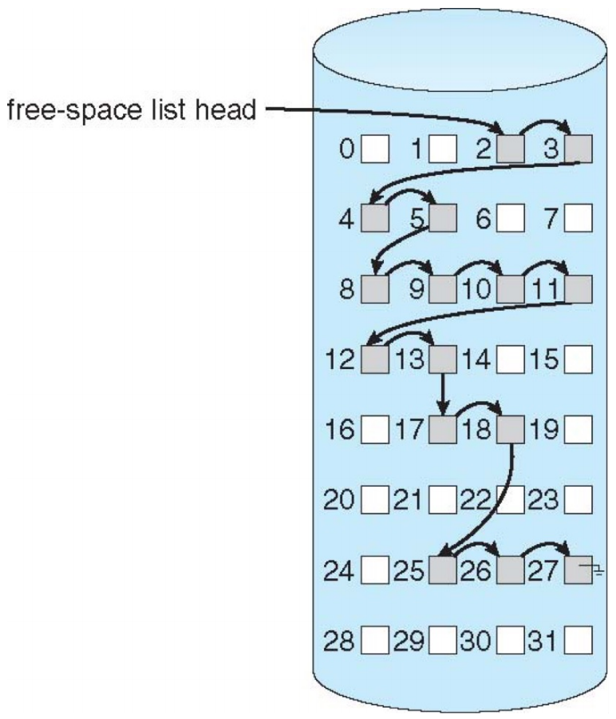{style="width:30%;display: block;margin: 20px auto"}

3. **Grouping**：使用**索引**对空闲块进行分组
    1. 在第一个空闲块中存储 $n-1$ 个**空闲块的地址**，和一个指向下一个索引块的**指针**
    2. **优点**：分配多个空闲块不需要遍历链表
4. **Counting**：**簇的链表**（起始块 + 连续块的数量）

---
## 文件系统性能
1. **文件系统的效率和性能取决于：**磁盘分配和目录算法、文件目录项中保存的数据类型、元数据结构的预分配或按需分配策略、固定大小或可变大小的数据结构
2. **提高文件系统性能的措施：**
    1. **让数据和元数据保持紧邻**
    2. **使用缓存**：在主内存中开辟独立区域用于存放频繁使用的块
    3. **使用异步写入**：可以进行缓冲/缓存，从而提高速度（无法缓存同步写）
    4. **滞后释放和预读**：从缓冲区中移除上一页，并提前读取多页

!!! info "Cache"
    1. **页面缓存 (page cache)** 为 MMIO（内存映射 I/O）缓存页面，例如内存映射文件
    2. 文件系统使用**块（磁盘）缓存 (buffer (disk) cache)** 进行磁盘 I/O
        1. 内存映射 I/O 可能会在系统中被缓存两次
    3. **统一缓冲区缓存 (unified buffer cache)** 使用相同的页面缓存来同时缓存内存映射页面和磁盘 I/O，以避免双重缓存

!!! info "恢复 (Recovery)"
    1. **文件系统需要进行一致性检查以确保一致性**
        1. 将目录中的数据与磁盘上的某些元数据进行对比以验证一致性
        2. 文件系统恢复可能很慢，且有时会失败
    2. **文件系统恢复方法**：备份 (Backup)、日志结构文件系统 (Log-structured file system)

    !!! quote "日志结构文件系统"
        1. 在 LSFS 中，更新的元数据会被顺序写入一个环形日志 (circular log)
        2. 当系统崩溃时，只需要重放日志中存在的事务

!!! success "文件系统实现"
    1. 文件有：
        1. external name：用户看到的路径名
        2. **internal name：inode number** 
        3. **目录作用**：external name → internal name
    2. fd 是 per-process table 的index：不同数值表示 stdin(0)、stdout(1)、stderr(2)
    3. **On-disk Layout 示例磁盘布局**
        
        ```TXT
        superblock
        inode bitmap
        data bitmap
        inode table
        data region
        ```

        1. <mark>**Superblock** 保存内容：inode 数量、data block 数量、inode table 起始位置、data region 起始位置、magic number</mark>
        2. Bitmap
            1. inode bitmap：管理空闲 inode
            2. data bitmap：管理空闲 data block