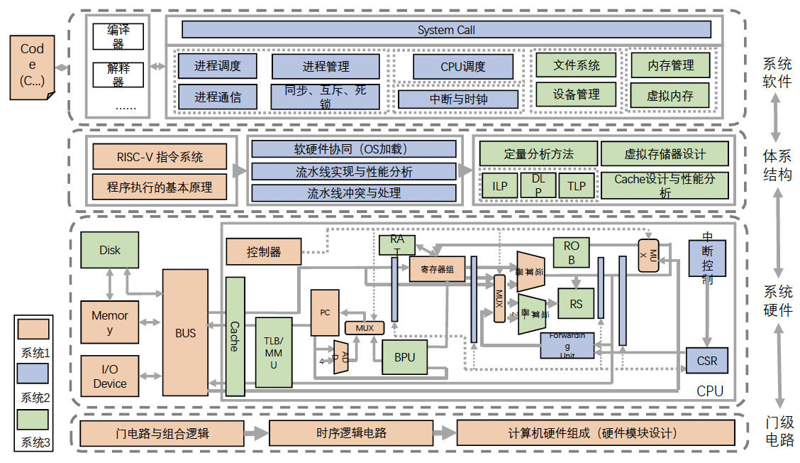

# 计算机系统

## 计算机架构

<table style="width:100%; border-collapse: collapse; border: 1px solid black;">
    <tr>
        <td rowspan="4">软件层</td>
        <td>应用程序</td>
    </tr>
    <tr>
        <td>编译器/宏与过程库</td>
    </tr>
    <tr>
        <td>操作系统(OS)</td>
    </tr>
    <tr>
        <td rowspan="2">指令集架构(ISA)</td>
    </tr>
    <tr>
        <td rowspan="5">硬件层</td>
        <td>计算机组成(微架构)</td>
    </tr>
    <tr>
        <td>寄存器传输级(RTL)</td>
    </tr>
    <tr>
        <td>数字逻辑电路(DLC)</td>
    </tr>
    <tr>
        <td> 器件工艺</td>
    </tr>
</table>

## 主要学习内容

1. 计算机系统 I ：计算机组成+逻辑电路
2. 计算机系统 II/III ：操作系统+计算机架构