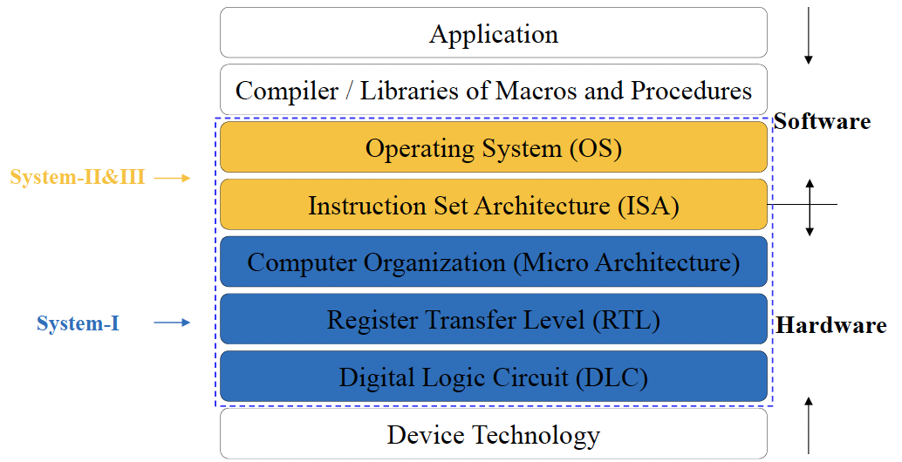
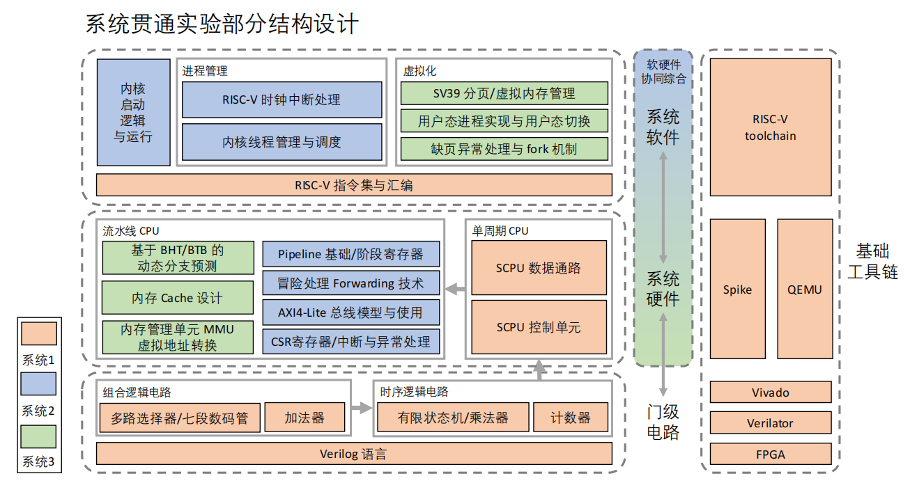

# <i class="fa-solid fa-microchip"></i> 计算机系统

## 计算机架构

{style="width:70%;display: block;margin: 20px auto"}

## 主要学习内容

1. 计算机系统 I ：计算机组成+逻辑电路
2. 计算机系统 II/III ：操作系统+计算机架构

## 主要实验内容

## 笔记目录

{{ BEGIN_TOC }}
- 计算机系统 I:
    - 数据编码[note]: data/
    - 数字逻辑基础[note]: logic/
    - 组合逻辑电路[note]: combine/
    - 运算单元[note]: ALU/
    - 时序逻辑电路[note]: sequence/
    - ISA[note]: ISA/
    - CPU[note]: CPU/
    - 多周期CPU[note]: MultiCPU/
- 计算机系统 II:
    - 流水线CPU[note]: pipeline/
    - 操作系统[note]: OS/
    - 进程[note]: process/
    - IPC[note]: IPCs/
    - CPU调度[note]: schedule/
    - 线程[note]: thread/
    - 同步[note]: synch/
    - 死锁[note]: deadlock/
- 计算机系统 III:
    - 量化研究方法[note]: quant/
    - 指令级并行 ILP[note]: ILP/
    - 内存层次结构[note]: memory_index/
    - 缓存[note]: cache/
    - 主存[note]: memory/
    - 虚拟内存[note]: vm/
    - 大容量存储[note]: storage/
    - I/O 系统[note]: IO/
    - 文件系统[note]: file/
    - 数据级并行 DLP[note]: DLP/
    - 线程级并行 TLP[note]: TLP/
{{ END_TOC }}

## 课程手写笔记

计算机系统 I 笔记

    <i class="fa-regular fa-clock"></i>
     2025-6-20 /
    <i class="fa-regular fa-note-sticky"></i>
     8 pages

<a class="down-button" target="_blank" href="files/system1 note.pdf" markdown="1">:fontawesome-solid-download: Download</a>

!!! tip "Tips"
    附一份手写笔记，包含除法器内容。

    （除法器等未完成内容等闲来无事再补充到网站上吧**(=￣ ρ￣=) ..zzZZ**）