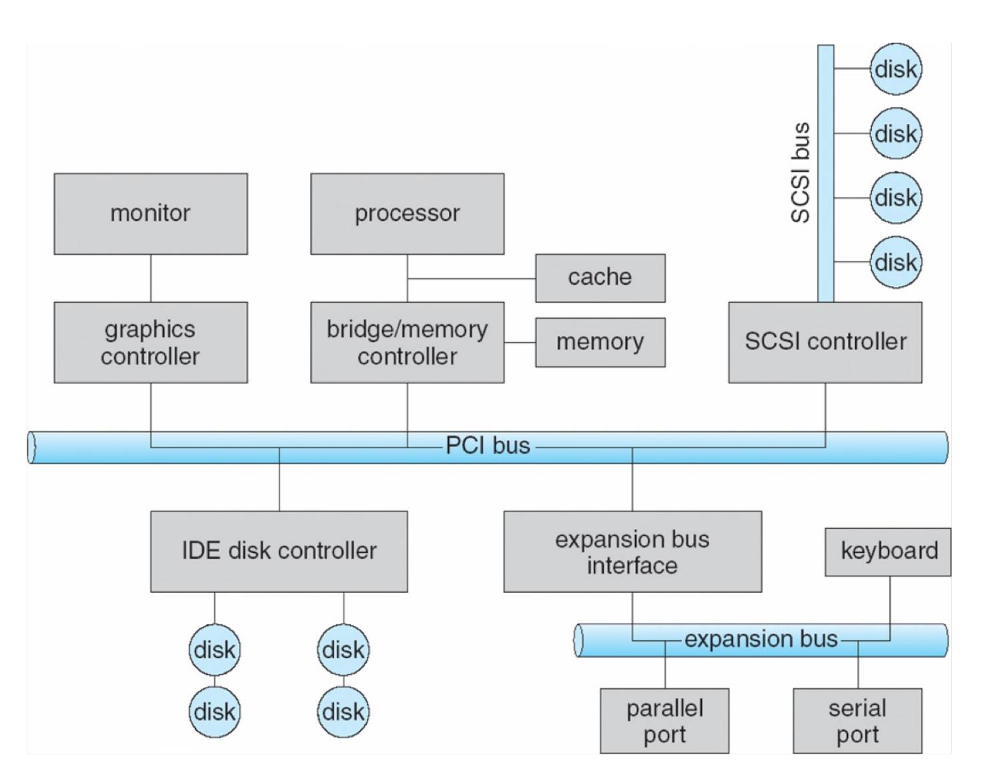
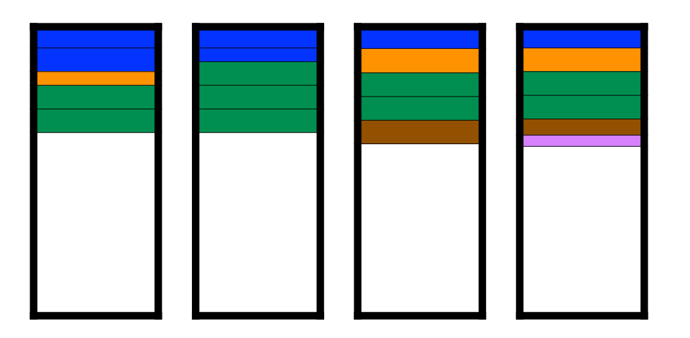
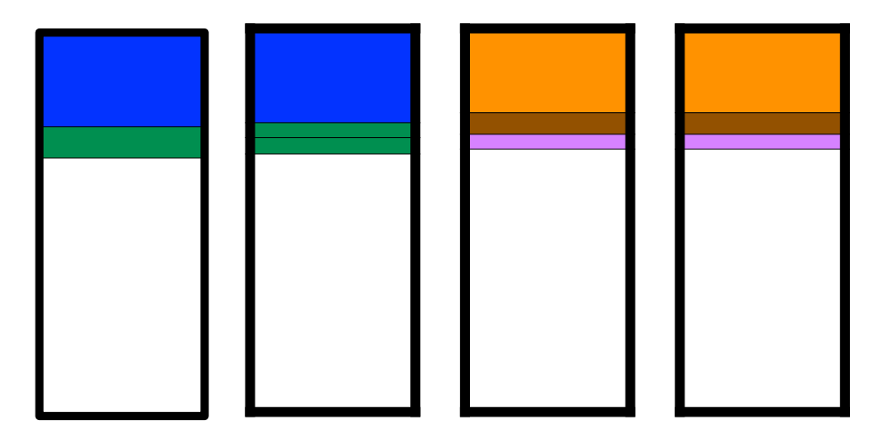
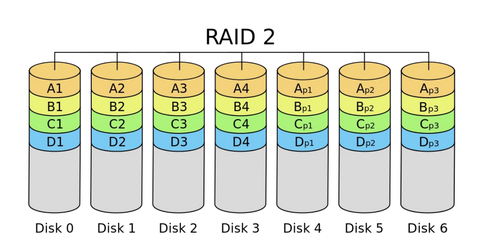
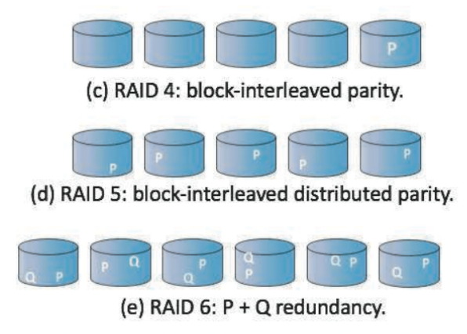

## 非易失性存储器

1. 如果特性类似磁盘驱动器，则称为**固态硬盘 (SSDs)**

!!! quote "Quote"
    其他形式包括 USB 驱动器（优盘、闪存盘）、DRAM 磁盘替代品、主板表面贴装存储以及主内存

2. **优点**：可以比 HDD 更可靠；速度快得多（没有移动部件，因此**没有寻道时间或旋转延迟**）
3. **缺点**：单位 MB 价格更贵；寿命可能较短，需要仔细管理；容量较小；总线可能太慢
4. **调度算法**：FCFS
5. **特性**：

    1. 以 **page** 为增量进行读写（类似扇区）
    2. 但**无法就地重写**，必须先被擦除，且必须擦除 page 所在的整个 block
    3. 在磨损前**只能擦除有限次数**
    4. 寿命通过**每日全盘写入次数** (DWPD) 来衡量

6. **NAND 闪存控制器算法**

    1. 控制器维护**闪存转换层 (FTL) 表**：
        1. **原因**：由于无法重写，页面最终会充满有效和无效数据的混合
        2. **目的**：为了追踪哪些逻辑块是有效的
    2. 还实现了**垃圾回收**以释放无效页面空间
    3. 分配**预留空间**为垃圾回收提供工作空间
    4. 每个单元都有寿命，因此**需要均衡地写入所有单元**

## 磁带

1. 磁带是早期的辅助存储类型，现在**主要用于备份**

2. **优点**：容量大；存储在磁带上的数据**相对永久**
3. **缺点**：访问时间慢，尤其是随机访问（寻道时间远高于磁盘，随机访问需要卷带/倒带）

## 磁盘管理

1. **物理格式化**：将磁盘划分成扇区，以便控制器进行读/写

- **扇区结构**：包含头部信息、数据以及纠错码 ECC

2. 操作系统在磁盘上**记录其自身的数据结构**，将磁盘分区为若干柱面组，每个组被视为一个**逻辑磁盘**
3. **逻辑格式化**分区以在其上**建立文件系统**（文件 I/O 以**簇**为单位完成）
4. **根分区**包含 OS，Mounted at boot time

- 其他分区可以包含其他操作系统、其他文件系统，或者是原始分区
- 其他分区可以**自动或手动挂载**

5. **引导块**：包含足够的代码以了解如何从文件系统中**加载内核**

!!! quote "Quote"
    1. 引导块初始化系统

    - 引导程序存储在 ROM、固件中
    - 自举加载程序程序存储在引导分区的引导块中

    2. **原始磁盘访问**适用于想要进行自身块管理、让操作系统避开的应用程序（例如数据库）
    3. 使用诸如**扇区备用**之类的方法来处理坏块
    4. 操作系统提供**交换空间管理**

---
## 磁盘连接
1. **磁盘连接到计算机的方式**：

- 主机连接存储 (host-attached storage)
- 网络连接存储 (network-attached storage)：通过网络而非本地总线提供的存储
- 存储区域网络 (storage area network)：连接服务器和存储单元的私有网络，使用高速互连和高效协议

2. **主机连接存储**

- **e.g.**：硬盘、RAID 阵列、CD、DVD、磁带...
- 磁盘可以通过 **I/O bus**直接连接到计算机 **e.g.** SCSI, IDE

{style="width:60%;display: block;margin: 20px auto"}

## RAID
1. **独立磁盘冗余阵列** (RAID)：操作系统可以通过**多个**总线连接的磁盘来实现

- 磁盘是不可靠、缓慢但廉价的
- 使用**冗余**：提高可靠性；提高速度（同时读，提高磁盘带宽）

2. **关键技术**：这些技术可以随意组合

- **数据镜像** (Data Mirroring)：在多个磁盘上保留相同的数据
- **数据条带化** (Data Striping)：将数据分散在多个磁盘上以**允许并行读取** 
    
    **e.g.** 从 8 个磁盘读取一个字节的各个位

- **纠错码** (ECC)：校验位（保留用于在驱动器故障时重建丢失位的信息）

3. **层级**

=== "RAID 0"
    1. RAID 0：数据条带化分布在多个磁盘上，**没有校验位（无冗余）**
    2. 提高性能，但不可靠

    !!! example "Example"
        固定条带大小；5 个不同大小的文件；4 个磁盘
        
        {style="width:40%;display: block;margin: 20px auto"}

=== "RAID 1"
    1. 在两个磁盘上保存一组数据的完全副本（或**镜像**）
    2. 使用的**磁盘数量**是 RAID 0 的两倍（浪费）
    3. 除非发生（极不可能的）同时故障，否则**可以保证可靠性**
    4. 可以通过从**寻道时间最快**的磁盘读取来提升性能

    !!! example "Example"
        {style="width:40%;display: block;margin: 20px auto"}

=== "RAID 2/3"
    1. **RAID 2**：
    
    - 在**位级** (bit-level) 进行数据条带化
    - 使用**汉明码** (Hamming code) 进行纠错（已不再使用）
    - 汉明码（4位数据 + 3位校验）允许使用 7 个磁盘

    !!! example "Example"
        {style="width:40%;display: block;margin: 20px auto"}

    2. **RAID 3**：使用 4 个数据磁盘和 1 个校验磁盘
    3. 没有被实际应用，因为**粒度太小**，现在无法单独读出来一个比特，**至少应该读出一个字节**

=== "RAID 4/5/6"
    1. **RAID 4**：基本类似于 RAID 3，但改用**条带/块** (strips/blocks) 进行交替（一个（小规模）读取仅涉及一个磁盘）
    2. **RAID 5**：类似于 RAID 4，但**校验信息分散在所有磁盘上**，而不是仅有一个专用的校验磁盘
    3. **RAID 6**：通过增加**一个额外的校验块 Q** 来扩展 RAID 5

    {style="width:40%;display: block;margin: 20px auto"}

---

!!! info "RAID 与文件系统"
    1. **RAID 只能检测/从磁盘故障中恢复，不能防止或检测数据损坏或其他错误**
    2. 像 Solaris ZFS 这样的文件系统增加了额外的检查来检测错误
    
    - ZFS 为所有文件系统 (FS) 数据和元数据添加了校验和
        - 校验和与指向数据/元数据的指针存放在一起
        - 可以检测并纠正数据和元数据损坏
    - ZFS 在存储池中分配磁盘，而不是使用卷或分区
        - 存储池中的文件系统共享该池，并从池中分配/释放空间