# 主存

!!! info "内存分配策略演进"
    1. **批处理系统**：
        - 物理内存中**仅**加载一个程序
        - 如果程序大于物理内存，则**分而治之**（类似于编译器的多轮处理）
    2. **多道程序设计**
        - **多个进程**同时存在于物理内存中，允许快速切换到就绪进程
        - 将物理内存划分为多个区域（**分区**）

---
## partition
1. **要求**
    - **保护**：防止进程间相互干扰（破坏彼此的数据）
    - **快速执行**：内存访问不能因保护机制而变慢
    - **快速上下文切换**：设置地址映射不能耗时过长

2. **进程加载**
    - 相对于分区起始地址**重定位**所有地址
    - 由操作系统分配**内存保护**，**逐块**映射到物理内存
    - **进程一旦开始运行，分区在内存中不可移动**（移动之后可能指针会指向错误的地址）
3. **分区策略**：Fixed Partition & Variable Partition

!!! warning "存在的问题"
    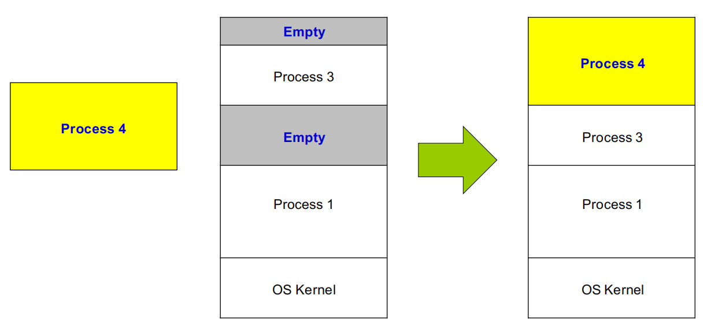{style="width:60%;display: block;margin: 20px auto"}

    **当进程 4 出现且所需的空间大于最大的空闲分区时**，无法被加载

    **解决方案**：移动进程 3 

!!! abstract "逻辑地址"
    1. **逻辑地址**：代替物理地址，在进程**运行时**翻译为物理地址
    2. **定义**：将逻辑地址定义为**分区内的偏移量**（由CPU产生）
    3. <mark class="cyan">**base and limit 寄存器**</mark>（硬件加速）：确保一个进程能够且仅能访问其地址空间内的地址
        - **base**：逻辑地址的起始物理地址，会被加到所有地址上
        - **limit**：逻辑地址的访问范围，在每次内存访问时进行检查
        - 在每次上下文切换时由**操作系统**加载，访问他们的指令都是**特权指令**

    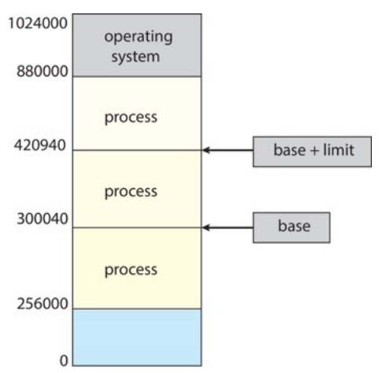{style="width:30%;display: block;margin: 20px auto"}

    ??? info "检查过程"
        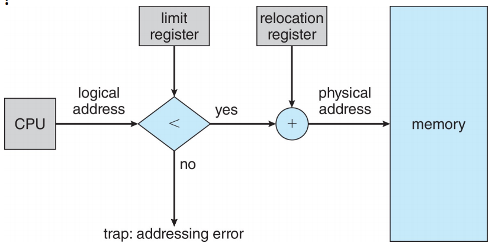{style="width:50%;display: block;margin: 20px auto"}

    !!! success "优势" 
        1. **界限寄存器提供内置保护**，无需针对每个页面或内存块进行物理保护
        2. **快速执行**：在每条指令执行过程中，加法运算和界限检查均以硬件速度完成
        3. **快速上下文切换**：仅需更改基址和界限寄存器
        4. 加载时**无需重定位**程序地址（所有地址均相对于零）
        5. 分区可以**随时挂起并移动**：进程感知不到变化（但是对于大型进程而言开销较大）   

### 固定分区
1. **固定分区**：将内存划分为**大小相等**的块（操作系统占用部分除外）

2. **问题**：<mark>**内部碎片**</mark>，**分区内**未使用的内存无法提供给其他进程使用（**严重的内存浪费**）

    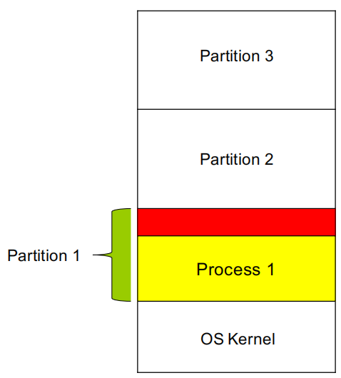{style="width:30%;display: block;margin: 20px auto"}

3. **解决方案**：可变分区

### 可变分区
1. **可变分区**：根据进程需求**动态**划分内存分区

2. **更复杂的管理问题**：
    - <mark>需要**数据结构**来跟踪空闲和已用的内存</mark>
    - 为新进程从足够大的 hole 中分配内存
    - <mark>**孔** hole</mark>：一块可用的内存，大小各异的孔散布在整个内存中

3. **分配算法**：
    - **first-fit**：从**第一个足够大**的内存块中进行分配
    - **best-fit**：从所有足够大的内存块中**选择最小**的一个进行分配
    - **worst-fit**：从**最大**的孔洞中进行分配

4. **问题**：<mark>**外部碎片**</mark>，**分区之间**未使用的内存太小，无法被任何进程使用

    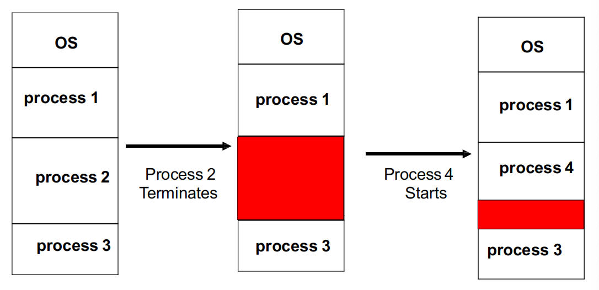{style="width:60%;display: block;margin: 20px auto"}

    !!! success "解决方案"
        外部碎片可以通过<mark class="green">**压缩 compaction**</mark> 来减少：移动内存内容，将所有空闲内存合并为一个大的块（程序需要在运行时是**可重定位的**）

        **性能开销**：执行此操作所需的时间成本

---
## segmentation
1. **分段**：
    - 将程序划分为多个具有逻辑意义的段 `text`、`data`、`stack`
    - 每个段就可以用一个 `partition` 来代表它
    - 使用**可变分区**策略（段的长度不固定）

2. <mark>**逻辑地址** `<segment-number, offset>` （segment-number 表示段号）</mark>
3. **segment table**：

    - 每个条目包含 `base` 和 `limit`
    - 根据 `number` 在表格中找到对应的 `base` 和 `limit`，然后加上 `offset` 就得到了真正的物理地址

    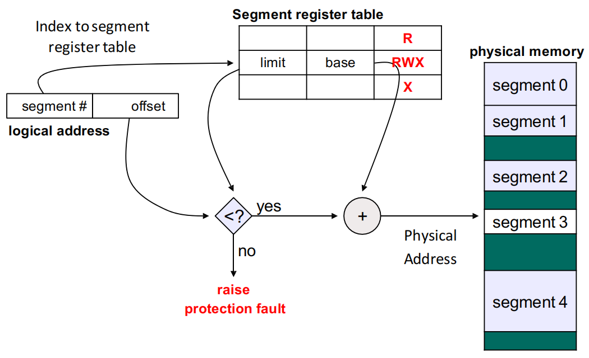{style="width:60%;display: block;margin: 20px auto"}

!!! warning "但是并没有解决外部碎片的问题"

!!! abstract "**MMU**：在运行时将逻辑地址映射到物理地址的硬件设备"

??? info "地址绑定"
    地址在程序生命周期的不同阶段以不同的方式表示

    - 源代码中的地址通常是符号化的 **e.g.** 变量名
    - 编译器将符号绑定到**可重定位地址** **e.g.** 距此模块开头 14 个字节
    - 链接器（或加载器）将可重定位地址绑定到**绝对地址** **e.g.** 0x0e74014

---
## Paging
1. **基本思想**：
    - 进程的物理地址空间可以是<mark>**非连续的**</mark>（固定分区和可变分区属于**物理连续**分配）
    - 只要物理内存可用，就可以为进程分配物理内存（一个进程对应一个页表）

    !!! success "优势"
        1. 避免了**外部碎片**的问题
        2. 避免了**内存块大小不一**的问题

2. **基础方法**
    - 将**物理地址**划分为固定大小的块，称为 **frame**（大小一般为 4KB）
    - 将**逻辑地址**划分为**相同**大小的块，称为 **page**
    - 追踪所有空闲 frame
    - 若要运行一个大小为 N page 的程序，需要找到 N 个空闲 frame 并加载程序
    - 建立映射以将逻辑地址翻译为物理地址 (page table)

    !!! warning "**有内部碎片的问题**，但是没有外部碎片的问题：只有程序的最后一页才会存在内部碎片的问题"

### Page Table
1. **Page Table**：存储 logical page 到 physical frame 的映射关系（<mark class="orange">**没有存储 page number**，只存储 frame number</mark>）
2. **Frame Table**：存储 frame 分配的情况 

    ??? example "Paging"
        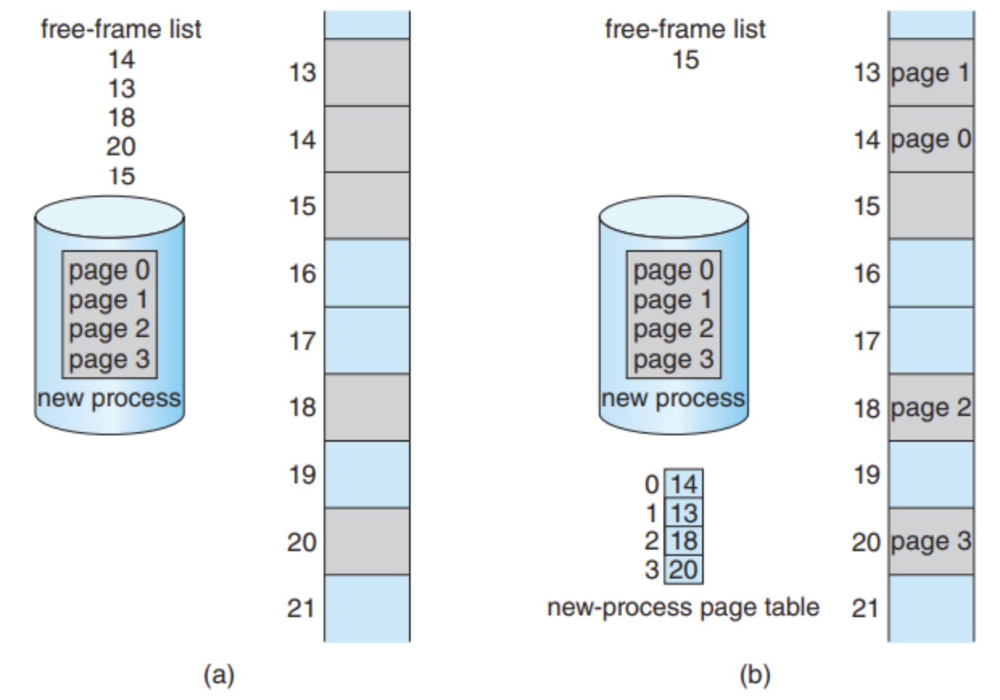{style="width:60%;display: block;margin: 20px auto"}

3. <mark>**逻辑地址**：page number + page offset</mark>
    - **offset**：确定在 page 内的具体**字节**位置
    - <mark>**物理地址**：frame number + offset</mark>
    - **物理地址的转换**：首先把 page number 拿出来，到 page table 里读出 frame number ，随后和 offset 拼接起来就得到了物理地址

    !!! abstract "32 bits 架构"
        一个页表大小 4KB，offset 为 12 位，页号为 20 位

### 硬件支持

!!! warning "页表保存在一组寄存器中"
    1. **优点**：非常高效（访问寄存器的速度很快）
    2. **缺点**：寄存器数量有限导致页表容量非常小；上下文切换时需要保存和恢复这些寄存器的值

1. <mark>page table 应该保存在**主存**中</mark>
    - **页表寄存器**
        - 基址寄存器 **`PTBR`**：指向页表的起始地址（RISC-V 上叫 **SATP**，ARM 上叫 TTBR，x86 上叫 CR3）
        - 长度寄存器 **`PTLR`**：表示页表的大小（省略）
    - **缺点**：每次数据/指令访问都需要两次**内存访问**：一次用于访问页表，一次用于访问数据/指令

2. <mark>**TLB**：在 MMU 中</mark>
    
    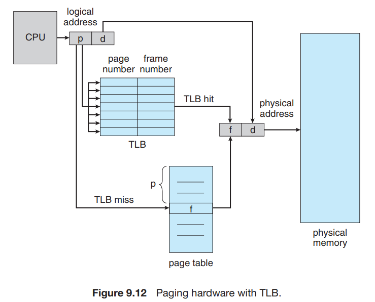{style="width:60%;display: block;margin: 20px auto"}

    - **用途**：用于缓存地址转换结果
        - 如果页号在 TLB 中，则无需访问页表
        - 如果页号不在 TLB 中（**TLB miss**），则需要访问页表并将其加载到 TLB 中
    - **上下文切换**：每个进程都有自己的页表，切换进程需要**切换页表**，TLB 必须与页表保持一致
        - 方案 I：在每次上下文切换时**刷新 TLB**
        - 方案 II：<mark>用**地址空间标识符** (ASID) 标记 TLB 表项，用以唯一标识一个进程，只刷新对应的表项</mark>
    - 某些 TLB 表项可以由进程共享，并在 TLB 中固定
    - TLB 通常很小，包含 64 到 1024 个表项

    ??? info "关联存储器"
        1. TLB 通常使用一种称为关联存储器 (associative memory) 的快速查找硬件缓存
        2. **关联存储器**：支持并行查找的存储器
        3. 关联存储器不通过地址寻址，而是通过内容寻址：如果页号（page#）存在于关联存储器的键（key）中，则直接返回帧号（frame#，即值）

    !!! question "TLB 有效访问时间"
        **命中率** (Hit ratio)：在 TLB 中找到页号的次数百分比

        <mark class="green">EAT = hit_ratio × memory_access_time + miss_ratio × 2 × memory_access_time</mark>

        假设访问内存需要 100 ns，命中率 80%
        
        - 如果我们在 TLB 中找到了所需的页，那么映射后的内存访问耗时 100 ns
        - 否则需要两次内存访问，耗时 200 ns：访问页表 + 访问内存
        - **有效访问时间**：EAT = 0.80 $\times$ 100 + 0.20 $\times$ 200 = 120 ns（访问时间变慢了 20%）

### 内存保护
1. **页表项** PTE：包含物理帧号以及权限位
    - **present bit / valid bit**：该页是否具有有效的物理 frame
    - **protection bit**：kernel/user 访问；该页是否可读、可写、可执行
2. 任何违反内存保护的行为都会导致向内核发出 **trap**

### 页面共享
1. Paging 允许进程间**共享内存**
2. 共享内存可用于进程间通信
3. **重入代码**：非自修改代码，代码本身在执行期间从不改变

!!! example "Paging Sharing"
    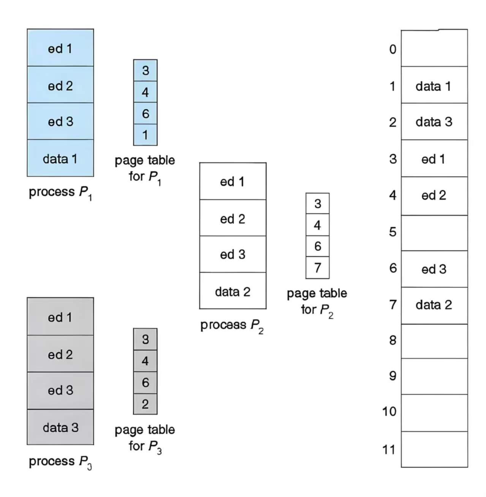{style="width:50%;display: block;margin: 20px auto"}

---
## 页表结构
### <mark>二级页表</mark>
!!! warning "**一级页表**"
    1. 如果只有一级的页表，那么**页表本身所占用的内存**很大：**4 MB**
        - **32 bits 地址为 4 GB**，每个页表 4 KB：一共需要 1 M 的页表项（1 K 个 page 来放页表项）
        - 一个页表项 4 B，占用的内存 1 M $\times$ 4 B = 4 MB

    2. <mark>页表一定是**物理连续的**</mark>（physically contiguous），否则还需要另一个页表进行映射
    3. **最坏情况下**：如果只访问第一个页和最后一页，那么只用一级页表需要 **1 K 个 page** 用来放页表

    !!! success "解决方案"
        一个 page 可以存放 1 K 个页表项，而存放一个一级页表需要 1 K 个 page，那么可以再用一个 page 存放这 1 K 个 page 的地址

1. **多级页表**：将逻辑地址空间分解为多级页表（<mark>**非连续存储**</mark>）
    - 一级页表包含指向二级页表的 **frame number**
    - 相当于对页表本身进行 **paging**

    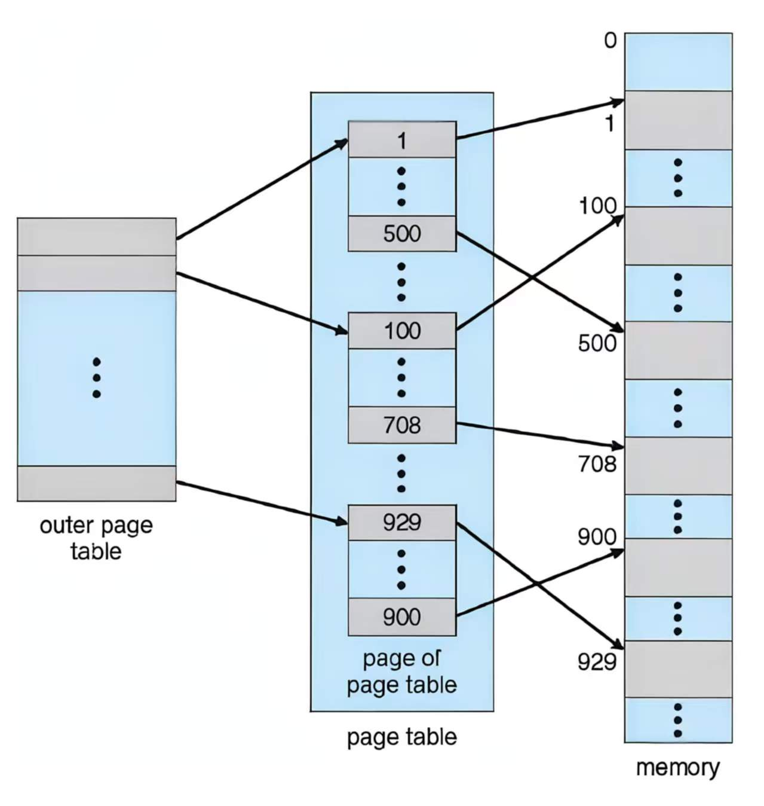{style="width:50%;display: block;margin: 20px auto"}

    !!! question "Questions"
        1. **顶级页表的一个页表项**可以指向 **4 MB** 的连续内存：4 KB $\times$ 1K = 4 MB
        2. 一级页表占用 4 KB 内存，**所有二级页表一共占用 4 MB 内存**

        !!! abstract "为什么可以省内存？"
            **最坏情况**：对于二级页表只需要 3 个页表（1 个一级页表和 2 个二级页表），即 3 个页来放页表（12 KB）

2. **逻辑地址**：

    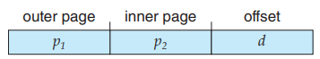{style="width:40%;display: block;margin: 20px auto"}

    - page directory number (一级页表)
    - page table number (二级页表)
    - page offset

    !!! question "逻辑地址位数计算"
        1. 32 bits 地址，4 KB page：p1 为 10 bits，p2 为 10 bits，d 为 12 bits
        2. **32 bits 地址，64 KB page**
            - **d** 需要 16 bits：一个 page 有 64 K 个 Bytes
            - **p2 需要 14 bits**：一个二级页表是一个 page，大小为 64 KB，可以放 16 K 个页表项
            - **p1 需要 2 bits**：一共 4 GB 的内存，一共 64 K 个 page，需要 4 个二级页表

    !!! quote "64 bits 虚拟地址空间"
        64 bits 虚拟地址空间需要更多层次的页表结构

        - 39 bits：三级页表（4KB / 8B = 512 entries，需要 9 bits 索引，9+9+9+12 = 39）
        - 48 bits：四级页表
        - 57 bits：五级页表

### 哈希页表

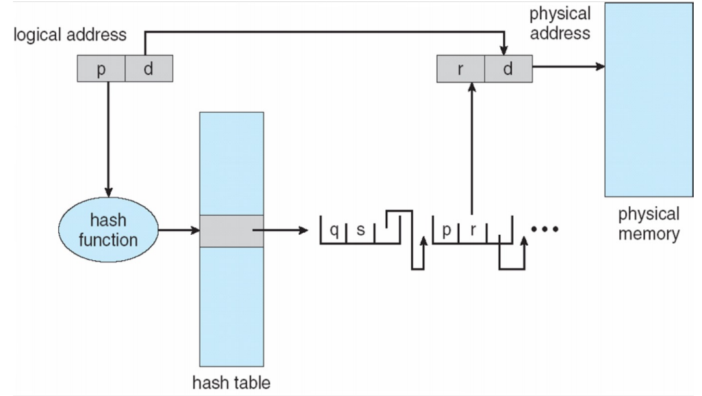{style="width:60%;display: block;margin: 20px auto"}

1. 在哈希页表中，page number 被哈希成一个 frame number

2. 每个元素包含：page#、frame# 和指向下一页的指针（解决冲突）
3. **缺点**：哈希函数计算较慢
4. **优点**：结构较简单

!!! info "说明"
    virtual page number 利用 hash function 得到 bucket index，然后在这个 <mark>bucket 对应的链表</mark>里查找真正的映射

### 倒置页表

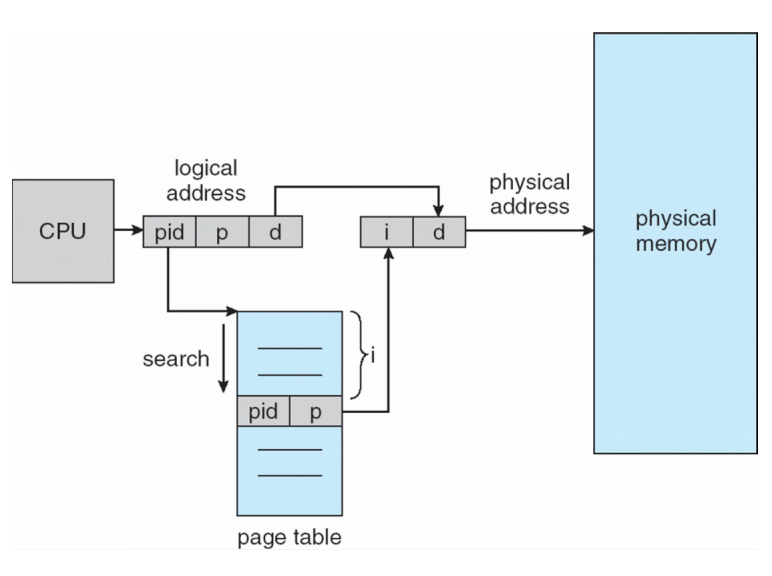{style="width:60%;display: block;margin: 20px auto"}

1. 因为通常**物理地址空间远小于虚拟地址空间**，所以想要<mark>从**物理地址**映射到虚拟地址</mark>
2. 只有一个页表，每个 entry 包含**进程 ID** 和 page#
3. **缺点**：效率太低

## Swapping

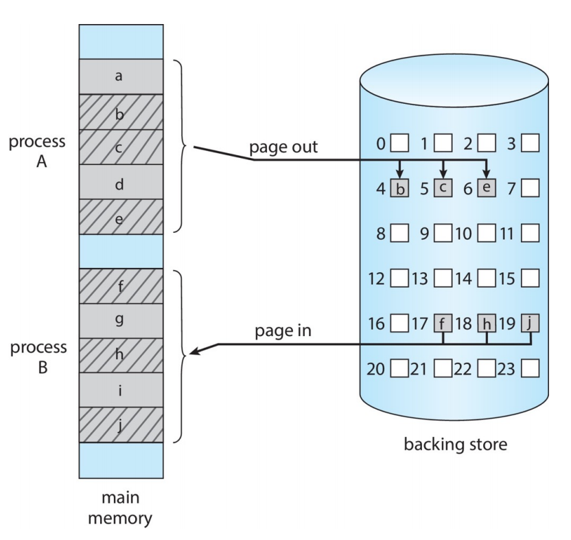{style="width:50%;display: block;margin: 20px auto"}

**交换**利用**后备磁盘**扩展了物理内存

- 进程可以被临时从内存交换到后备存储中（后备存储通常是（快速）磁盘）
- **不一定交换整个进程**
- 进程将被重新调入内存以继续执行（不需要物理地址相同）

