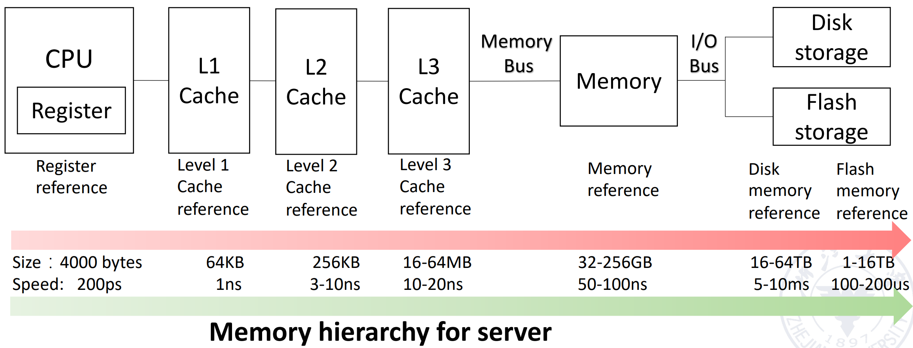

# 内存层次结构

1. **存储层次结构**：register、cache、memory、storage（从左到右容量越来越大，访问速度越来越慢，成本越来越低）

!!! abstract "**存储器层次结构**"
    （以服务器为例，不同用途计算机的要求不同）

    {style="width:80%;display: block;margin: 20px auto"}

2. 存储介质分类：

- 机械存储
- 电子存储：SRAM、DRAM（SDRAM）、Flash、ROM（PROM、EPROM）
- 光学存储

3. **局部性**

- **时间**局部性：如果一个条目被引用，它往往**很快**会再次被引用
- **空间**局部性：如果一个条目被引用，地址**与其接近**的条目往往很快也会被引用

!!! success "优势"
    为用户提供尽可能多的存储空间，同时提供最快技术所能达到的访问速度。

4. 存储层次结构中**关注点不同**的三类计算机

- **台式**计算机：主要为单个用户运行一个应用程序，更关注存储层次结构带来的**平均延迟**
- **服务器**计算机：通常可能有数百个用户同时运行数十个应用程序，关注**内存带宽**
- **嵌入式**计算机
    - 实时应用：关注最差情况性能 vs 最佳情况性能
    - 更关注**功耗和电池寿命**（如果能用简单的硬件电路实现，就不会写复杂的软件逻辑，因为软件运行需要 CPU 循环，非常耗电）
    - 运行单一程序并使用简单操作系统，**不需要**浪费额外的硬件电路去做复杂的内存保护
    - **主存非常小**，通常没有磁盘存储

---
## Cache

1. **Cache 定义**：用于改善慢速存储器平均访问时间的**“小而快”**的存储（万物皆缓存）

!!! tip "Tip"
    缓存是一个通用概念，广泛应用于处理器、操作系统、文件系统和应用程序中

2. **相关定义**

- **Cache Hit/Miss**：处理器能够/无法在缓存中找到所请求的数据项
- **Block/Line Run**：一个**固定大小**的数据集合，包含所请求的字，从主存中检索并放入缓存中
- **局部性原理**

3. **Cache Miss**

- 处理缓存未命中**所需的时间取决于**：
    - **延迟** (Latency)： 获取数据块中**第一个字**所需的时间
    - **带宽** (Bandwidth)： 获取该数据块**剩余部分**所需的时间
- **原因**
    - **强制性未命中** (Compulsory)： **首次**访问某个数据块
    - **容量未命中** (Capacity)： 数据块因**缓存满**被丢弃后，再次被访问
    - **冲突未命中** (Conflict)： 程序反复访问多个不同的数据块，而这些数据块映射到**缓存中的同一位置**

4. **性能提高**

- 充分利用**局部性原理**（大多数程序不会均匀地访问所有代码或数据）
    - 时间局部性：将最近访问过的数据项保留在更靠近处理器的位置
    - 空间局部性：将最近访问过的**连续字组**（数据块）移动到更靠近处理器的位置

??? abstract "关于 cache 的 36 个名词"
    | English | Chinese | English | Chinese | English | Chinese |
    | :--- | :--- | :--- | :--- | :--- | :--- |
    | **Cache** | 高速缓存 | **Full associative** | 全相联 | **Write allocate** | 写分配 |
    | **Virtual memory** | 虚拟存储器 | **Dirty bit** | 脏位 | **Unified cache** | 统一缓存 |
    | **Memory stall cycles** | 存储停顿周期 | **Block** | 块 / 行 | **Block offset** | 块内偏移 |
    | **Misses per instruction** | 每指令缺失数 | **Direct mapped** | 直接映射 | **Write back** | 写回 |
    | **Valid bit** | 有效位 | **Data cache** | 数据缓存 | **Locality** | 局部性 |
    | **Block address** | 块地址 | **Hit time** | 命中时间 | **Address trace** | 地址轨迹 |
    | **Write through** | 写直达 | **Cache miss** | 缓存缺失 | **Set** | 组 |
    | **Instruction cache** | 指令缓存 | **Page fault** | 缺页中断 | **Miss rate** | 缺失率 |
    | **Random replacement** | 随机替换 | **Index field** | 索引段 | **Cache hit** | 缓存命中 |
    | **Average memory access time** | 平均访存时间 | **Page** | 页 | **Tag field** | 标志段 |
    | **n-way set associative** | n 路组相联 | **No-write allocate** | 非写分配 | **Miss penalty** | 缺失惩罚 |
    | **Least-recently used** | 最近最少使用 | **Write buffer** | 写缓冲 | **Write stall** | 写停顿 |

### Cache 设计

1. **多级缓存组织**

{style="width:80%;display: block;margin: 20px auto"}

- **统一缓存**：
    - 所有内存请求都通过同一个缓存
    - 硬件需求较少，但性能较低 
- **分离 I & D 缓存**：
    - CPU 中指令和数据使用独立的缓存
    - 需要额外的硬件，但也有简化之处（**e.g.** I-cache 是只读的）

2. **设计的四个问题**

- Q1：数据块可以放在高级别存储/主存的什么位置？（块放置：全相联、组相联、直接映射）
- Q2：如果数据块在高级别存储/主存中，如何找到它？（块识别：标志位/数据块）
- Q3：在 Cache/主存缺失时，应该替换哪一块？（块替换：随机算法、最近最少使用、先进先出）
- Q4：写入时会发生什么？（写策略：回写或配合写缓冲器直写）

performence and improve cache performance

CPU vulnerability