# 流水线
1. **特点**

- 流水线将一个处理过程划分为多个子过程，每个子过程由专门的功能单元来实现
- 流水线中**各个阶段的处理时间应尽可能相等**，否则会导致流水线阻塞甚至中断；其中耗时最长的阶段会成为整个流水线的瓶颈
- 流水线的每个功能部件都必须配备一个**缓冲寄存器（锁存器）**，这种寄存器被称为**流水线寄存器** （传递相邻两个阶段之间的数据，确保后续阶段能正确使用这些数据，同时将各阶段的处理操作相互隔离）

2. **分类**

- **单功能流水线**：只能用来执行一种指令
- **多功能流水线**：可以执行多种指令
    - **静态流水线**：在同一个时间槽内，只能执行相同种类的指令
    - **动态流水线**：在同一个时间槽内，可以执行不同种类的指令

    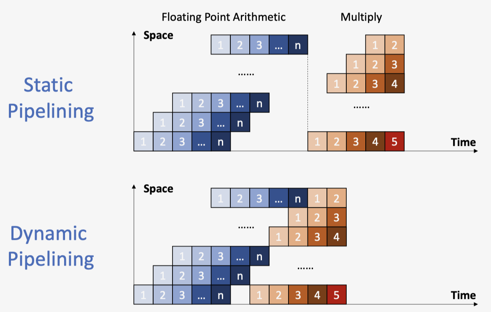{style="width:60%;display: block;margin: 20px auto"}
    
---
## 指令执行阶段

1. **IF**：内存取指
2. **ID**：译码 & 读取寄存器
3. **EX**：执行指令 or 计算地址
4. **MEM**：访问内存
5. **WB**：写回寄存器


---
## 流水线性能
1. **吞吐量 TP**：每秒钟处理的指令数

    $$
    TP = \frac{n}{T} = \frac{n}{m\Delta t_0 + (n-1)\Delta t_0}
    $$

    其中 $m$ 为流水线阶段个数

    吞吐量存在最大值 $TP < TP_{max}$ ：当 $n >> m$ 时，$TP ≈ TP_{max} = \frac{1}{\Delta t_0}$

2. **加速比 Sp**：

    $$
    \begin{aligned}
    Sp &= \frac{非流水线执行时间}{流水线执行时间} \\
    &= \frac{n \times m \times \Delta t_0}{(m+n-1)\Delta t_0} \\
    &= \frac{n \times m}{m+n-1} \\
    &> 1
    \end{aligned}
    $$

    当 $n >> m$ 时，$Sp ≈ m$

    !!! abstract "理想状况"
        最理想的加速比等于流水线的阶段数，但是并不是阶段数越多越好

3. **效率 $\eta$**：


    $$
    \begin{aligned}
    \eta &= \frac{n \times m \times \Delta t_0}{(m+n-1)\Delta t_0 \times m} \\
    &= \frac{n}{m+n-1}
    \end{aligned}
    $$

    当 $n >> m$ 时，$\eta ≈ 1$

    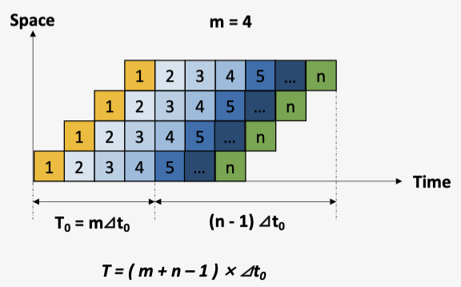{style="width:60%;display: block;margin: 20px auto"}

---
## RISC-V 流水线设计

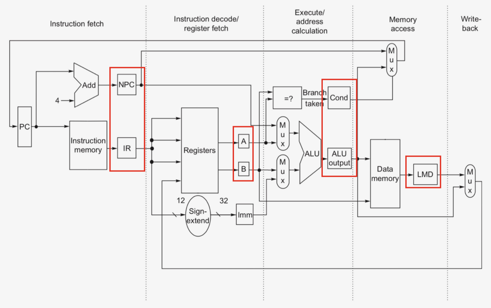

### 寄存器设计

1. **IF 取指**：

- **IF/ID.IR**：指令寄存器，保存当前指令
- **IF/ID.NPC**：保存下一条指令地址

2. **ID 译码**：

- **ID/EX.A/B**：保存寄存器操作数
- **ID/EX.Imm**：保存生成的立即数
- **ID/EX.NPC**：传递下一条指令地址（来自**IF/ID.NPC**）
- **ID/EX.IR**：传递指令（来自**ID/ID.IR**）

3. **EX 执行**：

- **EX/MEM.IR**：传递指令（来自**ID/EX.IR**）
- **EX/MEM.B**：传递寄存器操作数
- **EX/MEM.ALUOutput**：保存计算结果
- **EX/MEM.cond**：保存比较结果（1/0）

4. **MEM 读写**：

- **MEM/WB.IR**：传递指令（来自**EX/MEM.IR**）
- **MEM/WB.ALUOutput**：传递计算结果
- **MEM/WB.LMD**：保存读出的Memory数据

5. **WB 写回**

### 数据通路

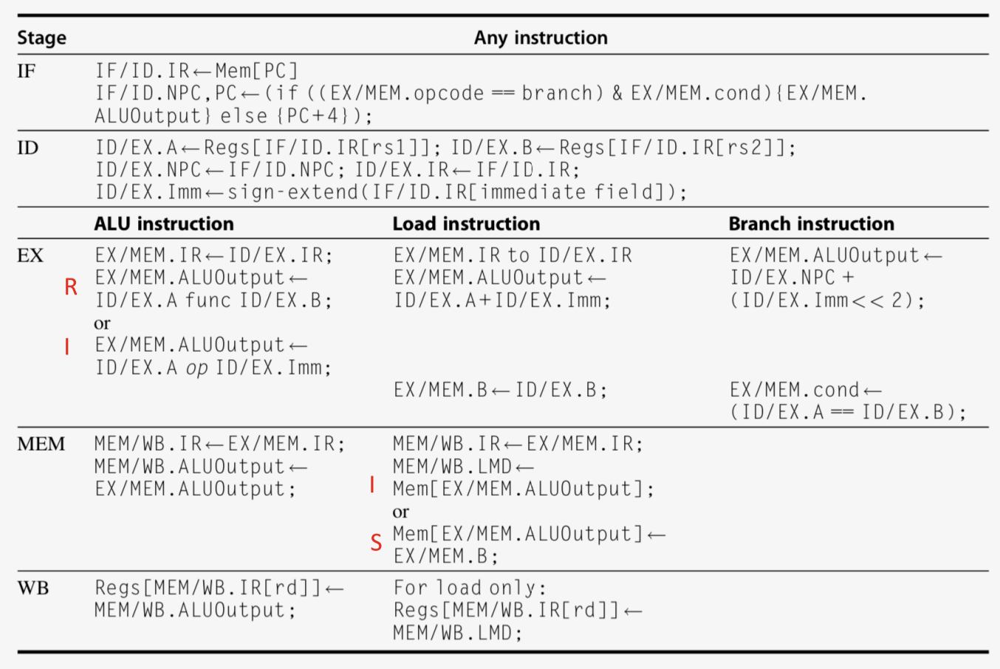

### 控制信号
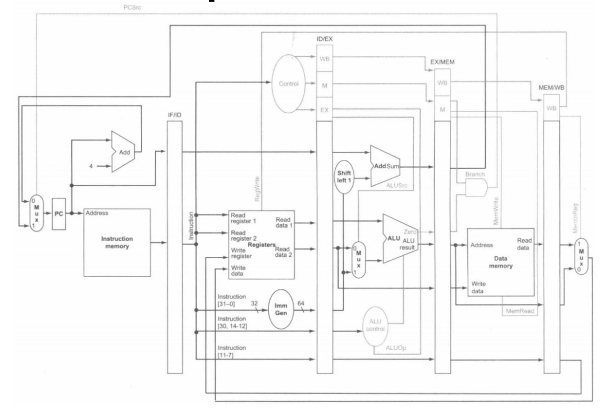

---
## 流水线冲突
### 结构冲突
1. **定义**：当前指令需要访问的资源被占用

2. **解决方法**：

- 增加硬件资源：**e.g.** 采用独立的指令缓存和数据缓存
- `stall`暂停一些指令：改成 **NOP** `addi x0, x0, 0` 指令

### 数据冲突
1. **定义**：指令间存在数据依赖关系，需要等待上一条指令完成数据的读写

    **e.g.** `add x1, x2, x3` 指令需要等待 `x2` 寄存器写入完成，才能开始执行 

2. **解决方法**：

- `stall`**暂停**一些指令，直至上一条指令完成数据读写
- `forwarding`**数据前递**：**添加额外硬件**，直接从内部资源提前获取缺失的数据，避免流水线停顿
- **重排代码**，避免流水线停顿

3. **`Forwarding`**

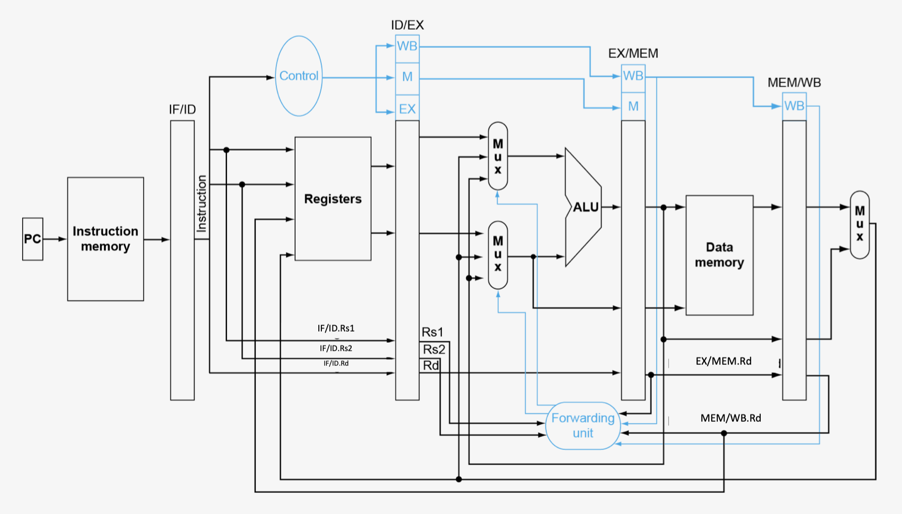{style="width:100%;display: block;margin: 20px auto"}

- **Load**：MEM Hazard
    - `ID/EX.rs1 == MEM/WB.rd` || `ID/EX.rs2 == MEM/WB.rd` : `ForwardA/B = 01`
    - `MEM/WB.rd != 0` & `MEM/WB.RegWrite == 1`
- **R-type**：EX Hazard
    - `ID/EX.rs1 == EX/MEM.rd` || `ID/EX.rs2 == EX/MEM.rd` : `ForwardA/B = 10`
    - `EX/MEM.rd != 0` & `EX/MEM.RegWrite == 1`

!!! tip "Tip"
    `rs1` 和 `rs2` 需要沿着流水线向下传递，才能用 `ID/EX` 阶段的`rs1` 和 `rs2` 与 `MEM/WB` 阶段的`rd` 进行比较。

- **控制信号**：
    - `ForwardA`：表示 `rs1` 的数据来源
    - `ForwardB`：表示 `rs2` 的数据来源

    | 控制信号取值| 数据来源| 解释|
    |:--|:--|:--|
    | **ForwardA/B = 00** | ID/EX     | No forwarding                 |
    | **ForwardA/B = 10** | EX/MEM    | Forwarding with data hazard in EX/MEM |
    | **ForwardA/B = 01** | MEM/WB    | Forwarding with data hazard in MEM/WB |


4. **双重数据冲突**
    
- e.g.

    ```asm
    # 既存在 EX Hazard ，也存在 MEM Hazard
    add x1,x1,x2
    add x1,x1,x3      
    add x1,x1,x4
    ```

- 优先选择 `EX` 的 `forwarding` ：在 `MEM` 的 `Forwatding` 控制信号的生成需要满足**不符合 `EX` 的 `forwarding` 条件**


5. **`load-use` 数据冲突**

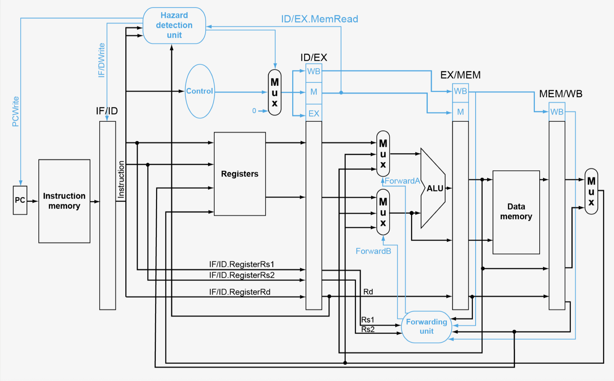{style="width:100%;display: block;margin: 20px auto"}

- **产生情况**：发生在 `load` 指令后**立即使用**该数据的指令之间
- **问题**：无法通过单一前递解决，需要**暂停**并且插入气泡
- **添加硬件**：冲突侦查单元
- **条件**：`ID/EX.MemRead && ((ID/EX. Rd = IF/ID. Rs1) || (ID/EX. Rd = IF/ID. Rs2))`
- **解决方法**
    - 插入 `nop` 指令：`ID/EX` 置0；`EX`, `MEM` and `WB` do `nop`
    - 阻止 `PC` 和 `IF/ID` 更新

!!! note "Notices"
    1. `forwarding`不能避免所有的流水线停顿，例如上一条指令为`load`指令

    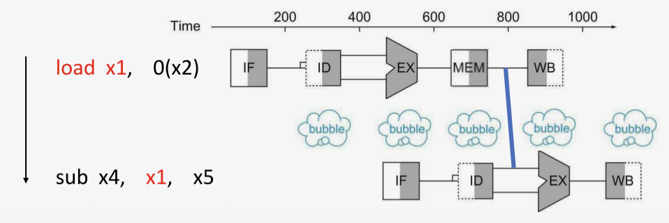{style="width:60%;display: block;margin: 20px auto"}

    2. `stall`会降低性能；编译器可以组织代码来避免冲突和停顿
    3. `stall` 之后，可能又会产生数据冲突

### 控制冲突
1. **定义**：执行流的控制依赖于上一条指令的执行结果

    **e.g.** 条件分支指令（下一条指令不能立即执行）

2. **解决方法**：
    
- `stall`：性能不佳，等到`MEM`阶段才知道分支结果，会导致**3个时钟周期**的停顿
- `Forwarding`：在流水线早期，比较寄存器并且计算目标地址，减少停顿
    - 在 **`ID`** 阶段添加硬件：目标地址加法器，比较器
    - 但是仍需要**暂停一个时钟周期**
    - 如果前移到 `IF` 阶段，则需要更复杂的控制信号

    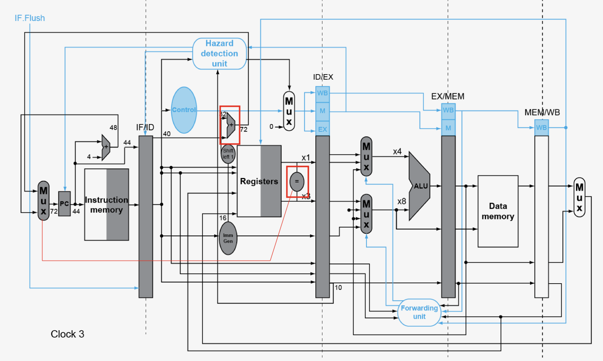

- **Delay slot**：
    - 在分支指令后设置一个位置，其中的指令**总是会被执行，无论分支是否跳转**，从而减少停顿
    - 编译器找到一条有用的、与分支指令不相关的指令，并将其移动到延迟槽中；找不到则填入nop

    !!! error "注意！"
        RISC-V中不存在延迟槽（编译器负担重，指令集复杂）

- **预测**：只有预测不正确时，才需要暂停

3. **预测** 

- **静态预测**：总是预测不跳转，或总是预测跳转
- **动态预测**：根据**当前指令的跳转历史**进行预测
    - **分支历史表**（BHT）：
        - 按分支指令地址**（PC）**索引
        - 存储当前指令上之前一次或多次的跳转结果，作为预测时的依据
    - **1-bit 预测器**

        {style="width:60%;display: block;margin: 20px auto"}

        !!! error "不足"
            **对循环末尾不友好**：一个循环分支在结束时会导致**连续两次的预测错误**
            
            1. 在最后一次循环的时候会预测错误（上一次跳转结果为真，但实际跳转结果为假）
            2. 在下一次进入循环的第一次迭代时，会预测错误（上一次跳转结果为假，但实际跳转结果为真）
   
    - **2-bit 预测器**：
        - 需要**两次连续的误预测**才会改变预测方向
        - **优势**：容忍一次异常行为

        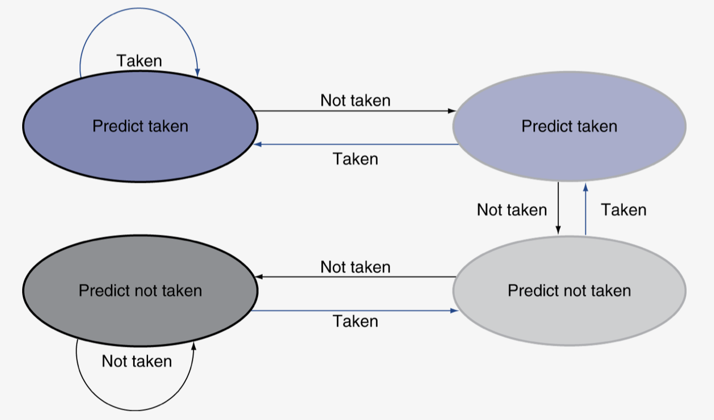{style="width:60%;display: block;margin: 20px auto"}

        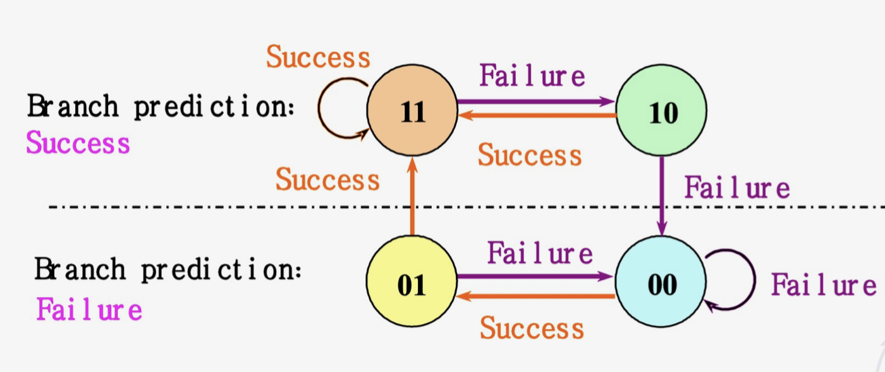{style="width:60%;display: block;margin: 20px auto"}

- **高级分支预测技术**
    - **分支目标缓冲**（BTB）：一个缓存，索引是PC，内容是预测的目标地址
    - **集成取指单元**

4. **跳转指令的数据冲突**

- 若分支依赖的寄存器是之前指令的结果，则仍存在数据冲突，需要停顿+数据前递
- **情况**
    - 比较寄存器需要紧接着前一条 `ALU` 指令的结果：停顿1周期
    - 比较寄存器是紧接着前一条 `LOAD` 指令的结果：停顿2周期

---
## 非线性流水线
### 调度
1. **作用**：决定下一条指令进入流水线的时间

2. **预约表**：用于描述一个任务在流水线中各段占用情况的表格
    
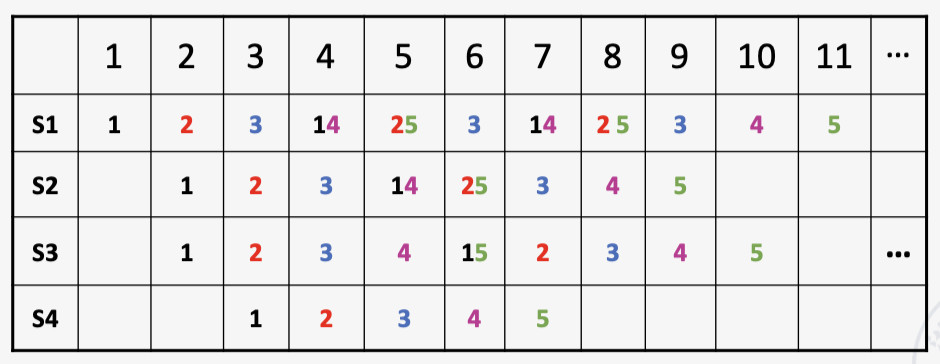{style="width:60%;display: block;margin: 20px auto"}

3. **调度方法流程**：初始冲突向量 → 冲突向量 → 状态转移图 → 循环队列 → 计算最小平均间隔

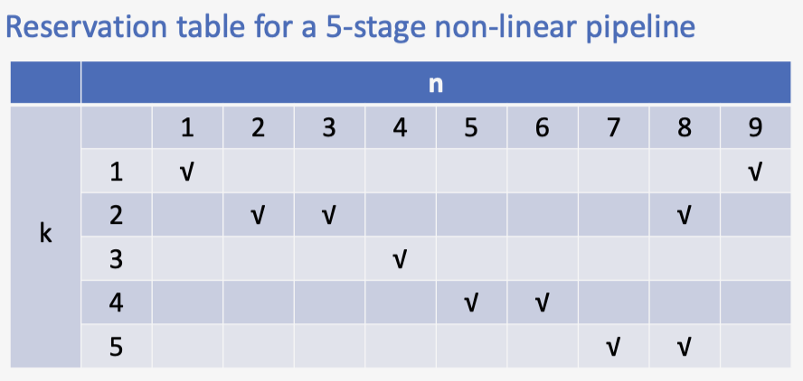{style="width:60%;display: block;margin: 20px auto"}

- **初始冲突向量**
    - **禁止集**：元素为两条指令产生冲突相隔的时钟周期  `F={1,5,6,8}`
    - **初始冲突向量**：禁止集转化，从右到左排列  `C_0=(10110001)`
- **冲突向量**
    - 不断更新当前指令的冲突向量
    - **更新方法**：
        - 选择间隔的时钟周期（未放入当前指令之前CCV为0的位置），记为 `n`
        - 将已经在流水线中的指令的冲突向量**向右移** `n` 位
        - 所有指令的冲突向量**按位或**，得到新的CCV
        - 重复上述操作直至**CCV形成循环**，则找到一个调度方案（不止一个） `{2,2,7}`

        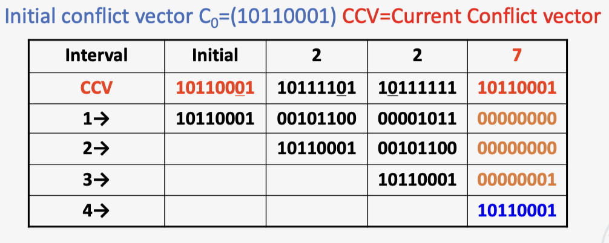{style="width:70%;display: block;margin: 20px auto"}

- **状态转移图**
    
    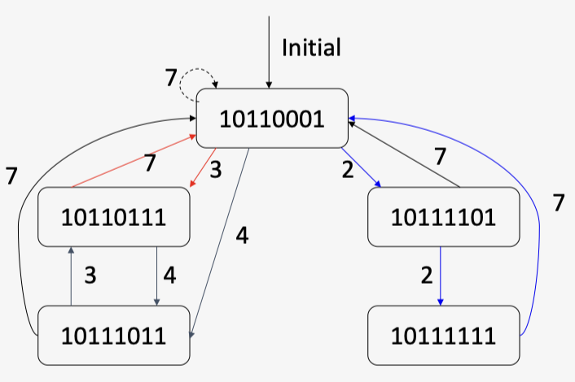{style="width:50%;display: block;margin: 20px auto"}

- **寻找最优调度方案**：求解最小平均间隔（直接对调度方案求平均）

---
## 多指令发射
1. **作用**：提高指令并行性（ILP）

2. **局限性**：主要受到以下三个方面的影响

- 程序中固有的指令级并行性
- 硬件实现的难度
- 超标量和超长指令字处理器固有的技术限制
  
### 分类
#### 静态多发射

1. 利用**超标量处理器**/**超长指令处理器**，指令**按序**流出，**流出时**进行冲突检测

2. **指令调度**

- **编译器**将需要同时发射的指令分组，将它们打包成“发射槽”
- 编译器**检测并避免冲突**，必要时用空操作指令填充

3. **冲突检测**

- 第一阶段：**在流出包中**进行冲突检测，并初步选择可以流出的指令
- 第二阶段：检查所选指令与**正在执行的指令**是否冲突

4. **硬件修改**：增加取指和译码带宽，增加功能单元，增加前递路径

5. **冲突缓解**：循环展开
#### 动态多发射
1. 利用**超标量处理器**
2. **指令调度**

- **CPU**检查指令流并**选择**每个周期要发射的指令
- **编译器**可以通过**重新排序指令**来提供帮助
- CPU在运行时使用**先进技术**解决冲突
- 允许CPU**乱序**执行指令以避免停顿，但按顺序将结果提交到寄存器

3. **需要动态调度的原因**

- 并非所有停顿都是可预测的
- 无法总是围绕分支进行调度，因为分支结果是动态确定的
- 同一指令集架构的不同实现具有不同的延迟和冲突


### 关键技术

1. **推测执行**

- **原理**：**“猜测”**执行指令（如分支方向、加载数值），并提前执行后续指令
- 如果猜对，完成操作，大大提升性能；如果猜错，`roll-back` 清空流水线重新执行正确操作
- **编译器/硬件推测**
    - **编译器**：重新排序指令，可包含“修复”指令以从错误猜测中恢复
    - **硬件**：前瞻查找要执行的指令，在错误推测时刷新缓冲区

2. **循环展开**

- **原理**：复制循环体以体现更多并行性，减少循环控制开销

- 每次复制使用不同的寄存器（**“寄存器重命名”**）
    - 避免循环携带的**“反依赖”**
        - 存储指令后跟对同一寄存器的加载，也称为“名称依赖”
        - 来源于寄存器名的重复使用

??? example "循环展开例题"
    **Problem:**
    
    

    **循环展开:**

    

3. **寄存器重命名**

- **保留站和重排序缓冲区**有效提供寄存器重命名功能
- 当指令发射到保留站时：
    - 如果操作数在寄存器文件或重排序缓冲区中**可用**，则被复制到保留站，不再需要保留在寄存器中，可以被覆盖
    - 如果操作数尚**不可用**，则将由功能单元提供给保留站，可能不需要更新寄存器

4. **加载推测**

- 预测分支并继续发射指令：在分支结果确定前不提交指令
- **加载推测**
    - 避免加载和缓存未命中的延迟：
        - 预测有效地址
        - 预测加载值
        - 在完成未完成的存储操作前进行加载
        - 将存储的值旁路到加载单元
    - 在推测被清除前不提交加载操作
### 多发射处理器
1. **超标量处理器**

- **特点**：每个时钟周期发射的**指令数量不固定**，取决于代码的具体情况（1～8条，有上限）
- 假设此上限为 `n`，则该处理器称为 `n` 路发射
- **指令调度**：可以通过**编译器**进行静态调度，或基于 **`Tomasulo` 算法**进行动态调度
- **应用**：该方法是目前**通用计算**领域最成功的方法

2. **超长指令字 VLIW**

- **特点**：每个时钟周期发射的指令数量是**固定的**（4-16条），构成一条长指令/指令包
- 在指令包中，指令间的并行性通过**指令**显式表达
- **指令调度**：只能通过**编译器**进行静态调度
- **应用**：已成功应用于数字信号处理和多媒体应用
- **问题**
    - 程序代码长度增加：
        - 需要大量**循环展开**来提高并行性
        - 指令字中的操作槽无法始终被填满
        - **解决方案**：共享立即数字段的命令，或采用指令压缩存储，在解码时传输到`Cache`或进行扩展
    - 机器代码不兼容

3. **超流水线处理器**

- **特点**：每个流水线阶段被进一步细分，多个指令可以在一个时钟周期内**分时**执行
- 实际上，**超流水线处理器的流水线周期**是 `1/n` 个时钟周期：对于每个时钟周期能流出 `n` 条指令的超流水线，这 `n` 条指令不是同时流出的，而是每 `1/n` 个时钟周期流出一条指令

{style="width:60%;display: block;margin: 20px auto"}

4. **对比**

{style="width:60%;display: block;margin: 20px auto"}


---
## 异常与中断 
1. **定义**：需要改变控制流的"意外"事件（不同的ISA对这些术语的使用有所不同）

- **异常**：来自CPU内部 **e.g.** 未定义操作码、系统调用等
- **中断**：来自外部I/O控制器
- 在不牺牲性能的情况下处理它们十分困难

2. **异常处理**

- 保存出错/被中断指令的**PC**：在 `RISC-V` 中为监督模式异常程序计数器（**SEPC**）
- 保存问题出现的**原因**：在 `RISC-V` 中为监督模式异常原因寄存器（**SCAUSE**）
- 跳转到**处理程序**

3. **处理程序的操作**

- 读取原因（**SCAUSE**），并跳转到相关的处理程序
- **确定**需要采取的**操作**
- 如果可**重新启动**：采取纠正措施，使用**SEPC**返回到程序
- **否则**：终止程序，使用**SEPC、SCAUSE**等报告错误

4. **流水线中的异常**：控制冒险的另一种形式

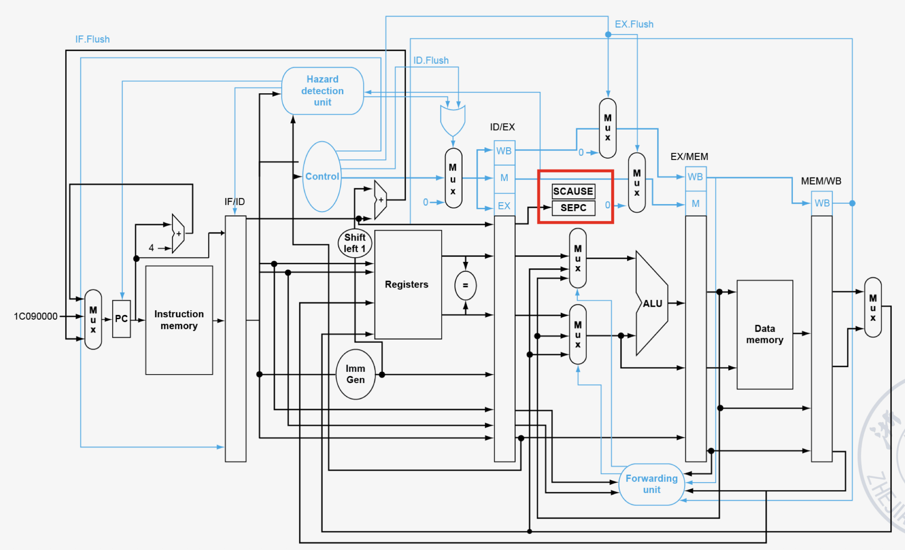


5. **多重异常**

- **情况**：流水线重叠执行多条指令
- **简单方法**：处理最早指令的异常，清空后续指令，“精确”异常
- 在**复杂流水线**中，每周期发射多条指令，且乱序完成，维护较困难


---
## 软硬接口
### **CPU软硬件协同**

1. **数据冲突**：软件`code scheduling`；硬件`forwarding`
2. **控制冲突**：软件`code scheduling`；硬件`prediction`

### **程序执行全流程**

#### **翻译过程（编译与汇编）**

1. **目标**：将人类可读的高级语言（C）转换为机器可执行的二进制指令
2. **编译**：编译器将C代码整体分析和翻译成等效的**汇编语言**程序
3. **汇编**：汇编器将每条汇编指令**一对一**或**一对多**地转换为二进制**机器语言**

#### **生成目标模块**

1. **目标**：生成一个包含机器代码和元数据的、可重用的代码单元

2. **目标模块的组成**：

- **头部**：描述文件的基本信息和各段的大小与位置
- **代码段**：存放编译生成的机器指令    
- **静态数据段**：存放全局变量等生命周期长的数据
- **重定位信息**：标记那些在链接前地址未知的指令和数据（例如，调用外部函数的指令地址）
- **符号表**：记录本模块定义的可被其他模块使用的符号（如全局函数、变量），以及本模块引用但未定义的符号（如 `printf`）
- **调试信息**：将机器指令与源代码行号对应，便于调试器使用


#### **链接**

1. **目标**：将多个目标模块和库文件合并，创建一个完整、独立的可执行文件
2. **链接器的核心工作**：
        
- **合并段**：将所有输入模块的代码段合并到输出文件的代码段，数据段合并到数据段
- **符号解析与地址分配**：遍历所有符号表，为每个符号（函数名、变量名）分配一个最终的运行时内存地址
- **重定位**：根据符号的最终地址，修改所有目标模块中那些临时地址或未定地址的引用（这些需要修改的位置由“重定位信息”指出）

3. **链接类型**：

- **静态链接**：在程序运行前，将所有需要的库代码**复制**到最终的可执行文件中
    -  静态链接的`ELF`没有`.interp`节
- **动态链接**：
    - 在可执行文件中只记录它需要哪些共享库
    - 在程序**加载时**或**运行时**，再由操作系统的动态链接器将所需的库代码加载到内存并完成地址解析
    - 动态链接的`ELF`有`.interp`节：指定**动态加载器**的路径
    

??? abstract "优缺点"
    1. **静态链接**

    - **优点**：程序独立性强，分发简单；**可移植性较好**，对环境的依赖小
    - **缺点**：可执行文件**体积大**，库更新需要重新链接所有程序
    
    2. **动态链接**

    - **优点**：显著减小可执行文件体积；节省内存（多个程序可共享同一份库代码）；库更新无需重新链接程序
    - **缺点**：增加了程序启动的轻微开销；存在`DLL Hell`依赖风险；可移植性较差

#### **加载**

1. **目标**：将磁盘上的可执行文件加载到内存中，并创建一个可以运行的进程。

2. **加载器的步骤**

- **读取头部**：了解代码和数据段的大小及位置
- **创建地址空间**：为程序创建一个独立的**虚拟地址空间**
- **载入代码与数据**：将代码段和已初始化的数据段从文件复制到内存的相应位置（现代OS常使用**按需分页**，仅建立映射关系，在实际访问时才调入内存）
- **设置栈**：为程序分配栈空间，并将命令行参数(`argc`, `argv`)和环境变量压栈
- **初始化寄存器**：将栈指针寄存器(`sp`, 即x2)等设置为初始值
- **跳转到入口点**：跳转到启动例程（如`_start`），该例程负责初始化C运行时环境，最后调用程序的 `main` 函数；当 `main` 返回时，再通过 `exit` 系统调用结束进程

#### **执行**

1. **核心**：**CPU 的工作周期**

- **取指**：程序计数器(`PC`)指向下一条指令的地址，CPU从内存中读取该指令
- **译码**：控制单元解析指令，识别操作类型和操作数
- **执行**：算术逻辑单元(`ALU`)根据指令执行计算，访问寄存器文件或内存
- **回写**：将结果写回寄存器或内存
- **更新PC**：将PC设置为下一条指令的地址，周而复始

2. **软件-硬件接口的体现**：**指令集架构** 是这个循环的规则书，软件（编译后的指令序列）通过它来指挥硬件

