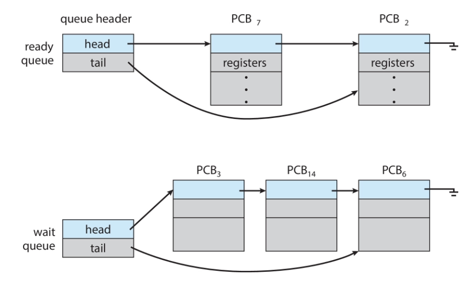
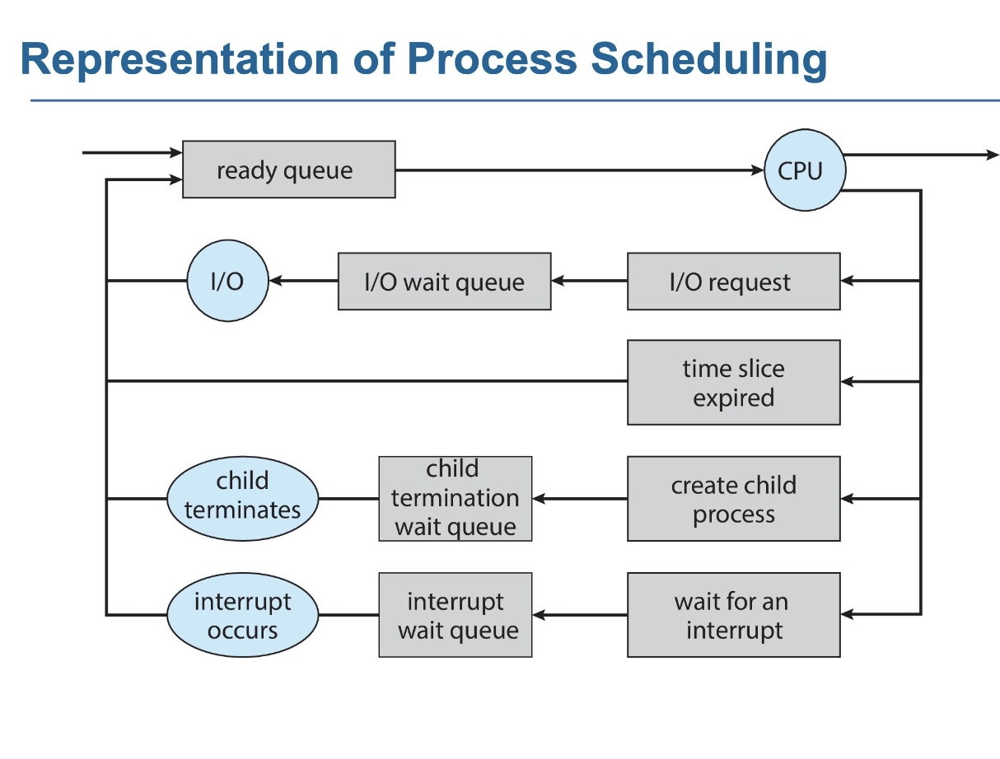
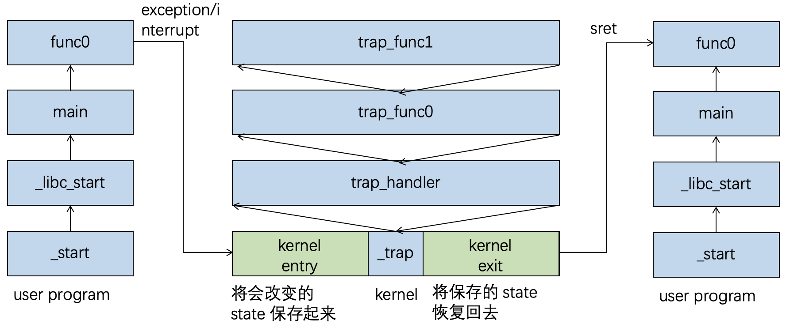
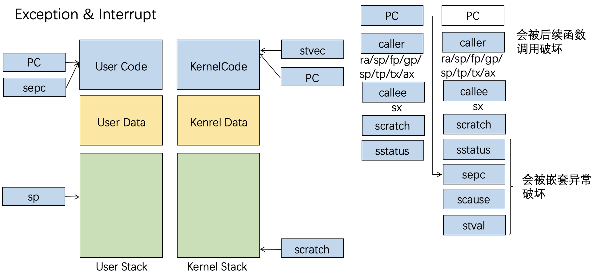
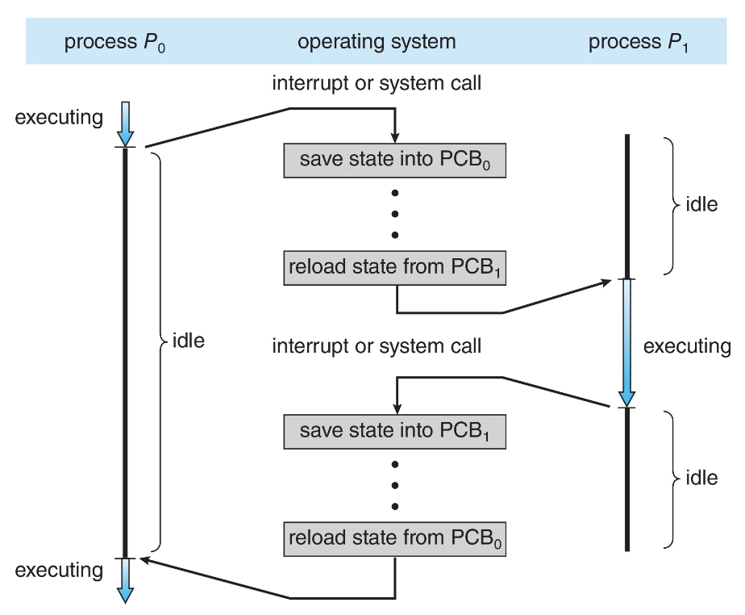
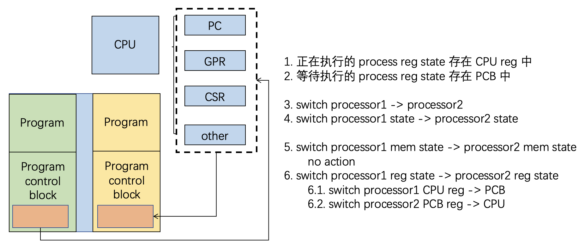

## 概念

1. **进程**

- 进行**资源分配和保护**的单位
- 是执行中的程序（程序是被动实体，当**被加载到内存**中时成为一个进程）

2. **组成**

- **代码**（文本段）：最初存储在磁盘上的**可执行文件**中
- **数据段**：全局变量（`x86`: `.data`+`.bss`）
- **程序计数器**：指向要执行的下一条指令
- **处理器寄存器的内容**
- **堆**：用于动态分配的内存（`malloc`、`new`...）
- **栈**

3. **内存空间**


{style="width:30%;display: block;margin: 20px auto"}

??? example "C语言程序的内存布局"
    

4. **栈**

- **运行时栈**（runtime stack）：可以进行压栈和出栈操作的栈
- **活动记录/栈帧**：栈中的项，包含函数/方法调用和返回所需的所有“簿记”信息

    !!! abstract "栈帧内容"
        1. 函数运行所需的“状态”：

        - 调用者传递给它的参数
        - 局部变量
        - 返回地址：函数返回后应执行的下一条指令的地址
        - 返回值

        2. 在调用函数前，调用者需要保存其寄存器的状态

- 栈用于管理程序中连续的**函数/方法调用**，栈向下增长
- 栈的管理完全由**编译器**负责

??? info "同一程序的两个进程"
    {style="width:60%;display: block;margin: 20px auto"}

??? abstract "多任务"
    

---
## 进程控制块 PCB

1. **定义**：与每个进程关联的信息，又被称为任务控制块

!!! tip "Tip"
    1. 每个进程**有且仅有一个**PCB（在新进程创建时分配一个PCB，在进程终止时释放PCB）
    2. **`Linux`进程表示**：`task_struct`结构体，其中包含了进程的所有信息

2. **包含信息**

- **进程状态**：运行、等待等
- **程序计数器**：下一条要执行指令的位置
- **CPU 寄存器**：所有进程中心寄存器的内容
- **CPU 调度信息**：优先级、调度队列指针
- **内存管理信息**：分配给进程的内存
- **记账信息**：使用的 CPU 时间、自启动以来经过的时钟时间、时间限制
- **I/O 状态信息**：分配给进程的 I/O 设备、打开文件列表

---
## 进程状态

1. **状态类型**

- **新建 New**：进程正在被创建
- **运行 Running**：指令正在被执行
- **等待 Waiting**：进程正在等待某些事件发生
- **就绪 Ready**：进程等待被分配给处理器
- **终止 Terminated**：进程已完成执行

2. **状态转换**

{style="width:80%;display: block;margin: 20px auto"}

3. **对比**

!!! note "进程状态"
    进程状态是**程序相关**寄存器的状态和程序相关内存的内存总和
    
    - 内存只包括Program自己的部分（Program+PCB）
    - CSR只包括控制process运行的部分，不包括`stvec`等
    
!!! abstract "处理器状态"
    处理器的架构层状态是**所有架构层**寄存器状态和内存状态的总和

    !!! info "寄存器状态"
        1. **PC（程序计数器）**
        2. **GPR（通用寄存器）**: 
        
        - `caller`: `ra`, `sp`, `fp`, `tp`, `gp`, `tx`, `ax`
        - `callee`: `sx`

        3. **CSR（控制和状态寄存器）**: `status`, `sepc`, `stval`, `scause`
        4. **others**

### 进程创建

1. 一个进程（**父进程**）可以创建一个新的进程（**子进程**），得到的树为**进程树**
2. 每个进程有一个**进程标识码**`pid`（`ppid`指父进程的`pid`）

!!! abstract "子进程与父进程"
    1. 父进程可以向子进程**传递输入**
    2. 创建子进程后，父进程可以继续执行，或者等待子进程完成
    3. 子进程可以是父进程的克隆（即拥有地址空间的副本），或者一个全新的程序
    4. 子进程可以继承/共享父进程的某些资源，或者拥有全新的资源

3. **`fork()`系统调用**（Linux/UNIX）

- **作用**：创建一个新进程（父进程的副本）
- **返回值**：向父进程返回子进程的`pid`，向子进程返回`0`
- **步骤**
    - 执行 `fork syscall`
    - 为子进程申请**内存和PCB**
    - **拷贝**所有的内存和PCB（进程状态）
    - **初始化**子进程PCB（PID和状态等等）
    - **设置返回值**
        - 将父进程的`a0`写为**子进程PID**
        - 将子进程的`a0`写为**0**
    - **上下文切换**
        - 父进程 CPU 进入 PCB
        - 子进程 PCB 进入 CPU
    - 子进程**执行**
    

!!! abstract "Note"
    1. 可以使用 `getpid()` 和 `getppid()` 获取当前进程的`pid`和`ppid`
    2. **子进程只是父进程的副本，无法直接变成另一个程序，如果你只想运行一个不同的程序，仅靠 `fork` 是不够的**

??? example "示例代码"
    1. **创建一个子进程**
    
    ```c
    pid = fork();
    if (pid < 0) {      // fork失败
        fprintf(stdout, "Error: can’t fork()\n");
        perror("fork()");
    }
    if (pid != 0) {     // 父进程代码块
        fprintf(stdout, "I am parent and my child has pid %d\n",pid);
        while (1);
    } else {            // 子进程代码块
        fprintf(stdout, "I am child, and my pid is %d\n", getpid());
        while (1);
    }
    ```

    **Output:**

    ```txt
    I am parent and my child has pid 65702
    I am child, and my pid is 65702
    ```

    2. **内存关系**

    ```c
    int a = 12;
    pid = fork();
    if (pid) {     // 父进程
        sleep(10);          // 父进程睡眠10秒
        fprintf(stdout,"a = %d\n",a); // 打印 a = 12
        while (1);
    } else {                // 子进程
        a += 3;             // 子进程修改自己的a副本，变为15
        while (1);
    }
    ```

    **Output:** `a = 12`

    3. **`hello`的个数**

    ```c
    pid1 = fork();    // 2个进程
    printf("hello\n");
    pid2 = fork();    // 4个进程
    printf("hello\n");
    ```

    **Output:** 六个`hello`

    4. **进程的个数**

    ```c
    int main (int argc, char *arg[]) {
        fork();         // 2个进程
        if (fork()) {   // 4个进程
            fork();     // 6个进程（父进程返回非0，生成两个新进程；子进程返回0，不生成新进程）
        }
        fork();         // 12个进程
    }
    // total = 12
    ```

??? info "Pros and Cons"
    1. **Pros**

    - 简洁：`Windows CreateProcess` 需要提供10个参数，`fork` 不需要参数
    - 分工：`fork` 搭建骨架，`exec` 赋予灵魂
    - 联系：保持进程与进程之间的关系

    2. **Cons**

    - 复杂：需要两个系统调用
    - 性能差
    - 安全性问题

    3. `Clone` 系统调用：`fork` + `exec` 

4. **`exec*()`系列系统调用**（Linux/UNIX）

```c
if (fork() == 0) {              // 子进程
    char *const argv[] = {"ls", "-l", "/tmp/", NULL};
    execv("/bin/ls", argv);     // 替换为ls程序
    // 如果execv成功，后面的代码不会执行
    exit();                     // 如果execv失败，则退出子进程
}
// 父进程继续执行
```


- **作用**：在`fork()`之后调用，用新程序**替换**进程的内存空间
- **C语言函数**：有`execl`、`execle`、`execlp`、`execv`、`execve`、`execvp`，是`execve`系统调用的**用户空间包装器**
- **参数**：指定可执行文件的路径、命令行参数、环境变量
- **返回**：如果`exec()`调用成功，不会返回（因为原程序已被替换）；只有**出错**时才会返回

??? info "exec 函数族"
    **函数的名字字母揭示了区别**

    1. `l`：参数以**列表**形式传递
    2. `v`：参数以**向量/数组**形式传递
    3. `p`：可以使用**程序名**而非完整路径
    4. `e`：可以传递一个**自定义的环境变量数组**给新程序

    ```c
    execl("/bin/ls", "ls", "-l", "-a", NULL); // 最后一个参数必须是 NULL

    char *argv[] = {"ls", "-l", "-a", NULL};
    execv("/bin/ls", argv);

    execlp("ls", "ls", "-l", NULL); // 不需要写 "/bin/ls"，系统会在 PATH 环境变量指定的目录中搜索该程序

    char *envp[] = {"USER=custom_user", "PATH=/usr/bin", NULL};
    execle("/bin/myprogram", "myprogram", NULL, envp);
    ```

!!! success "进程创建的流程"
    1. `fork()`系统调用创建新进程
    2. `exec()`用新程序替换进程的内存空间
    3. 父进程调用`wait()`等待子进程终止

### 进程终止

1. **`exit()`**

- 使用该系统调用，进程可以**自行终止**
- 此调用接受一个整数作为参数，称为进程的**退出/返回/错误代码**
- 操作系统会回收进程的所有资源（物理和虚拟内存、打开文件、I/O缓冲区等）
- **一个进程可以通过信号和 `kill()` 系统调用终止另一个进程**

2. `wait()` & `waitpid()`

- `wait()`
    - 阻塞父进程，直到**任意子进程结束**
    - **返回**已终止子进程的`pid`和退出代码
- `waitpid()`
    - 阻塞直到**一个特定的子进程结束**
    - 可以使用`WNOHANG`选项使其成为**非阻塞调用**

3. **信号**

- **信号**：**软件中断**，是进程必须处理的**异步事件**
- **用途**：进程同步、通信等
- **产生原因**：
    - 在命令行按 `^C` 向正在运行的命令发送 `SIGINT` 信号
    - 段错误发送 `SIGSEGV` 信号
    - 进程使用 `kill()` 发送 `SIGKILL` 信号给另一个进程
- 使用 `kill -l` 命令可以列出所有信号
- 每个信号在进程中引起**默认行为** **e.g.** `SIGINT` 信号导致进程终止
- **信号处理**
    - 大多数信号可以**被忽略或由用户提供的处理函数捕获**
    - `SIGKILL`和`SIGSTOP`不能被忽略或捕获（出于安全考虑）

!!! abstract "signal() 系统调用"
    ```c
    signal(SIGINT, SIG_IGN); // 忽略SIGINT信号
    signal(SIGINT, SIG_DFL); // 恢复默认行为
    signal(SIGINT, my_handler); // 使用自定义处理函数
    // 处理函数原型: void my_handler(int sig) { ... }
    ```

??? example "示例代码"
    ```c
    #include <signal.h>
    #include <stdio.h>
    void handler(int sig) {
        fprintf(stdout,"I don't want to die!\n");
        return;
    }
    int main() {
        signal(SIGINT, handler); // 捕获SIGINT信号
        while(1); // 无限循环
    }
    // 运行此程序后，按Ctrl-C不会终止程序，而是打印 "I don't want to die!"
    // 终止：kill pid
    ```

    **Output:**

    ```bash
    lucy@LucyhandeMacBook-Pro C(vscode) % ./1
    ^CI don't want to die!
    ^CI don't want to die!
    ^CI don't want to die!
    ...
    ```

4. **僵尸进程** `Zombie`

- **定义**：子进程终止后，在未被父进程“收割”前，处于一种“未死”的僵尸状态
- **存在原因**：父进程**没有调用`wait()`或者其变体**来获取子进程的退出代码

!!! tip "Tips"
    1. 哪些资源不能由子进程释放？**PCB**
    2. 僵尸进程不是真正的活动进程，**不消耗CPU资源**
    3. 但它消耗一个内存槽位：如果僵尸进程过多，可能会耗尽系统资源，导致`fork()`失败

- **查看进程信息**：`ps xao pid,ppid,comm,state | grep a.out`

!!! warning "如何避免僵尸进程"
    1. 僵尸进程会一直存在，直到**其父进程调用`wait()`，或者其父进程死亡**
    2. **处理方法**：使用`SIGCHLD`信号处理程序

    - 当子进程**退出时**，会向父进程发送`SIGCHLD`信号
    - 父进程可以为`SIGCHLD`安装一个**处理程序**，在该处理程序中调用`wait()`来回收子进程

5. **孤儿进程** `Orphan`

- **定义**：父进程已死亡的进程
- 在这种情况下，孤儿**被`pid`为`1`的进程“收养”**（`Linux`的`init`、`systemd`/`MacOSX`的`launchd`）
- 被`init`收养的孤儿进程终止时，`init`会调用`wait()`回收它，因此**孤儿进程不会变成僵尸**
- **技巧**：创建一个**完全独立于父进程**的进程
    - 创建“孙子”进程
    - 立即终止其父进程（子进程）


### 进程就绪、运行、等待

#### 进程调度

1. **目的**：最大化**CPU使用率**，通过**在进程间快速切换**来实现
2. **进程调度器** 从**就绪队列**中选择下一个在CPU核心上执行的进程
3. **调度队列**
    
- **分类**
    - **就绪队列**：
        - 位于主存中，包含所有准备就绪并等待执行的进程
        - **数量有限**（不超过CPU的核心数）
    - **等待队列**：
        - 包含因特定事件（**e.g.** I/O）而阻塞的进程
        - **数量无限**（只要`wait()`调用成功就会产生）
- 进程在各个队列之间迁移
- **数据结构**

    ```c
    struct list_head {
        struct list_head *next, *prev;
    };
    ```

    {style="width:50%;display: block;margin: 20px auto"}

!!! info "进程调度示意图"
    {style="width:50%;display: block;margin: 20px auto"}


#### 内核陷入与返回

1. **核心问题**：当**发生异常、中断或系统调用**时，进程状态陷入内核，会被改变，但是**并不希望它改变**

2. **解决方案**：在`kernel entry`时保存进程状态，在`kernel exit`时恢复

{style="width:80%;display: block;margin: 20px auto"}

3. **需要保存的寄存器**：`caller`、`callee`、`sepc`、`sstatus`、`scause`、`stval`

{style="width:80%;display: block;margin: 20px auto"}

4. **代码**

```asm
// kernel entry
csrrw sp, scratch, sp   // 交换sp和scratch寄存器（栈指针）
store callee
store scause
store stval
store sepc
call trap_handler
// kernel exit
load sepc
load stval
load scause
load callee
csrrw sp, scratch, sp
sret                    // 恢复PC（PC=sepc）
```

5. **系统调用**

- **参数传递**：传递`callee`所在的地址，读入对应偏移就是`a0-a7`，写入对应偏移修改`a0` 


#### 上下文切换

{style="width:50%;display: block;margin: 20px auto"}

1. **定义**：当CPU从一个进程切换到另一个进程时，系统必须**保存旧进程的状态**并通过上下文切换**加载新进程的已保存状态**
2. **上下文**：一个进程运行时CPU的状态，进程的上下文体现**在PCB中**
3. **开销**：上下文切换时间

- **原因**：系统在切换时不做**任何**有用的工作
- **影响因素**
    - 操作系统和PCB**越复杂**，上下文切换时间越长
    - 还取决于**硬件支持**：有些硬件为每个CPU提供多组寄存器，可以同时保存/加载多个上下文

4. **步骤**

- 正在执行的进程寄存器状态存在**CPU reg**中
- 等待执行的进程寄存器状态存在**PCB**中

{style="width:80%;display: block;margin: 20px auto"}

5. **代码**

- **架构**：`arm64 linux`
- **思路**：切换`sp`、`caller`、`ra`、`sstatus`
- **关键操作**：对返回地址的操作，对栈帧的操作（高亮部分）

```c
// 函数声明
extern struct task_struct *cpu_switch_to(struct task_struct *prev, struct task_struct *next);
```

```asm linenums="0" hl_lines="4 11 12 20 21 22"
ENTRY(cpu_switch_to)
    mov x10, #THREAD_CPU_CONTEXT  //获取 cpu_context 结构在 task_struct 中的内存偏移量
    add x8, x0, x10              //计算旧进程的内存地址
    mov x9, sp                   //保存当前栈指针（sp 不能直接用于 stp 指令）
    // 保存旧进程的寄存器
    stp x19, x20, [x8], #16      //将两个寄存器存入内存
    stp x21, x22, [x8], #16
    stp x23, x24, [x8], #16
    stp x25, x26, [x8], #16
    stp x27, x28, [x8], #16
    stp x29, x9, [x8], #16
    str lr, [x8]                 //保存返回地址
    add x8, x1, x10              //计算新进程的内存地址
    // 加载新进程的寄存器
    ldp x19, x20, [x8], #16      //从内存中加载两个寄存器
    ldp x21, x22, [x8], #16
    ldp x23, x24, [x8], #16
    ldp x25, x26, [x8], #16
    ldp x27, x28, [x8], #16
    ldp x29, x9, [x8], #16       //恢复桢指针和栈指针
    ldr lr, [x8]                 //恢复返回地址
    mov sp, x9
    msr sp_el0, x1
    ret
ENDPROC(cpu_switch_to)
```

!!! abstract "arm64 汇编"
    1. **寄存器**

    ```txt
    x29 = fp (Frame Pointer)
    x30 = lr (Return Address)
    ```

    2. **保存寄存器**

    - **`Caller-saved`寄存器** (`x0-x18`): 由**调用函数**负责保存，在函数调用中可能被破坏
    - **`Callee-saved`寄存器** (`x19-x30`): 由**被调用函数**负责保存，在函数返回时必须恢复原值
    - **特殊寄存器** (`sp`、`lr`): 必须显式保存，包含关键的执行状态

