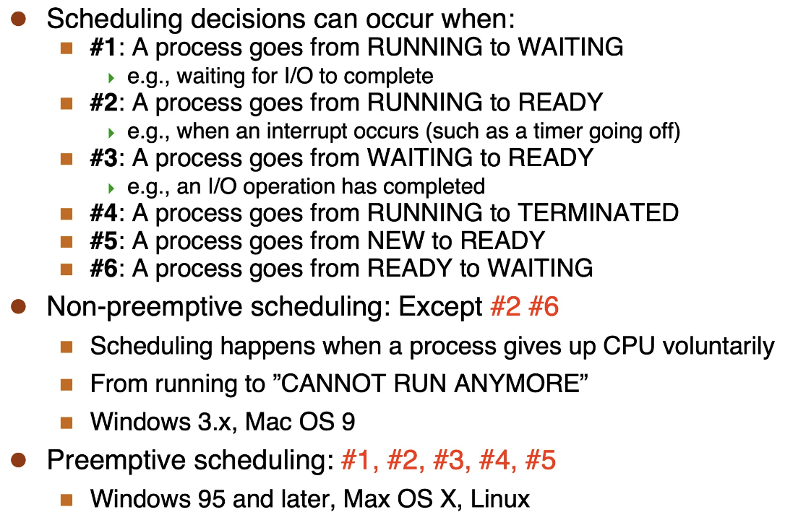
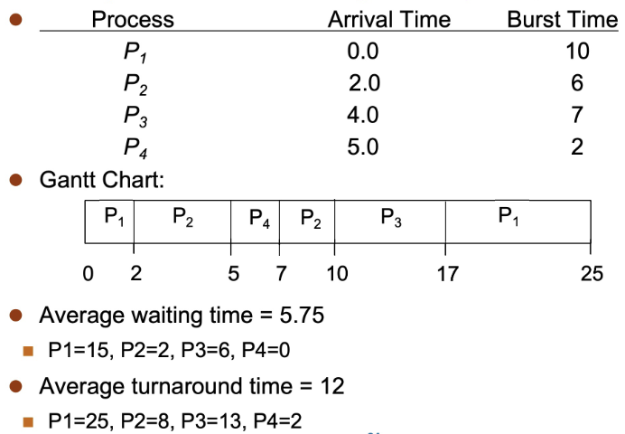
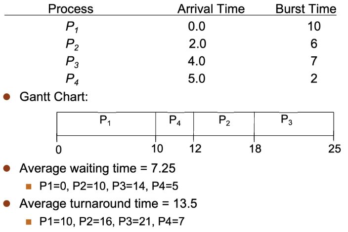
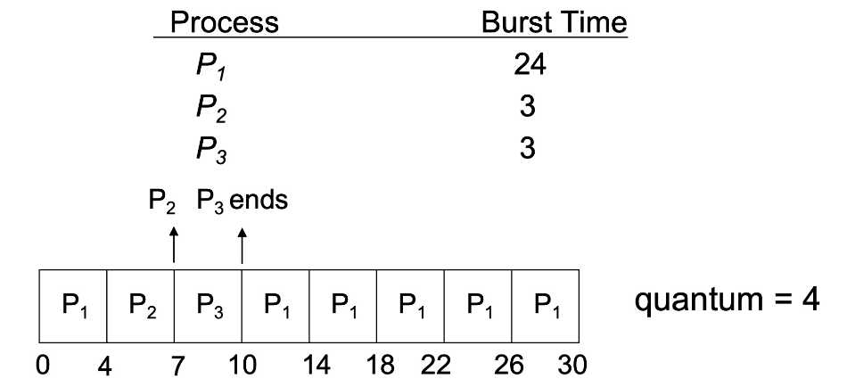
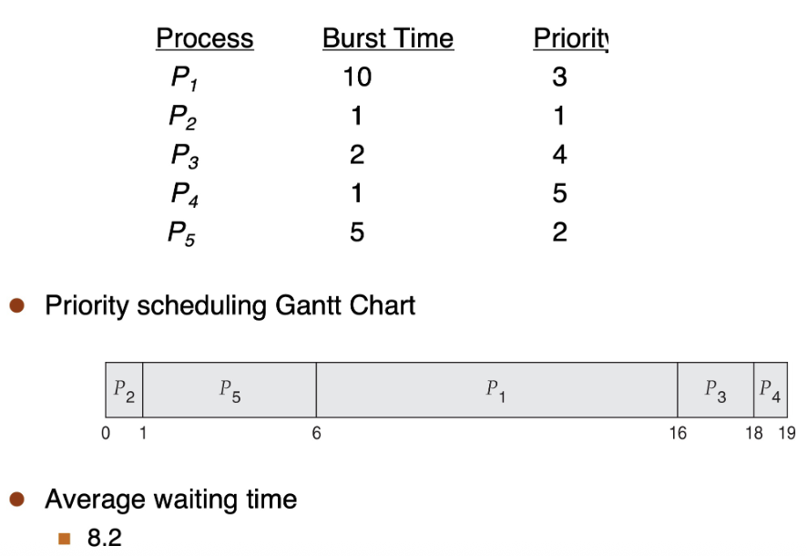
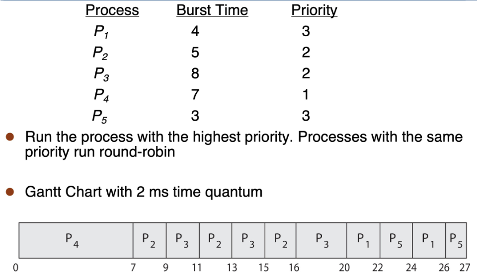
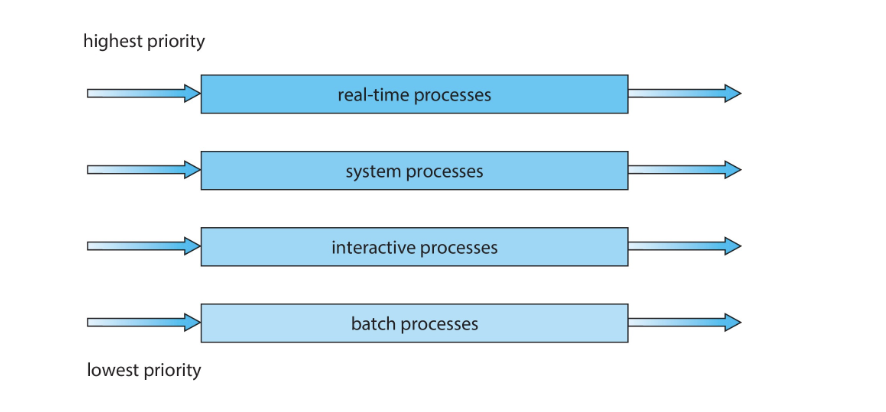
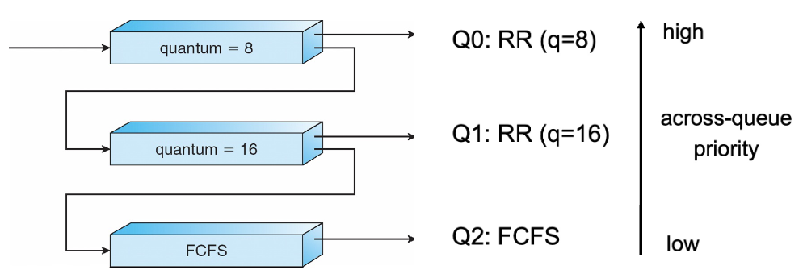
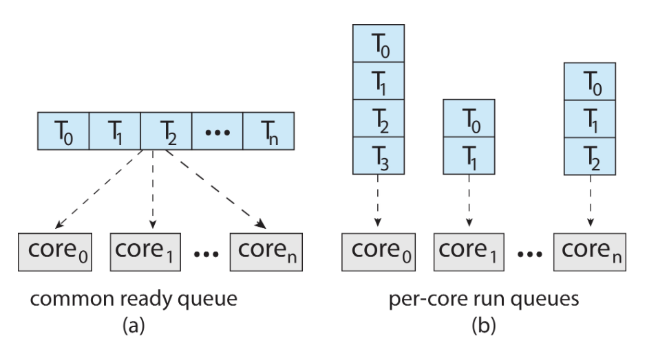
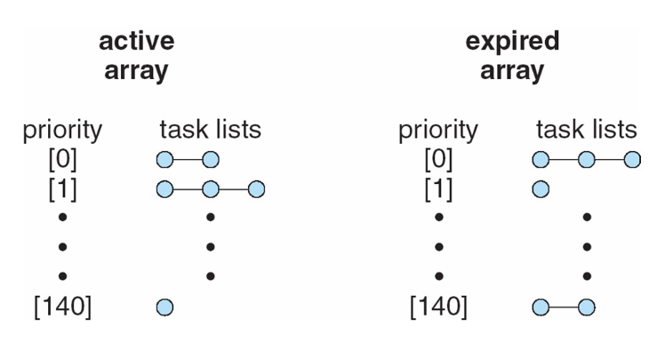

# CPU 调度
1. **定义**：由操作系统做出的决策，用于确定哪些就绪的进程/线程应当运行以及运行多长时间

!!! abstract "note"
    1. 在多道程序设计环境中是必要的
    2. CPU调度对于**系统性能和效率**至关重要：最大化CPU利用率，使其永不空闲


- **策略**：调度算法
- **机制**：调度器
    - 操作系统的一个组件，用于**在进程之间切换**
    - 该机制又依赖于**上下文切换机制**
    - 必须极其迅速（调度器延迟）


2. **CPU-I/O 突发周期**

- 大多数进程交替进行**CPU计算和I/O操作**，这种交替活动形成一系列突发
- 进程总是**以CPU突发开始和结束**
- **两类典型进程**
    - **I/O-bound 进程**：主要时间花费在等待I/O操作上，包含许多短暂的CPU突发 **e.g.**文件复制命令 `/bin/cp`
    - **CPU-bound 进程**：主要时间用于执行CPU计算，I/O突发非常短暂（甚至几乎没有） **e.g.**图像增强处理
- **进程类型的多样性**使得CPU调度变得困难
  
---
## CPU 调度器

1. **基本功能**：每当CPU空闲时，必须选择一个**就绪进程**来执行

!!! note "note"
    操作系统负责跟踪并维护所有进程的状态。

2. **调度方式**

- **非抢占式调度**：一个进程会一直占用CPU，直到它**主动放弃**，也称为**“协作式”调度**
    
    !!! abstract "复杂性"
        会引发许多棘手的进程同步问题

        1. 共享数据的访问
        2. 内核模式下的抢占
        3. 操作系统关键活动中发生中断

- **抢占式调度**：即使一个进程可以继续执行，也可能**被强行剥夺**CPU使用权

    !!! abstract "优势"
        1. **无需依赖**进程主动释放CPU
        2. 操作系统始终保持**控制权**

??? example "Example"
    

3. **调度目标**：存在许多**相互冲突**的目标

- **最大化CPU利用率**：提高CPU非空闲时间的比例
- **最大化吞吐量**：提高单位时间内完成的有效工作量
- **最小化周转时间**：缩短从进程创建到进程完成的总时间
- **最小化等待时间**：减少进程在就绪状态下的等待时间
- **最小化响应时间**：缩短从进程创建到接收到首次响应的时间

!!! abstract "调度指标"
    1. **CPU 利用率**：尽可能保持 CPU 处于忙碌状态
    2. **吞吐量**：单位时间内完成执行的进程数量
    3. **周转时间**：执行一个特定进程所需的总时间 `turnaround time = finish time - arrival time`
    4. **等待时间**：进程在就绪队列中等待的总时间 `waiting time = start time - arrival time`
    5. **响应时间**：从请求提交到产生第一个响应所需的时间（适用于分时系统环境）

4. **调度器** dispatcher：调度器模块将**CPU控制权**交给被调度程序选中的进程，包括：

- 切换到内核模式
- 切换上下文
- 切换到用户模式
- 跳转到用户程序中的适当位置以重启该程序

!!! note "note"
    实际上就是`cpu_switch_to`，但是比之前讲的多了调度算法（选择下一个执行的进程）

5. **调度延迟**：调度器停止一个进程并启动另一个进程运行所需的时间

---
## 调度算法

### FCFS 调度

1. FCFS（First-Come First-Served）：先来先服务调度算法
2. 是一种**非抢占式调度**

### SJF 调度

1. SJF（Shortest Job First）：最短作业优先调度算法
2. **基本思路**：选择下一个CPU burst最短的进程

- **抢占式**：选择**已经到达**的进程中**剩余**CPU burst最短的进程
    

    !!! example "Example"
        {style="width:60%;display: block;margin: 20px auto"}

        **`waiting time = finish time - arrival time - CPU burst time`**

- **非抢占式**（shortest-remaining-time-first，SRTP）：选择**已经到达**的进程中CPU burst最短的进程

    !!! example "Example"
        {style="width:60%;display: block;margin: 20px auto"}

3. **优劣势**

- **优点**：被证明是**最优**调度算法，进程的平均等待时间最短（SRTP）
- **缺点**：调度次数较多；**无法预测CPU burst长度**，可能导致饥饿（长进程一直得不到调度）

4. **改进**：预测CPU burst时长

- **思路**：基于过去的CPU bursts来预测未来的CPU bursts
- **公式**：
    - 对历史观测到的执行时长进行指数加权平均    
    - 为近期历史赋予比远期历史更高的权重  

    \[
    \tau _{n+1} = \alpha t_n + (1 - \alpha) \tau _n
    \]

    其中 

    - $\tau _{n+1}$ 为对第 $n+1$ 次burst的**预测**
    - $t_n$ 为第 $n$ 次burst的**观测值**
    - $\alpha$ 为介于0和1之间的参数  
        - $\alpha = 0$：不关心最近的历史  
        - $\alpha = 1$：只关心最近的历史  
        - $\alpha = 0.5$：某种折中方案 
    - $\tau _n$ 为对第 $n$ 次burst的**预测** 


### RR 调度
1. RR（Round-Robin）：时间片轮转调度算法

- 是一种**抢占式**的调度算法，专为**分时系统**（time-sharing）设计
- **时间片**（time quantum）：一个固定的时间间隔

2. **基本思路**：

- 除非一个进程是唯一的ready进程，否则它每次运行时间不会超过一个时间片，之后就会**将控制权让给另一个ready进程**
- 如果其CPU执行时长小于时间片，则**可能运行少于一个时间片的时间**
- ready队列是一个先进先出队列，每当一个进程状态变为ready时，它会**被放置在队列的末尾**

!!! example "Example"
    {style="width:60%;display: block;margin: 20px auto"}

3. **优劣势**：通常情况下，平均等待时间比SJF差，但**响应时间更好**

- **短时间片**
    - **优点**：响应时间更短，交互性好
    - **缺点**：上下文切换开销较大（如果切换开销占比太高，系统效率就会很低）
- **长时间片**
    - **优点**：上下文切换开销较小
    - **缺点**：响应时间更长，交互性差（如果时间片非常长，RR就会退化成FCFS）


### Priority 调度
1. Priority Scheduling：优先级调度算法
2. **基本思路**：

- 为每个进程分配一个**优先级**

    !!! abstract "优先级的产生"
        - **内部产生** **e.g.** 在SJF中，优先级是预测的执行时间、打开文件的数量等
        - **外部指定** **e.g.** 由用户设置以指定作业的相对重要性

- 根据进程的优先级来确定调度顺序（可以是抢占式的或非抢占式的）

!!! info "Note"
    SJF 是一种优先级调度算法，其优先级来自预测的下一次CPU执行时间：执行时间越短，优先级越高

!!! example "Example"
    {style="width:60%;display: block;margin: 20px auto"}
    
!!! abstract "Priority scheduling with Round-robin"
    **基本思路**：运行优先级最高的进程；相同优先级的进程采用**RR调度**

    !!! example "Example"
        {style="width:60%;display: block;margin: 20px auto"}

3. **问题**

- 低优先级进程可能被更高优先级的进程抢占，永远不会执行（这种现象称为**饥饿**）
- **解决方法**：Priority aging
    - 随着**进程等待时间**的增加，逐渐提高其优先级

### Multi-level Queue 调度
1. Multi-level Queue：多级队列调度算法
2. **基本思路**：将进程分组，为每类进程使用一个ready队列
3. **调度类型**

- **队列内的调度**
    - 每个队列可拥有自己的调度策略
    - **e.g.** 高优先级队列可采用轮转调度，低优先级队列可采用先来先服务调度
- **队列间的调度**
    - 通常采用**抢占式优先级调度**：只有当所有更高优先级队列为空时，低优先级队列中的进程才能运行
    - 或采用**队列间时间片分配** **e.g.** 80%的时间分配给队列1，20%的时间分配给队列2

{style="width:60%;display: block;margin: 20px auto"}

### Multi-level Feedback Queue 调度
1. Multi-level Feedback Queue：多级反馈队列调度算法
2. **基本思路**：进程可以在队列之间移动（移动特征已发生变化的进程，是实现Priority aging的好方法）
3. **步骤**

{style="width:80%;display: block;margin: 20px auto"}

- 新进程到达，被放入Q0，并在某个时刻获得长度为8的时间片
- 如果它**没有用完**整个时间片，则很可能是一个**I/O-bound 进程**，应保留在高优先级队列中，以确保在它偶尔需要CPU时能够获得CPU
- 如果它**用完了**整个时间片，则被降级到Q1，并在某个时刻获得一个为16的时间片
- 如果它**又用完了**整个时间片，则很可能是一个**CPU-bound 进程**，它会被降级到Q2
- 此时，该进程只有在没有非CPU-bound 进程需要CPU时才会运行

4. **原理**（Rationale）：非CPU-bound 进程在偶尔需要CPU时应当能快速获得 CPU，因为它们可能是**交互式进程**

!!! success "优点"
    多级反馈队列方案非常通用，因为它**高度可配置**；但是，需要相当多的计算开销

!!! info "调度算法的测试"
    1. 使用理论/分析结果（很少）
    2. 模拟：通过生成甘特图（而非手动）来测试一百万种情况
    3. 实际实现：针对某个基准工作负载，分别运行

---
## 多处理器调度

### SMP
1. Symmetric Multi-Processing：对称多处理器
2. **基本思路**：每个处理器能够自行调度
3. **方案**

- 所有线程可以位于一个公共ready队列中
- 每个处理器也可以拥有自己私有的线程队列

{style="width:60%;display: block;margin: 20px auto"}

4. **负载均衡**（Load Balancing）

- **目的**：保持工作负载均匀分布
- **方法**：
    - **推送迁移**：定期任务检查每个处理器的负载，如果发现过载，则将任务从过载的CPU推送到其他CPU
    - **拉取迁移**：空闲处理器从繁忙处理器拉取等待任务

5. **处理器亲和性**（Processor Affinity）

- **定义**：当一个线程在一个处理器上运行时，该处理器的缓存中会存储该线程的内存访问内容
- **负载均衡**可能会影响处理器亲和性，因为为了平衡负载，线程可能会从一个处理器迁移到另一个处理器，但这会导致该线程失去原处理器缓存中的内容
- **分类**：
    - **软亲和性**：操作系统会尽量让线程在同一个处理器上运行，但不做保证
    - **硬亲和性**：允许进程指定一组它可以运行的处理器

### Multi-core CPUs
1. Multi-core CPUs：多核处理器
2. **基本思路**：在同一物理芯片上放置**多个处理器核心**
3. **优点**：速度更快，功耗更低

### Multi-threaded Multi-core
1. **定义**：每个核心也可以有多个线程（利用内存延迟期，在等待内存读取的同时，在另一个线程上继续执行）
2. **芯片多线程**（chip-multithreading，CMT）：为每个核心分配多个硬件线程

- intel将此称为**超线程**
- 在一个四核系统上，如果每个核心有2个硬件线程，则操作系统会看到8个**逻辑处理器**

!!! note "两级调度"
    1. 操作系统决定在**逻辑CPU**上运行哪个**软件线程**
    2. 每个核心如何决定在**物理核心**上运行哪个**硬件线程**

---
## 示例
### windows XP
1. **调度机制**：基于优先级、时间片、多队列的抢占式调度

- 32级优先级：数值越高，优先级越高
    - 可变类别：优先级 1～15
    - 实时类别：优先级 16～31

2. **调度策略**：

- 当线程的时间片用完时，除非该线程属于实时类别（优先级 > 15），否则其优先级会被降低（可能是一个CPU密集型线程，我们需要保持系统的交互性）
- 当线程“唤醒”时，其优先级会得到提升（很可能是一个I/O密集型线程）
- **提升的幅度取决于线程在等待什么**，保持交互性是一个关键考虑因素

3. **idle 线程**：优先级为0或没有优先级

- 如果没有其他线程可以运行，它就会运行（但什么都不做）
- **优点**：简化了操作系统设计，**避免了没有进程在运行的情况**

### Linux

1. `nice`：一个可以调整进程优先级的用户空间参数

- 数值越小，优先级越高
- `nice -10 ./a.out`：设置程序优先级
- `ps -e -o uid,pid,ppid,pri,ni,cmd`：查看优先级信息

2. **优先级**：数值越低，优先级越高（0～140）
### Linux 0.11

1. **调度策略**：RR + Priority
2. **数据结构**：数组

```c
// schedule() 函数核心逻辑
while (1) {
    c = -1;                 // 用于记录找到的最大counter值，初始化为-1
    next = 0;               // 记录被选中进程的索引
    i = NR_TASKS;           // 系统支持的最大进程数（通常为32）
    p = &task[NR_TASKS];    // 指向进程数组末尾
    
    // 1：选择 counter 值最大的就绪进程（剩余时间片最多的）
    while (--i) {
        if (!*--p)  continue;       // 跳过空进程
        if ((*p)->state == TASK_RUNNING && (*p)->counter > c)       // 进程就绪且 counter 值最大
            c = (*p)->counter, next = i;
    }
    if (c) break;    // 如果找到了 counter > 0 的进程，跳出循环
    
    // 2：重新计算所有进程的 counter 值
    for (p = &LAST_TASK; p > &FIRST_TASK; --p)
        if (*p)
            (*p)->counter = ((*p)->counter >> 1) + (*p)->priority;      // counter/2+priority
}

// 3：切换到选中的进程
switch_to(next);
```

3. **Linux 1.2**

- **调度策略**：RR + Priority
- **数据结构**：循环队列

### Linux 2.4

1. **调度策略**：调度以周期（Epoch）为单位进行

- **周期内**：每个任务获得一个时间片
- **周期结束条件**：所有就绪任务的时间片都用完

2. **时间片计算规则**

- 如果任务**用完**整个时间片，下个周期获得**相同时间片**
- 如果任务**未用完**时间片（如I/O阻塞），下个周期获得**更大时间片**
    - 计算出的优先级更高，但是实际上不占用CPU
    - **效果**：交互式/I/O任务醒来时能快速获得CPU响应

3. `goodness`：`nice`值越大，`weight`越小，调度优先级越低

```c
weight = p->counter;
weight += 20 - p->nice;
```

4. `schedule`：`Nice`值越大，`counter`越小，时间片越短

```c
#define NICE_TO_TICKS(nice) (TICK_SCALE(20-(nice))+1)
p->counter = (p->counter >> 1) + NICE_TO_TICKS(p->nice);
```

5. **时间复杂度**：$O(n)$ （遍历整个就绪任务列表）

### Linux 2.6

1. **改进**：$O(1)$ 调度器
2. 在一个调度周期内，任务可以是活动状态或已过期状态
    
- **活动任务**：其时间片尚未完全消耗完
- **已过期任务**：已用完其全部时间片

3. 内核维护两个**轮转队列数组**（活动任务/过期任务）：每个优先级级别一个轮转队列
    
{style="width:50%;display: block;margin: 20px auto"}

4. **优先级数组数据结构**
  
```c
struct prio_array {
    int nr_active;                      // 任务总数
    unsigned long bitmap[5];            // 优先级位图
    struct list_head queue[MAX_PRIO];   // 队列数组
}
```

5. **位图**（Bitmap）

- **作用**：用于快速判断某个优先级是否有Ready任务 
- 无需遍历所有优先级级别，因此时间复杂度为 $O(1)$

6. **重新计算时间片**

- 当一个任务的时间片用完时，它会从活动队列移到过期队列
- 此时，任务的时间片会被重新计算：不需要一次性重新计算所有时间片，保持 $O(1)$ 时间复杂度的特性
- 当活动队列为空时，它会与过期队列**交换**：指针交换 $O(1)$

7. **Linux $\geq$ 2.6.23**

- **$O(1)$ 调度器的问题**：内核代码变得混乱且难以维护
- **CFS**：完全公平调度器
    - **主要思想**：跟踪CPU分配给任务的公平程度，并纠正不公平现象
    - **虚拟时间**：自任务启动以来，任务获得CPU的时间间隔总和（可能远小于任务启动以来的实际时间）
    - **调度器的目标**：将CPU分配给虚拟时间最小的任务
    - **任务存储的数据结构**：红黑树
    - **时间复杂度** $O(\log n)$
        - 检索“最不快乐”的任务 $O(\log n)$
        - 任务运行一段时间后，更新其虚拟时间 $O(1)$
        - 将其重新插入红黑树 $O(\log n)$

    !!! tip "Notice"
        执行少量CPU突发的I/O任务永远不会拥有较大的虚拟时间，因此将保持高优先级