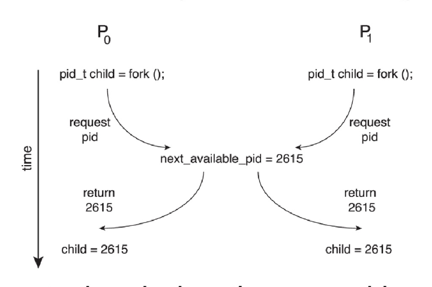
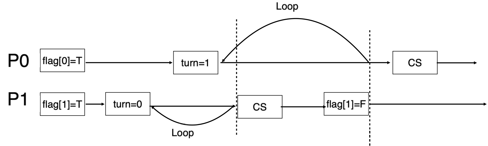
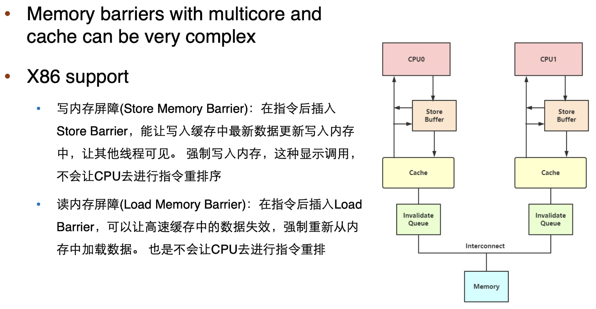
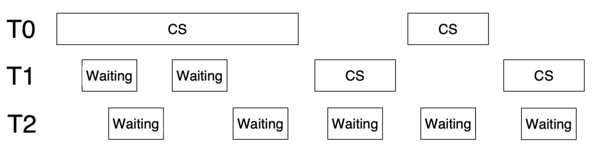
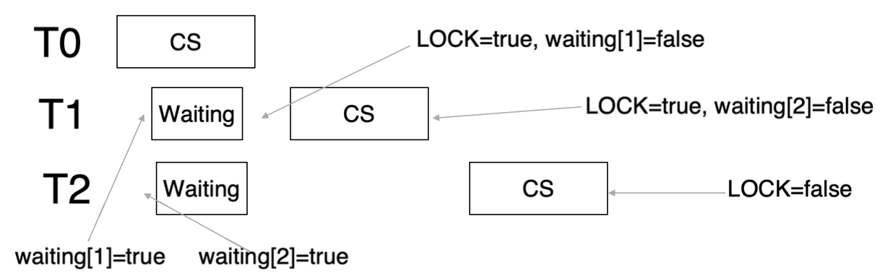
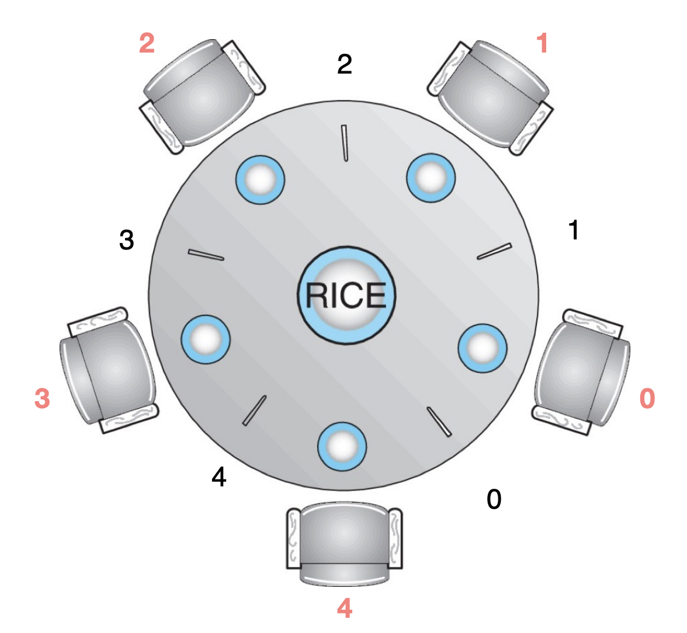

# 同步

??? warning "Warning"
    ```c
    #include <stdio.h>
    #include <stdlib.h>
    #include <pthread.h>

    int counter = 0;
    static int loops = 1000000; // le6 应该是 10^6 即 1000000
    /* pthread_mutex_t pmutex = PTHREAD_MUTEX_INITIALIZER; */

    void *worker(void *arg) {
        int i;
        printf("%s: begin\n", (char*)arg);
        for(i = 0; i < loops; i++) {
            /* pthread_mutex_lock(&pmutex); */
            counter++;    // 问题所在
            /* pthread_mutex_unlock(&pmutex); */
        }
        printf("%s: done\n", (char *)arg);
        return NULL;
    }

    int main() {
        pthread_t p1, p2; // 修正变量名：pl -> p1

        printf("main: begin (counter = %d)\n", counter);
        pthread_create(&p1, NULL, worker, "A");
        pthread_create(&p2, NULL, worker, "B");
        pthread_join(p1, NULL); // 修正变量名：pl -> p1
        pthread_join(p2, NULL);
        printf("main: done with both (counter : %d)\n", counter);
        return 0;
    }
    ```

    **Output：**

    ```bash
    wenbo@parallels:-/os-courses $ gcc sync_thread.c -lpthread
    wenbo@parallels:-/os-courses $ ./a.out
    main: begin (counter = 0)
    A: begin
    B: begin
    A: done
    B: done
    main: done with both (counter : 1057072)
    wenbo@parallels:-/os-courses $ ./a.out
    main: begin (counter = 0)
    A: begin
    B: begin
    A: done
    main: done with both (counter : 1031264)
    ```

    !!! warning "Warning"
        实际上预期的结果是`2000000`

        **解决方案**：加锁（将源代码上下两行的注释去掉即可）

---
## Race Condition

1. **定义**：多个进程（或线程）**并发**访问和操作**同一数据**，且执行结果取决于**访问发生的具体顺序**

!!! example "Example"
    进程 `P0` 和 `P1` 正在**同时**使用 `fork()` 系统调用创建子进程</br>
    在内核变量 `next_available_pid`（表示下一个可用的进程标识符 `pid`）上存在Race Condition

    {style="width:60%;display: block;margin: 20px auto"}

    **Problem**: 除非实现互斥访问，否则**相同**的 `pid` 可能会被分配给**两个不同的进程**！

2. **关键区间/临界区**（critical section）

!!! abstract "通用结构"
    ```c
    while (true) {
        // entry section
        // 请求进入critical section
        
        // critical section
        // 访问共享资源的代码
        
        // exit section
        // 离开critical section
        
        // remainder section
        // 其他不涉及共享资源的代码
    }
    ```

- **一次只能有一个进程位于critical section内**：当一个进程在**critical section**内时，其他进程不允许进入其critical section
- 每个进程必须在**entry section**请求进入critical section的许可
- 许可应在**exit section**中释放
- **remainder section**

3. **OS中critical section的处理**

- **单核系统**：禁止中断
- **多核系统**：
    - 禁止中断不可行
    - **可抢占式**
    - **非抢占式**：在内核模式下基本不存在Race Condition

4. **解决方案的必要条件**

- **Mutual Exclusion（互斥访问）**：在同一时刻，最多**只有一个**线程可以执行临界区
- **Progress（空闲让进）**：当没有线程在执行临界区代码时，必须在申请进入临界区的线程中选择一个线程，允许其执行临界区代码，保证程序执行的进展
- **Bounded waiting（有限等待）**：当一个进程申请进入临界区后，必须在**有限的时间**内获得许可并进入临界区，不能无限等待

----
## Peterson's solution

1. **用途**：解决两个进程/线程的同步问题（只适用于两个进程的情况）
2. **条件**

- 假设 `LOAD` 和 `STORE` 操作是原子的（atomic）
    - **原子性（atomic）**：执行过程不能被中断
    - 通常，硬件不能自动保证原子性，需要使用特殊的指令
- 两个进程**共享两个变量**
    - `boolean flag[2]`：表示某个进程是否准备进入临界区
    - `int turn`：表示轮到哪个进程进入临界区

3. **Example**

```c
// 初始化，都不进入临界区
flag[0] = FALSE;
flag[1] = FALSE;
/* P0 */
do {
    flag[0] = TRUE;     // P0想进入临界区
    turn = 1;           // 主动让P1进入临界区
    /* 
     * 如果：
     * 1) P1 也想进入临界区（flag[1] == TRUE）
     * 2) 当前轮到 P1（turn == 1）
     * 那么 P0 就一直等待
     */
    while (flag[1] && turn == 1)
        ;
    /* critical section */
    flag[0] = FALSE;    // 离开临界区
    /* remainder section */
} while (TRUE);

/* P1 */
do {
    flag[1] = TRUE;     // P1想进入临界区
    turn = 0;           // 主动让P0进入临界区
    while (flag[0] && turn == 0)
        ;
    /* critical section */
    flag[1] = FALSE;
    /* remainder section */
} while (TRUE);
```

- **Mutual Exclusion（互斥访问）**：满足
  
    ??? info "证明"
        **假设**：P0 进入了临界区（说明 `flag[1] == false` 或者 `turn == 0`）

        !!! example "情况"
            1. 情况 1：`flag[1] == false`：P1 不在临界
            2. 情况 2：`flag[1] == true && turn == 1`：P0 正在循环等待，这与 P0 已在临界区矛盾
            3. 情况 3：`flag[1] == true，turn == 0`：P1 正在循环等待

        无论 `flag[1]` 和 `turn` 取什么值，**只要 P0 在临界区，P1 一定无法进入临界区**，因此 Peterson 算法保证互斥性

- **Progress（空闲让进）**：满足

    ??? info "证明"
        {style="width:60%;display: block;margin: 20px auto"}

- **Bounded waiting（有限等待）**：满足（P0 将在 P1 进入临界区后，**最多等待一次**后进入）

!!! warning "Warning"
    Peterson 算法并不保证在现代架构上有效，缺点如下
	
    - 只适用于**两个进程**的情况
    - 假设 LOAD 和 STORE 操作是**原子性的**
    - 对**指令重排**的情况不正确
        - 为了提高性能，处理器和/或编译器可能会**重新排序**没有依赖关系的操作
        - 对于单线程，这样做是可以的，因为结果总是相同的
        - 对于多线程，重排可能会导致不一致或意外的结果
  
    ??? example "指令重排"
        ```c
        // 两个线程共享
        boolean flag = false;
        int x = 0;

        // 线程 1 执行
        while (!flag) ;
        print x;
        
        // 线程 2 执行
        x = 100;
        flag = true;
        ```
        
        **预期输出**：100

        **问题**：但是线程 2 的操作可能会**被重新排序：**

        ```c
	    flag = true;
	    x = 100;
        ```
	    
        如果发生这种情况，输出可能是 0

---
## 硬件支持同步

1. 许多系统提供硬件支持**临界区代码的同步**

2. **问题所在**

- 单处理器（Uniprocessors）：禁用中断，当前执行的代码不会被强占
- 但是在多处理器系统上通常**效率太低**
	- 需要禁用所有中断
	- 其他核心仍然可以访问临界区
	- 使用这种方式的操作系统不可扩展

3. **解决方案**

- **内存屏障**（Memory barriers）
- **硬件指令**（Hardware instructions）
	- test-and-set：测试内存字并设置值
	- compare-and-swap：比较并交换两个内存字的内容
- **原子变量**（Atomic variables）

### Memory barriers
1. **内存模型**是计算机架构向应用程序提供的内存保证

2. **内存模型种类**

- **强排序**（Strongly ordered）：一个处理器的内存修改会**立即**对所有其他处理器可见
- **弱排序**（Weakly ordered）：一个处理器的内存修改可能**不会**立即对所有其他处理器可见

3. **内存屏障（Memory barrier）**是一个指令，它**强制**任何内存中的更改传播（使其对所有其他处理器可见）

!!! example "Example"
    通过添加内存屏障来确保线程 1 输出 100

    ```c
    // 线程 1 执行
    while (!flag) ;
    memory_barrier();
    // 通过在读取 x 之前加入内存屏障，确保在读取 x 的值之前，flag 的修改已经完成
    print x;
    
    // 线程 2 执行
    x = 100;
    memory_barrier();
    // 在设置 flag 为 true 之前，内存屏障确保 x 的新值已经对其他处理器可见
    flag = true;
    ```

??? tip "x86"
    

### Hardware instructions
**定义**：一些特殊的硬件指令，允许我们**原子地**（不可中断地）对一个字中的内容进行测试并修改，或者**原子地**交换两个字的内容

#### Test-and-set
1. **定义**如下，以**原子**方式执行，设置并返回旧值

```c
bool test_set (bool *target){
    bool rv = *target;
    *target = TRUE;
    return rv;
}
```

2. 使用 `Test-and-Set` **实现锁**

```c
bool lock = FALSE
do {
    while (test_set(&lock));   // 忙等待
    critical section
    lock = FALSE;
    remainder section
} while (TRUE);
```

- `FALSE`：锁空闲
- `TRUE`：锁已被占用
- 第一个成功执行 `test_set` 的进程：看到旧值 `FALSE`，把锁设为 `TRUE`，循环结束，进入临界区
- 其他进程：看到旧值 `TRUE`，继续循环等待

??? info "三大性质"
	1. mutual exclusion：满足，`test_set` 是原子操作，同一时刻只能有一个进程把 `lock` 从 `FALSE` 改成 `TRUE`
	2. progress：满足，只要临界区空闲（`lock = FALSE`），想进入的进程一定能通过 `test_set` 竞争到锁
	3. bounded-waiting：**不满足**！！！！！
 
    !!! example "Example"
        假设有三个线程
        
        {style="width:60%;display: block;margin: 20px auto"}

    !!! success "改进"
        ```c
        do {
            waiting[i] = true;    // 表示进程 i 想进入临界区，加入等待队列
            while (waiting[i] && test_and_set(&lock)) ;    // 若还在等待且锁已被占用true，则自旋
            waiting[i] = false; // 成功获得锁，退出等待状态

            /* critical section */

            // 从下一个进程开始，寻找仍在等待的进程
            j = (i + 1) % n;
            while ((j != i) && !waiting[j])
                j = (j + 1) % n;

            if (j == i)
                lock = false;  // 没有其他进程在等待，释放锁
            else
                waiting[j] = false; // 将锁“直接交给”下一个等待的进程（不释放 lock）

            /* remainder section */
        } while (true);
        ```

        {style="width:60%;display: block;margin: 20px auto"}

#### Compare-and-swap
1. **定义**

```c
int compare_and_swap(int *value, int expected, int new_value){
    int temp = *value;
    if (*value == expected)
        *value = new_value;
    return temp;
}
```

- 以**原子方式**执行
- 返回传入参数 `*value` 的原始值
- 仅当 `*value == expected` 为真时，才会发生交换

2. **实现锁**：共享整型锁 `lock`，初始值为 0

```c
while (true)
{
    while (compare_and_swap(&lock, 0, 1) != 0)    // lock == 0 时跳出循环，得到锁
        ; /* do nothing */

    /* critical section */

    lock = 0;
    /* remainder section */
}
```

### Atomic variables
**定义**

- 通常，硬件指令会被用作构建其他**同步工具**的基础模块
- 其中一种工具是**原子变量**，它能够对基本数据类型（如整数和布尔值）提供原子性的更新

!!! example "Example"
    对原子变量 `sequence` 执行 `increment()` 操作，可以保证 `sequence` 的递增过程不会被中断

    ```c
    void increment(atomic_int *v) {
        int temp;

        do {
            temp = *v;
        } while (temp != (compare_and_swap(v, temp, temp+1)));
        // 如果 v 的值为 temp，则将其更新为 temp + 1
        // 如果值没有被更新（即存在竞争条件），则继续循环直到成功
    }
    ```

---
## Mutex Locks

1. **互斥锁**：通过先获取锁 `acquire()`，再释放锁 `release()` 来保护临界区

- **布尔变量**指示锁是否可用
- `acquire()` 和 `release()` 调用必须是**原子性的**：通常通过硬件原子指令实现 **e.g.** `compare-and-swap`

```c
bool locked = false;

acquire() {
    while (compare_and_swap(&locked, false, true))
        ; // 忙等待
}

release() {
    locked = false;
}

while (true) {
    acquire lock       // 获取锁
    critical section   // 临界区
    release lock       // 释放锁
    remainder section  // 其余部分
}
```

2. **相关定义**

- **忙等待**是指在等待锁的过程中，线程/进程**不停地进行检查**锁是否可用
- **忙等待时间**：从`acquire`到释放锁`release`之间的时间
- **自旋锁（spinlock）**：通过**忙等待**来获取锁，直到锁可用，是一个特定的互斥锁实现方式

!!! warning "Warning"
    **过多的自旋**：单个处理器上的两个线程
	
    - T0 获取锁，进入临界区
    - T1 在 T0 释放锁之前，使用其**所有 CPU 时间进行忙等待**，导致消耗了所有的 CPU 时间，但是并没有实际的计算进展
	- 由于 T1 不断自旋而无法释放 CPU 时间，导致 T0 虽然持有锁，但是无法继续执行其任务，两者的竞争导致了** CPU 资源的浪费**

    !!! success "改进"
        **减少忙等待**：让线程挂起（yield），从运行状态转到睡眠状态

        ```c
        void init() {
            flag = 0;
        }

        void lock() {
            while (test_set(&flag, 1) == 1)
                yield();  // 让出 CPU
        }

        void unlock() {
            flag = 0;
        }
        ```
        
        **实现**：semaphore
        
        - 添加一个队列
        - 当锁被占用时，改变进程状态为 `SLEEP`，然后将其添加到队列中，并调用 `schedule()`

---
## semaphore
1. **信号量**：一种同步工具，它提供了比互斥锁更复杂的方式来同步进程的活动

- 包含一个整数变量 `S`
- 只能通过两个不可分割（原子）操作 `wait()` 和 `signal()` 来访问

```c
wait(S) {
    while (S <= 0) ;  // 忙等待
    S--;
}
signal(S) {
    S++;
}
```

2. **类型**

- **Counting semaphore**：信号量的整数值可以在一个**无限制的范围内**变化
- **Binary semaphore**：信号量的整数值只能在** 0 和 1 之间**变化（和互斥锁相同）

!!! example "Example"
    ```c
    sem = 0;    // binary semaphore

    P1:
        S1;                  // P1 执行操作 S1
        signal(sem);         // P1 完成操作后，发出信号，sem = 1 

    P2:
        wait(sem);           // P2 等待 sem 的值变为正（即 P1 已完成，sem = 1）
        S2;                  // P2 执行操作 S2
    ```

### 带等待队列的信号量

1. **数据结构**

```c
typedef struct {
    int value;                        // 信号量的值
    struct list_head *waiting_queue;  // 等待队列
} semaphore;
```

2.  **两个操作**
	
- `block`：将调用该操作的进程**放入适当的等待队列**中
- `wakeup`：从等待队列中**移除**一个进程，并将其放入就绪队列中

3. **实现**

```c
wait(semaphore *S) {
    S->value--;  // 信号量减1
    if (S->value < 0) {
        // 如果信号量小于0，表示没有可用资源，需要等待
        // 将该进程加入到等待队列
        add this process to S->list;
        block();  // 阻塞当前进程，直到它从等待队列中被唤醒
    }
}

signal(semaphore *S) {
    S->value++;  // 信号量加1
    if (S->value <= 0) {
        // 如果信号量小于等于0，，表示仍有进程在等待资源
        // 从等待队列移除一个进程
        remove a proc.P from S->list;
        wakeup(P);  // 唤醒该进程，让它继续执行
    }
}

Semaphore sem;  // 初始化为 1，表示一个资源可用
do {
    wait(sem);
    critical section   // 临界区
    signal(sem);
    remainder section  // 其余部分
} while (TRUE);  // while 循环，但不进行忙等待
```

??? abstract "互斥锁 vs 信号量"
    1. **互斥锁或自旋锁**（Mutex or Spinlock）
	
    - **优点**：没有阻塞，不需要操作系统切换上下文
	- **缺点**：在循环等待时浪费 CPU 时间
	- **适合**于：短的临界区

    2. **信号量**（Semaphore）
	
    - **优点**：没有循环等待，可以节省大量的 CPU 时间
	- **缺点**：上下文切换耗时（将一个进程从运行状态切换到休眠状态，然后再切换回来）
	- **适合**于：长的临界区

!!! tip "原子性"
    真实实现中，`wait` 或 `signal` 操作应该是**原子性的**，需要用 **spinlock** 来实现

    - **临界区没有忙等待**，可以节省大量的 CPU 时间
	- 仍然存在在 **`wait` 和 `signal` 操作中的忙等待**，但等待时间明显更短（代码更短）

    ```c
    Semaphore sem;  // 初始化为 1
    do {
        wait(sem);          // busy waiting
        critical section    // no busy waiting
        signal(sem);        // busy waiting
        remainder section  
    } while (TRUE);  // while 循环，但不进行忙等待
    ```

??? example "真正实现"
    ```c
    typedef struct __lock_t {
        int flag;   // value：用于标记锁的状态，0 表示没有被占用，1 表示已被占用
        int guard;  // spinlock的保护变量
        queue_t *q; // 等待队列，存放等待锁的进程
    } lock_t;

    // 初始化
    void lock_init(lock_t *m) {
        m->flag = 0;        // 锁没有被占用
        m->guard = 0;       
        queue_init(m->q);
    }

    // wait
    void lock(lock_t *m) {
        /* start：保护 m->flag 的 spinlock */
        while (TestAndSet(&m->guard, 1) == 1); // 获取自旋锁，如果 m->guard = 0， m->guard 被设置为1，成功获取
        if (m->flag == 0) { // 锁没有被占用
            m->flag = 1;    // 锁被成功获取
            m->guard = 0;   // 释放自旋锁
            /* end 1 */
        } else {
            queue_add(m->q, gettid());  // 锁被占用，将当前进程加入等待队列
            m->guard = 0;               // 释放自旋锁
            // 如果不释放自旋锁就进入休眠状态，则其他进程无法获取自旋锁，从而浪费 CPU 时间 
            /* end 2 */
            park();                     // block()/schedule()
        }
    }

    // signal
    void unlock(lock_t *m) {
        /* start：保护 m->flag 的 spinlock */
        while (TestAndSet(&m->guard, 1) == 1); 
        if (queue_empty(m->q))   // 如果等待队列为空
            m->flag = 0;         // 锁被成功释放
        else
            unpark(queue_remove(m->q));  // 从等待队列移除一个进程并唤醒它
        m->guard = 0;
        /* end */
    }
    ```

### 死锁与饥饿
1. **死锁**（Deadlock）：两个或多个进程**无限期地**等待一个事件，而该事件只能由其中一个等待的进程触发

!!! example "Example"
    ```c
    // S 和 Q 是两个初始化为 1 的信号量
    P0:                         P1:
    wait(S);                    wait(Q);
    wait(Q);                    wait(S);
    ...                         ...
    signal(S);                  signal(Q);
    signal(Q);                  signal(S);
    ```

    假设 P0 在 `wait(S)` 时被阻塞
    
    P1 在 `wait(Q)` 之后执行 `wait(S)`，但是 S 被 P0 占用，P1 无法继续执行

    P0 继续执行 `wait(Q)`，但是 Q 被 P1 占用，P0 无法继续执行

    在这种情况下，P0 和 P1 都在等待对方释放资源，形成了**死锁**

2. **饥饿**（Starvation）：进程被无限期阻塞，永远不会从信号量的等待队列中被移除

### 优先级反转

1. **优先级反转**（Priority Inversion）：一个高优先级进程被低优先级任务**间接抢占**

- 低优先级任务持有锁，但由于它**的优先级较低，因此无法获得 CPU 时间**，最终无法释放锁
- 高优先级任务会一直等待锁

!!! example "Example"
    假设有三个进程 PL、PM 和 PH，优先级关系为 `PL<PM<PH`
	
    - PL 持有一个锁，PH 请求这个锁，因此 PH 被阻塞，无法继续执行
	- PM 是中优先级的进程，在 PL 持有锁时，PM 变为就绪状态，并且它的优先级高于 PL，因此会抢占 PL，使 PL 无法继续执行并且释放锁
	- PH 需要锁，但由于 PL 被 PM 中断，PH 一直无法继续执行
	- 相当于反转了 PH 和 PM 的优先级关系

2. **解决方案**：优先级继承（Priority Inheritance）

- 将等待进程（PH）的**最高优先级临时分配**给持有锁的进程（PL）
- PL 会尽快完成它的任务并释放锁，PH 就可以获得锁并继续执行
- 当 PL 释放锁后，它的优先级会**恢复**为原始的低优先级

--- 
## Linux
1. 2.6 以前的版本的 kernel 中通过禁用中断来实现一些短的 critical section；2.6 及之后的版本的 kernel 是抢占式的
2. Linux **提供的同步机制**：

- 原子整数（atomic integers）
- 自旋锁（spinlocks）
- 信号量（semaphores）：
    - 在单处理器系统上，自旋锁通过启用/禁用内核抢占来替代
    - `down()` 和 `up()`
- 读写锁（reader-writer locks）

---
## [POSIX](https://wsh-zju.github.io/notebook/Computer_Science/Computer_System/OS/?h=posix#_6)  同步机制

1. **用于user space 的同步机制**
2. 常见的 POSIX **同步机制**

- 互斥锁（mutex locks）
- 信号量（semaphores）
- 条件变量（condition variable）

3. **互斥锁**

```c
#include <pthread.h>
pthread_mutex_t mutex;

/* 创建并初始化互斥锁 */
pthread_mutex_init(&mutex, NULL);

/* 获取互斥锁 */
pthread_mutex_lock(&mutex);

/* 临界区 */

/* 释放互斥锁 */
pthread_mutex_unlock(&mutex);
```

4. **信号量**

- 未命名信号量（unnamed）：只能被当前进程使用
   
    !!! abstract "code"
        ```c
        #include <semaphore.h>
        sem_t sem;

        /* 创建并初始化信号量，将其值设为 1 */
        sem_init(&sem, 0, 1);

        /* 获取信号量 */
        sem_wait(&sem);

        /* 临界区 */

        /* 释放信号量 */
        sem_post(&sem);
        ```

- 命名信号量（named）：可以被不相关的进程使用
	- 通过 `sem_open()` 函数创建并初始化命名信号量，`"SEM"` 为信号量的名称，`O_CREAT` 表示创建新信号量
	- 另一个进程可以通过信号量的名称访问它
    
    !!! abstract "code"
        ```c
        #include <semaphore.h>
        sem_t *sem;

        /* 创建并初始化信号量，将其值设为 1 */
        sem = sem_open("SEM", O_CREAT, 0666, 1);

        /* 获取信号量 */
        sem_wait(sem);

        /* 临界区 */

        /* 释放信号量 */
        sem_post(sem);
        ```

5. **条件变量**：允许线程等待某个特定的条件发生，才能继续执行

- while 检查不是原子操作时，可以使用条件变量
- **不能支持多线程**
- 条件变量是用户模式对象，不能在进程间共享

!!! example "Example"
    ```c
    void* thread_func(void *args) {
        while (x != 10) {
            sleep(5);  // 每次检查不到条件时，线程会休眠
        }
        // 条件成立后，执行后续的代码
    }
    ```

!!! abstract "操作"
    - `wait(condition, lock)`：释放锁并让线程等待，直到条件成立；线程被唤醒后，需要重新获取锁
	- `signal(condition, lock)`：如果有线程在等待条件成立，唤醒一个线程
	- `broadcast(condition, lock)`：与 `signal()` 类似，但**唤醒所有等待线程**

!!! success "POSIX 条件变量"
    POSIX 条件变量与 POSIX 互斥锁关联，以提供互斥（保证操作的原子性）

    ```c
    // 创建和初始化条件变量
    pthread_mutex_t mutex;
    pthread_cond_t cond_var;
    pthread_mutex_init(&mutex, NULL);
    pthread_cond_init(&cond_var, NULL);
    
    // 	线程等待条件：a == b 为 true
    pthread_mutex_lock(&mutex);
    while (a != b)
        pthread_cond_wait(&cond_var, &mutex);  // 释放锁并等待条件
    pthread_mutex_unlock(&mutex);
    
    // 线程发出信号，唤醒另一个线程
    pthread_mutex_lock(&mutex);
    /* 执行可能满足条件的操作 */
    pthread_mutex_unlock(&mutex);
    pthread_cond_signal(&cond_var);  // 唤醒线程 1
    ```

!!! abstract "信号量 vs 条件变量"
    - 条件变量可以唤醒所有等待条件的线程，适用于多个线程等待相同条件的情况（只关心队列是否为空，而不关心队列的长度）
    - 信号量通常只唤醒一个线程，它适用于较少的线程间同步情况

---
## 经典同步问题

### 有界缓冲区问题
1. **有界缓冲区问题**（Bounded-Buffer Problem）：也称为生产者-消费者问题（producer-consumer problem）

- **两个进程**：生产者（producer）和消费者（consumer）共享 n 个缓冲区
    - **生产者**生成数据，并把数据放入缓冲区
	- **消费者**通过从缓冲区取出数据来消费数据
- **保证**：
	- 当缓冲区**已满**时，生产者不会尝试往缓冲区继续放数据
	- 当缓冲区**为空**时，消费者不会尝试从缓冲区取数据

2. **解决方案**

- `n` 个缓冲区，每个缓冲区只能容纳 `1` 个数据项
- 信号量 `mutex` 初始化为 `1`
- 信号量 `full-slots` 初始化为 `0`
- 信号量 `empty-slots` 初始化为 `N`

3. **生产者进程**

```c
do {
    // produce an item           // 生产一个数据项
    ...
    wait(empty-slots);          // 等待“空槽位”>0：防止缓冲区满了还写入
    wait(mutex);                // 获取互斥锁：进入临界区，独占访问缓冲区
    // add the item to the buffer// 把数据项放入缓冲区（对共享缓冲区的写操作）
    ...
    signal(mutex);              // 释放互斥锁：退出临界区
    signal(full-slots);         // 满槽位+1：通知消费者“现在有数据可取了”
} while (TRUE);
```

4. **消费者进程**

```c
do {
    wait(full-slots);           // 等待“满槽位”>0：防止从空缓冲区读取
    wait(mutex);                // 获取互斥锁：进入临界区，独占访问缓冲区
    // remove an item from buffer// 从缓冲区取出一个数据项（对共享缓冲区的读/删操作）
    ...
    signal(mutex);              // 释放互斥锁：退出临界区
    signal(empty-slots);        // 空槽位+1：通知生产者“现在有空位可写了”
    // consume the item          // 消费/处理该数据项（不需要在临界区内做）
    ...
} while (TRUE);
```

### 读者-写者 问题
1. **条件**：一个数据集被多个并发进程**共享**

- **读者**（readers）：只读取数据集，不进行任何更新操作
- **写者**（writers）：既可以**读取**数据，也可以写入数据

2. **读者-写者问题**（readers-writers problem）

- **允许多个读者**同时读取数据（共享访问）
- 任意时刻**只允许一个写者访问**共享数据（独占访问）

3. **解决方案**

- 信号量 `mutex` 初始化为 `1`
- 信号量 `write` 初始化为 `1`
- 整型变量 `readcount` 初始化为 `0`

4. **写者进程**

```c
do {
    wait(write);            // 请求写锁，确保对共享数据的独占访问
                            // 若有读者或其他写者在访问，则在此阻塞
    ...
    // write the shared data // 写共享数据（写操作必须独占）
    ...
    signal(write);          // 释放写锁，允许读者或其他写者进入
} while (TRUE);
```

5. **读者进程**

```c
do {
    wait(mutex);            // 进入临界区，保护 readcount（防止多个读者同时修改）
    readcount++;            // 当前读者数量 +1
    if (readcount == 1)     // 如果是第一个进入的读者
        wait(write);        // 获取写锁，阻止写者进入临界区
    signal(mutex);          // 离开临界区，允许其他读者修改 readcount
    ...
    // reading data         // 读共享数据（允许多个读者同时进行）
    ...
    wait(mutex);            // 再次进入临界区，准备更新 readcount
    readcount--;            // 当前读者数量 -1
    if (readcount == 0)     // 如果这是最后一个离开的读者
        signal(write);      // 释放写锁，允许写者进入
    signal(mutex);          // 离开临界区
} while (TRUE);
```

6. **问题变种**（不同的优先策略）

- **读者优先**（Reader first）：前边的代码所实现
	- 只要写者没有正在更新数据，就不会让读者等待
	- 如果已有读者在访问数据，新来的读者可以**直接继续读取**
	- **写者可能发生饥饿**
- **写者优先**（Writer first）
	- 一旦写者准备好写数据，就应尽快执行写操作
	- 如果已有读者在访问数据，新来的读者将**等待被挂起的写者**

### 哲学家进餐问题
1. **哲学家进餐问题**（Dining-Philosophers Problem）：一种多资源同步问题

- 哲学家围坐在一张圆桌旁，但彼此之间**不直接交互**
- 每两个相邻的哲学家之间放置**一根筷子**
- 进餐需要同时拿到两根筷子，进餐结束后释放两根筷子

2. **解决方案**（假设有5位哲学家）

{style="width:30%;display: block;margin: 20px auto"}

- 信号量 `chopstick[5]` 初始化为 `1`
- **第i个哲学家**

    ```c
    // 哲学家i（总共5个），每根筷子用一个信号量 chopstick[k] 表示（初值 1）
    do {
        wait(chopstick[i]);           // 拿起左边筷子（对第 i 根筷子加锁）
        wait(chopstick[(i+1)%5]);     // 再拿起右边筷子（对相邻那根筷子加锁）
        eat;                          // 同时拿到两根筷子后才能吃
        signal(chopstick[i]);         // 放下左边筷子（释放资源）
        signal(chopstick[(i+1)%5]);   // 放下右边筷子（释放资源）
        think;                        // 思考
    } while (TRUE);
    ```

    !!! warning "Warning"
        **问题**：死锁（deadlock）

        **原因**：如果5个哲学家同时先拿左筷子，每个人都在等右筷子，而右筷子被别人拿着，形成**循环等待**


3. **在实际代码中的哲学家进餐问题**

- 每个哲学家线程先随机思考一段时间
- 想吃饭时调用 `pickup()` 去拿筷子
- 吃完后调用 `putdown()` 放下筷子
- 偶数哲学家先拿左筷子，奇数哲学家先拿右筷子


??? abstract "code"
    ```c
    void *philosopher(void *v){
        Phil_struct *ps;      // 哲学家对应的数据结构（包含编号、共享资源等）
        int st;               // 状态/计时等（具体含义看结构体定义）
        int t;                // 时间/随机数等（具体含义看结构体定义）

        ps = (Phil_struct *) v;   // 取出线程参数

        while (1) {
            /* 先思考随机秒数 */
            ...

            /* 醒来后想吃饭：调用 pickup 去拿筷子（拿资源） */
            ...
            pickup(ps);           // 尝试获取两根筷子（这里如果策略不当会死锁/饥饿）

            /* pickup 返回后说明已经拿到筷子，可以吃一段时间 */
            ...

            /* 吃完后调用 putdown 放下筷子（释放资源） */
            ...
            putdown(ps);          // 释放两根筷子，唤醒其他等待者
        }
    }
    ```


