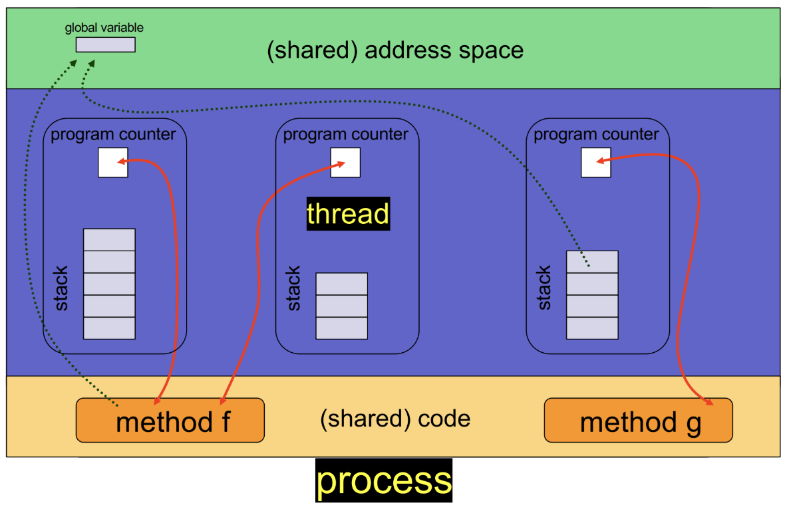
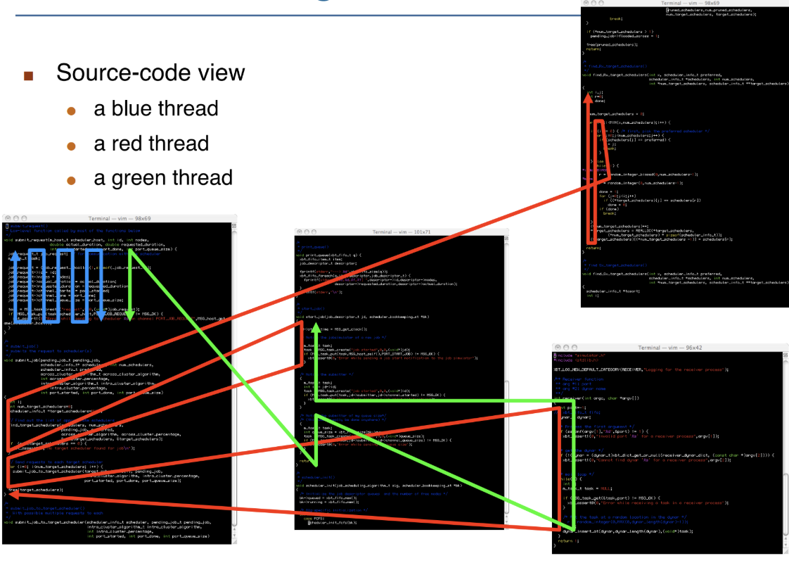

# 线程

!!! tip "Cause"
    **如何让进程运行的更快？**在进程内使用多个执行单元（多线程）

    {style="width:80%;display: block;margin: 20px auto"}

## 定义

1. **线程**：进程内的一个基本执行单位
2. **独有的**：每个线程都拥有自己的线程ID、程序计数器`pc`、寄存器组、栈
3. **共享的**：它与**同一进程内**的其他线程共享代码段、数据段、堆（动态分配的内存）、打开的文件与信号

!!! note "代码"
    同一个进程中的线程执行的代码可以相同，但大概率不同

    {style="width:60%;display: block;margin: 20px auto"}

4. **并发性**：多线程进程可以同时执行多个任务
5. **优点**

- **经济性**
    - **创建线程**成本低廉（相比于进程）：代码、数据和堆已经存在于内存中，只需要创建一个栈空间
    - **线程间上下文切换**成本低廉（相比于进程）：不需要刷新缓存
- **资源共享**
    - 线程共享**内存**：进程可能需要使用较复杂的IPC，但是进程不需要
    - 在同一地址空间内进行并发活动的能力非常强大（但也充满风险）