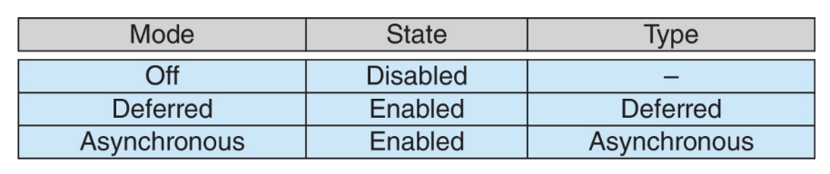
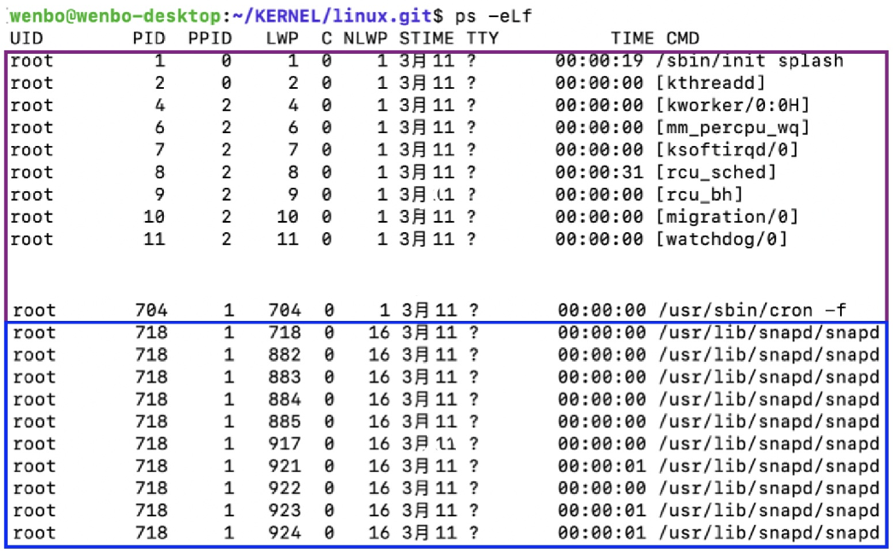

# 线程

!!! tip "Cause"
    **如何让进程运行的更快？**在进程内使用多个执行单元（多线程）

    {style="width:80%;display: block;margin: 20px auto"}

## 定义

1. **线程**：进程内的一个基本执行单位
2. **独有的**：每个线程都拥有自己的线程ID、程序计数器`pc`、寄存器组、栈
3. **共享的**：它与**同一进程内**的其他线程共享代码段、数据段、堆（动态分配的内存）、打开的文件与信号

!!! note "代码"
    同一个进程中的线程执行的代码可以相同，但大概率不同

    {style="width:60%;display: block;margin: 20px auto"}

4. **并发性**：多线程进程可以同时执行多个任务

### 优缺点

1. **优点**

- **经济性**
    - **创建线程**成本低廉（相比于进程）：代码、数据和堆已经存在于内存中，**只需要创建一个栈空间**
    - **线程间上下文切换**成本低廉（相比于进程）：不需要刷新缓存
- **资源共享**
    - 线程共享**内存**：进程可能需要使用较复杂的IPC，但是进程不需要
    - 在同一地址空间内**进行并发活动的能力非常强大**（但也充满风险）
- **响应性**：一个包含并发活动的程序具有**更好的响应性**
    - 当一个线程因等待某个事件而被阻塞时，另一个线程可以继续执行其他任务 
    - **e.g.** 在客户端-服务器架构的实现中，可以创建一个新线程来响应客户端请求
- **可扩展性**
    - 同时运行多个“线程”可以**更有效地利用机器资源** 
    - **e.g.** 在多核机器上

!!! abstract "Notice"
    **进程同样具有后两个特性**，但线程在资源共享和经济性方面更具优势

2. **缺点**

- **线程间的隔离性弱**：如果一个线程失败（**e.g.** 段错误），那么整个进程就会失败，从而导致整个程序崩溃

    !!! info "Info"
        1. 线程**无法受益于内存保护**：使用线程进行并发编程很困难，但对于使用**进程+共享内存段**的情况也是如此
        2. 这催生了基于进程的并发模型 **e.g.** 谷歌 Chrome 浏览器

- 线程可能比进程**更受内存限制**：原因在于操作系统对单个进程地址空间大小的限制（在64位架构上这已不再是问题）

!!! warning "多线程挑战"
    1. 处理数据依赖与同步问题
    2. 在线程间划分任务活动
    3. 平衡各线程间的负载
    4. 在线程间拆分数据
    5. 测试与调试

### 分类
1. **分类**

- **User-thread**：内核不知道该线程，完全在用户空间运行
- **Kernel-thread**：内核知道该线程，运行在用户空间或内核空间

2. **对应关系**

- **Many-to-one Model**：多个用户线程对应一个内核线程
    - **优点**：多线程效率高、开销低（无需向内核发起系统调用）
    - **缺点**：
        - 无法利用**多核架构**的优势
        - 如果一个线程阻塞，其他所有线程也会被阻塞
- **One-to-One Model**：一个用户线程对应一个内核线程
    - **优点**：消除了Many-to-one Model的两个缺点，线程管理变简单
    - **缺点**：创建新线程需要**内核**参与工作
    - **e.g.**：Linux、Windows、Solaris 9 及更高版本
- **Many-to-Many Model**：多个用户线程对应多个内核线程（折中）
    - 如果某个用户线程被阻塞，内核可以创建新的内核线程来避免阻塞所有用户线程
    - **缺点**：太复杂
- **Two-Level Model**：可以选择Many-to-Many或者One-to-One（太复杂）

### 线程库
1. 线程库为用户提供了在其程序中**创建线程的方式**
2. **类型**

- `C/C++`：
    - `pthreads` 和 `Win32` 线程：由内核实现
    - `OpenMP`：构建于 `pthreads` 之上，用于在"简单"情况下方便地进行多线程编程
- `Java`：
    - `Java` 线程：由 `JVM` 实现，`JVM` 依赖于内核实现的线程

3. **`pthreads`**

- 是规范，不是实现（API 规定了线程库的行为，具体实现由**库的开发者**决定）
- **e.g.** 常见于 `UNIX` 操作系统（`Linux` 和 `Mac OS X`）

??? example "示例代码"
    ```c
    #include <pthread.h>
    #include <stdio.h>
    #include <stdlib.h>
    int sum; /* 该数据由线程共享 */

    /* 线程将在此函数中执行 */
    void *runner(void *param) {
        int i, upper = atoi(param);
        sum = 0;

        for (i = 1; i <= upper; i++)
            sum += 1;
        pthread_exit(0);
    }

    int main(int argc, char *argv[]) {
        pthread_t tid; /* 线程标识符 */
        pthread_attr_t attr; /* 线程属性集 */

        /* 设置线程的默认属性 */
        pthread_attr_init(&attr);

        /* 创建线程 */
        pthread_create(&tid, &attr, runner, argv[1]);

        /* 等待线程退出 */
        pthread_join(tid, NULL);

        printf("sum = %d\n", sum);
    }
    ```

4. **`Win32`**

??? example "示例代码"
    ```c
    #include <windows.h>
    #include <stdio.h>
    DWORD Sum; /* 该数据由线程共享 */

    /* 线程将在此函数中执行 */
    DWORD WINAPI Summation(LPVOID Param) {
        DWORD Upper = *(DWORD *)Param;
        for (DWORD i = 1; i <= Upper; i++)
            Sum += i;
        return 0;
    }

    int main(int argc, char *argv[]) {
        DWORD ThreadId;
        HANDLE ThreadHandle;
        int Param;

        Param = atoi(argv[1]);

        /* 创建线程 */
        ThreadHandle = CreateThread(NULL, 0,
            Summation, /* 线程函数 */
            &Param, /* 传递给线程函数的参数 */
            0, &ThreadId); /* 返回线程标识符 */

        /* 等待线程完成 */
        WaitForSingleObject(ThreadHandle, INFINITE);

        /* 输出结果 */
        printf("sum = %d\n", Sum);
    }
    ```

5. **`OpenMP`**

- 通过识别**并行区域**（即可并行运行的代码块）来实现并行化
- `#pragma omp parallel`：创建**与核心数量相同**的线程

??? example "示例代码" 
    ```c
    #include <omp.h>
    #include <stdio.h>
    int main(int argc, char *argv[]){
        /* sequential code */
        #pragma omp parallel
        {
            printf("I am a parallel region.");  //并行
        }
        /* sequential code */
        return 0;
    }

    #pragma omp parallel for
    for (i = 0; i < N; i++){
        c[i] = a[i] + b[i];
    }
    ```

6. **`Java`**

- **便利性**：可以避免所有内存管理的烦恼
- **创建方式**：
    - 继承 `Thread` 类
    - 实现 `Runnable` 接口 

??? example "示例代码"
    ```java
    class MyThread extends Thread {
        public void run() {
            . . .
        }
    }
        MyThread t = new MyThread();
        public interface Runnable {
        public abstract void run();
    }
    ```

## 线程相关问题

1. **`fork()` 和 `exec()` 系统调用**

- **调用可能性**
    - 创建一个**仅包含一个线程的新进程**（该线程是调用 `fork()` 的线程的副本）
    - 创建一个**包含原进程所有线程的新进程**（复制所有线程，包括调用 `fork()` 的线程）
- 在 Linux 中采用上述**第一种**选项：如果在 `fork()` 之后调用 `exec()`，**所有线程都会被“清除”**

2. **信号处理**

- 有**多种选项**
    - 将信号传递给信号**所适用**的线程
    - 将信号传递给进程中的**每个**线程
    - 将信号传递给进程中的**某些**线程
    - **指定**一个特定线程接收**所有**信号
- 在大多数 UNIX 版本中，线程可以指定它接受哪些信号以及不接受哪些信号
- 在 Linux 系统中，处理线程与信号的关系较为复杂

3. **线程安全取消**

- 允许一个线程直接终止另一个线程
- **实现方式**
    - **异步取消**：一个线程立即终止另一个线程
    - **延迟取消**：线程**定期**检查是否应当终止
- 调用线程取消只是发出取消请求，但实际的取消操作**取决于目标线程的状态**
    - 如果线程**禁用（关闭）**了取消功能，取消请求将保持**挂起**状态，直到线程启用该功能
    - 默认取消类型为**延迟取消** **e.g.** `pthread_testcancel()`

    !!! abstract "实际的取消操作"
        {style="width:60%;display: block;margin: 20px auto"}

!!! example "创建与取消线程的 Pthread 代码"
    ```c
    /* 创建线程 */
    pthread_create(&tid, 0, worker, NULL);
    /* 取消线程 */
    pthread_cancel(tid);
    /* 等待线程终止 */
    pthread_join(tid, NULL);
    ```

!!! warning "缺点"
    1. **异步取消**
    
    - 如果线程正在执行“重要操作”，异步取消可能导致**状态不一致或引发同步问题**
    - **e.g.** 一个线程正在写变量，值还没有同步到内存或者 `cache`，这个 `bug` 很难被复现

    2. **延迟取消**：由于需要设置多个取消点，代码会变得**繁琐**
    3. 在 `Java` 中，`Thread.stop()` 方法已被弃用，因此必须使用**延迟取消**方式

4. **线程调度**

- PCS：线程只在同一进程内竞争 CPU，调度由用户级线程库控制
- SCS：线程在整个系统中竞争 CPU，调度由操作系统内核控制

## 实现示例 Linux
1. 在 `Linux` 中，线程也被称为轻量级进程（Lightweight Process，LWP）
2. **`clone()`系统调用**

- **用途**：创建一个线程或进程
- 新创建的线程/进程与其父进程**共享**执行上下文
- `pthread` 库使用 `clone()` 来实现线程

!!! abstract "参数"
    |标志（flag）|含义（meaning）|
    |:--:|:--|
    |CLONE_FS|共享文件系统信息|
    |CLONE_VM|共享同一块内存空间（地址空间）
    |CLONE_SIGHAND|共享信号处理函数|
    |CLONE_FILES|共享已打开的文件集合（文件描述符表）|


3. **数据结构**

- **TCB**用来存储线程的信息
- Linux并不区分PCB和TCB，都是用 `task_struct` 来表示

3. **单线程进程 VS 多线程进程**

{style="width:60%;display: block;margin: 20px auto"}

- `ps -elf`
- 如果 `PID` 和 `LWP` **相同**，说明这个进程只有这一个线程
- 如果**不相同**，说明进程有多个线程，此时进程的 `PID` 是第一个线程的 `LWP`

4. **用户线程到内核线程的映射**

- 同一个 `task_struct`（PCB）意味着是**同一个线程**
    - 一个用户线程映射到一个内核线程
    - **但实际上，它们是同一个线程**
- **执行方式**
	- 可以在用户空间执行：用户代码，用户空间栈
	- 可以在内核空间执行
      	- **e.g.** 调用系统调用
      	- 执行流程切换到内核，执行内核代码（用户线程对应的内核线程），使用内核空间栈