# 虚拟内存

---
1. **虚拟内存**：将逻辑内存与物理内存分离，通过 paging 实现

    !!! success "Notice"    
        <mark>虚拟内存远大于物理内存，**本质上只是一组地址范围**</mark>，并不能真正的存储数据，所有数据都存储在物理内存中！

    !!! quote "虚拟内存的优点"
        1. 执行时仅需将程序的一部分调入内存
            - 逻辑地址空间可以**远大于**物理地址空间
            - 允许更多程序**并发运行**
            - 加载或交换进程（部分）所需的 **I/O 减少**
        2. 允许内存（如共享库）被多个进程**共享**，提升 IPC（进程间通信）性能
        3. 实现更高效的 **forking**，采用 **copy-on-write** 技术


2. **虚拟地址空间**
    - stack 从最高逻辑地址开始向下增长，而 heap 向上增长
        - 使地址空间**利用率最大化**
    - 两者之间未使用的地址空间称为 **hole**
        - 在堆或栈增长到特定的新页面之前，**不需要分配物理内存**
        - 通过支持包含 hole 的稀疏地址空间，留出空间用于**增长和动态链接库**等
    - <mark>系统库通过**映射到虚拟地址空间实现共享**</mark>
    - 在执行 `fork()` 时可以共享页面，从而加快进程创建速度：**copy-on-write**

<div style="clear: both;"></div>

??? info "共享页面"
    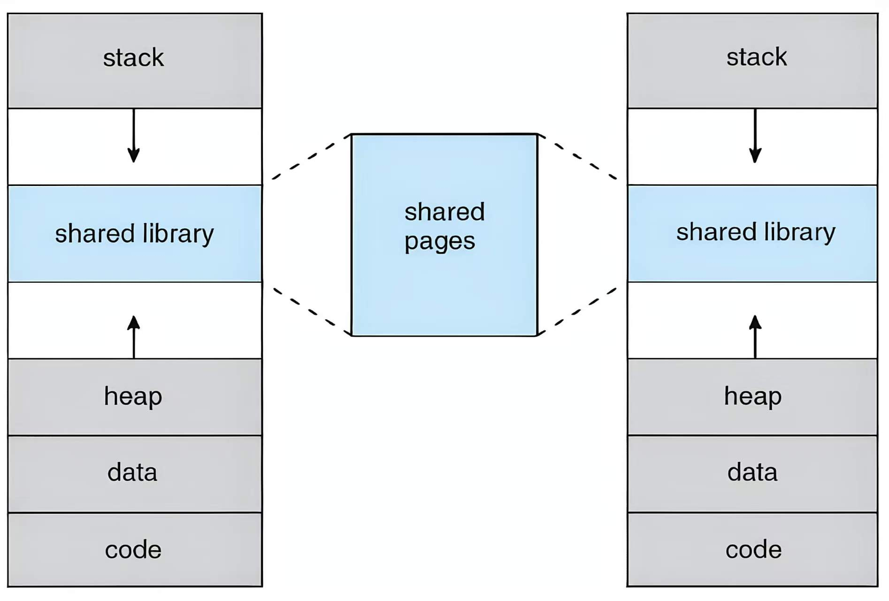{style="width:45%;display: block;margin: 20px auto"}

## Demand Paging

!!! info "Background"
    1. 代码必须被写入主存才能运行，但是整个程序很少需要同时被使用，存在未使用的代码和未使用的数据
        - **未使用的代码**：错误处理代码、不常用的例程
        - **未使用的数据**：大型数据结构
    2. 需要执行**部分加载程序**的能力：程序不再受限于物理内存的限制，**程序可以比物理内存更大**

1. **Demand Paging**：只有当需要的时候才将一页调入内存
    - **优点**：无不必要的 I/O，内存需求减少，支持更多应用
    - **缺点**：响应速度变慢

2. **运行流程：当发生访问操作（读/写）**
    - 如果地址不在 vm_area 中（<mark>地址非法</mark>） $\Rightarrow$ 触发 <mark>**segmentation fault**</mark> $\Rightarrow$ 终止操作
    - 如果地址在合法 vm_area 中但**不在内存中**（invalid） $\Rightarrow$ 触发缺页异常/缺页中断 (**page fault**) $\Rightarrow$ 将其调入物理内存

    !!! info "**调入方式**"
        1. 对于已交换出的页面，通过交换 (**swapping**) 换入
        2. 对于新页面，通过映射 (**mapping**) 分配

3. **swapper**
    - **lazy-swapper**：除非页面将被需要，否则绝不将其换入内存
        - **优点**：更省内存
        - 处理页面的交换程序也被称为**调页程序** <mark>pager</mark>
    - **pre-paging**：在进程引用页面之前，<mark>预先调入</mark>该进程将需要的全部或部分页面
        - **优点**：可以减少执行期间的缺页异常数量，效率更高
        - **缺点**：如果预调页的页面未被使用，则会**浪费 I/O 和内存资源**；总的 I/O 次数可能会更高

4. **最坏情况**：pure demand paging（启动进程时内存中没有任何 frame）
5. **硬件支持**：带有有效/无效位的页表项、**后备存储**（通常是磁盘）、指令重启能力

!!! info "内核内存分配"
    1. 内核内存分配的处理方式与用户内存不同，通常是从**空闲内存池**中分配的
    2. 内核为**不同大小**的结构请求内存：**尽量减少由于碎片造成的浪费**
    3. 某些内核内存需要是**物理连续的** **e.g.** 用于设备 I/O

### 性能
1. **缺页率**：$0 \le p \le 1$（如果 $p = 0$，则没有缺页；如果 $p = 1$，则每一次引用都会产生缺页）
2. **有效访问时间**：

    EAT = (1-p) $\times$ memory access + p $\times$ (page fault overhead + swap page out + swap page in + instruction restart overhead)

    !!! quote "Translate"
        (1 - p) $\times$ 内存访问时间 + p $\times$ ( 缺页中断开销 + 页面换出 + 页面换入 + 指令重启开销 )

3. **优化**：
    - **方法 1：swap space**
        - 交换空间的 **I/O 比文件系统 I/O 更快**（以更大的块进行分配，所需的管理比文件系统少）
        - 在进程加载时，将整个进程镜像从磁盘复制到交换空间，然后从交换空间进行页面的换入和换出
    - **方法 2**：从磁盘上的程序二进制文件请求分页，但在**释放帧时直接丢弃而非换出**（下次使用时再从磁盘重新加载）
        - 以下情况仍需写入**交换空间**：
            - **匿名内存**：未与文件关联的页面（如栈和堆）
            - **内存中已修改但尚未写回**文件系统的页面

### copy-on-write

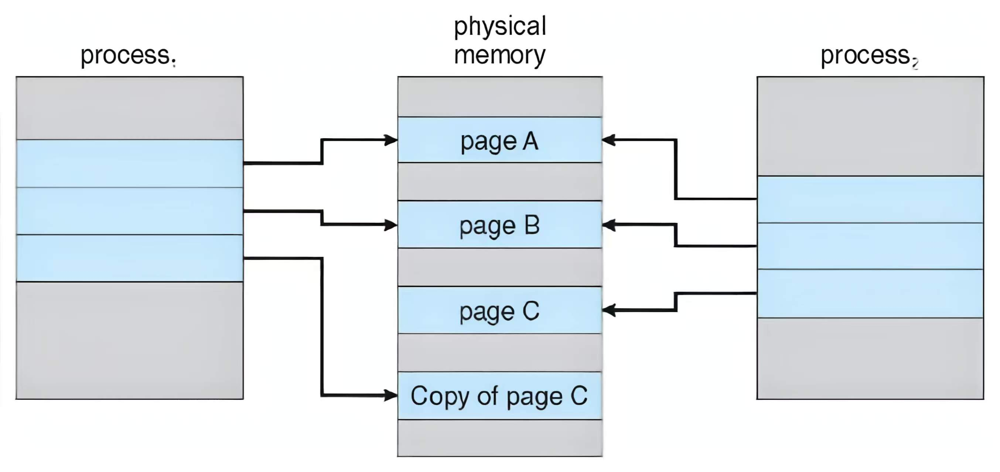{style="width:60%;display: block;margin: 20px auto"}

1. **COW**：允许父进程和子进程在初始阶段**共享内存中的相同页面**
    - 只要没有进程修改该页面，页面就会一直共享
    - 只有**当其中一个进程修改共享页面时**，才会复制该页面

2. **优点**：<mark>进程创建更高效</mark>（在执行 `fork` 期间无需复制父进程内存，之后**仅复制发生更改的内存部分**）

??? info "vfork"
    `vfork` 系统调用优化了子进程在 `fork` 后立即调用 `exec` 的情况

    1. 父进程被挂起，直到子进程退出或调用 `exec`
    2. 子进程共享父进程的资源，包括**堆和栈**
    3. 子进程**不能从函数返回或调用 `exit`**，而应调用 `_exit`

---
## page fault

!!! abstract "Page Fault 分类"
    1. **主缺页中断** (Major)：页面被引用但不在内存中， 只能通过访问磁盘来满足 **e.g.** code

    2. **次缺页中断** (Minor)：映射不存在，但页面已在内存中 **e.g.** stack/heap、共享库、页面已被回收但尚未被完全释放


1. **触发条件**：**用户**空间程序访问了一个地址，且该地址对应的页面当前**未调入物理内存**

    !!! warning "注意"
        只有 user space 才会产生 page fault，kernel space 不会产生 page fault，因为用户空间有 **lazy allocation**

2. <mark>**发出 page fault 的硬件**：MMU</mark>

    - 通过查看页表项的 valid-invalid 位（present bit：操作系统来设置），判断该页是否被映射
    - 如果 **invalid**，则触发 page fault

3. <mark>**处理 page fault**：操作系统</mark>（以 Linux 为例）

    - 首先检查 VMA 以**确定异常类型**（使用**红黑树**组织 VMA 来提高查找的速度）
        - 地址位于 `vm_area` 之内：合法访问，继续处理
        - 地址超出 `vm_area` 范围：非法访问，<mark>报错并终止（segmentation fault）</mark>
    - 然后获取空闲的 **physical frame** 并映射

!!! info "获取空闲页框"
    1. 大多数操作系统维护着一个**空闲页框链表** free-frame list
    2. 操作系统通常使用一种称为**请求零填充** (zero-fill-on-demand) 的技术来分配空闲页框：即在分配页框之前，将其内容全部清零
    3. 当系统启动时，所有可用内存都会被放入空闲页框链表中

!!! success "**VMA**"
    ```c
    struct vm_area_struct {
        unsigned long vm_start;
        unsigned long vm_end;
        struct rb_node vm_rb; // 红黑树
        ...
    }
    ``` 

    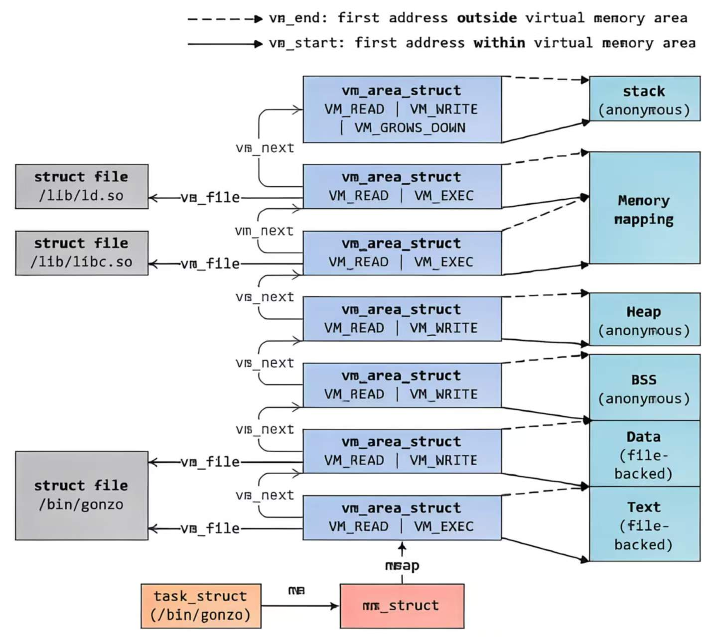{style="width:60%;display: block;margin: 20px auto"}

### heap
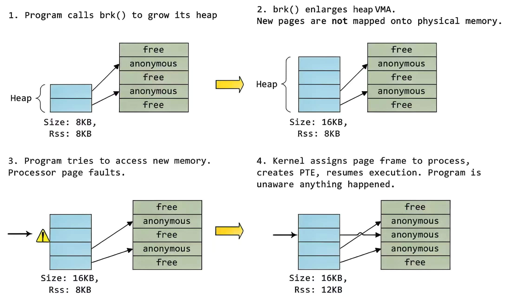{style="width:80%;display: block;margin: 20px auto"}

**执行 `malloc()` 时**

1. 程序调用 `brk()` 来扩展 heap
2. `brk()` 通过**增加 `vm_end`** 扩大了 heap 的 VMA，但是新页面尚未映射到物理内存上
3. 程序尝试访问新内存，处理器**触发 Page Fault**，并进入 kernel
4. 内核为进程分配 Page Frame，创建页表项 (PTE)，并恢复程序执行（程序对这一切毫无察觉）

### code

!!! warning "对比 heap"
    1. heap 是**匿名的**，而 code 是非匿名的（**有文件支持**），因此 code 相对于 heap 的 page fault 解决，需要去硬盘上寻找支持的文件，并**从硬盘读取到物理内存**，而硬盘的读取速度比较慢，所以会被其他进程占用
    2. 下述步骤如果是 heap，则需要 1, 2, 3, 4, 9, 10

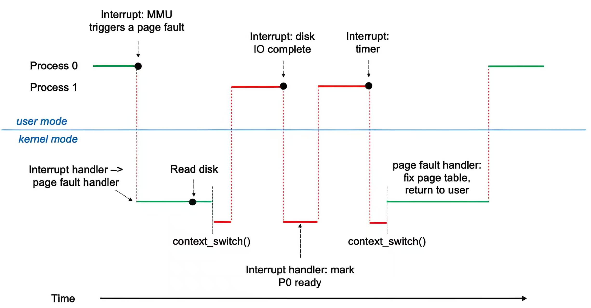{style="width:80%;display: block;margin: 20px auto"}

假设 Process 0 正在运行，触发了 page fault

1.  **陷入 (Trap)** 到操作系统
2.  **保存**用户寄存器和进程状态到内核栈的 **`pt_regs`**
3.  **确定中断类型**为缺页异常（检查页面引用是否合法）
4.  **查找**空闲页框
5.  **确定**页面在磁盘上的位置，并向空闲页框**发起磁盘读取**：
    - 在设备队列中等待，**直到读取请求获得服务**
    - 等待设备的寻道和/或延迟时间
    - 开始将页面传输到空闲页框
6.  在等待期间，将 CPU **分配给 Process 1**
7.  <mark>接收到来自磁盘 I/O 子系统的**中断**</mark>（**I/O 已完成**）：
    - 确定中断来自磁盘
    - 将发生缺页异常的进程标记为 **ready 状态**
8. <mark>**等待** CPU 再次分配给 Process 0</mark>
    - 保存 Process 1 的寄存器和进程状态
    - **上下文切换**回发生缺页异常的 Process 0
9. **修正页表**，映射新的页框
10. **返回用户态**：恢复用户寄存器、进程状态和新页表，然后**重启**被中断的指令

!!! info "页表切换"
    1. <mark>**一个进程对应一个页表**</mark>
    2. 进行系统调用的时候，由用户空间跳到内核空间，页表切换为**内核的页表**

---
## 页面替换

!!! abstract "页面替换类型"
    1. **全局置换** (Global replacement)：进程从所有页框的集合中选择一个置换页框（一个进程可以从另一个进程那里夺取页框）
        - **缺点**：进程的执行时间可能会有很大波动（取决于其他进程）
        - **优点**：**吞吐量更高，更为常见**
    2. **局部置换** (Local replacement)：每个进程**仅从其自身分配**的页框集合中进行选择
        - **优点**：每个进程的性能更加稳定
        - **缺点**：可能导致内存利用率不足

1. **页面替换算法**：FIFO, optimal, LRU, LFU, MFU...
2. **算法评估**：在特定的内存引用序列上运行该算法，计算该引用串上的<mark>**缺页中断次数**</mark>

!!! info "info"
    下述例子均为 7, 0, 1, 2, 0, 3, 0, 4, 2, 3, 0, 3, 0, 3, 2, 1, 2, 0, 1, 7, 0, 1

### FIFO

1. **FIFO**：先进先出
2. **实例**：一共 15 次 page fault（3 个 frames）

    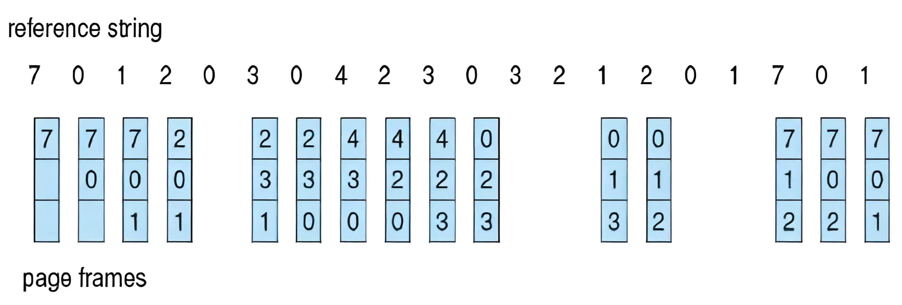{style="width:60%;display: block;margin: 20px auto"}

3. <mark>**Belady's Anomaly**：对于 FIFO，**增加更多的页框**反而可能导致更多的缺页中断</mark>

    !!! example "Example"
        

        

### Optimal
1. **Optimal**：替换**未来**最长时间不使用的页面
2. **缺点**：无法预知未来（不可能实现）
3. <mark>该算法主要用于**衡量其他算法的性能优劣**</mark>
4. **实例**：9 个 page fault

    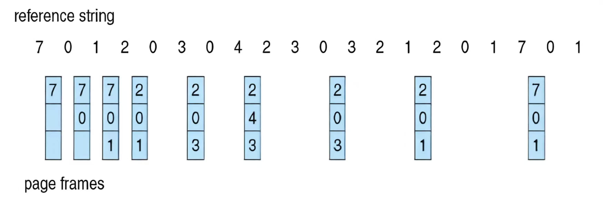{style="width:60%;display: block;margin: 20px auto"}

### LRU
1. **LRU**：最近最少使用

    !!! success "LRU 和 OPT 算法不会出现 Belady's Anomaly"

2. **实例**：12 个 page fault

    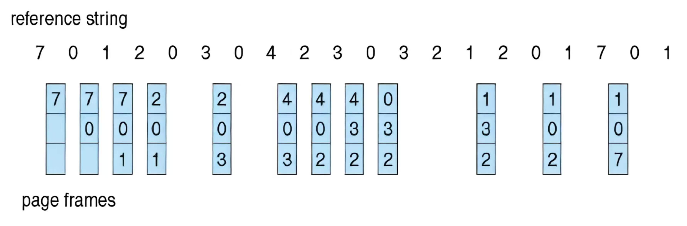{style="width:60%;display: block;margin: 20px auto"}

3. **实现**：
    - **counter-based**：
        - 每一个页表项带有一个 counter
        - 每当页面被引用时，将 **clock** 的值复制到该 counter 中
        - <mark>当需要置换页面时，搜索 **counter 值最小**的页面（可以用**最小堆**来实现）</mark>
    - **stack-based**：
        - <mark>维护一个**页码栈**（采用**双向链表**结构）</mark>
        - 当一个页面被引用时，将其移动到**栈顶**
        - 每次更新的**开销更高**，但置换时**无需进行搜索**

        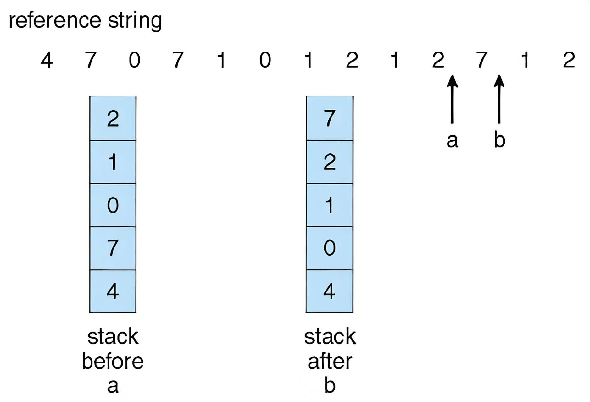{style="width:40%;display: block;margin: 20px auto"}

    !!! warning "基于计数器和基于栈的 LRU 实现具有较高的性能开销"

4. **LRU 近似算法**（最常用）
    - **硬件**提供了一个<mark>**引用位** (Reference bit)</mark>
    - 为每个页面关联一个引用位，初始设置为 0；**当页面被引用**时，将该位设置为 1（由硬件完成）
    - **置换**任何引用位为 0 的页面（如果存在）

    !!! warning "Warning：该算法无法得知这些页面的**引用先后顺序**"

5. **附加引用位算法**：假设为每个页面分配一个 8 位的字节
    - 在**每个时间间隔**内，将位右移 1 位，如果页面被使用过，则**将最高位置为 1**，然后舍弃低位
    - **e.g.** 11000100 vs 01110111，前者最近被使用

6. **二次机会算法**
    - 待置换的页面
        - **引用位 = 0** -> 置换该页面
        - **引用位 = 1** -> 引用位清零，将页面留在内存中
    - 按照相同规则置换下一个页面

    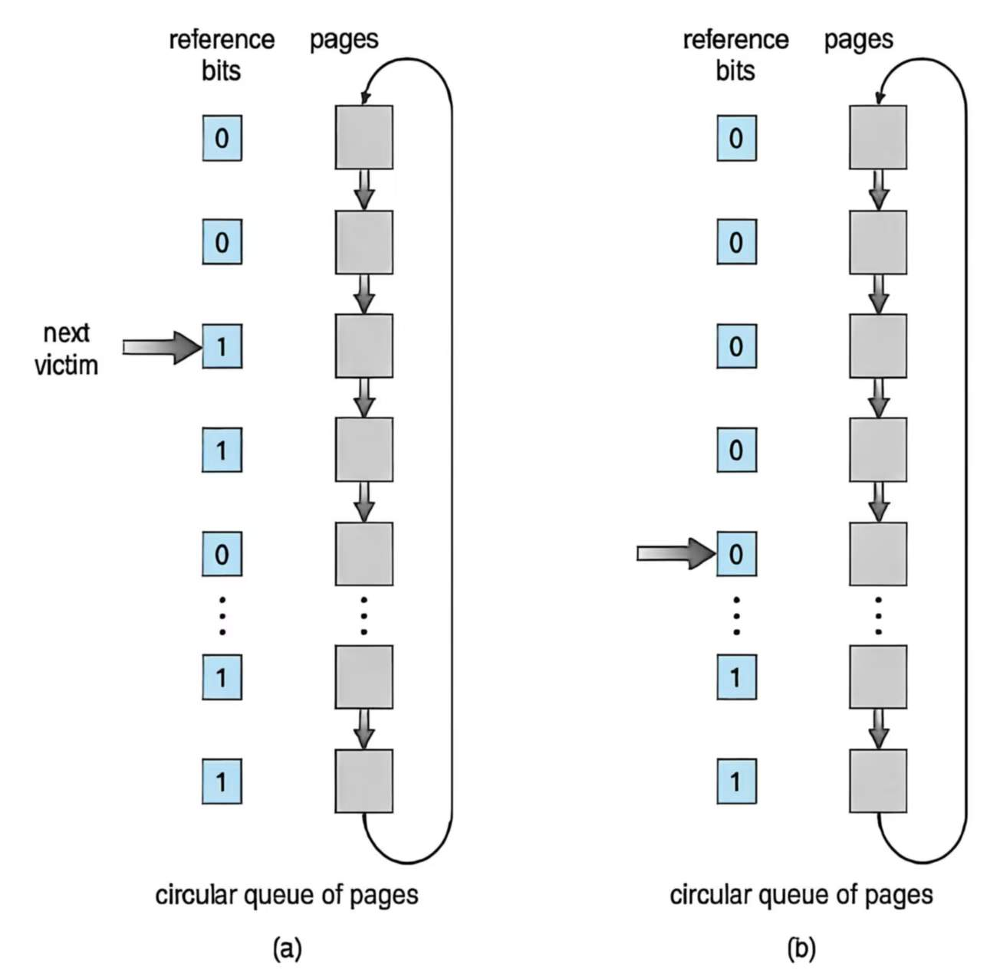{style="width:40%;display: block;margin: 20px auto"}

7. **增强型二次机会算法**：通过结合使用**引用位和修改位**来改进算法
    - 采用**有序对**（引用位，修改位）
    - **(0, 0)**：最近未被使用也未被修改 -> **最佳置换页面**

### Counting-based
1. <mark>**counter** 记录对每个页面的**引用次数**</mark>
2. **最不经常使用算法** (LFU)：置换 counter 值最小的页面（一个页面可能在进程初始化阶段被大量使用，随后便不再使用）
3. **最经常使用算法** (MFU)：置换 counter 值最大的页面（值最小的页面可能刚被调入内存，尚未被使用）
4. LFU 和 MFU **并不常用**

!!! abstract "应用程序与页面替换"
    1. **内存密集型应用程序**可能会导致双重缓冲（一种内存浪费）：
        - 操作系统在内存中保留一份页面副本作为 I/O 缓冲区
        - 应用程序在内存中保留该页面用于自身工作
    2. **原始磁盘模式** (Raw disk mode)：授予操作系统对磁盘的直接访问权限，从而不干扰应用程序

---
## 页面缓冲算法
1. <mark>**维持一个 frame pool**</mark>：
    - 当需要时立即有可用帧，无需在发生缺页时才去找
    - 将页面读入空闲帧，无需等待“牺牲页”被写回磁盘：**尽可能快地重启进程**
    - 在方便时再驱逐牺牲页

2. **维护已修改页面的列表**：
    - 当磁盘空闲时，将这些页面写入磁盘并设置为“非脏”
    - 这样该页面就可以在**无需写入后端存储**的情况下**直接**被置换

3. **帧内容缓存**：保持空闲帧内容完好并记录其中的内容（如果页面在被重用前再次被引用，则无需再次从磁盘加载内容）

!!! abstract "Frames 分配"
    **进程内存分配的两种主要方案**：

    1. **平均分配**
        - **e.g.** 100 个页框和 5 个进程，为每个进程分配 20 个页框
        - 保留一部分作为空闲页框缓冲池
    2. **按比例分配**：根据进程的大小进行分配

!!! success "页面回收"
    **页面回收** Reclaiming Pages：一种实现全局页面置换策略的方法，**确保始终有足够的空闲内存**

    - 所有的内存请求都通过**空闲页框列表**来满足
    - 在列表降至**特定阈值以下**时触发页面置换（杀死某些进程：根据 OOM 分数进行选择）
 
    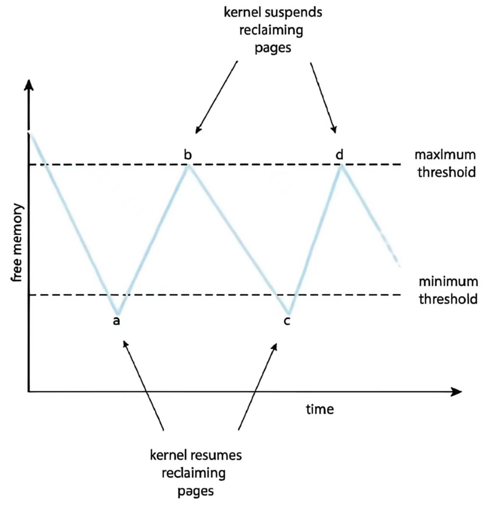{style="width:40%;display: block;margin: 20px auto"}

!!! quote "NUMA 非一致性内存访问"
    1. **NUMA**：访问内存的速度各不相同
    2. 不同 CPU 距离不同的内存的距离不同，因此访问时间也不同

---
## 抖动
1. <mark>**Thrashing**：进程忙于频繁地**换入和换出**页面（a process is busy swapping pages in and out）</mark>
    - 如果**一个进程没有足够的 frame**，其缺页率可能会很高
        - 发生缺页中断以获取页面，并置换掉某些现有的页框
        - 但很快又需要**被置换掉的那个页框**（刚换出就换入）
    - <mark>导致**低 CPU 利用率 $\Rightarrow$ 内核认为需要更多的进程以最大化 CPU 利用率 $\Rightarrow$ 系统中加入更多进程**</mark>

    !!! info "CPU 利用率"
        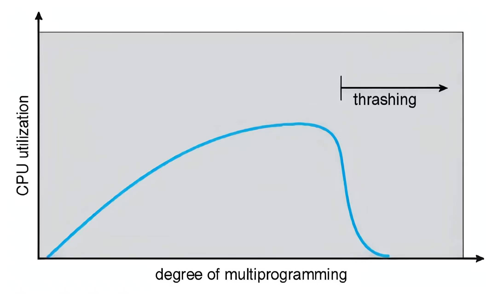{style="width:40%;display: block;margin: 20px auto"}


2. <mark>**产生原因**：内存总大小 < 局部区域的总大小</mark>，导致有 frame 频繁的换入和换出

3. **解决方法**：
    - **局部页面置换**：从**同一个进程**中选择要换出的页面，一个进程开始抖动不会导致其他进程也发生抖动
    - **工作集模型**
    - **缺页频率 PFF**（比工作集策略更直接的方法）：建立可接受的缺页率
        - 如果缺页率过低，进程失去页框
        - 如果缺页率过高，进程获得页框
        - 如果没有空闲页框可用，则需要换出某个进程

!!! info "<mark>工作集模型</mark>"
    1. **工作集窗口** $\Delta$： 一个固定数量的页面引用序列
    2. **进程 $p_i$ 的工作集** $WSS_i$： 在最近的 $\Delta$ 窗口内引用的**页面总数**（随时间变化）
    3. **某时刻总工作集大小**：$D = \sum WSS_i$
        - <mark>如果 $D > m$（总内存页框数） $\Rightarrow$ 存在抖动的可能性</mark>
        - **避免抖动**：如果 $D > m$，则挂起或换出某些进程，将其释放的页框分给正在抖动的进程

    !!! example "Example：$\Delta$ = 10"
        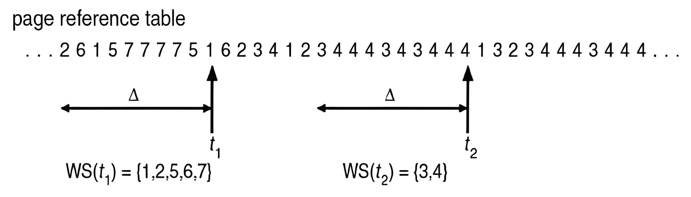{style="width:60%;display: block;margin: 20px auto"}

---
## 其他概念

1. **Prepaging**：在页面被引用之前，预先调入进程需要的所有或部分页面
    - **目的**：为了减少进程启动时发生的大量缺页中断
    - **缺点**：但如果预调页的页面未被使用，则会**浪费 I/O 和内存**

2. **Page Size**
    - **小页面**：
        - 减少内部碎片：页面越小，浪费的内存就越少
        - **分辨率**更高：更精确地只将部分数据加载进内存，而不必带入大量无关数据
        - **局部性**更好：只保留程序当前最活跃的代码和数据
    - **大页面**：
        - 减小页表大小：页表项数越少，页表占用的内存越少
        - **降低 I/O 开销**：提高单次传输的吞吐量
        - <mark>**减少缺页中断次数**</mark>
        - **提升 TLB 大小和有效性**：同样的 TLB 条目能覆盖更大的地址范围，CPU 更有可能在 TLB 中直接找到物理地址，减少了访问内存中多级页表的次数
3. **TLB Reach**：指从 TLB 可访问的**内存总量**
    - <mark>**TLB 覆盖范围 = TLB 大小 $\times$ 页面大小**</mark>
    - **理想情况下**，每个进程的工作集都存储在 TLB 中，否则会出现**大量的 TLB 未命中**
    - 增加页面大小有助于减轻 TLB 压力（可能会增加碎片）

4. **程序结构**：影响缺页中断

    ```c
    int[128,128] data;
    // program 1
    for (j = 0; j < 128; j++)
        for (i = 0; i < 128; i++)
            data[i,j] = 0;
    // program 2    
    for (i = 0; i < 128; i++)
        for (j = 0; j < 128; j++)
            data[i,j] = 0;
    ```

    - **假设**
        - 页面大小为 512B
        - 每一行存储在一个页面中
        - 假设系统有 127 个物理页框
    - **程序 1**：128 $\times$ 128 个缺页中断
    - **程序 2**：128 个缺页中断（每一行一次）

5. **I/O interlock**：把页面锁定在内存中，保证不会被换出去

    **e.g.** 用于从设备复制文件的页面必须被锁定，以防被页面置换算法选中并移出内存

---
## 实例

### Windows XP
1. 使用**带有群集的请求调页**：群集会将发生缺页中断页面周围的页面调入（局部性）
2. 为进程分配**工作集的最小值和最大值**
    - **wsmin**：保证进程拥有的最小页面数量
    - **wsmax**：一个进程最多可以被分配到其 wsmax 所规定的页面数量
    - 当系统中空闲内存量低于阈值时，自动进行工作集修整以恢复空闲内存量，从页面数量超过 wsmin 的进程中**移除页面**

### Linux
1. **`mm_struct`**
    - **`pgd`**：页表
    - **`mmap`**：vma

    !!! tip "Tip"
        1. **`mm_struct`**：一个进程对应一个
        2. **`task_struct`**：一个线程对应一个

2. <mark class="orange">**虚拟地址**</mark>：
    1. User virtual address：每个进程独立映射
    2. Kernel logical address：**线性映射**物理内存，VA 和 PA 可以简单加减转换
    3. Kernel virtual address：**虚拟连续，物理可不连续**，需要查页表（vmalloc）

    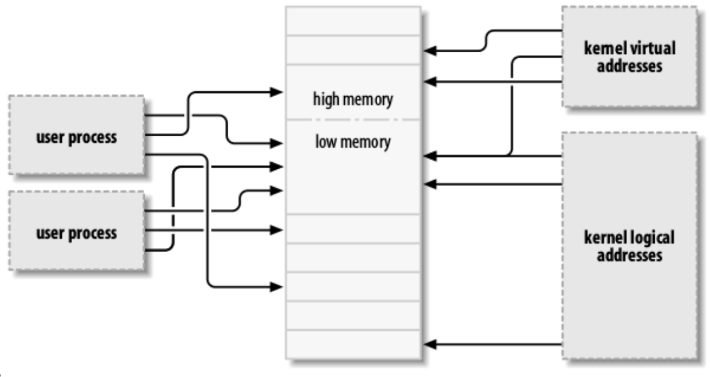{style="width:50%;display: block;margin: 20px auto"}

3. **Buddy System**：Linux 管理物理页框的分配器
    1. 内存以 **2 的幂大小**为单位进行分配，将单位拆分为两个 Buddy，直到获得大小合适的块
    2. **优点**：可以快速将未使用的块合并为更大的块
    3. **缺点**：内部碎片

    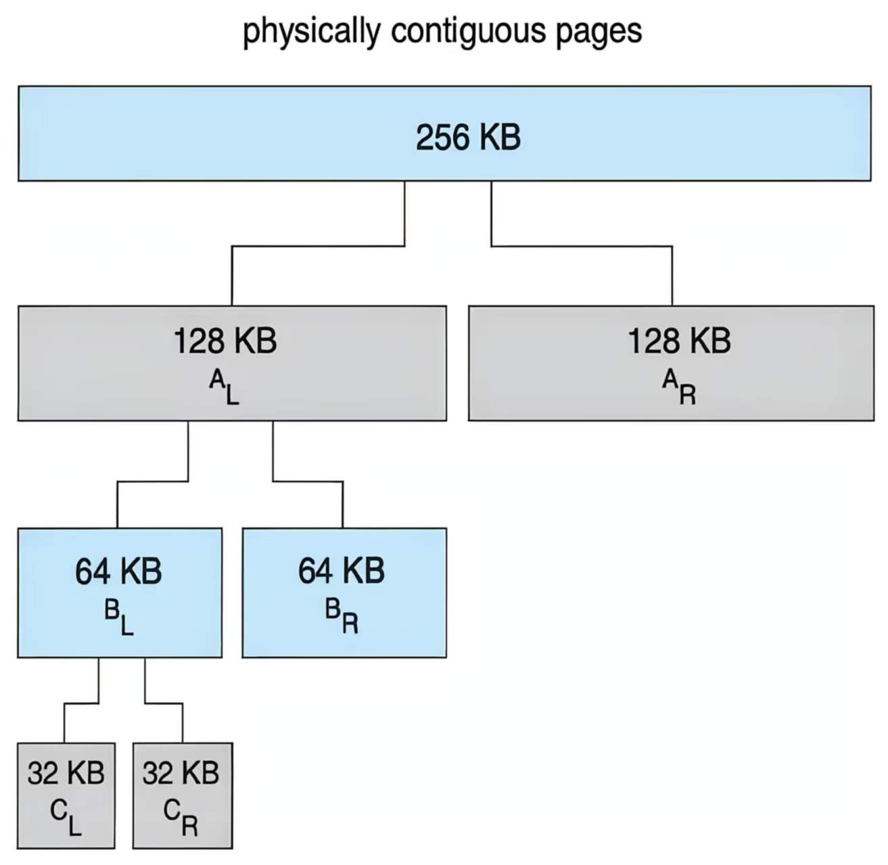{style="width:50%;display: block;margin: 20px auto"}

4. **Slab 分配器**是对象缓存（内核分配小对象时使用）
    - Slab 分配器中的缓存由一个或多个 slab 组成
    - 一个 slab 包含**一个或多个页面**，并被划分为**大小相等**的对象
    - 内核为**每种独特的内核数据结构**使用一个缓存
        - 创建缓存时，分配一个 slab，并将其划分为空闲对象
        - 数据结构的对象从 slab 中的空闲对象中分配
        - 如果一个 slab 已满，则下一个对象将来自空闲/新的 slab
    - **优点**：
        - 无碎片且内存分配速度快
        - 某些对象字段可能是可重用的，无需再次初始化
    - **三种状态**：full、empty、partial

    !!! example "Example"
        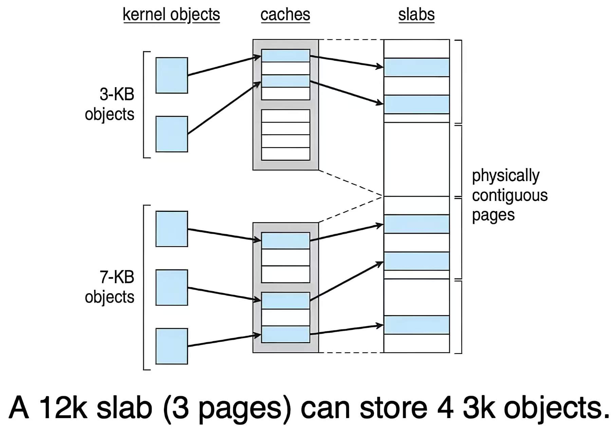{style="width:50%;display: block;margin: 20px auto"}