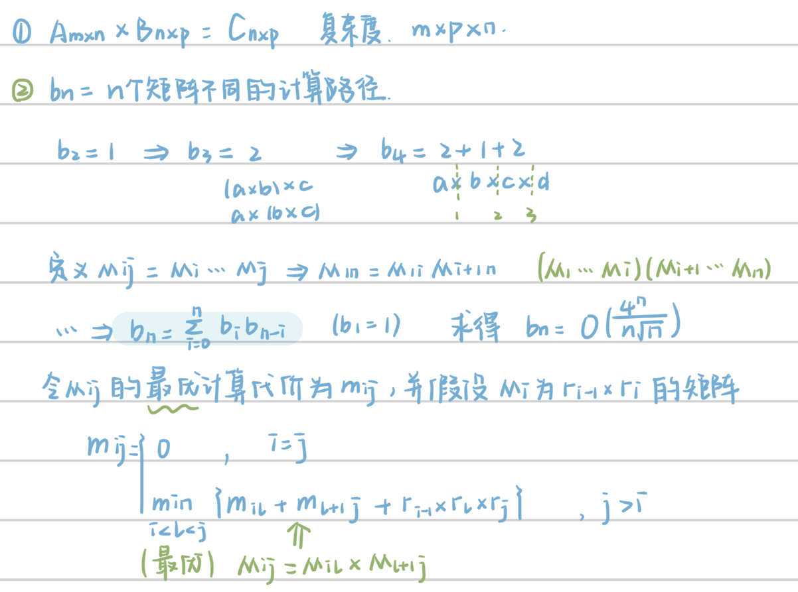
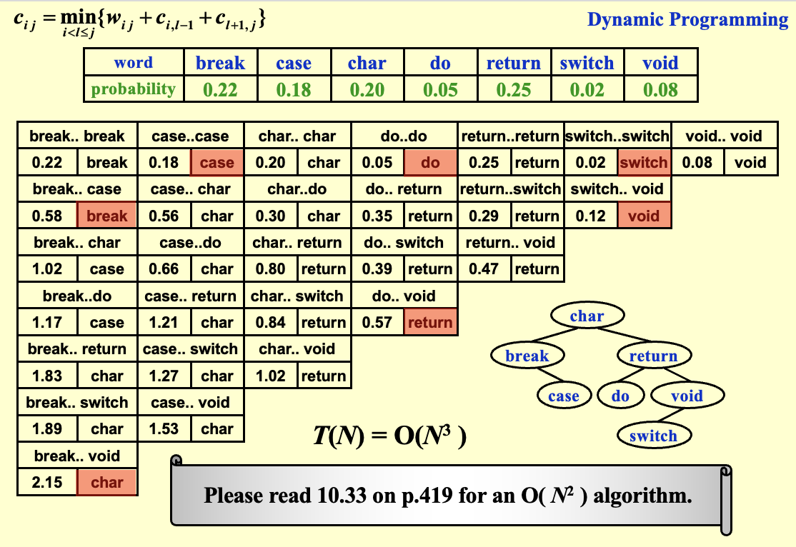

## 动态规划 DP
!!! tip "Tips"
    需要大量做题！！！

??? example "例题"
    1. 如果一个问题可以用动态规划解决，那么它一定在多项式时间内解决.（F）

1. **基本思路**：仅解决一次子问题，并保存子问题的解，避免重复计算
2. **设计算法的步骤**

- 明白问题的最优解和子问题最优解的关系
- 列出最优解的递推式
- 选择计算顺序，计算最优解
- 重新构建解决方案

 
### 斐波那契数列
1. **时间复杂度**：\( O(N) \)
2. **问题根源**：冗余计算呈爆炸式增长
3. **解决方案**：记录**最近计算的两个值**以避免递归调用（**记忆化搜索**）


```c
// 斐波那契数列
int Fibonacci ( int N ) {
    int i, Last, NextToLast, Answer;
    if ( N <= 1 ) return 1;
    Last = NextToLast = 1;    /* F(0) = F(1) = 1 */
    for ( i = 2; i <= N; i++ ) {
        Answer = Last + NextToLast;   /* F(i) = F(i-1) + F(i-2) */
        NextToLast = Last; Last = Answer;  /* 更新 F(i-1) 和 F(i-2) */
    }  /* end-for */
    return Answer;
}
```

### 矩阵链乘法排序
1. **时间复杂度**：三层嵌套循环\( O(N^3) \)
2. **空间复杂度**：二维DP表 \( O(N^2) \)
3. **思路**：一个问题的最优答案利用子问题的最优答案得到
4. **解答**：

!!! abstract "已知"
    对于矩阵乘法 $A_{m \times n} \times B_{n \times p} = C_{n \times p}$ ，时间复杂度为 $m \times p \times n$

!!! note "定义"
    1. $b_n$：表示 $n$ 个矩阵相乘的不同计算路径的个数，**e.g.** $b_1 = 1, b_2 = 1, b_3 = 2, b_4 = 5$
    2. $M_i$：$r_{i-1} \times r_i$ 的矩阵
    3. $M_{ij} = M_i \cdots M_j$
    4. $m_{ij}$：表示矩阵 $M_{ij}$ 的**最优**计算代价

- **$b_n$ 的递推式**

    $$
    b_n = \sum_{i=0}^{n} b_i b_{n-i} \Rightarrow b_n = O(\frac{4^n}{n \sqrt{n}})
    $$

- **$m_{ij}$ 的递推式**
  
    $$
    m_{ij} = \begin{cases}
    0 & i=j \\
    \min_{i<l<j} \{m_{il} + m_{l+1,j} + r_{i-1}  r_l  r_j\} & i<j
    \end{cases}
    $$


```c
void OptMatrix(const long r[], int N, TwoDimArray M) {
    int i, j, k, L;
    long ThisM;
    // 初始化：单个矩阵的乘法代价为0
    for(i = 1; i <= N; i++) 
        M[i][i] = 0;
    // 按链长度递增计算
    for(k = 1; k < N; k++) {           // k = 链长度-1
        for(i = 1; i <= N - k; i++) {  // 所有起始位置
            j = i + k;
            M[i][j] = Infinity;
            // 尝试所有可能的划分点
            for(L = i; L < j; L++) {
                ThisM = M[i][L] + M[L+1][j] + r[i-1]*r[L]*r[j];
                if(ThisM < M[i][j])
                    M[i][j] = ThisM;
            }
        }
    }
}
```

??? abtract "note"
    {style="width:60%;display: block;margin: 20px auto"}


### 最优二叉搜索树 OBST
1. **时间复杂度**：\( O(N^3) \)
2. **问题**：

- **已知**：$N$ 个单词，字典序为 $w_1 \leq w_2 \leq \cdots \leq w_N$，$p_i$ 为单词 $w_i$ 的概率
- **检索代价的计算公式**

    $$
    T(N)=\sum_{i=1}^N p_i(1+d_i)
    $$

- **目标**：找到令搜索代价最小的检索次序

3. **解答**：

!!! note "定义"
    1. $T_{ij}$：表示 $w_i$ 到 $w_j$ 组成的OBST
    2. $c_{ij}$：表示 $T_{ij}$ 的代价
    3. $r_{ij}$：表示 $T_{ij}$ 的根节点
    4. $w_{ij} = \sum_{k=i}^j p_k$：表示 $T_{ij}$ 的权重

- **$c_{ij}$ 的递归式**

    $$
    c_{ij} = \min_{i<k<j} \{c_{i,k-1} + c_{k+1,j} + w_{ij} \}
    $$

??? abstract "example"
    

### 所有节点对最短路径
1. **思路**：对于从i到j的路径，考虑新引入的顶点k：

- 不经过k：保持原最短路径
- 经过k：路径分解为 $i→k$ 和 $k→j$

2. **时间复杂度**：\( O(N^3) \)）


```c
void AllPairs(TwoDimArray A, TwoDimArray D, int N) {
    int i, j, k;
    // 初始化：复制邻接矩阵
    for (i = 0; i < N; i++)
        for (j = 0; j < N; j++)
            D[i][j] = A[i][j];
    // 动态规划核心：逐步引入中间顶点k
    for (k = 0; k < N; k++)
        for (i = 0; i < N; i++)
            for (j = 0; j < N; j++)
                if (D[i][k] + D[k][j] < D[i][j])
                    D[i][j] = D[i][k] + D[k][j];
}
```

