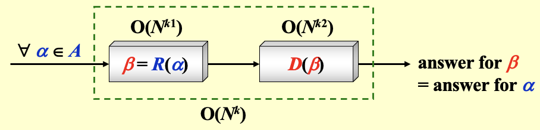
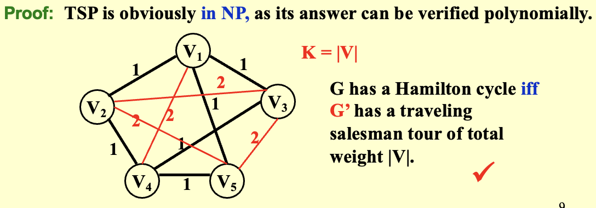

# NP 完全性

!!! info "计算问题 Easy or Hard"
    1. **最简单的问题**：$O(N)$，至少需要读入数据
    2. **最难的问题**：不可判定问题

## 停机问题

（**Halting Problem**）

1. **问题**：你的C编译器是否能够检测**所有**无限的循环？
2. **答案**：不能
3. **证明**

- 假设存在一个可以检测无限循环的程序，并且确保可以检测自己

    ```c
    Loop(P){
        if (P loops) print("YES")
        else infinite_loop();
    }
    ```

- 无法判断 `Loop(Loop)` 是终止还是循环
    - 若判定 `Loop` 会无限循环 → 打印 `YES` → 实际停止 → 与判定**矛盾**
    - 若判定 `Loop` 会停止 → 进入 `infinite loop` → 实际不会停止 → 与判定**矛盾**

## 图灵机

1. **组成**：

- **无限内存**：相当于无限长的纸带，用于**存储数据**
- **扫描头**：读写内容
- **有限状态控制器**：根据当前状态和读写头所读到的符号决定下一操作，**执行图灵机操作逻辑**

2. **运行**

- 改变有限状态机的当前状态
- 擦除读写头所在单元的符号，并写入新的符号
- 将读写头向左（L）或向右（R）移动一个单元，或者保持不动（S）

3. **类型**

- **确定性图灵机 DTM**：每一步确定唯一操作
- **非确定性图灵机 NTM**：每一步可同时尝试多条路径，只要有一条成功即认为成功

!!! warning "Notices"
    即使使用非确定性图灵机，**不可判定问题仍然不可判定**


## NP 完全性

1. **定义**

- **P**：在**确定性**图灵机上在多项式时间内**被直接解决**
- **NP**：问题的解可以在**确定性图灵机**上在多项式时间内**被验证**
- **co-NP**：问题的**补问题属于 NP**
- **NP-Hard**：所有问题Q，使得NP中的每一个问题都可以多项式时间归约到Q
- **NP-Complete**：
    - 一个问题Q既是 **NP-Hard** ，又属于 **NP**
    - 是NP中**最难**的问题子集

!!! warning "Notices"
    1. **NP-Hard** 问题不一定在 **NP** 中
    2. 所有 NP 问题都可以在**非确定性图灵机**上在多项式时间内**解决**，与定义不矛盾
    3. 已知 $P \subseteq NP$


!!! example "Example"
    **Problem**: 哈密顿回路问题

    **Answer**: 给定一条回路，只需要验证该回路是否包含了所有顶点即可，这一验证过程可以在多项式时间内完成，因此该问题属于 NP

    !!! warning "Notices"
        **并非所有可判定问题都属于 NP**
        
        **e.g.** 判断一个图不存在哈密顿回路并不一定能在多项式时间内验证，因此不属于 NP


2. **性质**

- 一个问题若是NP完全问题，那么NP中的任意问题都可以在多项式时间内归约到该问题
- 如果有一个NP完全问题能够在多项式时间内被解决，那么**所有NP问题都能在多项式时间内解决**

3. **多项式归约定理**：若对任意输入 $α$ 属于问题 $A$，能找到一个多项式时间算法将其转换为问题 $B$ 的输入 $β$，即：

- 转换过程 $R(\alpha) \rightarrow \beta$ 的时间复杂度为 $O(N^{k_1})$
- 解 $β$ 的过程时间复杂度为 $O(N^{k_2})$
- 并且问题 $B$ 的答案与问题 $A$ 的答案一致
- 那么可认为**问题 $A$ 可以被归约到问题 $B$**

{style="width:50%;display: block;margin: 20px auto"}

!!! example "Example"
    **Problem**: 假设我们已经知道哈密顿回路问题是NP完全问题，证明**旅行商问题（TSP）**也是NP完全问题

    ??? abstract "Abstract"
        1. **旅行商问题**：给定一个带有权重的完全图 $G=(V,E)$，以及整数 $K$，是否存在一个访问所有顶点的简单回路，使得其总权值不超过 $K$
        2. **哈密顿回路问题**：给定图 $G=(V,E)$，是否存在一个包含所有顶点的简单回路

    {style="width:70%;display: block;margin: 20px auto"}

4. **证明问题是 NP-Complete 的标准步骤**

- 证明它属于 **NP**：给出一个验证其解的多项式时间算法
- 证明它是 **NP-Hard**：将一个已知的 NP-Complete 问题归约到它

!!! info "SAT"
    1. 第一个被证明为NP完全的问题：可满足性问题（SAT），它是NP完全研究的起点
    2. **问题描述**：给定一个布尔表达式，询问是否存在一组对变量的赋值，使得该表达式的值为1
    3. **Cook定理**：所有NP问题都可以多项式时间归约到可满足性问题
    4. **证明方法**：通过在非确定性图灵机上以多项式时间解决此问题来证明

## 形式语言框架

1. **抽象问题**：一个抽象问题 $Q$ 是问题实例集合 $I$ 和问题解集合 $S$ 之间的一个**二元关系**
2. **编码**：将实例集合 $I$ 映射到二进制串 ${0, 1}$，经过编码的问题称为**具体问题**
3. **形式语言理论**

??? abstract "Definition"
    - 字母表 $\Sigma$ 是一个有限符号集合
    - 语言 $L$ 是一个由 $\Sigma$ 中符号组成的字符串集合
    - 空字符串 $\epsilon$
    - 空语言 $\emptyset$
    - 所有可能字符串集合 $\Sigma^*$
    - 语言 $L$ 的补集 $\Sigma^* - L$
    - 语言的连接 $L = \{x_1x_2 | x_1 \in L_1, x_2 \in L_2\}$
    - 语言的闭包 $L^* = \{\epsilon\} \cup L \cup L^2 \cup L^3 \cup \cdots$

4. **归约**

- **如果**存在一个**多项式时间可计算**的函数 $f: \{0,1\}^* \rightarrow \{0,1\}$ ，使得对于所有 $x \in \{0,1\}$ ，$x \in L_1$ 当且仅当 $f(x) \in L_2$，则称语言 $L_1$ 可**多项式时间归约到**语言 $L_2$，记作 $L_1 \leq_p L_2$
- 其中 $f$ 称为**归约函数**，计算 $f$ 的多项式时间算法 $F$ 称为**归约算法**

!!! info "定理"
    如果 $L_1 \leq_p L_2$ ，并且 $L_2 \in NP$ ，那么 $L_1 \in NP$


!!! success "NP完全的证明"
    一个语言 $L \subseteq \{0,1\}^*$ 是NP完全的，如果

    1. $L \in NP$
    2. 对于每个 $L' \in NP$ ，有 $L' \leq_p L$

