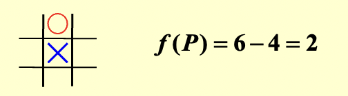

## 倒排索引
1. **组成**

- **词汇表**：所有出现的单词
- **索引表**：出现的文档数+出现的位置（文档编号、文档中的位置编号）

2. **文本预处理**

- 词干提取（还原为词根）
- 去除停用词（`a`,`the`...）

3. **关键技术**

- **词典数据结构**：哈希表、搜索树
- **大规模数据处理**：分区索引（词项分区索引、文档分区索引）
- **动态索引**：更新现有词项或添加新词项、添加辅助索引（用于临时存储新文档）

4. **性能优化**

- **索引压缩**：去除停用词、差分存储（利用文档ID之间的差值进行压缩，大多数间隙可以用远小于20位的位进行编码）
- **检索优化**：
    - **文档截断**：仅返回权重最高的前X篇文档
    - **查询截断**：按词项频率升序排序，选择性处理查询词项

5. **搜索引擎的衡量标准**

- 索引速度有多快
- 搜索速度有多快
- 查询语言的表达性

6. **核心评估指标**

- **精确率**：P = 相关检索数 / 总检索数
- **召回率**：R = 相关检索数 / 总相关文档数

7. **用户满意度**

- **数据**检索性能评估（在确保正确性后）
    - 响应时间
    - 索引空间
- **信息**检索性能评估：答案集的相关性


---
## 回溯算法
1. **思路**：通过系统地生成和检查部分候选解，并在确定该部分解不可能导向最终正确解时，提前放弃该分支（即剪枝），从而减少需要检查的候选解数量
2. **代码模版**

```c
bool Backtracking(int j){
    Found = false;
    if (j > N)
        return true; /* 已找到解 (x_1, …, x_N) */
    // 遍历当前步骤的所有可能选择
    for (each x_i ∈ S_i) {
        /* 检查是否满足约束条件 R */
        OK = Check((x_1, …, x_i), R); /* 剪枝：提前排除无效路径 */
        if (OK) {
            Count x_i in; // 选择 x_i
            Found = Backtracking(i + 1); // 递归处理下一步
            if (!Found)
                Undo(j); /* 回溯：恢复到之前的状态 (x_1, …, x_{i-1}) */
        }
        if (Found) break; // 如果已找到解，提前结束
    }
    return Found;
}
```

3. **典型例题**：

- **八皇后问题**：在8×8棋盘上放置8个皇后，使得它们互不攻击（即不在同一行、列、对角线或反对角线）
- **收费公路重建问题**
    - **问题**：给定 \( N(N-1)/2 \) 个点对之间的距离集合 \( D \)，重建点在 \( x \) 轴上的原始坐标序列 \( x_1 < x_2 < ... < x_N \)（已知 \( x_1 = 0 \)）
    - **算法思路**：
        - 由距离个数确定点的数量 \( N \)
        - 最大距离即为 \( x_N - x_1 \)，则 \( x_N = \max(D) \)
        - 递归地尝试将**剩余的最大距离**放置在当前解集的**最右端** \( X[\text{right}] \) 或**最左端** \( X[\text{left}] \)
        - 每次放置后，检查新产生的距离是否都在剩余距离集合 \( D \) 中，并更新 \( D \)
        - 如果某条路径失败，则**回溯**，撤销该步的距离放置，恢复距离集合 \( D \)
    - **代码**

        ```c
        bool Reconstruct(DistType X[], DistSet D, int N, int left, int right){ 
            /* X[1]...X[left-1] 和 X[right+1]...X[N] 已经确定 */
            bool Found = false;    //返回值：是否找到完整的解
            if (Is_Empty(D))
                return true; /* 问题已解决 */
            D_max = Find_Max(D); // 找出当前最大距离
            /* 选项1: 将最大距离放在右侧 X[right] = D_max */
            /* 检查 |D_max-X[i]| 是否都在距离集合 D 中，对于所有已确定的 X[i] */
            OK = Check(D_max, N, left, right); /* 如果满足约束条件，则返回 true；反之，剪枝 */
            if (OK) { /* 添加 X[right] 并更新距离集合 D */
                X[right] = D_max;
                for (i=1;i<left;i++) Delete(|X[right]-X[i]|,D);// 删除新点与左侧已确定点之间的距离
                for (i=right+1;i<=N;i++) Delete(|X[right]-X[i]|,D);// 删除新点与右侧已确定点之间的距离
                // 递归处理剩余部分
                Found = Reconstruct(X, D, N, left, right - 1);
                if (!Found) { /* 如果此路径不行，撤销操作 */
                    // 恢复被删除的距离
                    for (i=1;i<left;i++) Insert(|X[right]-X[i]|,D);
                    for (i=right+1;i<=N;i++) Insert(|X[right]-X[i]|,D);
                }
            }
            /* 完成选项1的检查 */
            if (!Found) { /* 如果选项1不行 */
                /* 选项2: 将最大距离放在左侧 X[left] = X[N] - D_max */
                OK = Check(X[N] - D_max, N, left, right);
                if (OK) {
                    X[left] = X[N] - D_max;
                    // 删除新点与左侧已确定点之间的距离
                    for (i=1;i<left;i++) Delete(|X[left]-X[i]|,D);
                    // 删除新点与右侧已确定点之间的距离
                    for (i=right+1;i<=N;i++) Delete(|X[left]-X[i]|,D);
                    // 递归处理剩余部分
                    Found = Reconstruct(X, D, N, left + 1, right);
                    if (!Found) {
                        // 恢复被删除的距离
                        for (i=1;i<left;i++) Insert(|X[left]-X[i]|,D);
                        for (i=right+1;i<=N;i++) Insert(|X[left]-X[i]|,D);
                    }
                }
                /* 完成选项2的检查 */
            } /* 完成所有选项的检查 */
            return Found;
        }
        ```

4. **关键策略**

- **最小最大策略**：
    - 通过递归地模拟双方的最佳走法，最终选择对己方最有利的路径
    - e.g. 井字棋：人类玩家试图最小化局面的价值，而计算机则试图最大化它
    - 为了量化一个局面的“好坏”，需要一个**评估函数** \( f(P) \)
        
        \[ f(P) = W_{\text{Computer}} - W_{\text{Human}} \]
        
        !!! tip "Tips"
            {style="width:30%;display: block;margin: 20px auto"}

            \( W_{\text{Computer}} \)：计算机在当前位置 **所有可能获胜的路径** 数量

            \( W_{\text{Human}} \)：人类在当前位置 **所有可能获胜的路径** 数量
            
            1. \( f(P) \) 值越大，说明计算机的潜在优势越大，局面越好
            2. \( f(P) \) 值为正，表示计算机占优
            3. \( f(P) \) 值为负，表示人类占优
            4. \( f(P) = 0 \)，表示双方势均力敌

- \* **Alpha-Beta 剪枝**：对最小最大策略的优化，旨在**减少需要搜索的节点数**
    - **$α$ 剪枝**：在**Max层**，如果发现一个节点的值已经小于父节点已知的$α$值（当前路径已确保的最小收益），则可以剪掉该节点的剩余分支
    - **$β$ 剪枝**：在**Min层**，如果发现一个节点的值已经大于父节点已知的$β$值（当前路径对手已确保的最大损失），则可以剪掉该节点的剩余分支
    - 采用**深度优先**的策略进行搜索

---
## 分而治之

1. **通用递归式** 

\[ T(N) = aT(N/b) + f(N) \]

其中 \(f(N)\) 代表将子问题的解合并成原问题

??? abstract "常见解"
    \( T(N) = 2T(N/2) + cN = O(N\log N) \)
    \(T(N) = 2T(N/2) + cN^2 = O(N^2) \)

2. **解决案例**

- 最大子序列和: 时间复杂度 \(O(N \log N)\)
- 树的遍历: 时间复杂度 \(O(N)\)
- 归并排序和快速排序: 时间复杂度 \(O(N \log N)\)

3. **最近点对问题**

- **问题**：给定平面上的 $N$ 个点，找出距离最近的点对（如果两个点位置相同，则该点对即为最近点对，距离为0）
- **简单穷举搜索法**：检查 \( N(N-1)/2 \) 个点对（时间复杂度 \( T = O(N^2) \)）
- **分而治之**：按 $x$ 坐标排序并进行**划分**，分成左半部分、右半部分以及**跨越分割线**的三部分解来**递归求解**
    - **跨越分割线的解法**：
        - 利用**δ - strip**求解：找到左半部分和右半部分中最短的一段距离，记为 $\delta$ ，在 $(x-\delta, x+\delta)$ 的范围内寻找即可

            {style="width:30%;display: block;margin: 20px auto"}
            
        - 如果带状区域内的点数为 \( O(\sqrt{N}) \)，使用遍历，时间复杂度为 \( O(N) \)

            ```c
            for (i=0; i<NumPointsInStrip; i++)
            for (j=i+1; j<NumPointsInStrip; j++)
                if (Dist(P_i, P_j) < δ)
                δ = Dist(P_i, P_j);
            ```

        - 最坏情况：带状区域内的点数为 \( N \)，遍历并不高效，采取优化策略

            ```c
            /* points are all in the strip */
            /* and sorted by y coordinates */  // 关键：已按y坐标排序
            for (i = 0; i < NumPointsInStrip; i++)
                for (j = i + 1; j < NumPointsInStrip; j++)
                    if (Dist_y(P_i, P_j) > δ)  // 先比较y坐标距离
                        break;                 // 如果y方向已超过δ，直接跳出内循环
                    else if (Dist(P_i, P_j) < δ)
                        δ = Dist(P_i, P_j);
            ```
        
        - 对于任意点 \( p_i \)，最多只需要考虑7个点（这些点与 \( p_i \) 的距离小于 $δ$），从而时间复杂度 \[ f(N) = O(N) \]


4. **递归式求解方法**

\[ T(N) = a \, T(N/b) + f(N) \]

- **假设前提**
    - \(N = b^k\)
    - 当 \(n\) 足够小时，\(T(n) = \Theta(1)\)
- **代入法**：猜测解的形式，并用数学归纳法证明
- **递归树法**：通过画递归树直观理解递归过程


    ??? example "例题"
        {style="width:80%;display: block;margin: 20px auto"}

        {style="width:80%;display: block;margin: 20px auto"}

- **主定理法**：对于 \[ T(N) = a \, T(N / b) + \Theta (N^k \log^p N) \]（其中 \( a \geq 1, \, b > 1, \) 且 \( p \geq 0 \)）

    \[
    T(N) =
    \begin{cases} 
    O(N^{\log_b a}) & \text{若 } a > b^k \\ 
    O(N^k \log^{p+1} N) & \text{若 } a = b^k \\ 
    O(N^k \log^p N) & \text{若 } a < b^k 
    \end{cases}
    \]

    ??? abstract "主定理的几个形式"
        - **原定理**：令 \( a \geq 1 \) 和 \( b > 1 \) 为常数，\( f(N) \) 是一个函数，\( T(N) \) 是在非负整数上由以下递归式定义：

            \[ T(N) = aT(N/b) + f(N) \]

            - 如果对某常数 \( \epsilon > 0 \)，有 \( f(N) = O(N^{\log_b a - \epsilon}) \)，那么 \( T(N) = \Theta(N^{\log_b a}) \)
            - 如果对某个 \( k \geq 0 \)，有 \( f(N) = \Theta(N^{\log_b a} \log^k N) \)，那么 \( T(N) = \Theta(N^{\log_b a} \log^{k+1} N) \)
            - 如果对某常数 \( \epsilon > 0 \)，有 \( f(N) = \Omega(N^{\log_b a + \epsilon}) \)，**并且**满足 \( af(N/b) \leq cf(N) \)（对于某个 \( c < 1 \) 和所有足够大的 \( N \)），那么 \( T(N) = \Theta(f(N)) \)
        - **简单形式**：对于递归式 \( T(N) = aT(N/b) + f(N) \)
            - 如果对于某个常数 \( k < 1 \)，有 \( af(N/b) = kf(N) \)，则 \( T(N) = \Theta(f(N)) \)
            - 如果对于某个常数 \( K > 1 \)，有 \( af(N/b) = Kf(N) \)，则 \( T(N) = \Theta(N^{\log_b a}) \)
            - 如果 \( af(N/b) = f(N) \)，则 \( T(N) = \Theta(f(N)\log_b N) \)
        - **最终可用形式**：见正文