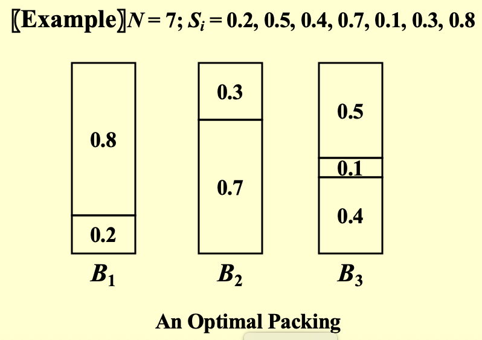
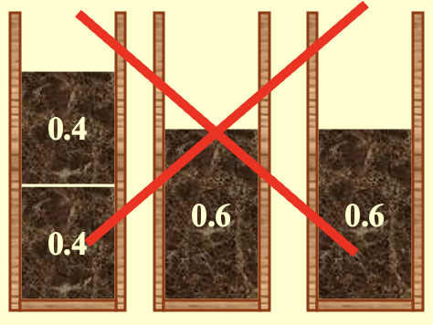

# 近似算法

!!! success "Summary"
    算法设计通常需要在解的最优性、计算效率和适用实例范围之间进行权衡（**即使 $P=NP$，也不可能三个方面都满足**）
    
    近似算法是在保证效率和普适性的前提下，**牺牲部分最优性**的一种方法

1. **目的**：解决**困难问题**

!!! info "NP 完全"
    - 当 $N$ 很小时，指数级复杂度 $O(2^N)$ 是可以接受的
    - 在多项式时间内可以解决某些重要的特殊情况
    - **在多项式时间内找到近似最优解**：近似算法

2. **基本定义**

- **近似比** $\rho(n)$：如果一个算法对于规模为 \(n\) 的任何输入，其产生解的成本 \(C\) 与最优解成本 \(C^{*}\) 的比值在因子 \(\rho(n)\) 之内，即

    \[
    \max\left(\frac{C}{C^{*}},\frac{C^{*}}{C}\right) \leq \rho(n)
    \]

    则该算法具有近似比 \(\rho(n)\)

- 如果一个算法达到了 \(\rho(n)\) 的近似比，我们称其为 **\(\rho(n)\)-近似算法**
- **近似方案**：一种近似算法
    - **定义**：
        - **输入**：问题实例和一个参数 \(\epsilon > 0\) 
        - 使得对于任何固定的 \(\epsilon\)，该方案都是 **\((1+\epsilon)\)-近似算法**
    - **分类**：
        - **多项式时间近似方案（PTAS）**：
            - 对于任何固定的 \(\epsilon > 0\)，该方案在其输入实例的规模 \(n\) 的**多项式时间**内运行 
            - **e.g.** $O(n^{2/\epsilon})$
        - **完全多项式时间近似方案（FPTAS）**：
            - 运行时间关于 $n$ 和 $1/ε$ 都是多项式时间  
            - **e.g.** $O((1/\epsilon)^2 n^3)$

---
## 近似装箱问题
1. **问题**：将 $N$ 个大小不超过1的物品装入最少数量的单位容量箱子中

??? example "Example"
    {style="width:60%;display: block;margin: 20px auto"}

2. **在线算法**

- **定义**：在处理下一个物品**之前**放置一个物品，并且**不能更改决定**
- **`Next Fit`算法**
    - **思路**：只检查上一个箱子是否能存下下一个物品，如果不能，则新建一个箱子
        
        ```c
        void NextFit(){   
            read item1;
            while (read item2) {
                if (item2 can be packed in the same bin as item1)
                    place item2 in the bin;
                else
                    create a new bin for item2;
                item1 = item2;
            } /* end-while */
        }
        ```

    - **定理**：设 $M$ 为打包物品列表 $I$ 所需的最优箱子数，则`next fit`使用的箱子数 $\leq 2M – 1$ ，并且存在某些序列使得`next fit`使用 $2M – 1$ 个箱子 
        
        ??? info "Proof"
            **即证**：如果`Next Fit`生成了 \( 2M \)（或 \( 2M+1 \)）个箱子，那么最优解必须至少生成 \( M+1 \) 个箱子

            设 \( S(B_i) \) 为第 \( i \) 个箱子中物品的大小之和。那么必须有：
            
            \[
            \begin{gathered}
            S(B_1) + S(B_2) > 1 \\
            S(B_3) + S(B_4) > 1 \\
            \cdots\cdots\cdots \\
            S(B_{2M-1}) + S(B_{2M}) > 1
            \end{gathered}
            \]

            **最优解至少需要 \(\lceil\)所有物品总大小/1\(\rceil\) 个箱子**

            \[
            \lceil \sum_{i=1}^{2M} S(B_i) \rceil \geq M+1
            \]

- **`First Fit`算法**
    - **思路**：扫描第一个能装下当前物品的箱子
         
        ```c
        void FirstFit(){   
            while (read item) {
                scan for the first bin that is large enough for item;
                if (found)
                    place item in that bin;
                else
                    create a new bin for item;
            } /* end-while */
        }
        ```
    
    - **时间复杂度**： $O(N \log N)$
    - **定理**：设 $M$ 为打包物品列表 $I$ 所需的最优箱子数，则`first fit`使用的箱子数 $\leq 1.7M$ ，并且存在某些序列使得`first fit`使用 $1.7(M-1)$ 个箱子 

- **`Best Fit`算法**
    - **思路**：放入最紧的箱子（即能放下该物品并且剩余空间最小）
    - **时间复杂度**：$O(N \log N)$
    - 使用的箱子数 $\leq 1.7M$ 

!!! warning "局限性"
    1. **局限性**：看不到全部数据（未来的数据），**只能根据当前数据**进行求解；永远不知道输入何时可能结束
    2. **没有**在线算法总能给出最优解
    3. **定理**：存在一些输入，迫使**任何在线装箱算法**使用**至少 $5/3$ 倍**的最优箱子数
    
    !!! example "Example 1"
        $$
        \begin{aligned}
        S_i = \{1/7+ε, 1/7+ε, 1/7+ε, 1/7+ε, 1/7+ε, 1/7+ε, \\
        1/3+ε, 1/3+ε, 1/3+ε, 1/3+ε, 1/3+ε, 1/3+ε, \\
        1/2+ε, 1/2+ε, 1/2+ε, 1/2+ε, 1/2+ε, 1/2+ε\}
        \end{aligned}
        $$
        
        其中 $\epsilon = 0.001$
        
        1. **最优解**：需要6个箱子
        2. **但是**所有三种在线算法都需要10个箱子
    
    !!! example "Example 2"
        $$
        S_i=\{0.4,0.4,0.6,0.6\}
        $$

        {style="width:40%;display: block;margin: 20px auto"}

3. **离线算法**

- **定义**：在给出答案之前**查看整个物品列表**
- **麻烦制造者**：大尺寸物品
- **`First/Best Fit Decreasing`算法**：将物品按大小**非递增序列**排序，然后使用**`First/Best Fit`**算法
- **定理**：设 $M$ 为打包物品列表 $I$ 所需的最优箱子数，则`first fit decreasing`使用的箱子数 $\leq 11M/9+6/9$ ，并且存在某些序列使得`first fit decreasing`使用 $11M/9+6/9$ 个箱子
  
---
## 背包问题
### 分数版本

1. **问题**：

- 有一个容量为 $M$ 的待装背包，给定 $N$ 个物品
- 每个物品 $i$ 有一个重量 $w_i$ 和一个利润 $p_i$
- 如果 $x_i$ 是物品 $i$ 被打包的百分比，那么打包该物品的利润将是 $p_i x_i$
- 求解背包中打包的物品能获得的**最大利润**

2. **贪心策略**：每次选择**最大利润密度 $pi/wi$** 的物品

!!! example "Example"
    **Problem**: $$n=3, M=20,\, (p_1,p_2,p_3)=(25,24,15),\,(w_1,w_2,w_3)=(18,15,10)$

    **Solution**: $(x_1,x_2,x_3)=(0,1,1/2)$ 且 $P=31.5$

### 0-1/整数版本
!!! error "Notice"
    1. 整数版本的背包问题是**NP-hard问题**！！！
    2. 物品不可分割

1. **贪心算法**

!!! warning "贪心算法反例"
    贪心策略（按**最大利润或利润密度**）不能保证最优！！！

    !!! example "Example"
        **Problem**: 
        
        - $n = 5$, $M = 11$
        - $(p_1, p_2, p_3, p_4, p_5) = (1, 6, 18, 22, 28)$
        - $(w_1, w_2, w_3, w_4, w_5) = (1, 2, 5, 6, 7)$

        **最优解：**$(0, 0, 1, 1, 0)$, $P = 40$

        **贪心解：**$(1, 1, 0, 0, 1)$, $P = 35$

- **近似比**：贪心算法是**2-近似的**
    
??? info "证明"
    !!! note "定义"
        1. $p_{max}$ = 单个物品的最大价值
        2. $P_{opt}$ = 最优解的总价值
        3. $P_{frac}$ = 分数背包问题的最优解总价值
        4. $P_{greedy}$ = 0-1背包问题的贪心算法解的总价值

    **证明**：已知
    
    $$
    \begin{gathered}
    p_{max} ≤ P_{opt} ≤ P_{frac} \\
    p_{max} ≤ P_{greedy}\\
    P_{frac} ≤ P_{greedy} + p_{max}
    \end{gathered}
    $$
    
    则
    
    $$
    P_{opt} / P_{greedy} ≤ 1 + p_{max} / P_{greedy} ≤ 1 + 1 = 2
    $$

2. **动态规划解法**

- $W_{i,p}$ = 从前 $i$ 个物品中恰好获取总利润 $p$ 所需的**最小重量**

    \[
    W_{i,p} =
    \begin{cases}
    \infty & i = 0 \\
    W_{i-1,p} & p_i > p \\
    \min\{W_{i-1,p}, w_i + W_{i-1,p-p_i}\} & \text{其他情况}
    \end{cases}
    \]

    其中 \( i = 1, ..., n \) 且 \( p = 1, ..., n \, p_{\max}\)

- **时间复杂度**：$O(n^2 p_{max})$

    !!! warning "Notice"
        - 当利润值很大时，DP效率很低
        - **解决方案**：对利润值进行**四舍五入**，以精度换取效率
            
            \[
            (1 + \epsilon) P_{alg} \leq P
            \]

            其中 $\epsilon$ 为精度系数，$P_{alg}$ 为四舍五入之后算法的解，$P$ 为实际解

## K中心问题
!!! error "Notice"
    不太完整！

1. **问题定义**：从 $n$ 个站点中选择 $K$ 个中心 $C$ ，使得任意站点到其最近中心的最大距离（**覆盖半径**）最小

??? abstract "距离性质"
    1. **自反性** $dist(x,x)=0$
    2. **对称性** $dist(x,y)=dist(y,x)$
    3. **三角不等式** $dist(x,y)\leq dist(x,z)+dist(z,y)$
    4. **$s_i$ 到最近中心的距离**：$dist(s_i,C)=min_{c \in C} \{dist(s_i,c)\}$
    5. **最小覆盖半径**：$r(C)=max_i \{dist(s_i,C)\}$

2. **贪心算法（Greedy-Kcenter）**

- **直觉贪心**：将第一个中心放置在对于**单个中心**而言的最佳可能位置，然后持续添加中心，每次**尽可能大地减少覆盖半径**

    !!! warning "Notice"
        对于单个中心可行；但是对于多个中心，效果非常差

        {style="width:40%;display: block;margin: 20px auto"}

- **Greedy-2r 判定算法**：
    - **步骤**
        - 猜测半径 $r$
        - 反复从**未覆盖集合** $S'$ 里任选一个点 $s$ 加入中心集 $C$，并删除所有距离 $s$ 不超过 $2r$ 的点
        - 最后如果 $|C|\leq K$ 则返回，否则**报错**
    - **定理**：若 Greedy-2r 选出了超过 $K$ 个中心，则对任意 $|C^*|\leq K$，都有 $r(C^*)>r$ （即**半径 $r$ 不可能实现 K-center 覆盖**）
    - 该贪心算法是**2-近似的**：返回的解满足 $r(C) \leq 2 \cdot r(C^*)$

    !!! abstract "二分查找"
        设 $0<r\leq r_{max}$，二分查找**猜** $r$  
	    
        - 每次调用 Greedy-2r
	        - 用半径 $2r$ 能找到 $≤K$ 个中心 → $r$ 可能偏大，**缩小上界**
	        - $r$ 太小，**增大下界**
        - 最终得到区间 $r_0<r\leq r_1$
        - **输出半径为 $2r_1$** （因为是**被证明可行**的半径的下界）

- **Farthest-first 贪心**：
    - **步骤**（在Greedy-2r 算法的基础上改变）
        - 任意选择一个点作为第一个中心
        - 接下来每次选择**距离当前中心集合最远**的点作为下一个中心，直到选出 $K$ 个中心
    - 该贪心算法仍然是**2-近似的**

3. **定理**：除非 $P = NP$，否则不存在比**2-近似算法**更好的多项式时间算法