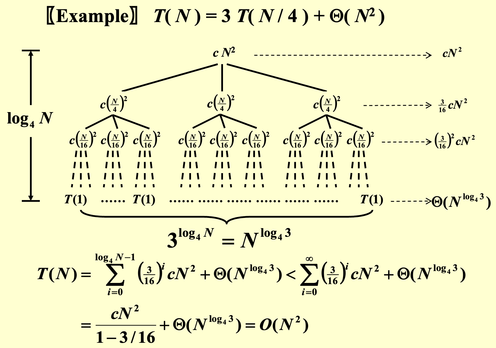
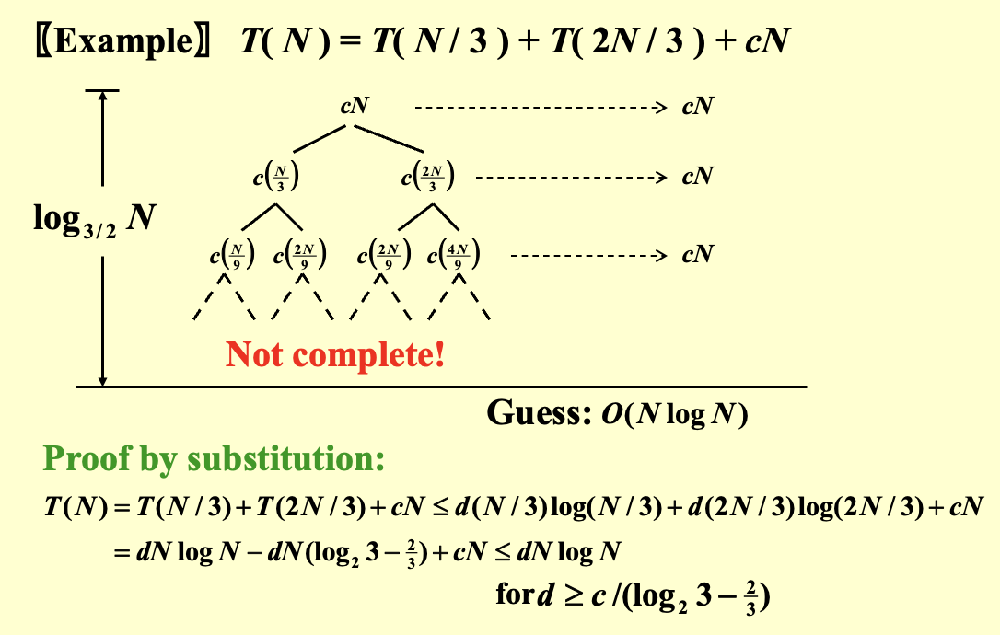
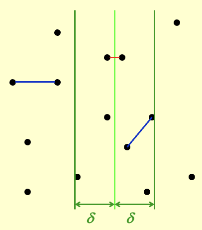

# 分而治之
**解决案例**：

- 最大子序列和: 时间复杂度 \(O(N \log N)\)
- 树的遍历: 时间复杂度 \(O(N)\)
- 归并排序和快速排序: 时间复杂度 \(O(N \log N)\)

---
### 通用递归式

\[ T(N) = aT(N/b) + f(N) \]

其中 \(f(N)\) 代表将子问题的解合并成原问题

??? abstract "常见解"
    \( T(N) = 2T(N/2) + cN = O(N\log N) \)

    \(T(N) = 2T(N/2) + cN^2 = O(N^2) \)

---
## 递归式求解方法

\[ T(N) = a \, T(N/b) + f(N) \]

1. **假设前提**
    - \(N = b^k\)
    - 当 \(n\) 足够小时，\(T(n) = \Theta(1)\)
2. **代入法**：猜测解的形式，并用数学归纳法证明
3. **递归树法**：通过画递归树直观理解递归过程


    ??? example "递归树例题"
        {style="width:80%;display: block;margin: 20px auto"}

        {style="width:80%;display: block;margin: 20px auto"}

4. **主定理法**：对于 \( T(N) = a \, T(N / b) + \Theta (N^k \log^p N) \)（其中 \( a \geq 1, \, b > 1, \) 且 \( p \geq 0 \)）

\[
T(N) =
\begin{cases} 
O(N^{\log_b a}) & \text{若 } a > b^k \\ 
O(N^k \log^{p+1} N) & \text{若 } a = b^k \\ 
O(N^k \log^p N) & \text{若 } a < b^k 
\end{cases}
\]

??? abstract "主定理的几个形式"
    - **原定理**：令 \( a \geq 1 \) 和 \( b > 1 \) 为常数，\( f(N) \) 是一个函数，\( T(N) \) 是在非负整数上由以下递归式定义：

        \[ T(N) = aT(N/b) + f(N) \]

        - 如果对某常数 \( \epsilon > 0 \)，有 \( f(N) = O(N^{\log_b a - \epsilon}) \)，那么 \( T(N) = \Theta(N^{\log_b a}) \)
        - 如果对某个 \( k \geq 0 \)，有 \( f(N) = \Theta(N^{\log_b a} \log^k N) \)，那么 \( T(N) = \Theta(N^{\log_b a} \log^{k+1} N) \)
        - 如果对某常数 \( \epsilon > 0 \)，有 \( f(N) = \Omega(N^{\log_b a + \epsilon}) \)，**并且**满足 \( af(N/b) \leq cf(N) \)（对于某个 \( c < 1 \) 和所有足够大的 \( N \)），那么 \( T(N) = \Theta(f(N)) \)
    - **简单形式**：对于递归式 \( T(N) = aT(N/b) + f(N) \)
        - 如果对于某个常数 \( k < 1 \)，有 \( af(N/b) = kf(N) \)，则 \( T(N) = \Theta(f(N)) \)
        - 如果对于某个常数 \( K > 1 \)，有 \( af(N/b) = Kf(N) \)，则 \( T(N) = \Theta(N^{\log_b a}) \)
        - 如果 \( af(N/b) = f(N) \)，则 \( T(N) = \Theta(f(N)\log_b N) \)
    - **最终可用形式**：见正文

---
## 最近点对问题
1. **问题**：给定平面上的 $N$ 个点，找出距离最近的点对（如果两个点位置相同，则该点对即为最近点对，距离为0）
2. **简单穷举搜索法**：检查 \( N(N-1)/2 \) 个点对（时间复杂度 \( T = O(N^2) \)）
3. **分而治之**：按 $x$ 坐标排序并进行**划分**，分成左半部分、右半部分以及**跨越分割线**的三部分解来**递归求解**
    - **跨越分割线的解法**：
        - 利用**δ-strip**求解：找到左半部分和右半部分中最短的一段距离，记为 $\delta$ ，在 $(x-\delta, x+\delta)$ 的范围内寻找即可

            {style="width:30%;display: block;margin: 20px auto"}
           
        - 如果带状区域内的点数为 \( O(\sqrt{N}) \)，使用遍历，时间复杂度为 \( O(N) \)

            ```c
            for (i=0; i<NumPointsInStrip; i++)
            for (j=i+1; j<NumPointsInStrip; j++)
                if (Dist(P_i, P_j) < δ)
                δ = Dist(P_i, P_j);
            ```

        - 最坏情况：带状区域内的点数为 \( N \)，遍历并不高效，采取优化策略

            ```c
            /* points are all in the strip */
            /* and sorted by y coordinates */  // 关键：已按y坐标排序
            for (i = 0; i < NumPointsInStrip; i++)
                for (j = i + 1; j < NumPointsInStrip; j++)
                    if (Dist_y(P_i, P_j) > δ)  // 先比较y坐标距离
                        break;                 // 如果y方向已超过δ，直接跳出内循环
                    else if (Dist(P_i, P_j) < δ)
                        δ = Dist(P_i, P_j);
            ```
       
        - 对于任意点 \( p_i \) ，最多只需要考虑7个点（因为这些点与 \( p_i \) 的距离小于 $δ$），从而时间复杂度 \( f(N) = O(N) \)
