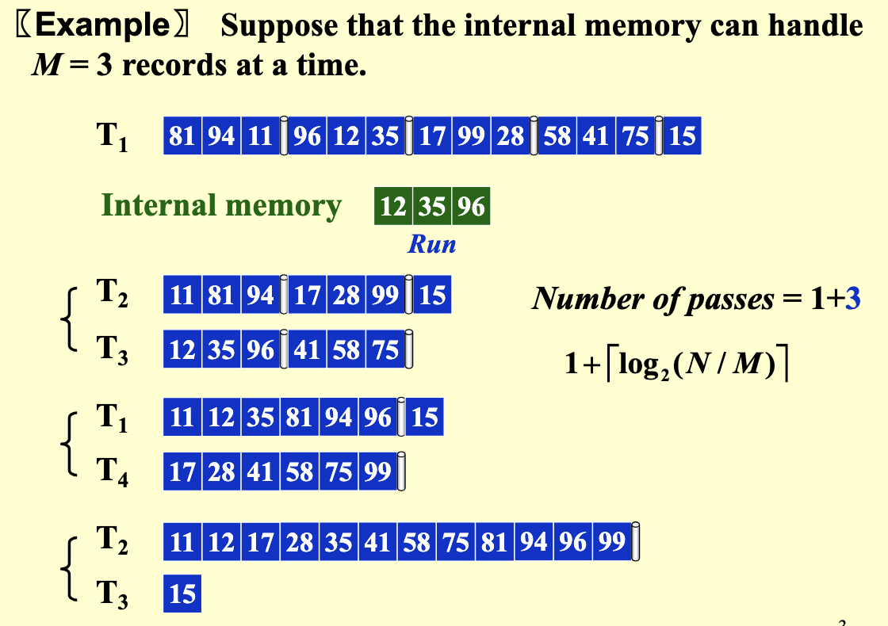
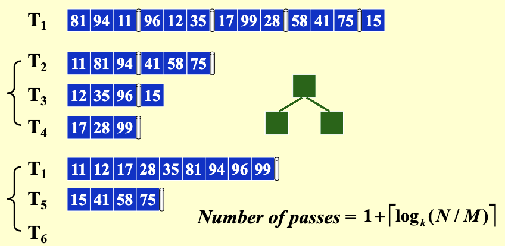
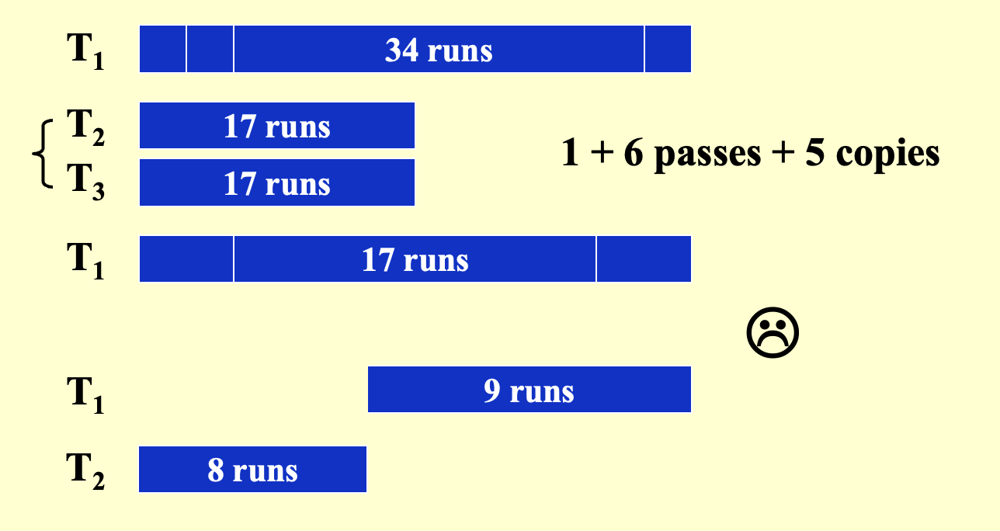
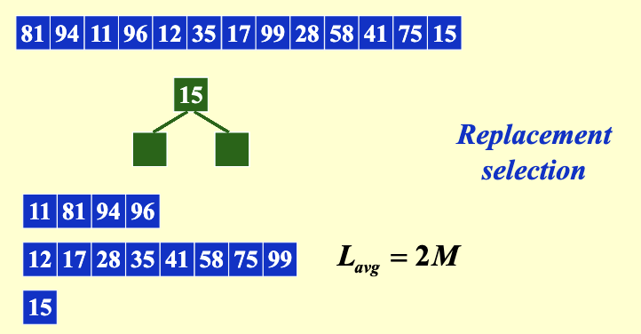
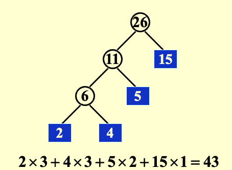

# 外部排序

!!! warning "Warning"
    当数据规模大到**无法全部放入内存**时，如何进行排序？

    数据主要存放在**磁盘或磁带等外部存储介质**上

1. **为什么不能直接在磁盘上执行快速排序？**

- 当访问 `a[i]` 时
    - **内存**：直接定位地址 $O(1)$
    - **硬盘**：需要定位盘片，寻找磁道（track），寻找扇区（sector），找到 `a[i]` 并传输（**时间很长！！！**）
- **过程依赖具体的硬件设备**

2. **解决方法**：归并排序

- **简化版**
    - 将数据存放在**磁带**上（只能顺序访问）
    - 假设至少有3个磁带驱动器

3. **示例**

- **假设**：
    - 内存只能放3个数据 $M = 3$，数据初始放在磁带 $T_1$ 中
    - 有很好的排序算法，不需要消耗太多其他的内存
- **步骤**：
    - 按顺序读入磁带 $T_1$ 的三个数据，排序好后，将排好序的数据**放在 $T_2$ 中**
    - 接着读入 $T_1$ 的下一个三个数据，排序好后，将排好序的数据**放在 $T_3$ 中**
    - 以此类推，生成多个有序子队列（runs）
    - **归并排序**：
        - 归并 $T_2$ 和 $T_3$ 中的前三个数据，放入 $T_1$ 中
        - 归并 $T_2$ 和 $T_3$ 中的紧接着三个数据，**放入 $T_4$ 中**
        - 以此类推，重复多次得到最终结果
- **磁带数**：4
- **数据被完整扫描（读+写）的轮数**（number of passes）：合并次数+1
    - 直接影响 **I/O 成本**
    - **一般公式**： $1+\lceil \log_2 (N/M) \rceil$

!!! example "Example"
    {style="width:80%;display: block;margin: 20px auto"}

    number of passes: 1+3

4. **外部排序的主要开销**

- 寻找时间（慢）：O(number of passes)
- 读/写一个块的时间（慢）
- 内存内部排序 $M$ 条数据的开销
- 将 $N$ 条记录从输入缓冲区合并到输出缓冲区的时间

!!! tip "Tip"
    计算机可以**并行执行** I/O 与 CPU 操作

5. **目标**

- 减少 number of passes
- **合并** run 时更快地写入硬盘
- 利用缓冲区实现**并行**
- 改进 run 的生成方式

---
## k 路归并

1. 合并多条磁带上的数据时，使用**最小堆结构**
2. **number of passes** = $1+\lceil \log_k (N/M) \rceil$
3. **优点**：可以减小 number of passes
4. **缺点**：需要 $2k$ 条磁带

!!! example "Example"
    {style="width:60%;display: block;margin: 20px auto"}

---
## 减少磁带数

!!! info "Question"
    **问题**：能否只用3个磁带完成2路归并？

    - **直接均分 runs 会导致效率低**：需要先合并，再copy一半到另一条磁带
       
        !!! warning "Warning"
            {style="width:60%;display: block;margin: 20px auto"}

    - 更聪明的方法：**不均匀拆分 runs**（不用进行copy！！！）

1. **断言 1**：如果 runs 数是斐波那契数 $F_n$，**最优拆分方式**是 $F_{n-1}$ + $F_{n-2}$

2. **断言 2**：对于 k 路归并，有 $k$ 阶斐波那契数 $F_N^k = F_{N-1}^{(k)} + F_{N-2}^{(k)} + \cdots + F_{N-k}^{(k)}$ 

- 其中 $F_N^{(k)} = 0$，$F_{k-1}^{(k)} = 1$
- **最优拆分方式**：按照 $k$ 阶斐波那契数 
- 只需要 $k+1$ 个磁带即可完成 $k$ 路归并

!!! warning "Warning"
    如果 runs 的数目不是斐波那契数，**补空气**，直到是斐波那契数

---
## 并行

1. **问题**：对一个包含3250条数据的文件进行排序，使用一台内存最大可排序750条数据的计算机，输入文件的块大小为250条数据

!!! note "解"
    1. 内存中可以放3块数据
    2. 将内存分为：输入缓冲区（500）、输出缓冲区（250）
    3. **归并排序**输入缓冲区中的两块数据，将数据依次写入输出缓冲区
    4. 输出缓冲区写满之后，一次性写入硬盘（只进行了一次I/O操作，大大减少了I/O操作）

2. **缺点**：写和读硬盘的时候无法进行排序，效率低

3. **改进方法**：将两个缓冲区都变成双倍

- 对于 k 路归并，我们需要 2k 个输入缓冲区 和 2 个输出缓冲区来支持并行操作

!!! abstract "Notice"
    1. 超过某个 k 值后，I/O 时间实际上会增加，即使 number of passes 减少
    2. 最优的 k 值显然取决于磁盘参数以及可用于缓冲区的内存大小

---
## 替换选择

1. **目的**：生成更长的 runs
2. **方法**：利用最小堆

- 读入3个数据，利用最小堆输出最小元素
- 读入下一个元素，**如果比输出的最小元素小，不放入最小堆，直到全部输出**

!!! example "Example"
    {style="width:60%;display: block;margin: 20px auto"}

3. **run 的平均长度**： $L_{avg} = 2M$ （相当于number of passes中的 $M$）
4. 当输入数据**接近有序**时，替换选择非常强大，适用于外部排序

---
## 哈夫曼树
1. **目标**：多路归并时，合理安排合并顺序，最小化合并时间

2. **示例**：**假设**有4个长度分别为2、4、5、15的runs

{style="width:30%;display: block;margin: 20px auto"}

3. **总合并时间**：$O ($ 加权外部路径长度 $)$
