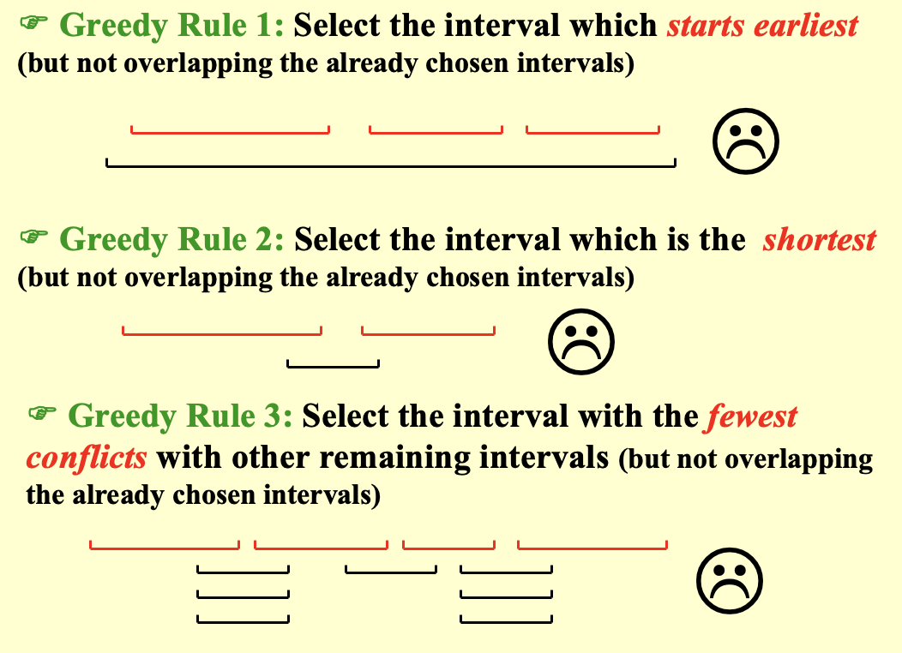

# 贪心算法

!!! warning "Notices"
    1. 仅当**局部最优等于全局最优**时，贪心算法才**有效**
    2. 贪心算法**不能保证获得最优解**
    3. 然而通常能产生非常接近最优解值的解，因此当**寻找最优解耗时过长**时，它很直观且合适

---
## 活动选择问题

1. **问题描述**

- 给定一个活动集合 $S=\{ a_1,a_2,\cdots,a_n \}$
- 每个活动 $a_i$ 都发生在一个时间区间 $[s_i,f_i)$ 内
- 这些活动希望使用一个资源，选择**尽量多**的互相不重叠的活动

!!! info "假设和定义"
    1. 如果 $s_i \geqslant f_j$ 或 $s_j \geqslant f_i$（即时间区间不重叠），则 $a_i$ 和 $a_j$ 两个活动是**兼容的**
    2. **假设** $f_1 \leqslant f_2 \leqslant \cdots \leqslant f_n$

2. **解决方案**

- **DP 解法**
    - 定义**二维DP表**：$c[i][j]$ 为活动 $a_i$ 和 $a_j$ 之间（不包括$a_i$ 和 $a_j$）可选择的最大活动数
    - **状态转移公式**：
    
        $$
        c_{ij} =
        \begin{cases}
        0, &  S_{ij} = \varnothing \\
        \max_{a_k \in S_{ij}}
        \left\{ c_{ik} + c_{kj} + 1 \right\},
        & S_{ij} \neq \varnothing
        \end{cases}
        $$ 

    - **时间复杂度**：$O(N^2)$

- **贪心规则 1**：选择**开始最早**且不与已选区间重叠的活动
- **贪心规则 2**：选择**最短**但不与已选区间重叠的活动
- **贪心规则 3**：选择**与剩余其他区间冲突最少**且不与已选区间重叠的活动

!!! danger "Error"
    贪心规则1、2、3**都不能得到最优解**，反例如下

    ??? example "Example"
        {style="width:60%;display: block;margin: 20px auto"}

- **贪心规则 4**：选择**结束最早**但不与已选区间重叠的活动
    - **定理**：考虑任何非空子问题 $S_k$，令 $a_m$ 是 $S_k$ 中最早结束的活动，那么 $a_m$ 被包含在 $S_k$ 的**某个**最大规模的**相互兼容**活动子集中
    - **时间复杂度**：$O(N \log N)$（来源于排序而不是贪心）

!!! success "Success"
    贪心规则4可以得到最优解，因为**资源可以尽快释放**

!!! abstract "Notice"
    1. 在几乎所有贪心算法的背后，都存在一个更加繁琐但可靠的动态规划解法
    2. 但是如果是**有权问题**，贪心算法不一定能得到正确解，动态规划可以得到最优解

---
## Huffman 编码

1. **用途**：对数据进行无损压缩
2. **基本思想**：为出现频率较高的字符分配较短的编码，为出现频率较低的字符分配较长的编码
3. **编码方式**：前缀码（任何一个字符的编码都不是另一个字符编码的前缀，保证了**无歧义编码**）
4. **成本计算**

- 一个字符的编码长度等于它在树中的深度 $d_i$ （**编码长度最大为 $n-1$**）
- **编码总成本**：$Cost = \sum (f_i × d_i)$

5. **时间复杂度**：$O(N \log N)$，其中 $N$ 为字符数

!!! info "引理"
    1. **贪心选择性质**：令 $x$ 和 $y$ 是频率最低的两个字符，那么存在一棵最优前缀码树，其中 $x$ 和 $y$ 是**深度最大且为兄弟节点**的两个叶子节点
    2. **最优子结构性质**：
    
    - 将 $x$ 和 $y$ 合并为一个新节点 $z$（`z.freq = x.freq + y.freq`），得到一个新字母表 $C'$ 
    - 设 $T'$ 是 $C'$ 的最优前缀码树，那么将 $T'$ 中的 $z$ 节点展开为具有孩子 x 和 y 的内节点后得到的树 $T$，是原字母表 $C$ 的最优前缀码树
