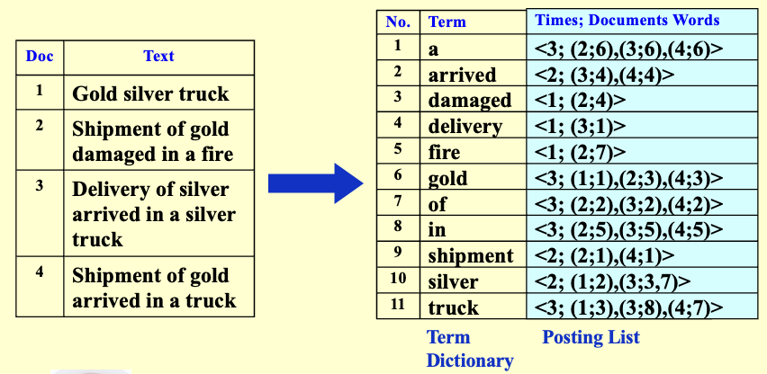

# 倒排索引
1. **概念**：由词查找文档

- **索引**（Index）：用于在文本中定位某个给定词项（term）
- **倒排文件**（Inverted file）：包含一个指针列表（例如页码），指向该词项在文本中出现的所有位置

2. **组成**

- **词典**：所有出现的单词
- **倒排表**：出现该词的文档数+出现的位置（文档编号、文档中的位置编号）

!!! example "Example"
    

3. **构建过程**

```c
while (read a document D) {
    while (read a term T in D) {    // Token Analyzer & Stop Filter
        if (Find(Dictionary, T) == false)   // Vocabulary Scanner
            Insert(Dictionary, T);          // Dictionary Insertor
        Get T’s posting list;
        Insert a node to T’s posting list;
    }
}
Write the inverted index to disk;           // Memory Management
```

**核心功能模块**：

- 分词器`Token Analyzer`
- 停用词过滤`Stop Filter`：过滤掉在搜索中没有实际意义的常见词，如"的"、"a"、"the"
- 词汇表扫描器`Vocabulary Scanner`
- 词汇表插入器`Vocabulary Insertor`
- 内存管理`Memory management`


??? abstract "内存不足时的倒排索引"
    ```c
    BlockCnt = 0; 
    while ( read a document D ) {
        while ( read a term T in D ) {
            if ( out of memory ) {
                Write BlockIndex[BlockCnt] to disk;
                BlockCnt ++;
                FreeMemory;
            }
            if ( Find( Dictionary, T ) == false )
                Insert( Dictionary, T );
            Get T’s posting list;
            Insert a node to T’s posting list;
        }
    }
    for ( i=0; i<BlockCnt; i++ )
        Merge( InvertedIndex, BlockIndex[i] );
    ```

    当内存装不下整个倒排索引时，把索引分块写到磁盘，最后再把这些块按词项顺序归并成一个完整的倒排索引

4. **文本预处理**

- **词干提取**（stemming）（还原为词根）：提高召回率，降低精确率
- **去除停用词**（`a`,`the`...）

5. **关键技术**

- **词典数据结构**（用于访问词）：哈希表、搜索树

    !!! abstract "**Pros & Cons**"
        |  | **Hashing** | **Search Trees** |
        |:--|:--|:-----|
        | **查找速度** | 平均 O(1)，非常**快** | O(log n)，较快但略慢于哈希 |
        | **是否有序** | 无序，**不支持范围或前缀查询** | 有序，可支持排序、范围查找、前缀匹配 |
        | **内存利用率** | 可能浪费空间（哈希桶未满） | 节点结构紧凑，**空间利用率较高** |
        | **插入/删除** | 操作简单，速度**快** | 需要维护树的平衡，稍慢 |
        | **扩展性** | 当数据量增大时可能需要**重哈希**（rehash） | 可随数据量增长自然扩展 |
        | **实现复杂度** | 简单 | 相对**复杂**（尤其是平衡树、前缀树 Trie） |
        | **适用场景** | 精确匹配查询 | 排序查询、前缀查询、范围检索 |
        | **总体评价** | 哈希速度快但功能有限 | 搜索树功能丰富但开销稍大 |

- **大规模数据处理**：分区索引（词项分区索引、文档分区索引）
- **动态索引**：辅助索引临时存储新文档，达到一定大小/时间再合并入主索引


6. **性能优化**

- **索引压缩**（compression）：去除停用词、**差分存储**（利用**文档ID之间的差值**进行压缩，大多数间隙可以用远小于20位的位进行编码）
- **阈值检索**（Thresholding）：
    - **文档截断**：仅返回权重最高的前 $x$ 篇文档
        - 不适用于布尔查询
        - 由于截断，可能会遗漏部分相关文档
    - **查询截断**（Query）：按词项频率**升序**排序，选择性处理查询词项（优先选择**较稀有**的词项进行搜索）

7. **搜索引擎的衡量标准**

- 索引速度有多快
- 搜索速度有多快
- 查询语言的表达性
- **用户满意度**
    - **数据**检索性能评估（在确保正确性后）
        - 响应时间
        - 索引空间
    - **信息**检索性能评估：答案集的相关性
        - **核心评估指标**
            - **精确率**：P = 相关检索数 / 总检索数
            - **召回率**：R = 相关检索数 / 总相关文档数

