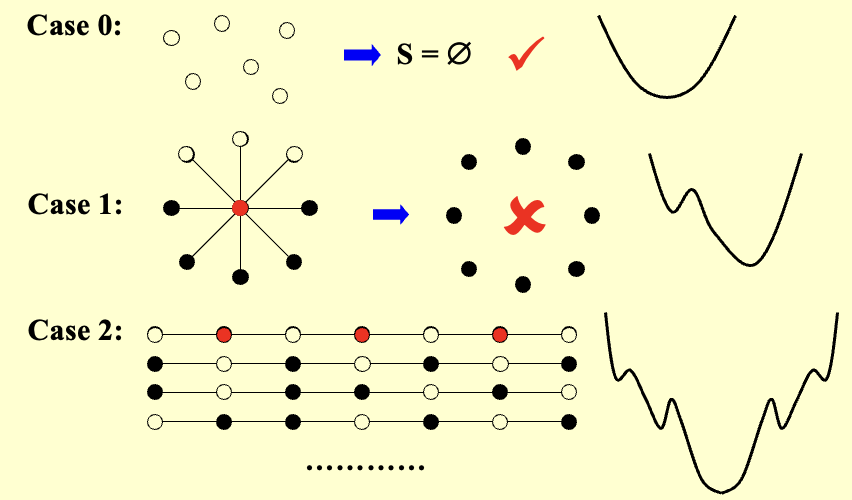
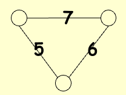

# 局部搜索

1. **定义**

- **局部性**
    - 在可行解集中定义**邻域**
    - **局部最优解**是邻域中的最优解
- **搜索**
    - 从一个可行解开始，并在其邻域中搜索更好的解
    - 当无法进一步改进时，即达到局部最优解

2. **邻居关系**
 
- $S \sim S'$ ：$S'$ 是 $S$ 的邻居解（ $S'$ 可以通过对 $S$ 进行微小的修改得到）
- $N(S)$ ：$S$ 的邻域——集合 $\{ S': S \sim S' \}$

---
## 梯度下降算法

1. **定义**：梯度下降（在局部搜索中）是一种贪心改进策略，通过不断移动到**当前解的最优邻域解**来寻找局部最优解

2. **代码**

```c
SolutionType Gradient_descent(){ 
    从可行解集 FS 中的可行解 S 开始；  
    MinCost = cost(S);  
    while (1) {  
        S' = Search(N(S)); /* 在 N(S) 中找到最优的 S' */  
        CurrentCost = cost(S');  
        if (CurrentCost < MinCost) {  
            MinCost = CurrentCost; 
            S = S';  
        }  
        else break;  
    }  
    return S;  
}
```

### 顶点覆盖问题

1. **问题**：给定一个无向图 $G=(V,E)$ ，找到一个最小的顶点集合 $S$ ，**对于每条边，至少有一个顶点在集合中**

!!! info "相关定义"
    1. **可行解集** \(\mathcal{FS}\)：所有能覆盖图中每条边的顶点子集
    2. **成本函数**：\(cost(S) = |S|\)
    3. **邻居关系** \(S \sim S'\)：\(S'\) 可以通过在 \(S\) 中添加或删除一个节点得到
    4.  每个顶点覆盖 \(S\) 最多有 \(|V|\) 个邻居

2. **搜索过程**：从 \(S = V\) 开始，删除一个节点并检查 \(S'\) 是否是一个成本更小的顶点覆盖，如果是，直接应用

!!! warning "warning"
    有的情况下，无法得到局部最优解

    {style="width:60%;display: block;margin: 20px auto"}

### 改进：Metropolis 算法

**引入概率**:

$$
p=e^{\frac{-\Delta cost}{kT}}
$$

其中定义常量：

- $k$：玻尔兹曼常数（理论中用，算法中常取 1）
- $T$：温度参数，控制接受较差解的概率

```c
SolutionType Metropolis(){   
    Define constants k and T;
    Start from a feasible solution S in FS ;
    MinCost = cost(S);
    while (1) {
        S’ = Randomly chosen from N(S); 
        CurrentCost = cost(S’);
        if ( CurrentCost < MinCost ) {
            MinCost = CurrentCost;    S = S’;
        }
        else {
            With a probability p , let S = S’;      // 以一定概率 p 接受该“较差解”
            else  break;
        }
    }
    return S;
}
```

---
## 模拟退火算法
`Simulated Annealing`：材料从高温开始，非常缓慢地冷却，使其有足够时间在一系列逐步降低的中间温度下达到平衡

### 霍普菲尔德神经网络

1. **问题**：图 $G = (V, E)$ 具有整数边权重 $w$（可为正或负）
    
- 若 \( w_e < 0 \)，其中 $e = (u, v)$，则 $u$ 和 $v$ 需要处于**相同状态**（+1/-1）
- 若 \( w_e > 0 \)，则 $u$ 和 $v$ 需要处于**不同状态**
- 绝对值 \( |w_e| \) 表示该要求的强度

2. **输出**：网络的一个配置 $S$ ——每个节点 $u$ 的状态 \( s_u \) 分配 

!!! warning "Warning"
    可能**不存在**满足所有边要求的配置，只需要寻找一个**足够好**的配置。

    {style="width:20%;display: block;margin: 20px auto"}

3. **相关定义**

- 在配置 $S$ 中，边 $e = (u, v)$ 是**好边**，如果 $w_e s_u s_v < 0$（即当且仅当 $w_e < 0$ 时 $s_u = s_v$ ）；否则是**坏边**
- 在配置 $S$ 中，节点 $u$ 是**满足的**，如果与其关联的**好边**的权重之和 $\geq$ 与其关联的**坏边**的权重之和  

    $$
    \sum_{v: e = (u, v) \in E} w_e s_u s_v \leq 0
    $$

- 如果所有节点都满足，则该配置是**稳定的**

4. **状态翻转算法**

```c
ConfigType State_flipping(){
    从任意配置 S 开始;
    while ( ! IsStable(S) ) {    // 如果不稳定
        u = GetUnsatisfied(S);   // 获取一个不满足的节点
        s_u = -s_u;              // 翻转该节点的状态
    }
    return S;
}
```

- **断言 1**：状态翻转算法**最多**在 $W= \sum_{e} |w_e|$ 次迭代后终止于一个稳定配置

    ??? success "证明"
        考虑进展度量

        $$
        \Phi(S) = \sum_{e 是好边} |w_e|
        $$

        当节点 \( u \) 翻转状态（\( S \) 变为 \( S' \)）时：

        - 所有与 \( u \) 相关的好边变为坏边
        - 所有与 \( u \) 相关的坏边变为好边
        - 所有其他边保持不变

        $$
        \Phi(S') = \Phi(S) - \sum_{\begin{array}{c}
        e:e=(u,v)\in E \\
        e 是坏边
        \end{array}} |w_e| + \sum_{\begin{array}{c}
        e:e=(u,v)\in E \\
        e 是好边
        \end{array}} |w_e|
        $$

        显然 $0 \leq \Phi(S) \leq W$

- **断言 2**：在状态翻转算法中，**任何最大化 $\Phi$ 的局部极大值都是一个稳定配置**

### 最大割问题

1. **问题**：给定一个具有正整数边权重 $w_e$ 的无向图 $G = (V, E)$，寻找一个节点划分 $(A, B)$，使得**跨越割的边的总权重最大化**

$$
w(A, B) := \sum_{u \in A, v \in B} w_{uv}
$$

!!! abstract "note"
    是霍普菲尔德神经网络问题的一个特殊情况，所有边的权重都是正数

2. **简单应用示例**：\( n \) 个活动，\( m \) 个人，每个人希望参加其中两个活动，将每个活动安排在上午或下午，以最大化能够同时参加两个活动的人数

3. **断言**：设 $(A, B)$ 是一个局部最优划分，$(A^*, B^*)$ 是全局最优划分，那么 $w(A, B) \geq \frac{1}{2} w(A^*, B^*)$

??? success "证明"
    由于 \((A, B)\) 是局部最优划分，对于任意 \(u \in A\)

    \[
    \sum_{\nu \in A} w_{uv} \leq \sum_{\nu \in B} w_{uv}
    \]

    对所有的 \(u \in A\) 求和

    \[
    2 \sum_{\{u,v\} \subseteq A} w_{uv} = \sum_{u \in A} \sum_{\nu \in A} w_{uv} \leq \sum_{u \in A} \sum_{\nu \in B} w_{uv} = w(A, B)
    \]

    类似地

    \[
    2 \sum_{\{u,v\} \subseteq B} w_{uv} \leq w(A, B)
    \]

    因此

    \[
    w(A^*, B^*) \leq \sum_{\{u,v\} \subseteq A} w_{uv} + \sum_{\{u,v\} \subseteq B} w_{uv} + w(A, B) \leq 2w(A, B)
    \]

!!! warning "Warning"
    1. **最坏时间复杂度**：可能为 $O(W)$ 次翻转
    2. 如果边的权重很大，可能不是多项式时间算法  

4. **大改进翻转**：仅选择翻转后能至少将割值增加 $\frac{2\varepsilon}{|V|} w(A,B)$ 的节点

- **断言 1**：大改进翻转算法终止时返回的割 $(A, B)$ 满足  
    
    \[
    (2 + \varepsilon) w(A, B) \geq w(A^*, B^*)
    \]  

- **断言 2**：大改进翻转算法最多在 \(O(n/\varepsilon \log W)\) 次翻转后终止

5. **更好的局部搜索**

- 解的邻域应足够丰富，以避免陷入**不良的局部最优解**
- 但是解的邻域不应太大，保证能够**高效地搜索**邻域以找到可能的局部移动
- **k-L heuristic 算法**
    - 第1步：尽可能优化单次翻转 $O(n)$
    - 第k步：对未标记节点尽可能优化单次翻转 $O(n-k+1)$
    - **邻域大小**：$n-1$ 个候选解
    - **时间复杂度**：$O(n^2)$