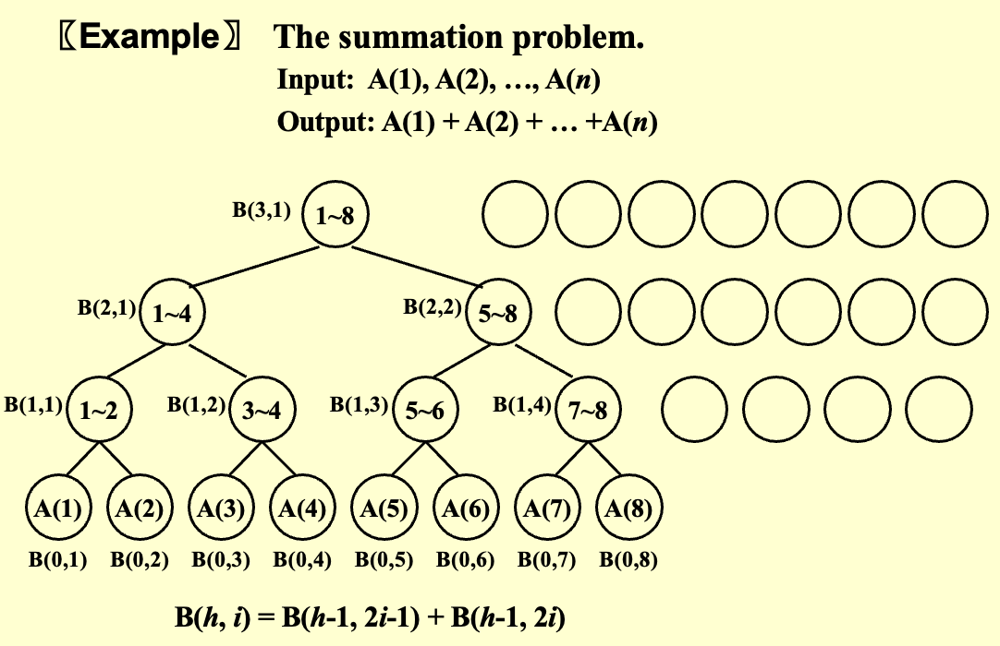
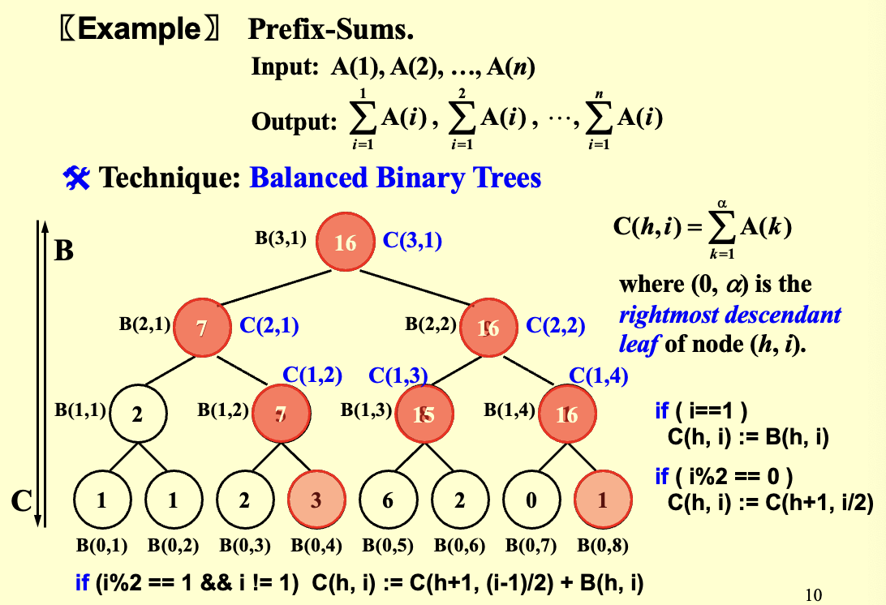
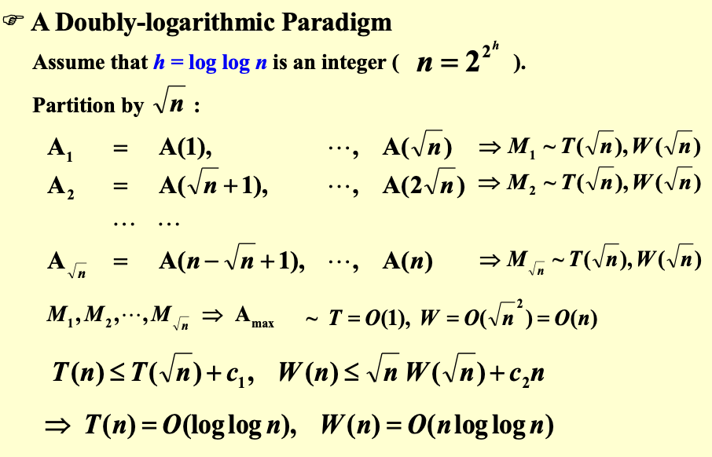
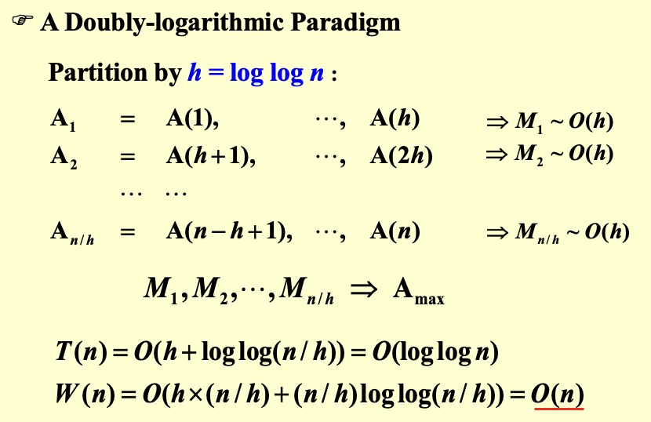

# 并行算法

!!! abstract "并行性"
    1. **机器并行性**：处理器并行性、流水线、超长指令字
    2. **并行算法**：描述方式有`PRAM`和`WD`

## 性能度量

1. **工作量**：总操作数 \( W(n) \)
2. **最坏情况运行时间**：\( T(n) \)
3. 使用 \( W(n) \) 次操作和 \( T(n) \) 时间

- 使用 \( P(n) = W(n)/T(n) \) 个处理器在 \( T(n) \) 时间内完成
- 使用任意数量 \( p \leq W(n)/T(n) \) 个处理器时的时间为 \( W(n)/p \)
- 使用任意数量 \( p \) 个处理器时的时间为 \( W(n)/p + T(n) \)
- **所有情况在渐近意义下等价**

## 并行随机存取机 PRAM

1. **定义**：多个处理器使用同一个**共享内存**（会有访问冲突问题）
2. **访问冲突的解决**

- 互斥读互斥写 (Exclusive-Read Exclusive-Write, **EREW**)
- 并发读互斥写 (Concurrent-Read Exclusive-Write, **CREW**)
- 并发读并发写 (Concurrent-Read Concurrent-Write, **CRCW**)
    - **任意规则**：最乱
    - **优先级规则**：编号最小的处理器优先
    - **公共规则**：除非所有处理器都试图写入相同的值，否则所有处理器都只能读

## 问题
### 多数相加问题

{style="width:60%;display: block;margin: 20px auto"}

其中 $B$ 为一个二维数组

1. **PRAM 伪代码**

```c
for P_i, 1 ≤ i ≤ n pardo
    B(0, i) := A(i)           // 初始化第一层
for h = 1 to log n do     // 层序遍历
    if i ≤ n/2^h
        B(h, i) := B(h-1, 2i-1) + B(h-1, 2i)
    else stay idle
for i = 1: output B(log n, 1);  // 只有第一个处理器输出结果
for i > 1: stay idle
```        

- **时间复杂度**：$T(n)=\log n +2$

!!! warning "缺点"
    1. 隐藏了处理器数量影响：公式假设有恰好$n$个处理器，但未说明如果处理器更少时如何运行
    2. 指令分配过于理想化：假设处理器"知道"自己该做什么，但实际实现时需要显式的任务分配

2. **WD 伪代码**：对开发人员友好，不需要考虑具体的处理器数量

```c
for P_i, 1 ≤ i ≤ n pardo
    B(0, i) := A(i)
for h = 1 to log n
    for P_i, 1 ≤ i ≤ n/2^h pardo    
        B(h, i) := B(h-1, 2i-1) + B(h-1, 2i)
for i = 1 pardo
    output B(log n, 1)
```

- **性能**
    - $T(n) = \log n+2$ 
    - $W(n) = n + \frac{n}{2} + \frac{n}{2^2} + \cdots + \frac{n}{2^k} + 1=2n$ 其中 $2^k = n$
- **WD 表示充分性定理**：任何 WD 模式下的算法，都可以在 **\( O(W(n)/P(n) + T(n)) \)** 时间内，由任意 **\( P(n) \)** 个处理器实现，且使用与 WD 表示中相同的并发写约定

### 前缀和问题
{style="width:60%;display: block;margin: 20px auto"}

1. **代码**

```c
// 初始化叶子节点
for P_i, 1 ≤ i ≤ n pardo
    B(0, i) := A(i)

// 自底向上计算每层节点和
for h = 1 to log n
    for i, 1 ≤ i ≤ n/2^h pardo
        B(h, i) := B(h-1, 2i-1) + B(h-1, 2i)

// C(h,i) = 从第一个叶子到节点(h,i)最右后代的所有叶子之和
for h = log n downto 0  // 从上到下
    // 情况1：偶数节点直接继承父节点值
    for i even, 1 ≤ i ≤ n/2^h pardo
        C(h, i) := C(h+1, i/2)
    // 情况2：最左节点（i=1）
    for i = 1 pardo
        C(h, 1) := B(h, 1)
    // 情况3：奇数节点（i>1的左孩子）
    for i odd, 3 ≤ i ≤ n/2^h pardo
        C(h, i) := C(h+1, (i-1)/2) + B(h, i)

// 叶子层的C值就是最终的前缀和
for P_i, 1 ≤ i ≤ n pardo
    Output C(0, i)
```
2. **性能**

- $T(n) = O(\log n)$
- $W(n) = O(n)$

### 数组合并
1. **问题**：

- 将两个非递减数组合并成一个非递减数组
- $A(1), A(2), ..., A(n)$ 和 $B(1), B(2), ..., B(m)$ 合并为另一个非递减数组 $C(1), C(2), ..., C(n+m)$
- **假设**
    - $A$ 和 $B$ 的元素互不相同
    - $n=m$
    - $\log n$ 和 $n/logn$ 均为整数

2. **技术**：划分

- **划分**：将输入划分为 $p$ 个独立的小任务，使得最大小任务的大小约为 $n/p$
- **实际工作**：并行执行这些小任务，每个任务使用一个单独的（可能是串行的）算法

3. **解决方法**：合并变为排名

!!! abstract "规则"
    1. $RANK( j, A ) =  i$，若 $A(i) < B(j) < A(i+1)$，对于 \( 1 \leq i < n \)
    2. $RANK( j, A ) = 0$，若 \( B(j) < A(1) \)
    3. $RANK( j, A ) =  n$，若 \( B(j) > A(n) \)

- 对每个 \( 1 \leq i \leq n \)，计算 $RANK(i, B)$，以及 $RANK(i, A)$

    ??? info "计算排名的方法"
        1. **二分查找法**：$T(n)=O(\log n)$，$W(n)=O(n\log n)$

        ```c
        for P_i, 1 ≤ i ≤ n pardo
            RANK(i, B) := BinarySearch(A[i], B)
        for P_i, 1 ≤ i ≤ m pardo  
            RANK(i, A) := BinarySearch(B[i], A) 
        ```

        2. **连续排名法**：$T(n)=W(n)=O(n+m)$

        ```c
        i = j = 0
        while (i ≤ n || j ≤ m){
            if ( A(i+1) < B(j+1) )
                RANK(++i, B) = j;
            else RANK(++j, A) = i;
        }
        ```

- 根据计算结果得到 $C$

    ```c
    for P_i, 1 ≤ i ≤ n pardo
        C[i + RANK(i, B)] := A[i]
    for P_i, 1 ≤ i ≤ m pardo  
        C[i + RANK(i, A)] := B[i]
    ```


- **结论：** 给定排名问题的解，合并问题可以在 O(1) 时间和 O(\( n+m \)) 工作量内解决

4. **并行排名算法**

- 假设 \( n = m \) 并且 \( A(n+1) \) 和 \( B(n+1) \) 都大于 \( A(n) \) 和 \( B(n) \)

- **划分**：
    - **采样数量**：$p = n / \log n$
    - $A_ Select( i ) = A(1+(i-1)\log n)$，对于 \( 1 \leq i \leq p \)  
    - $B_ Select( i ) = B(1+(i-1)\log n)$，对于 \( 1 \leq i \leq p \)  
    - 计算每个**选定**元素（路标）的`RANK`
    - **性能**：\( T = O(\log n) \) 且 \( W = O(p\log n) = O(n) \)  
- **实际排名**
    - **关键**：$A[i]$ 在 $B$ 中的排名一定在它的左右路标排名之间  
    - 最多 \( 2p \) 个规模较小（\( O(\log n) \)）的问题
    - **性能**：\( T = O(\log n) \) 且 \( W = O(p\log n) = O(n) \) 
- **总性能**：$T = O(\log n)$ 且 $W = O(n)$ 

### 最大值查找
1. **比较所有对**

```c
// 初始化标记数组
for P_i, 1 ≤ i ≤ n pardo  
    B(i) := 0  // B(i)=0表示A(i)可能是最大值，1表示肯定不是最大值

// 并行比较所有元素对（共n²次比较）
for i and j, 1 ≤ i, j ≤ n pardo  
    if ( (A(i) < A(j)) || ((A(i) = A(j)) && (i < j)) )  
        B(i) = 1  
    else 
        B(j) = 1  
    // 注意：这里存在并发写入冲突！多个处理器可能同时写入B(i)或B(j)

// 找出未标记的元素，即为最大值
for P_i, 1 ≤ i ≤ n pardo  
    if B(i) == 0  
        A(i) is a maximum in A
```

- **性能**：$T(n)=O(1)$ 且 $W(n)=O(n^2)$

2. **双对数方法 1**：按照 $\sqrt{n}$ 划分

{style="width:60%;display: block;margin: 20px auto"}

- **性能**
    - $T(n)=O(\log \log n)$
    - $W(n)=O(n\log \log n)$

3. **双对数方法 2**：按照 $h=\log \log n$ 划分

{style="width:60%;display: block;margin: 20px auto"}

- **性能**
    - $T(n)=O(h+\log \log (n/h))=O(\log \log n)$ 
    - $W(n)=O((n/h)(h+\log \log (n/h)))=O(n)$

4. **随机采样**：

- **步骤**：
    - **采样** $n^{\frac{7}{8}}$ 个元素
        - 将采样得到的元素按照每块 $n^{\frac{1}{8}}$ 划分为 $n^{\frac{3}{4}}$ 个块，找到每一块的最大值
        - 继续将得到的最大值划分为每块 $n^{\frac{1}{4}}$ 个元素，共 $n^{\frac{1}{2}}$ 块
        - 最终找到最大值M
    - **迭代**
        -  淘汰小于等于M的元素，大于M的元素随机放入新数组
        -  在新数组中找最大值
- **定理**：
    - 该算法可找到 \( n \) 个元素中的最大值
    - （在任意 CRCW PRAM 上）以极高概率，它在 \( O(1) \) 时间和 \( O(n) \) 工作内完成
    - 在此时限和工作复杂度内未能完成的概率为 \( O(1/n^c) \)，其中 \( c \) 为某个正常数