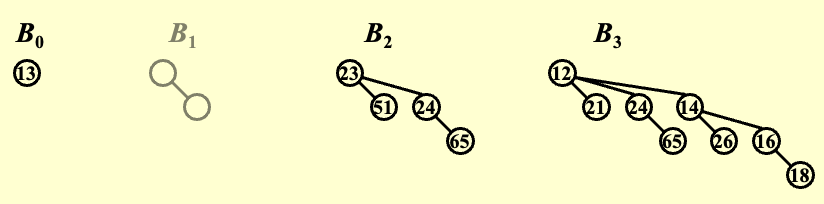
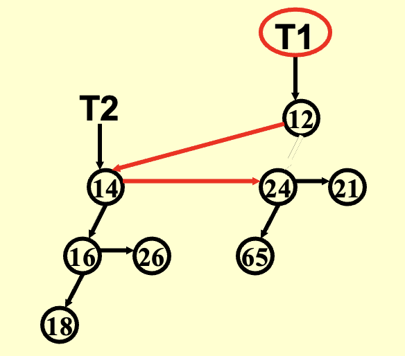
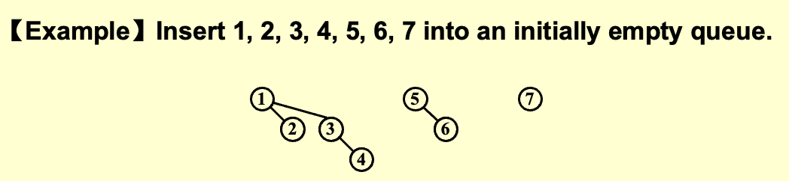
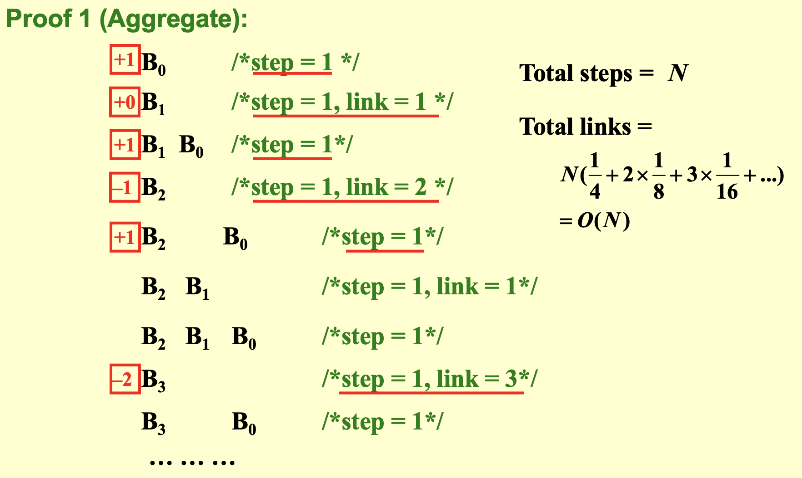
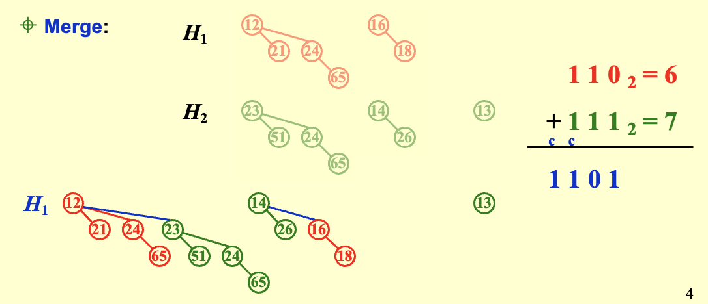

## 二项队列
1. **目标**：为了寻找一种能实现**高效插入**（理想情况下是常数平均时间）的优先队列结构

- 某些堆结构（如左式堆、斜堆）的**单次**插入操作时间复杂度为 $O(\log N)$，在需要频繁插入的场景下可能不够高效
- 二叉堆的 $N$ 次**连续插入**的摊还总时间复杂度为 $O(N)$ ，意味着**平均每次**插入的成本是 $O(1)$（常数时间）

2. **结构**：二项队列**不是一棵堆序树**（树的根节点是最小值），而是一个由堆序树组成的集合，称为**森林**；每一棵堆序树都是一棵**二项树**

- 高度为 $0$ 的二项树是一个**单节点树**
- 高度为 $k$ 的**二项树** $B_{k}$ ，是通过将一棵二项树 $B_{k–1}$ 连接到另一棵二项树 $B_{k–1}$ 的根上构成的
- 对于 $B_{k}$ 
    - 根节点有 $k$ 个子节点，分别为 $B_0,B_1,B_2,\cdots,B_{k-1}$
    - 总共有 $2^k$ 个节点
    - 在深度 $d$ 处的节点数量是二项式系数 $C_{d,k}$

3.  **性质**

- 任何大小的优先级队列都可以由二项式树的集合**唯一表示**
- 一个包含 $N$ 个元素的二项队列可以通过 $N$ 次连续的插入在 $O(N)$ 时间内构建完成

!!! example "Example"
    **Problem**：用一个二项树的集合来表示一个大小为13的优先队列

    **Solution**：已知 $13 = 1101_2$ ，因此优先队列包含 $B_0,B_2,B_3$

    


### 二项树实现

1. **结构**

- **“左孩子-右兄弟”表示法**将一个节点的所有儿子组织成一个链表：`DeleteMin(Q)`时可以**线性地**获得所有子树
- 子树**按照树的高度从大到小排列**：`Merge`时不用遍历所有的子树

```c
typedef struct BinNode *Position;
typedef struct Collection *BinQueue;
typedef struct BinNode *BinTree;  

struct BinNode {  // 二项树结点结构
    ElementType	    Element;
    Position	    LeftChild;
    Position 	    NextSibling;
} ;

struct Collection {   // 二项队列结构
    int	    	CurrentSize;  /* total number of nodes */
    BinTree	    TheTrees[ MaxTrees ];
} ;
```

2. **二项树合并** $O(1)$

{style="width:30%;display: block;margin: 20px auto"}

```c
BinTree CombineTrees( BinTree T1, BinTree T2 ){  /* merge equal-sized T1 and T2 */
    if ( T1->Element > T2->Element ) /* attach the larger one to the smaller one */
        return CombineTrees( T2, T1 );
    /* insert T2 to the front of the children list of T1 */
    T2->NextSibling = T1->LeftChild;
    T1->LeftChild = T2;
    return T1;
}
```


### 操作
=== "Insert"
    1. **步骤**：（合并操作的特例）逐个插入，插入后将相同高度的树进行合并

    {style="width:80%;display: block;margin: 20px auto"}

    2. **时间复杂度**：如果**最小的不存在的**二项树是 $B_i$ ，则单次插入 $T_p = const · (i+1)$ 
    
    - **每次插入的最坏时间复杂度**： $O(\log N)$ （一直合并到最后一个二项树）
    - 在一个初始为空的二项队列上执行 $N$ 次插入操作将花费 $O(N)$ 的时间，因此**平均时间是常数**

        ??? abstract "证明"
            {style="width:80%;display: block;margin: 20px auto"}

        !!! abstract "摊还时间复杂度：势能法"
            **定理**：一次代价为 $c$ 的插入操作，会使森林中的二项树数量净增加 $2 - c$

            - $C_i$：第 $i$ 次插入的代价
            
            - $\Phi_i$：第 $i$ 次插入之后森林中的树的数量（$\Phi_0 = 0$）
            
            对所有 i = 1, 2, \dots, N，都有 $C_i + (\Phi_i - \Phi_{i-1}) = 2$
            
            将上述等式全部相加，得到 $\sum_{i=1}^{N} C_i + \Phi_N - \Phi_0 = 2N$
            
            因此 $\sum_{i=1}^{N} C_i = 2N - \Phi_N \le 2N = O(N)$

            **摊还时间复杂度**：$T_{amortized} = 2$

            !!! success "Notice"
                最坏情况下，会减少树的数量，为后续插入预付了成本

=== "FindMin"
    1. **步骤**： 遍历所有树的根节点 ($\lceil \log N \rceil$ 个)，找到最小值
    2. **时间复杂度**： $O(\log N)$
    3. **优化**：维护一个指向最小根节点的指针，并在执行其他操作时更新它，从而将 `FindMin` 优化到 $O(1)$

=== "Merge"
    {style="width:80%;display: block;margin: 20px auto"}

    1. **步骤**：将相同高度的树进行合并，类似于二进制加法
    2. **时间复杂度**： $O(\log N)$
    3. **先决条件**：二项树必须按照高度顺序排列

    ```c
    BinQueue Merge( BinQueue H1, BinQueue H2 ){	
        BinTree T1, T2, Carry = NULL; 	
        int i, j;
        if ( H1->CurrentSize + H2-> CurrentSize > Capacity )  ErrorMessage();  // 检查容量
        H1->CurrentSize += H2-> CurrentSize;   // 更新大小
        for ( i=0, j=1; j<= H1->CurrentSize; i++, j*=2 ) {  
            //i：遍历所有高度；j：检查当前高度的树的节点数是否超过要求
            T1 = H1->TheTrees[i]; T2 = H2->TheTrees[i]; /*current trees */
            switch( 4*!!Carry + 2*!!T2 + !!T1 ) { 
                /*
                相当于 {carry,T2,T1}
                !!x = (x ≠ 0 ? 1 : 0)
                !!Carry：进位二项树是否存在（1=存在，0=不存在）
                !!T2：H2在当前高度的树是否存在
                !!T1：H1在当前高度的树是否存在
                */
                case 0: /* 000 */
                case 1: /* 001 */  break;	
                case 2: /* 010 */  H1->TheTrees[i] = T2; H2->TheTrees[i] = NULL; break;
                case 4: /* 100 */  H1->TheTrees[i] = Carry; Carry = NULL; break;
                case 3: /* 011 */  Carry = CombineTrees( T1, T2 );
                                   H1->TheTrees[i] = H2->TheTrees[i] = NULL; break;
                case 5: /* 101 */  Carry = CombineTrees( T1, Carry );
                                   H1->TheTrees[i] = NULL; break;
                case 6: /* 110 */  Carry = CombineTrees( T2, Carry );
                                   H2->TheTrees[i] = NULL; break;
                case 7: /* 111 */  H1->TheTrees[i] = Carry; 
                                   Carry = CombineTrees( T1, T2 ); 
                                   H2->TheTrees[i] = NULL; break;
            } 
        }
        return H1;
    }
    ```

=== "DeleteMin"
    1. **步骤**：

    - 遍历，找到最小根，**时间复杂度**：$O(\log N)$
    - 从森林中移除包含最小根的树 $B_k$，**时间复杂度**：$O(1)$
    - 删除其根节点，其子树形成一个新的二项队列，**时间复杂度**：$O(\log N)$
    - 将原队列与新队列合并，**时间复杂度**：$O(\log N)$

    2. **时间复杂度**： $O(\log N)$

    ```c
    ElementType  DeleteMin( BinQueue H ){	
        BinQueue DeletedQueue; 
        Position DeletedTree, OldRoot;
        ElementType MinItem = Infinity;  
        int i, j, MinTree; 
        if ( IsEmpty( H ) ){  
            PrintErrorMessage();  
            return –Infinity; 
        }
        //1. 找到最小的树
        for ( i = 0; i < MaxTrees; i++) {  
            if( H->TheTrees[i] && H->TheTrees[i]->Element < MinItem ) { 
                MinItem = H->TheTrees[i]->Element;  
                MinTree = i;    
            }
        } 
        DeletedTree = H->TheTrees[ MinTree ]; 
        //2. 删除最小的树 
        H->TheTrees[ MinTree ] = NULL;
        //3.1 删除最小树的根节点
        OldRoot = DeletedTree; 
        DeletedTree = DeletedTree->LeftChild;   
        free(OldRoot);
        //3.2 形成新的二项队列 H”
        DeletedQueue = Initialize(); 
        DeletedQueue->CurrentSize = ( 1<<MinTree ) – 1;  /* 2MinTree – 1 */
        for ( j = MinTree – 1; j >= 0; j – – ) {  
            DeletedQueue->TheTrees[j] = DeletedTree;
            DeletedTree = DeletedTree->NextSibling;
            DeletedQueue->TheTrees[j]->NextSibling = NULL;
        } 
        H->CurrentSize  – = DeletedQueue->CurrentSize + 1;
        //4. 合并 H 和 H”
        H = Merge( H, DeletedQueue ); 
        return MinItem;
    }
    ```
