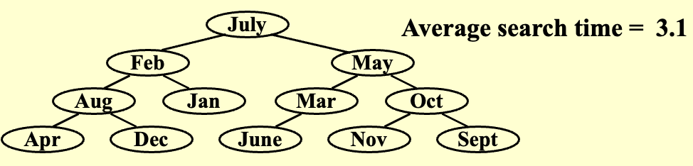
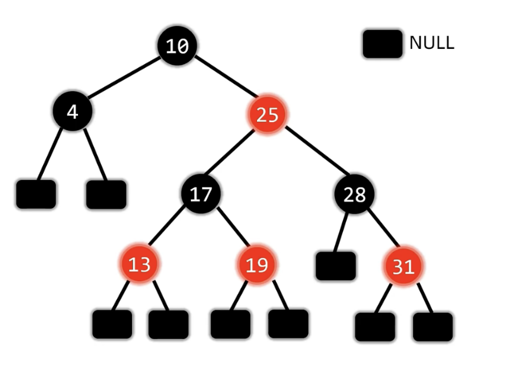
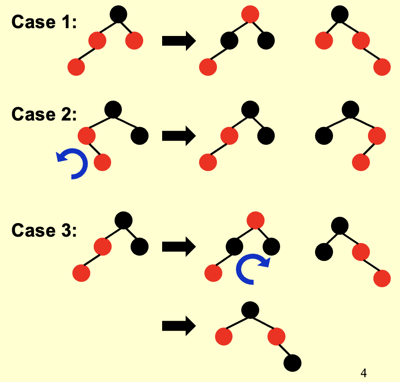
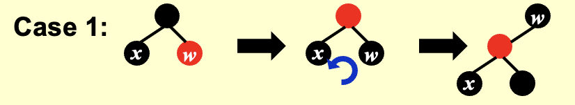
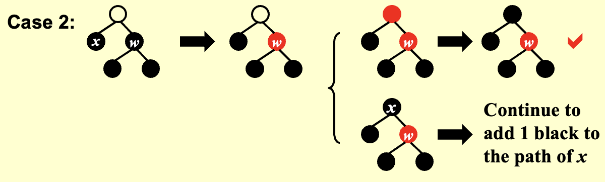
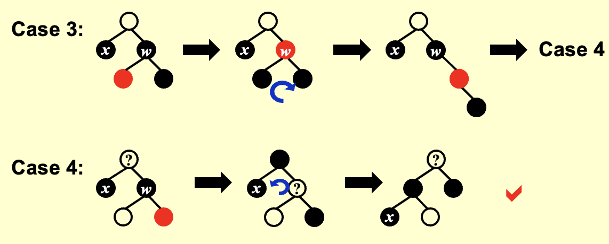
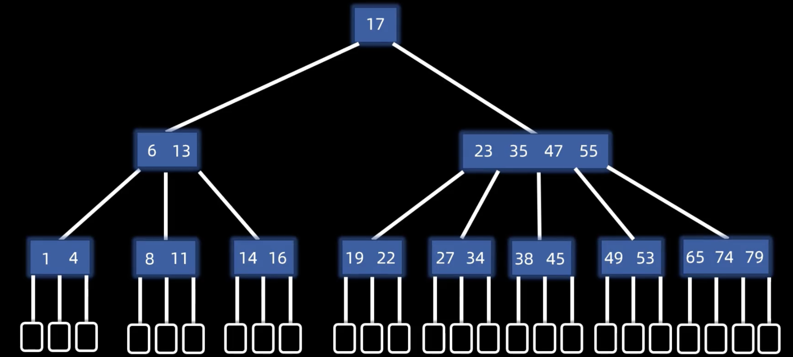
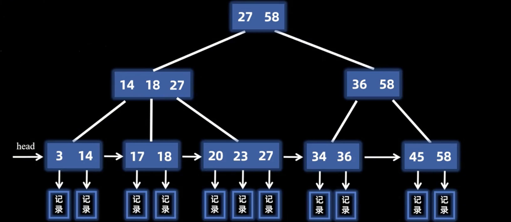

## 二叉搜索树 BST
1. **条件**：任何节点的左子树 < 根节点 < 右子树
2. **性质**：中序遍历一定是从小到大
3. **基本操作**：

- **查找**&**插入**：
    - 二叉搜索树比较均衡的情况下，时间复杂度都是 $O(\log n)$
    - 如果二叉搜索树非常不平衡（构建时序列已经有序），则时间复杂度可能退化为 $O(n)$
- **删除**：找到待删除的节点，将其替换为它的后继节点/前驱节点，然后删除后继节点/前驱节点

??? abstract "前驱与后继节点"
    1. **前驱节点**：当前节点的左子树中的最大节点
    2. **后继节点**：当前节点的右子树中的最小节点

---
## 平衡二叉树 AVL
1. **目标**：加快搜索速度

??? abstract "平均搜索时间"
    平均搜索时间 = 到每个节点需要搜索的节点数之和取平均

    **e.g.**

    {style="width:80%;display: block;margin: 20px auto"}

2. **平衡因子**：节点的左子树高度 - 右子树高度

3. **条件**：

- **前提**：二叉搜索树
- 所有节点的平衡因子的绝对值 $\leq$ 1
  
4. 平衡二叉树的高度 $h = O(\log n)$

!!! abstract "树高公式推导"
    设 \( n_h \) 为平衡二叉树（其高度为 \( h \)）中的最小节点数，则该树根节点的左右子树的树高一定分别为 \( h-1 \) 和 \( h-2 \) （相同则不是最小节点数）。

    **最小节点数的递推公式**为 \( n_h = n_{h-1} + n_{h-2} + 1 \)，则通项公式为 \( n_h \approx \frac{1}{\sqrt{5}} \left( \frac{1 + \sqrt{5}}{2} \right)^{h+3} - 1 \) ，从而 \( h = O(\log n)\)。

### 基本操作

1. 查找、插入、构建、删除的过程和**二叉搜索树**一致，只是在操作之后如果**失衡**需要**调整平衡**

2. **调整平衡**

- **左旋**：
    - 逆时针旋转
    - 冲突的左子树变为新左子节点的右子树
- **右旋**：
    - 顺时针旋转
    - 冲突的右子树变为新右子节点的左子树 

3. **失衡**：插入后只检查插入节点到根节点路径上的节点是否失衡

|类型|条件|调整方式|
|:--:|:--|:--|
|**LL型**|（1）失衡节点的平衡因子=2 （2）失衡节点的左子节点的平衡因子=1|右旋|
|**RR型**|（1）失衡节点的平衡因子=-2 （2）失衡节点的右子节点的平衡因子=-1|左旋|
|**LR型**|（1）失衡节点的平衡因子=2 （2）失衡节点的左子节点的平衡因子=-1|先左旋左子节点 后右旋失衡节点|
|**RL型**|（1）失衡节点的平衡因子=-2 （2）失衡节点的右子节点的平衡因子=1|先右旋右子节点 后左旋失衡节点|

!!! tip "Notices"
    1. **插入**节点后如果导致多个节点失衡，只需要调整与插入节点**最近的失衡节点**，其他失衡节点会自然平衡（局部调整解决全局问题）
    2. **删除**节点后需要**依次对每个祖先节点**进行调整
    3. 进行**左旋和右旋**操作之后，二叉树的**中序遍历**序列始终相同

---

## 伸展树 Splay
1. **目标**：从一棵空树开始，连续进行 $M$ 次操作，总耗时不会超过 $O(M \log N)$
2. **解决方法**：在一个节点**被访问**之后，将该节点旋转（利用 AVL 树的旋转方式）到根节点位置
3. **调整方式**：对于非根节点`X`，其父节点为`P`，祖父节点为`G`

- `P`是根节点：`X`旋转到根节点
- `P`不是根节点：
    - **zig-zag**：double rotation（异侧旋转：先转父节点，再转祖父节点）
    - **zig-zig**：single rotation（同侧旋转：先转祖父节点，再转父节点）

4. **删除**：

（1）**访问**`X`节点，将其**旋转**到根节点 
（2）**删除**`X`节点 
（3）访问左子树的**最大节点**，将其旋转到左子树的根节点，此时左子树的根节点没有右孩子（因为是左子树的最大值） 
（4）右子树作为左子树的右孩子

5. **插入**：按照搜索二叉树的方法**插入**`X`节点，将其旋转到根节点

---
## 红黑树
{style="width:50%;display: block;margin: 20px auto"}

1. **条件**：

- **前提**：二叉搜索树
- 根节点和**叶子节点`NULL`**都为黑色
- **不存在**连续的两个红色节点：红节点的子节点一定是黑色的
- 任一节点到**其所在的子树上的**叶子节点的所有路径上，黑色节点的个数相同

!!! abtract "定义"
    1. **内部节点**：黑色的非`NULL`的节点
    2. **外部节点**：`NULL`的黑色叶子节点

2. **性质**：最长路径不会超过最短路径的两倍（任一节点的左右子树高度相差不超过两倍）

- **最短路径**：只有黑色节点
- **最长路径**：红黑相间的路径（红色节点的个数不会超过黑色节点的路径）

3. **黑高**：
 
- **定义**：从结点`x`（不包括`x`）到任一个叶结点的任意简单路径上的**黑色结点个数**，不包括该节点自身，但包括终止的 `NULL` 节点，记为 $bh(x)$
- **定理**
    - 树的黑高 $bh(Tree) = bh(root)$
    - 一棵有 $N$ 个内部结点的红黑树的高度至多为 $2\log(N+1)$，至少为 $\log(N+1)$

### 插入

1. 插入操作与二叉搜索树一致
2. 插入的节点**默认为红色**：

- 一般不会破坏红黑树的任何一个条件
- 只可能破坏**根叶黑**和**不红红**

3. **调整**：
    
- **插入节点为根节点**：直接变为黑色
- **插入节点的叔叔为红色**：
    - 插入节点的叔叔、父亲和爷爷都变色
    - 之后让爷爷变插入节点，再次调整
- **插入节点的叔叔为黑色**
    - case 2：左子节点（父亲）左旋
    - case 3：父亲与爷爷交换颜色，爷爷节点右旋

{style="width:40%;display: block;margin: 20px auto"}

4. **时间复杂度**：$O(h) = O(\ln N)$

### 删除

1. **只有左孩子/只有右孩子**：直接代替被删除的节点，然后变黑

!!! tip "Notices"
    该情况下被删除节点只有可能是**黑色的**！并且不可能是只有左子树/右子树！
    
    如果节点是红色的或者只有左子树/右子树，则破坏了黑路同的性质。

2. **有两个孩子**：

- **后继/前驱**节点替换被删除的节点
- 保持被删除的节点**颜色不变**
- 相当于删除**后继/前驱**节点

3. **没有孩子**：

（1）**红节点**：直接删除

（2）**黑节点**：删除后变为**双黑节点**，相对于双黑节点进行调整

- **兄弟节点为红色**：
    - `s`和`p`变色
    - `p`朝**双黑节点**旋转
    - 保持双黑继续调整

    {style="width:40%;display: block;margin: 20px auto"}

- **兄弟节点为黑色**：
    - **兄弟节点没有红孩子**：
        - 兄弟变红，双黑上移，遇到**红节点/根节点**变为单黑
        - 若仍存在双黑，则相对于双黑节点继续调整
        
        {style="width:60%;display: block;margin: 20px auto"}

    - **兄弟节点至少有一个红孩子**：
        - case 3：近侄与兄弟交换颜色，兄弟节点右旋，转换为case 4
        - case 4：父亲与兄弟交换颜色，远侄变黑，父亲左旋
        
        {style="width:60%;display: block;margin: 20px auto"}     
        
??? abstract "方法二"
    判断**`p`（父亲节点）、`s`（兄弟节点）、`r`（红孩子）**三个节点的形态，进行变色，并且旋转，结束后双黑变单黑

    |形态|特点|变色|旋转|
    |:--:|:--|:--|:--|
    |**LL型**|（1）`s`是`p`的左孩子 （2）`r`是`s`的左孩子/`s`有两个红孩子|`r`变为`s`，`s`变为`p`，`p`变黑|`p`右旋|
    |**RR型**|（1）`s`是`p`的右孩子 （2）`r`是`s`的右孩子/`s`有两个红孩子|`r`变为`s`，`s`变为`p`，`p`变黑|`p`左旋|
    |**LR型**|（1）`s`是`p`的左孩子 （2）`r`是`s`的右孩子|`r`变为`p`，`p`变黑|先`s`左旋后`p`右旋|
    |**RL型**|（1）`s`是`p`的右孩子 （2）`r`是`s`的左孩子|`r`变为`p`，`p`变黑|先`s`右旋后`p`左旋|

### 旋转次数比较

| 操作   | AVL 树 | 红黑树 |
|--------|--------|--------|
| 插入   | $≤ 2$    | $O(\log N)$ |
| 删除   | $≤ 3$    | $≤ 3$     |

---
## B+树
1. **M阶B+树结构特征**

- **根节点**没有子节点或有$2～M$个子节点
- 所有除根节点外的**非叶节点**有$\lceil M/2 \rceil～M$个子节点
- 所有的叶节点在**同一层**
- 叶节点有$\lceil M/2 \rceil～M$个关键字

2. **性质**

- 内部节点**只存放索引关键字**，不存放实际数据记录；**实际数据**记录全部存放在叶子节点
- 内部节点的关键字数量 = 指针数（分支数） − 1
- 在内部节点中，存放的关键字是来自**各子树（除第一个子树外）的最小关键字**的副本

3. **复杂度**

- **深度：**  

\[
\text{Depth}(M, N) = O\left(\lceil \log_{\lceil M/2 \rceil} N \rceil\right)
\]

- **查找时间复杂度：**  

\[
T_{\text{Find}}(M, N) = O(\log N)
\]

- **注意：** M 的最佳选择是3（2-3 tree）或4（2-3-4 tree）

### 基本操作
1. **插入**：先查找到插入的位置进行插入

- 如果没有**上溢出**，则无需调整
- 如果上溢出，则中间元素$\lceil m/2 \rceil$上移，两边分裂，直至没有上溢出

2. **删除**：

（1）**非叶子节点**：用该节点的直接前驱/后继替换 
（2）**叶节点**：

- 如果没有**下溢出**，则无需调整
- 如果下溢出
    - 兄弟够借：借一个数据（父节点下移，兄节点上移）
    - 兄弟不够借：合并（父节点下移，然后合并）

??? abstract "扩展内容（非课堂）"
    **B树**

    {style="width:100%;display: block;margin: 20px auto"}

    1. **特点**：

    （1）**平衡**：所有的叶节点在同一层 
    （2）**有序**：节点内的数据有序；满足二叉搜索树的大小顺序 
    （3）**多路**：对于$m$阶B树

    - **最多**：$m$个分支，$m-1$个数据
    - **最少**：
        - 根节点：2个分支，1个数据
        - 非根节点：$\lceil m/2 \rceil$个分支，$\lceil m/2 \rceil-1$个数据

    ---

    **B+树**
    
    {style="width:100%;display: block;margin: 20px auto"}

    1. **特点**

    （1）所有元素都在叶节点层按顺序排列 
    （2）所有叶节点通过指针相连，形成一个链表 
    （3）非叶子节点由其子节点的最大值构成

    2. **对比**

    |B树        | B+树     |
    |:--|:--|
    |所有结点都有关键字及直接指向对应记录的指针  | 叶结点包含全部关键字及指向相应记录的指针，非叶结点仅作索引 |
    |m个分支对应m-1个关键字  | m个分支对应m个关键字       |
    |支持随机查找，但不支持顺序查找    | 兼顾顺序查找和随机查找     |

    3. **查找**

    - **顺序查找**：从`head`指针开始，叶节点按顺序访问
    - **随机查找**：从根节点开始按层查找，最后一定落在**叶节点**上

