# E-R 模型

## 实体集
1. **实体**：是一个存在且可与其他对象区分的对象

2. **实体集**是具有**相同类型且共享相同属性**的实体集合

3. 实体具有**属性**，属性是实体集中所有成员共同拥有的**描述性性质**

4. **域**：每个属性所允许的所有值的集合

5. **属性类型**：

- 简单和复合属性（性别 和 姓名）
- 单值和多值属性（多值：电话号码）
- **派生属性**：可以从其他属性计算得出，对应基本属性或存储属性

## 联系集
1. **联系**：是二个或多个不同类实体之间的关联
2. **联系集**：具有相同类型的联系的集合

!!! tip "Tip"
    1. 一个联系集表示二个或多个实体集之间的关联
    2. 一个联系集包含多个同类联系（或联系实例）

3. **联系集属性**：不属于任何单一实体，而必须由参与联系的多个实体共同决定的描述性特征

4. **联系集的度**：指参与到一个联系集中的**实体集的数量**

5. **映射基数**：表达在一个联系集中，一个实体可以与另一类实体相关联的**实体数量**

!!! abstract "二元联系集"
    映射基数必须是以下类型之一：

    - 一对一 (1 : 1)，例如：就任总统（总统，国家）
    - 一对多 (1 : n)，例如：分班情况（班级，学生）
    - 多对一 (n : 1)，例如：就医（病人，医生）
    - 多对多 (n : m)，例如：选课（学生，课程）

    **注意**：两个实体集中的某些元素可能不映射到另一个集中的任何元素

## 码
1. **实体集**

- **实体集的超码**是一个或多个属性的集合，其值可以**唯一**地确定每个实体
- **实体集的候选码**是一个最小超码（可能有多个候选码，从中选择一个做主码）

2. **联系集**

- 参与联系集的各实体集的**主码**的组合构成了该联系集的一个**超码**（这意味着在特定的联系集中，**一对实体最多只能有一个联系**）
- **映射基数决定候选码**：多对多需两端主码组合；一对多或多对一只需“多”端实体的主码；一对一则任选一端主码即可
- 当存在多个候选码时，需要根据联系集的语义来选择主码 **e.g.** 作为码的属性不能为空，值不应经常改变
## E-R 图

1. **图形表示**

- 矩形表示实体集、菱形表示联系集
- 线将**属性**链接到实体集，将实体集链接到联系集
- 椭圆表示属性，**双椭圆表示多值属性**（嵌套的椭圆），**虚线椭圆表示派生属性**
- 下划实线表示**主码属性**

!!! abstract "自环联系集"
    1. **联系集的实体集不必是不同的**
    2. **角色**：实体在联系中扮演的功能 **e.g.** `manager` & `worker`

    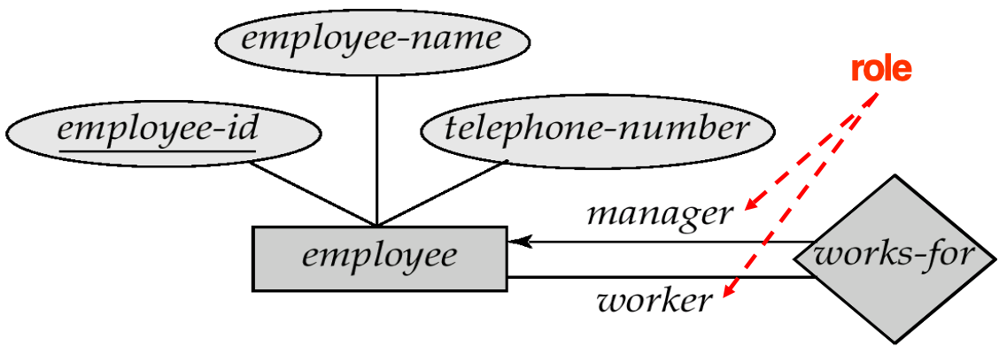{style="width:60%;display: block;margin: 20px auto"}

2. **基数约束**：有向线表示“一”；无向线段表示“多”（图表示一对多联系）

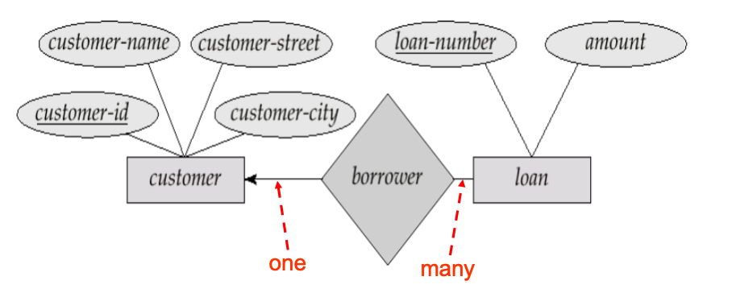{style="width:60%;display: block;margin: 20px auto"}

3. **实体集在联系集中的参与**

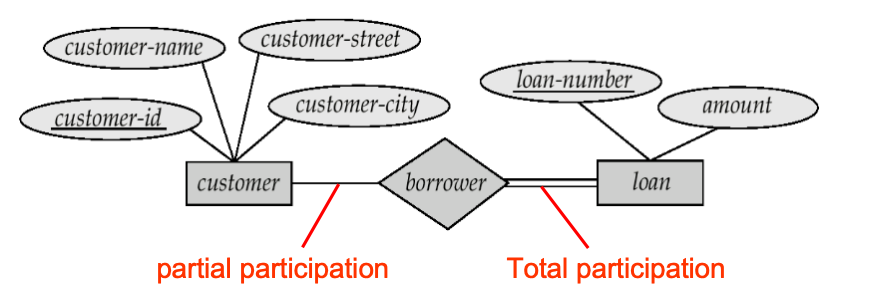{style="width:60%;display: block;margin: 20px auto"}

- **全参与（用双线表示）**：实体集中的每个实体都参与联系集中的至少一个联系
- **部分参与**：某些实体可能**不参与**联系集中的任何联系

!!! tip "Tips"
    1. 映射基数约束，限定了一个实体与发生关联的另一端实体可能关联的**数目上限**
    2. 全参与和部分参与约束，则反映了一个实体参与关联的**数目下限**（0次，还是至少1次）

    ??? example "替代表示法"
        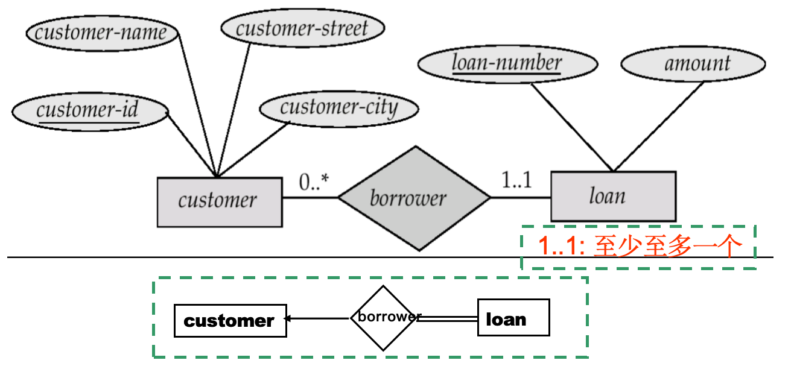{style="width:60%;display: block;margin: 20px auto"}

!!! abstract "非二元联系集"
    任何非二元联系都可以通过**创建一个人工实体集**来用二元联系表示

    **e.g.** 用实体集 E 替换实体集 A、B、C 之间的非二元联系 R，并创建三个新的联系集

    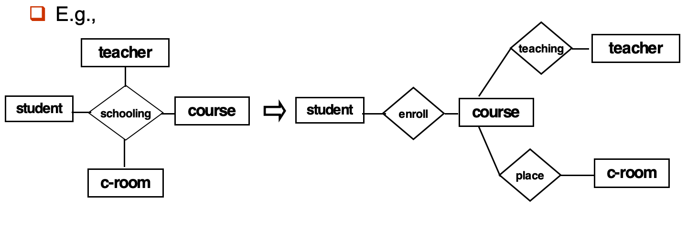{style="width:60%;display: block;margin: 20px auto"}

## 弱实体集
1. **弱实体集**：没有主码的实体集（相对于强实体集）

2. 弱实体集的生存取决于**标识实体集或属主实体集**

3. 弱实体集必须通过从标识实体集到弱实体集的**总参与、一对多的联系集**与标识实体集关联，相关的联系被称为**标识性联系**

4. 弱实体集的**分辨符或部分码**：用于区分依赖于**同一个**特定强实体的所有弱实体

5. 弱实体集的**主码**：由其所依赖的强实体集的**主码**，加上该弱实体集的**分辨符**共同组成

!!! note "Notice"
    强实体集的主键不会**显式存储**在弱实体集中，因为它隐含在标识性联系中

6. **图示**

- 下划**虚线**表示分辨符或部分码
- 双矩形表示弱实体集
- 双菱形表示标识性联系

??? example "Example"
    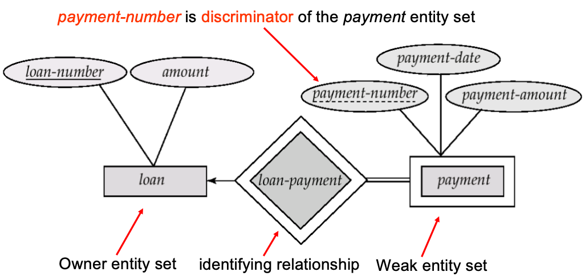{style="width:60%;display: block;margin: 20px auto"}

## 扩展 E-R 特性 

### **实体集层级**

1. **特殊化/具体化**：自顶向下的设计过程

- 在一个实体集中定义出与其他实体不同的子分组，这些子分组成为**较低层次的实体集**，它们拥有不适用于高层次实体集的属性或参与的联系
- **属性继承** ISA：低层实体集继承其连接的高层实体集的**所有属性和参与的联系**

??? example "符号表示"
    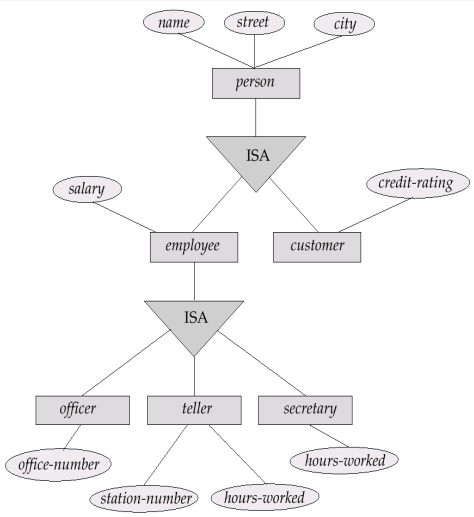{style="width:60%;display: block;margin: 20px auto"}

2. **泛化/普遍化**：自底向上的设计过程

- 将多个具有相同特征的实体集组合成一个**高层实体集**
- 特殊化和泛化互为**简单的逆过程**，在 E-R 图中的表示方式相同

### 设计约束

1. **成员资格约束**：关于**哪些**实体可以属于某个较低层次实体集的约束

- **条件定义的**：实体是否属于子类由属性值决定
- **用户定义的**：由数据库用户手动指定实体所属的子类

2. **不相交约束**：关于一个实体是否可以属于同一泛化中的**多个**较低层次实体集的约束

- **不相交**：一个实体**只能属于一个**较低层次实体集（在 E-R 图中用 disjoint 标注在 ISA 三角形旁）
- **可重叠**：一个实体可以属于多个较低层次实体集

3. **完全性约束**：指定高层次实体集中的实体是否必须属于该泛化中的至少一个较低层次实体集

- **完全泛化**：实体必须属于某一个较低层次实体集
- **部分泛化**：实体**可以不属于**任何较低层次实体集

!!! abstract "符号表示"
    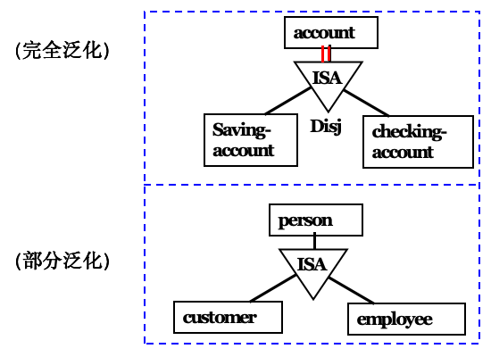{style="width:50%;display: block;margin: 20px auto"}

### 聚合
1. 聚合是为了解决**“联系的联系”**这一问题

2. 通过聚合**消除冗余**：将一个联系集及其相关的实体集抽象成一个**虚拟的实体**，允许联系与联系之间建立关系

3. **应用场景**：当我们需要表达一个三元关系作为一个整体与另一个实体发生关系时，使用聚合可以避免数据冗余

!!! abstract "符号表示"
    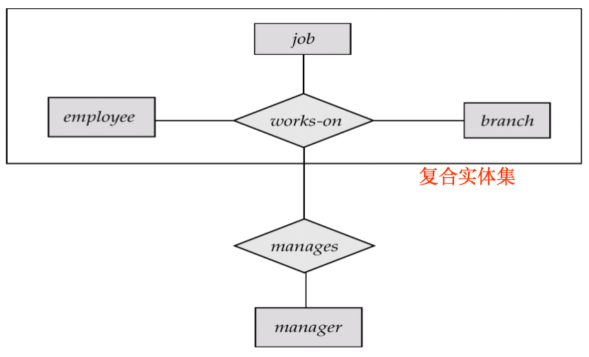{style="width:60%;display: block;margin: 20px auto"}

??? success "summary E-R 符号"
    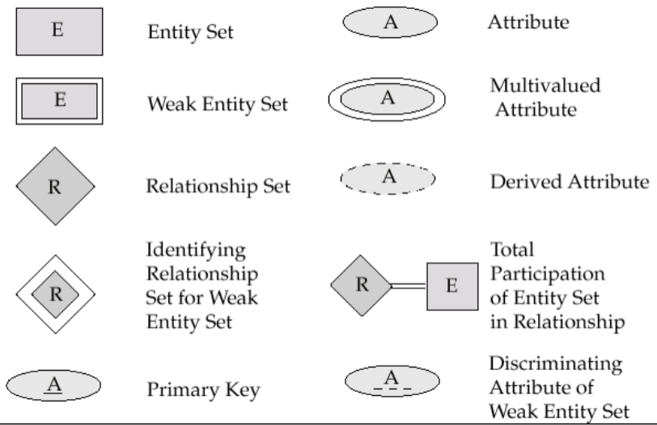{style="width:60%;display: block;margin: 20px auto"}

    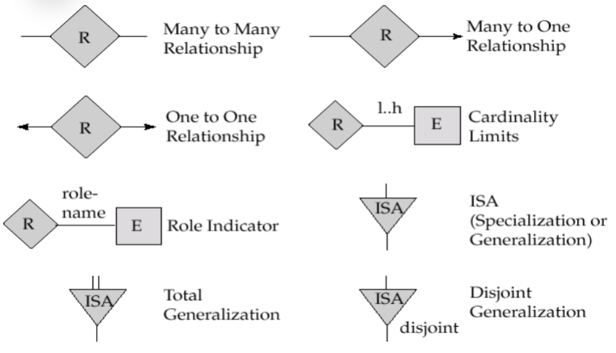{style="width:60%;display: block;margin: 20px auto"}

    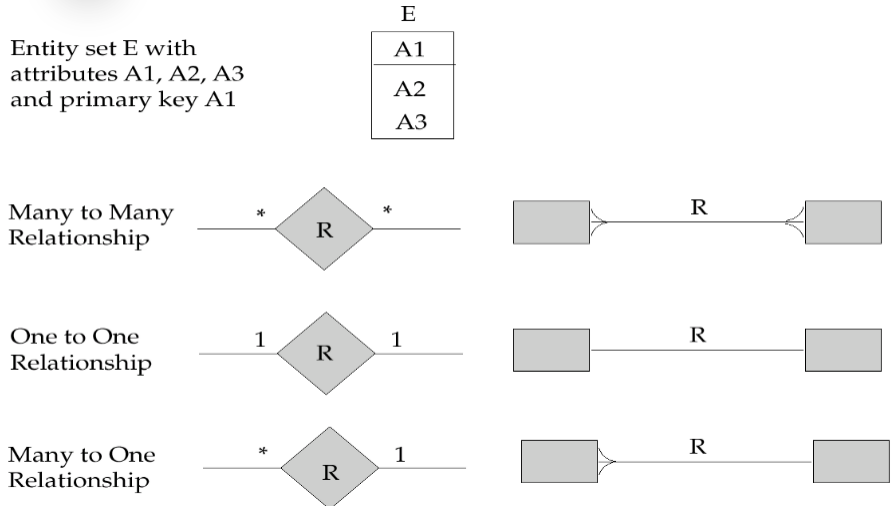{style="width:60%;display: block;margin: 20px auto"}

## E-R 数据库模式的设计

**设计注意点**

1. **属性 or 实体集 ？**

- 如果是单值，对象可以作为属性
- 如果是多值，对象应该作为实体集（比如电话号可能有多个）
- 一个对象**不能同时作为实体和属性**
- 一个实体集不能与另一实体集的属性相关联，只能实体与实体相联系

2. **实体集 or 联系集 ？**（映射基数会影响这一决策）

??? example "区别"
    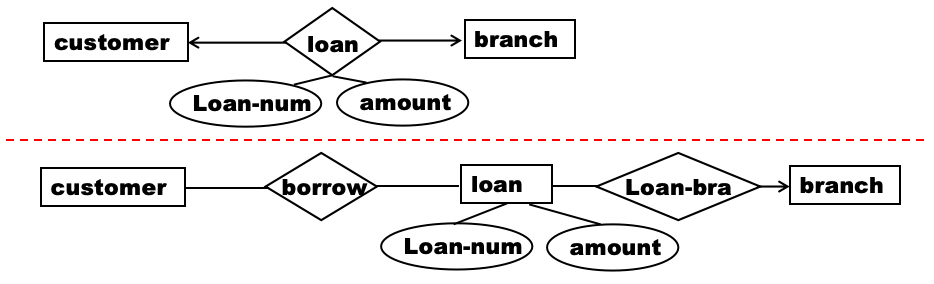{style="width:80%;display: block;margin: 20px auto"}

3. **实体 or 联系 ？**（原则：从语义独立性和减少数据冗余角度考虑）

4. 使用三元或 n 元联系，还是使用一对二元联系

5. 使用强实体集还是弱实体集

6. 使用特殊化/泛化：有助于设计的模块化

7. 使用聚集：可以将 E-R 图的一部分组合成一个单一的实体集，并将其视为一个整体，而无需关注其内部结构的细节

## 将 E-R 模式还原为表

1. 对于**每个实体集和联系集**，都有一个对应的唯一表，表名与相应的实体集或联系集同名
2. **强实体集**：转换为具有相同属性的表
3. **弱实体集**：转换为一个表，其中**包含**标识强实体集的主键作为一列
4. 带**复合属性**的实体集：

- 复合属性被展平，为每个分量属性创建一个单独的属性
- 然后创建一个**单独的新表**来表示

5. **联系集**：表示为一张表，包含：

- 两个参与实体集的**主键列**（这里作为外键）
- 联系集本身的任何**描述性属性**
- **主键**
    - **多对多**：两个实体集的主键的组合
    - **一对多或多对一**：多端的实体集的主键
    - **一对一**：类似一对多

6. **表的冗余处理**

- 对于一对多
    - 如果多端是总参与的，可将联系对应的表**合并到多端实体的表**中
    - 如果多端是部分参与，上述方法可能会导致空值
- 对于一对一联系集，可以在两个实体集对应的两个表中任选一个添加额外属性
- 连接弱实体集及其标识强实体集的联系集对应的表是冗余的（**标识性联系**）

7. **将特殊化表示为表**

- **方法1**
    - 为高层实体集创建一个表
    - 为每个低层实体集创建一个表，包含**高层实体集的主键和局部属性**
    - **缺点**：获取信息可能需要需要访问两个表
- **方法2**：为每个实体集创建一个表，包含所有局部属性和继承属性
    - 如果特殊化是**完全的**，则高层实体的表不需要存储信息，高层次表可以定义为包含所有特殊化表并集的**视图**
    - **缺点**：对于同时存在于多个低层实体集的实体，**继承属性可能冗余存储**