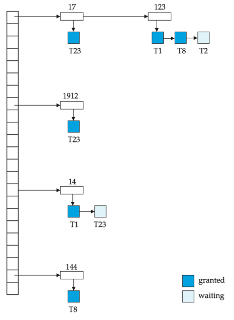
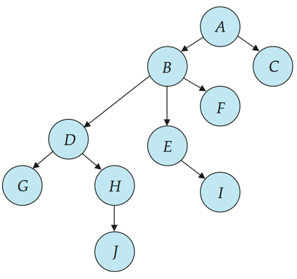
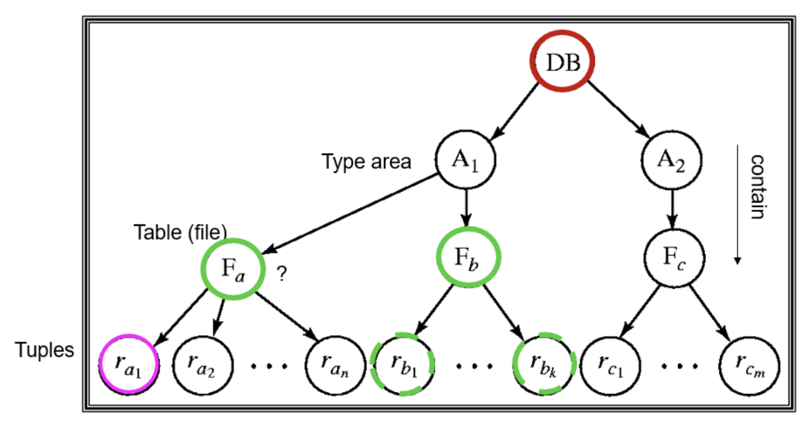

# 并发控制

!!! success "**可串行化调度是并发控制的基础**"
## 基于锁的协议
1. 数据项可以**用两种模式加锁**：
    1. **排他锁（Exclusive，X）模式：**
        1. 数据项既可以被读取，也可以被写入
        2. X 锁通过 `lock-X` 指令申请
    2. **共享锁（Shared，S）模式**：
        1. 数据项**只能被读取**
        2. S 锁通过 `lock-S` 指令申请
2. 锁请求提交给**并发控制管理器**，只有当锁请求被**批准**后，事务才能继续执行
3. **锁兼容矩阵**
    
    | 已持有锁 \ 请求锁 | S（共享锁）     | X（排他锁）     |
    | ---------- | ---------- | ---------- |
    | **S（共享锁）**     | true（兼容）   | false（不兼容） |
    | **X（排他锁）**     | false（不兼容） | false（不兼容） |
    
    1. 如果事务请求的锁与其他事务已经持有的锁**兼容**，则该事务**可以获得该数据项上的锁**
    2. 如果锁请求**不能被批准**，则发出请求的事务必须**等待**，直到其他事务持有的**所有不兼容锁**被释放之后，该锁请求才会被批准

!!! warning "WARNING"
    ```txt
    T2:
    lock-S(A); read(A); unlock(A);
    lock-S(B); read(B); unlock(B);
    display(A+B);
    ```
    
    如果在读取 A 和读取 B 之间，A 和 B 被其他事务更新（因为 S 是可共享锁），则显示出的和将是错误的（A 是旧值，B 是新值）

4. **缺点**：
    1. 可能会产生死锁（不可避免）
    2. 如果并发控制管理器**设计不当**，也可能发生**饥饿**
5. **两阶段锁 2PL**
    1. **Growing Phase**：事务可以获得锁，不能释放锁
    2. **Shrinking Phase**：事务可以释放锁，不能**再**获得锁
    3. 每个事务都有一个**锁点**（lock point）：事务获取的最后一个锁的时间点
    4. **优点**：该协议**保证可串行化**，事务能够按照它们的**锁点（Lock Point）**顺序进行串行化
    5. **缺点**：
        1. 但是**不能保证避免死锁**
        2. 可能发生**级联回滚**
            1. **strict 2PL**：事务必须一直持有**其所有排他锁**，直到事务提交或中止（也就是拿到所有排他锁之后才可以执行）
            2. **Rigorous 2PL**：事务必须**保持其所有锁**，直到事务提交或中止（事务可以按照它们的提交顺序进行串行化）

    !!! tip "TIPs"
        3. 即使采用 2PL，**仍然可能存在某些冲突可串行化调度无法被产生**
        4. 然而，在没有额外信息（例如数据访问顺序）的情况下，从以下意义上说，**2PL 是实现冲突可串行化所必需的**：给定一个不遵循 2PL 的事务 Ti，总可以找到另一个遵循 2PL 的事务 Tj，使得 Ti 和 Tj 的某个调度不是冲突可串行化的

    ??? info "带锁转换的 2PL"   
        5. 第一阶段（增长阶段） 
            1. 可以获得数据项上的 lock-S
            2. 可以获得数据项上的 lock-X
            3. 可以将共享锁（lock-S）转换为排他锁（lock-X）（upgrade）
        6. 第二阶段（收缩阶段）
            1. 可以释放 lock-S（unlock）
            2. 可以释放 lock-X（unlock）
            3. 可以将排他锁（lock-X）转换为共享锁（lock-S）（downgrade）
        7. 该协议**保证可串行化**，但它仍然依赖程序员在程序中插入各种加锁指令

### 锁的实现
1. **锁管理器**
    1. 可以作为独立进程实现，事务向其发送**加锁和解锁请求**
    2. 锁管理器对锁请求的**回复**包括
        1. 发送锁授予消息
        2. 或者**在发生死锁时，发送要求事务回滚的消息**
    3. 请求锁的事务等待，直到其请求得到回应
2. **锁表**：用于记录已授予的锁和待处理的请求，还记录已授予或请求的锁类型
    1. **锁管理器来维护**
    2. 锁表通常实现为**内存中的哈希表**，以被锁数据项的名称作为**索引**

    !!! abstract "锁表结构"
        {style="width:40%;display: block;margin: 20px auto"}

        其中深蓝色矩形表示已授予的锁，浅蓝色矩形表示正在等待的请求

        1. 新请求被添加到该数据项请求队列的末尾，如果与之前所有锁**兼容**，则授予该锁
        2. 解锁请求会导致相应请求被删除，随后检查后续请求是否可以被授予
        3. 如果事务 abort，该事务所有等待或已授予的请求都会被删除（锁管理器可维护**每个事务持有的锁列表**，以实现高效处理）


### 基于图的 protocol
1. **基于图的协议（Graph-based Protocols）**是两阶段锁协议的另一种替代方案

    !!! note "NOTE"
        在所有数据项集合 $D={d_1,d_2,\ldots,d_h}$ 上施加一个**偏序关系** $\rightarrow$

        如果 $d_i \rightarrow d_j$，那么任何同时访问 $d_i$ 和 $d_j$ 的事务，都必须先访问 $d_i$，再访问 $d_j$

        这意味着数据项集合 $D$ 可以被看作一个**有向无环图**，称为**数据库图**

2. **树协议（Tree Protocol）**是一种简单的基于图的协议
    
    !!! abstract "树协议"
        {style="width:30%;display: block;margin: 20px auto"}

        图中一共七个数据项

        1. 只允许使用**排他锁**（X 锁）
        2. 事务 Ti 的第一个锁可以加在**任何数据项**上
        3. 后续对数据项 Q **加锁的前提**是：Ti 当前正持有 Q 的父节点的锁
        4. 数据项可以在**任何时候解锁**
        5. 如果数据项已被 Ti 加锁并解锁，则 Ti **后续不能再重新对其加锁**

    !!! tip "优点 & 缺点"
        1. **优点**：
            1. 树协议**保证了冲突可串行化**，并且**避免死锁**，无需回滚
            2. 在树锁协议中，解锁可以比两阶段锁协议更早发生：缩短等待时间，提高并发性
        2. **缺点**：
            1. 协议**不保证可恢复性或无级联回滚**，需要引入提交依赖以确保可恢复性
            2. 事务可能必须锁定自己不访问的数据项：增加锁开销，延长等待时间，并且可能降低并发性
        3. 在树协议下可能实现的调度，在两阶段锁下未必可行，反之亦然。

--- 
## \* 基于时间戳的协议
1. 每个事务在进入系统时会**被分配一个时间戳**。若旧事务 Ti 的时间戳为 TS(Ti)，新事务 Tj 会被分配时间戳 TS(Tj)，**且 TS(Ti) < TS(Tj)**
2. **时间戳排序协议**保证任何发生冲突的读、写操作都按照时间戳顺序执行
    
    !!! abstract "Abstract"
        为保证此行为，协议为每个数据项 Q 维护两个时间戳值：
        
        1. **W-timestamp(Q)**：**成功执行** write(Q) 的事务中最大时间戳
        2. **R-timestamp(Q)**：成功执行 read(Q) 的事务中最大时间戳

    1. 假设事务 Ti 发出 **read(Q)**：
        1. 如果 TS(Ti) ≤ W-timestamp(Q)，则 Ti 需要读取的 Q 值**已经被覆盖**，因此拒绝该读操作，并**将 Ti 回滚**
        2. 如果 TS(Ti) ≥ W-timestamp(Q)，则执行该读操作，并将 R-timestamp(Q) 设为 max(R-timestamp(Q), TS(Ti))
    2. 假设事务 Ti 发出 **write(Q)**：
        1. 如果 TS(Ti) < R-timestamp(Q)，则 Ti 要产生的 Q 值**之前已经被需要**，而系统假定该值永远不会被产生，因此拒绝该写操作，并**将 Ti 回滚**
        2. 如果 TS(Ti) < W-timestamp(Q)，则 Ti 试图**写入一个过时的 Q 值**，因此拒绝该写操作，并**将 Ti 回滚**
        3. 否则，执行该写操作，并将 W-timestamp(Q) 设为 TS(Ti)

3. **正确性**： 
    1. 时间戳排序协议保证可串行化，因为优先图中的所有边都**由事务（较小时间戳）指向事务（较大时间戳）**，因此优先图中不会出现环路
    2. 时间戳协议**保证无死锁，因为事务从不等待**
4. **问题**：产生的调度可能不是无级联回滚的，甚至可能不是可恢复的
5. **解决方法**：
    1. 一个事务的**所有写操作构成一个原子动作**，当某事务正在执行写操作时，不允许其他事务执行
    2. 中止的事务重新启动时，会被**分配一个新的时间戳**

---
## \* 基于验证的协议
1. **基于验证的协议**：事务 Ti 的执行分为三个阶段：
    1. **读与执行阶段**：事务 Ti 只写入临时局部变量
    2. **验证阶段**：事务 Ti 进行验证测试，判断其局部变量是否可以写入数据库而不违反可串行化性
    3. **写入阶段**：如果 Ti 验证通过，更新写入数据库；**否则，事务回滚**

    !!! tip "TIPs"
        1. 也称为**乐观并发控制（OOC）**
        2. 并发执行的事务的三个阶段可以交错进行，但每个事务必须按顺序经历三个阶段

2. 每个事务 Ti 有 **3 个时间戳**：
    1. **Start(Ti)**：Ti 开始执行的时间
    2. **Validation(Ti)**：Ti 进入验证阶段的时间
    3. **Finish(Ti)**：Ti 完成写入阶段的时间
    4. 为了提高并发性，可串行化顺序**由验证时赋予的时间戳**决定（因此，TS(Ti) 被赋值为 Validation(Ti)）
3. **优点**：当冲突发生**概率较低**时，该协议非常有用，并且能够提供更高程度的并发性
    1. 因为可串行化顺序不是预先决定的
    2. 需要回滚的事务相对较少

---
## 多粒度
1. **多粒度（Multiple Granularity）**：允许根据需求对**不同大小**的数据项进行加锁
2. **数据结构**：
    1. 定义一个数据粒度的层次结构：数据库 → 表 → 页 → 行/记录
    2. 其中较小粒度嵌套在较大粒度内部，并可用**树形结构**表示（不要与树锁协议混淆）
    3. 当事务显式地锁定树中的某个节点时，它会以相同的锁模式**隐式地锁定**该节点的所有后代节点

    {style="width:60%;display: block;margin: 20px auto"}

3. **锁粒度（即进行加锁的树层级）**：
    1. **细粒度**（Fine Granularity，树的较低层）：高并发性，但高加锁开销
    2. **粗粒度**（Coarse Granularity，树的较高层）：低加锁开销，但低并发性

### 意向锁
1. **Intention Locks**：当事务要在某节点加锁时，先在该节点的**所有祖先节点加意向锁**
2. **意向锁类型**：
    
    | 锁类型   | 含义  |
    | -------- | -------- |
    | IS (Intention Shared)  | 后代存在 S 锁（共享锁）       |
    | IX (Intention Exclusive)  | 后代存在 X 锁（排它锁）       |
    | SIX (Shared + Intention Exclusive) | 当前节点 S 锁 + 后代存在 X 锁 |

3. **兼容矩阵**：

     |         | IS    | IX    | S     | SIX   | X     |
    | ------- | ----- | ----- | ----- | ----- | ----- |
    | **IS**  | **true**  | **true**  | **true**  | **true**  | false |
    | **IX**  | **true**  | **true**  | false | false | false |
    | **S**   | **true**  | false | **true**  | false | false |
    | **SIX** | **true**  | false | false | false | false |
    | **X**   | false | false | false | false | false |

4. **作用**：
    1. 当锁高层节点时，无需检查所有子节点是否锁定，**只需查祖先节点的意向锁**
    2. 防止与后代锁冲突，提高效率
5. **事务 Ti 对节点 Q 加锁规则**：

    1. 必须遵守锁兼容矩阵
    2. 树根必须先加锁，可使用任意模式
    3. Q 节点可以加 S 或 IS 锁，仅当 Q 的父节点已由 Ti 加锁为 IX 或 IS
    4. Q 节点可以加 X、SIX 或 IX 锁，仅当 Q 的父节点已由 Ti 加锁为 IX 或 SIX
    5. Ti 只能加锁**未曾解锁过**的节点（符合两阶段锁协议，2PL）
    6. Ti 只能**解锁**那些没有子节点被自己锁定的节点

    !!! tip "TIPs"
        1. **加锁顺序**：自顶向下
        2. **解锁顺序**：自下而上
        3. **优点**：增强并发性，降低加锁开销

---
## \* 多版本机制
**多版本机制**（Multiversion Schemes） 通过保留数据项的旧版本来提高并发性

1. 每一次成功的 write 操作都会创建该数据项的一个新版本
2. **使用时间戳来标识各个版本**
3. 当执行 read(Q) 操作时，**根据事务的时间戳**选择 Q 的合适版本，并返回该版本的值
4. 读操作永远不需要等待，因为总能立即返回一个合适的版本

!!! abstract "多版本时间戳"
    **每个数据项 Q 都维护一个版本序列**：

    \[
    \langle Q_1, Q_2, \ldots, Q_m \rangle
    \]
    
    每个版本 Qk 包含**三个数据字段**：

    1. **Content**：版本 Qk 的值
    2. **W-timestamp(Qk)**：创建（写入）版本 Qk 的事务的时间戳
    3. **R-timestamp(Qk)**：成功读取版本 Qk 的事务中的最大时间戳

    当事务 Ti 创建数据项 Q 的新版本 Qk 时，Qk 的 W-timestamp 和 R-timestamp 都初始化为 **TS(Ti)**

    当事务 Tj 读取 Qk 且 **TS(Tj) > R-timestamp(Qk)** 时，更新 Qk 的 R-timestamp

---
## 死锁处理
1. 如果存在这样一个事务集合，集合中的每个事务都在等待集合中的另一个事务，则系统发生了**死锁（Deadlock）**
2. **处理死锁**
    1. 死锁预防（Deadlock Prevention）
    2. 死锁检测与死锁恢复（Deadlock Detection and Deadlock Recovery）

### 死锁预防
1. **死锁预防协议（Deadlock Prevention Protocols）**保证系统永远不会进入死锁状态。
2. **保守两阶段锁**（Conservative 2PL）：
    1. 要求每个事务在开始执行之前就锁定其**所需的全部数据项**
    2. **缺点**：**并发性差**；很难预先预测事务将访问哪些数据项
3. 对所有数据项施加**偏序关系**
    1. 要求事务只能按照**规定顺序**对数据项加锁（基于图的协议）
    2. 因此不会形成环路，所以不会发生死锁

    !!! example "Example"
        规定顺序：先锁 A，再锁 B

        1. T1：先锁 A → 锁 B
        2. T2：先锁 A → 锁 B
        
        由于所有事务都按顺序加锁，永远不会形成环路，死锁被避免

4. **基于时间戳的方案**
    1. **Wait-die 方案**（非抢占式）：
        1. 老事务可以等待年轻事务释放锁；年轻事务不能等待老事务，否则回滚
        2. **缺点**：事务可能**多次回滚**才能获取锁

        !!! example "Example"
            时间戳：T1 < T2（T1 比 T2 老）
            
            1. T1 锁 A，T2 锁 B
            2. **T2 想锁 A：年轻事务不能等待老事务 → T2 回滚**
            3. T1 可以继续锁 B → 完成操作
            4. 回滚 T2 后重新执行，保证不会死锁

    2. **Wound-Wait 方案**（抢占式）
        1. 老事务不会等待年轻事务；老事务“伤害”年轻事务，强制其回滚
        2. 年轻事务可以等待老事务
        3. **优点**：回滚次数可能比 Wait-Die 少

        !!! example "Example"
            时间戳：T1 < T2（T1 比 T2 老）

            1. T1 锁 A，T2 锁 B
            2. **T1 想锁 B：老事务可以“伤害”年轻事务 → T2 被回滚**
            3. T1 获得 B 锁 → 完成操作
            4. 回滚的 T2 后续再执行，不会死锁

    !!! success "Success"
        在 wait-die 和 wound-wait 两种方案中，被回滚的事务会**使用其原始时间戳重新启动**。因此，较老的事务始终优先于较新的事务，从而**避免饥饿**（Starvation）现象。

5. **基于超时的方案**（Timeout-Based Schemes）：
    1. 事务对锁的等待时间只允许持续一个指定时长
    2. 超时则**事务被回滚**，因此系统不会无限等待，死锁不可能发生
    3. **优点**：实现简单
    4. **缺点**：可能发生**饥饿**；很难确定一个合适的超时时间

### 死锁检测与恢复
1. 死锁可以用**等待图**来描述，当且仅当等待图中存在**环**时，系统处于死锁状态
2. **必须周期性地调用死锁检测算法来查找环路**
3. **当检测到死锁时**：必须回滚某个事务以打破死锁，应选择**代价最小的事务作为牺牲者**
4. 回滚（Rollback）：需要决定事务**回滚到什么程度**：
    1. **完全回滚**（Total Rollback）：中止（Abort）该事务，然后重新启动
    2. **部分回滚**（Partial Rollback）：**只回滚到足以打破死锁的位置，通常更有效**

!!! warning "WARNING"
    如果总是选择**同一个**事务作为牺牲者，就会发生**饥饿**（Starvation）。
    
    为避免饥饿，应将事务**已经经历的回滚次数**纳入代价因素进行考虑。

---
## 插入与删除操作
!!! quote "Quote"
    此处具体内容请查看 PPT 或[笔记](https://wintermelonc.github.io/WintermelonC_Docs/zju/compulsory_courses/database_system/ch12/#7-insert-and-delete-operations)

## \* 索引结构中的并发控制

!!! quote "Quote"
    此处具体内容请查看 PPT 或[笔记](https://wintermelonc.github.io/WintermelonC_Docs/zju/compulsory_courses/database_system/ch12/#-8-concurrency-in-index-structures)