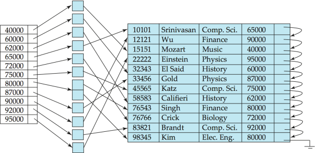
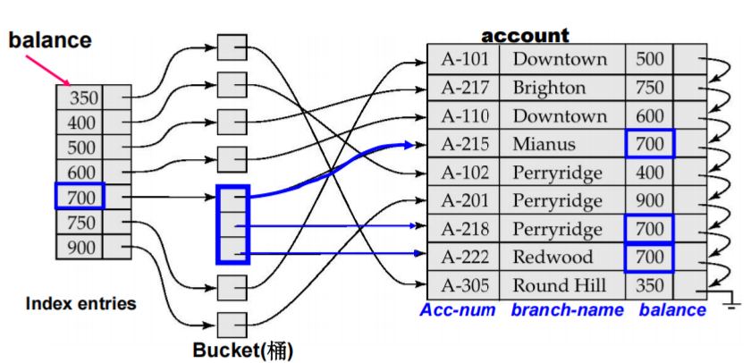
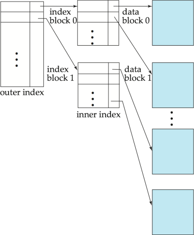
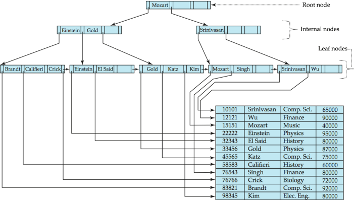
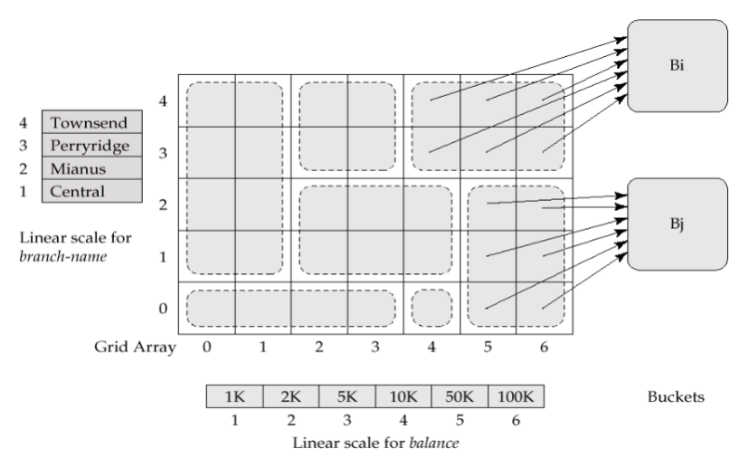
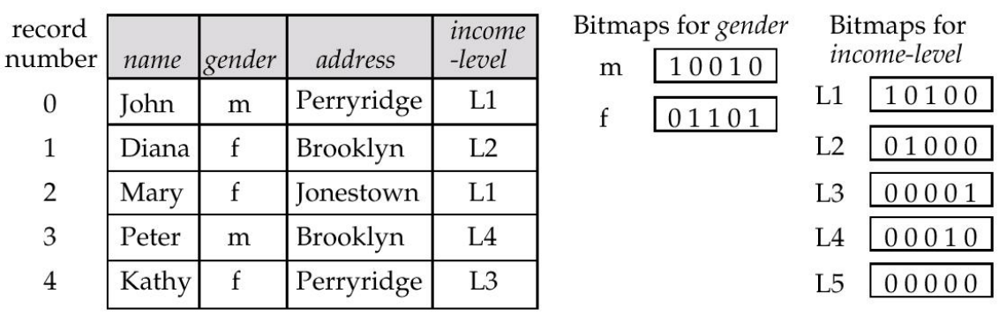

# 索引与哈希

1. **索引目的**：加快对所需数据的访问
2. **搜索码** (Search Key)：用于在文件中查找记录的一个属性或一组属性
3. **索引文件**

- 由形式为 **(搜索码, 指针)** 的记录（称为索引项）组成
- 通常比原始文件**小得多**

4. **索引类型**：

- **顺序索引**：搜索码（索引项）按排序好的顺序存储
- **散列索引**：搜索码（索引项）通过**散列函数**均匀地分布在“桶”中

5. **索引评估指标**：支持高效访问的类型（点查询与范围查询）、访问时间、插入时间、删除时间、空间开销

!!! quote "Quote"
    时间效率和空间效率是衡量索引技术最主要的指标，也是数据库系统组织和管理技术的关注焦点之一。

## 顺序索引
1. **顺序排序文件**：数据文件中的记录按**搜索码**排序
2. **索引顺序文件**：具有**主索引**的顺序排序文件

- **缺点**：
    - 随着文件增大，性能会下降，因为会产生大量的**溢出块**
    - 需要定期对整个文件进行**重组**

### 索引类型
1. **主索引**：与对应的数据文件本身的排列顺序相同的索引，也称为**聚集索引** 

!!! tip "主索引"
    1. 主索引的搜索键**通常是但并非一定是主码**
    2. 非顺序文件没有主索引，但关系可以有主码

2. **主索引类型**：

- **稠密索引**：文件中的每个搜索码值在索引中都有一个索引项
    - 可用于顺序文件和非顺序文件
- **稀疏索引**：仅为部分搜索码值包含索引项
    - 只能用于顺序文件
    - **搜索方法**：先找到小于等于搜索码 K 的最大索引值，然后从该点开始顺序搜索文件
    - **优点**：占用的空间更少，维护开销更低
    - **缺点**：查找速度通常比稠密索引**慢**

3. **辅助索引**：定义的搜索码所指定的顺序与数据文件的物理顺序不同，也称为**非聚集索引**

- 建立一个辅助索引，为每个搜索键值提供一个索引记录
- 该索引记录指向一个**存储桶**，其中包含指向具有该特定搜索键值的**所有实际记录**的指针

{style="width:60%;display: block;margin: 20px auto"}

!!! warning "Warning"
    1. 辅助索引**不能使用稀疏索引**，每条记录都必须有指针指向
    2. 但 search-key 常存在重复项，而 **index entry 不能有重复**，否则查找算法复杂化, 为此使用 bucket 结构
    3. 使用主索引进行顺序扫描效率很高，但使用辅助索引进行**顺序扫描则代价昂贵**：每次记录访问都可能需要从磁盘获取一个新的数据块

??? example "Example"
    {style="width:60%;display: block;margin: 20px auto"}

!!! info "Info"
    如果主索引太大而无法放入内存，访问成本就会变得很高：使用多级索引

5. **多级索引**：把内层索引文件看作顺序数据文件，在其上建立外层的**稀疏索引**

- 外层索引：主索引的稀疏索引
- 内层索引：主索引文件

{style="width:40%;display: block;margin: 20px auto"}

### 索引更新

!!! info "Info"
    该部分包含删除和插入操作，具体例子请查看 PPT：Lec 9_Indexing and Hashing

    **补充**：插入操作可能会出现 overflow

!!! abstract "多级索引"
    由底层逐级向上层扩展，每一层的处理过程与上述单层索引情况下类似


## B+ 树索引文件
1. **B+ 树索引文件**：

- **优点**：
    - 在面对插入和删除操作时，能通过**微小的局部更改**自动进行自我重组
    - 不需要为了维持性能而重组**整个文件**
- **缺点**：额外的插入和删除开销；空间开销

{style="width:80%;display: block;margin: 20px auto"}

2. **特性**

- 非叶节点相当于**多级稀疏索引**
- 每一个非根且非叶的节点拥有 $\lceil n/2 \rceil$ 到 $n$ 个子节点
- 一个叶节点拥有 $\lceil (n-1)/2 \rceil$ 到 $n-1$ 个值
- 如果文件中有 $K$ 个搜索键值，**树的高度不超过** $\lceil \log_{\lceil n/2 \rceil}(K) \rceil$

3. **插入时分裂叶节点**：将 $n$ 个（键值，指针）对按排序顺序排列，将前 $\lceil n/2 \rceil$ 个放在原节点中，其余的放在一个新节点中


??? abstract "非唯一搜索键**代替方案**"
    1. 为每个键维护一个**元组指针列表**：需要额外的代码来处理长列表；如果搜索键存在大量重复，删除元组的代价可能很高；空间开销低，查询无额外成本
    2. 通过添加记录标识符 (record-identifier) 使搜索键唯一：键的存储开销增加；插入/删除的代码更简单；被广泛使用

??? info "B+ 树索引文件组织"
    **良好的空间利用率非常重要**，因为记录占用的空间比指针更多
    
    为了提高空间利用率，在分裂和合并过程中**让更多兄弟节点参与重新分配**
    
    **e.g.** 让 2 个兄弟节点参与重新分配（以尽可能避免分裂/合并），可以使每个节点至少拥有 $\lfloor 2n/3 \rfloor$ 个条目

???  quote "\* B 树索引文件"
    1. 与 B+ 树类似，但 B 树**仅允许搜索键值出现一次**：消除了搜索键的冗余存储
    2. **优点**：相比对应的 B+ 树，可能使用更少的树节点（因为没有重复键）；有时可以在到达叶节点之前就找到搜索键值
    3. **缺点**：只有极小比例的搜索键值能被提前找到；非叶节点更大，导致扇出 (fan-out) 降低，因此 B 树通常比对应的 B+ 树深度更深；插入和删除操作比 B+ 树更复杂；实现难度高于 B+ 树
    4. 通常情况下，B 树的优点并不足以抵消其缺点

## hash
1. 散列索引将搜索键及其关联的记录指针组织成**散列文件结构**
2. **散列索引总是辅助索引**

### \* 静态散列
1. **静态散列**：桶数量固定
2. **哈希函数**：直接从记录的搜索键值获取其所在的存储桶

- **最差的**散列函数会将所有搜索键值映射到同一个存储桶，使得访问时间与文件中的搜索键值数量成正比
- 理想的散列函数是**均匀的**（每个存储桶被分配到相同数量的搜索键值）、**随机的**（每个存储桶都将分配到相同数量的记录）

3. **桶溢出**

- **原因**
    - 存储桶数量不足
    - **记录分布倾斜**：多条记录具有相同的搜索键值；所选散列函数导致键值分布不均匀
- **处理**：虽然存储桶溢出的概率可以降低，但无法消除
    - **闭散列**：使用溢出桶（溢出桶通过溢出链连接）
    - **开散列**：不适用于数据库

??? warning "静态散列缺点"
    1. 如果初始存储桶数量太小，性能会因溢出过多而下降
    2. 如果预估未来的文件大小并据此分配存储桶数量，初始阶段会浪费大量空间
    3. 如果数据库缩小，同样会造成空间浪费
    4. 如果定期使用新的散列函数对文件进行重新组织，代价极高

### \* 动态散列
1. **动态散列**：适用于大小会增长和缩小的数据库，**允许动态修改散列函数**
2. **可扩充散列**：动态散列的一种形式，只使用散列函数结果的一个**前缀**来索引存储桶地址表

??? info "可扩展散列的更新" 
    1. **插入**：若目标存储桶已满

    - $i_j$；所有指向同一个存储桶的条目在其前 $i_j$ 位上具有相同的值
    - $i$：前缀的长度
    - $i > i_j$（桶满，但地址表还有空间）：创建一个新桶，将原桶和新桶的局部深度都加 1，然后重新分配原桶中的记录，地址表中的一部分指针指向新桶
    - $i = i_j$（桶满，且地址表指针已用尽）：将全局深度 $i$ 加 1，地址表条目数量翻倍；原本的一个条目分裂为两个，再次按照 $i > i_j$ 的方式处理桶分裂

    2. **删除**：可以进行存储桶的合并（只能与具有相同 $i_j$ 值且具有相同 $i_j-1$ 前缀的存储桶合并）

## 写优化索引
1. **日志结构合并树 (LSM 树)**

- 内存树：$L_0$；磁盘：$L_1, L_2, L_3...$
- **插入核心过程**：
    - 记录首先被插入到内存树中
    - 当内存树满时，记录被移动到磁盘 $L_1$ 树：通过将 $L_0$ 树中的记录与现有的 $L_1$ 树合并，使用**自底向上构建法**创建 $B^+$ 树
    - 依此类推，支持更多层级
- **删除操作**通过添加特殊的“删除”条目来处理
- **更新操作**使用“插入+删除”组合来处理
- $L_{i+1}$ 树的大小阈值是 $L_i$ 树大小阈值的 $k$ 倍

2. **优点**：

- 插入操作仅使用**顺序** I/O 操作完成
- 叶节点是满的，避免了**空间浪费**
- 与普通的 B+ 树相比（在达到一定规模前），每条插入记录的 I/O 操作次数更少

3. **缺点**：查询必须搜索多个树；每一层的全部内容会被多次复制
4. **分级合并索引** (Stepped-merge index)：LSM 树的一种变体，每一层包含多个树

- 与 LSM 树相比**降低了写入成本**
- 但**查询开销更高**：使用布隆过滤器 (Bloom filters) 来避免在大多数树中进行查找

5. **缓冲树**：LSM 树的替代方案

- **核心思想**： $B^+$ 树的每个内部节点都有一个用于存储插入操作的缓冲区
    - 当缓冲区满时，插入操作被移动到更低层级
    - 配合大容量缓冲区，每次可以将多条记录移动到更低层级
    - 每条记录的 I/O 开销相应减少
- **优点**：查询开销较小；可以配合任何树形索引结构使用；用于 PostgreSQL 的通用搜索树 (GiST) 索引
- **缺点**：比 LSM 树产生更多的随机 I/O


## SQL 中的索引
1. **创建索引**

```sql
create index <index-name> on <table-name> (<attribute-list>);
```

!!! abstract "Abstract"
    使用 `create unique index` **隐式指定并强制要求搜索键必须是候选键**

    **注意**：如果系统支持 SQL 唯一性完整性约束，则通常不需要此操作

2. **删除索引**

```sql
drop index <index-name>;
```

## \* 多键访问

1. **多键访问**：针对某些类型的查询使用多个索引

```sql
select account-number
from account
where branch-name = "Perryridge" and balance = 1000
```

2. **多属性索引**：有一个基于**组合搜索键** `(branch-name, balance)` 的索引
3. **网格文件**：用于加速涉及**一个或多个比较运算符**的通用多搜索键查询的结构

- 具有单个网格数组，并且为每个搜索键属性配备一个线性标度
- **网格数组的维数**等于搜索键属性的数量
- 若要查找搜索键值对应的桶，需使用**线性标度**定位其单元格的行和列，并跟随指针

{style="width:60%;display: block;margin: 20px auto"}

4. **位图索引**：一种特殊类型的索引，旨在对多个键进行高效查询

- **适用范围**：适用于取值范围较小的属性
- 通过**位图运算**来回答查询：and or not
- **存在位图**：用于标记记录位置是否存在有效记录

{style="width:60%;display: block;margin: 20px auto"}
