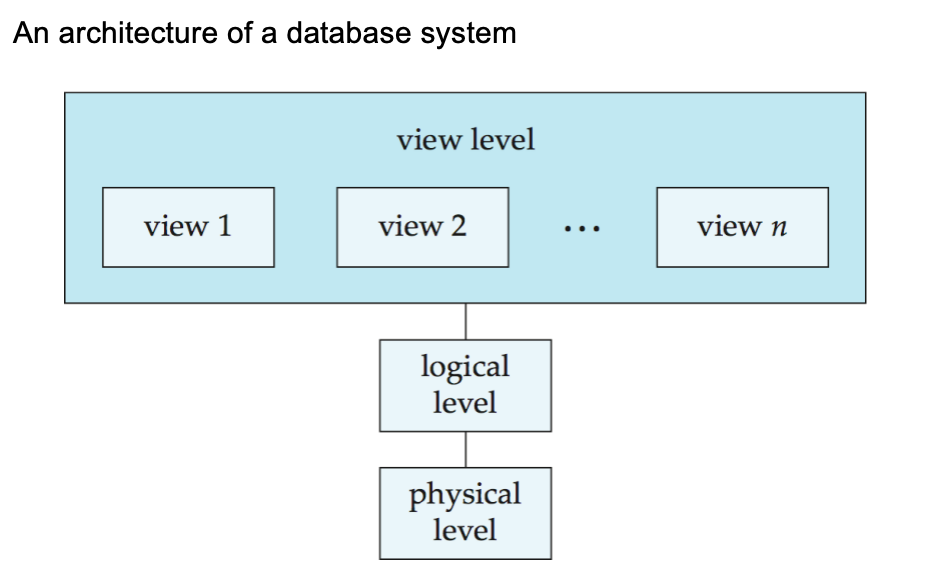

# 基本介绍

1. **数据库**：

- 一个与企业相关的**相互关联**的数据集合
- 一个大的集成且持久的**数据集合** (DB)
- 一个长期存在（通常许多年）的信息集合
- 长期存储在计算机内、有组织的、可共享的数据集合

2. **数据库管理系统**（DBMS）

- 是一种**软件系统**，用于存储、管理并支持对数据库的访问数据库管理系统
- **组成：数据库 + 一组用于访问、更新和管理数据库中数据的程序**
- **特点**
    - 数据访问的高效性和可扩展性
    - 减少应用开发时间
    - 数据独立性 (包括物理数据独立性和逻辑数据独立性)
    - 数据完整性和安全性
    - 并发访问和健壮性 (可恢复性)

!!! abstract "**数据库访问方法**"
    - 使用 DBMS 提供的交互式工具（e.g. SQL Server 的查询分析器，ORACLE 的 Sql*Plus 和工作表等）访问数据库
    - 通过使用开发工具（e.g. VC++、PB、Delphi、ASP、JSP、PHP 等）调用 ODBC/JDBC 来访问数据库

??? warning "**文件处理系统**（File-Processing System）"
    1. **特点**：
        - 由传统的**操作系统**支持
        - 必要时必须编写新的应用程序，并根据需要创建新的数据文件
        - 随着时间的推移，数据文件可能采用**不同格式**
        - 数据文件**彼此独立**
    
    2. **缺点**：
        - 数据**冗余和不一致**：多种文件格式，信息在不同文件中重复
        - **访问困难**：需要编写新程序来执行每个新任务
        - 数据孤立（多个文件和多种格式），难以检索，难以共享
        - 完整性问题：难以添加新约束或更改现有约束
        - 无更新原子性
        - 多用户**并发**访问困难，不受控的并发访问可能导致不一致
        - **安全**问题

    !!! success "Success"
        数据库系统为上述所有问题提供了解决方案！

## 数据

1. **数据抽象级别**

- **物理层**：描述数据是如何存储的
- **逻辑层**：描述数据库中存储的数据，以及上层数据之间的关系
- **视图层**：应用程序隐藏了数据类型的细节（注意，视图也可以为了安全目的隐藏信息）

{style="width:60%;display: block;margin: 20px auto"}

2. **模式**：数据库在不同层次上的结构

- **物理模式**：在物理层设计的数据库结构
- **逻辑模式**：在逻辑层设计的数据库结构
- **子模式**：在视图层的模式

3. **实例**：在特定时间点数据库的**实际内容**

4. **物理独立性 VS 逻辑独立性**

- **数据独立性**：在不影响更高层模式定义的情况下修改某一层模式定义的能力
- **物理**数据独立性：在不改变逻辑模式的情况下修改物理模式
    - 应用程序依赖于逻辑模式
    - 应用程序与数据的结构和存储方式隔离
    - **使用 DBMS 最重要的好处之一**
- **逻辑**数据独立性：保护应用程序免受数据逻辑结构变化的影响
    - 逻辑数据独立性**很难实现**，因为应用程序很大程度上依赖于数据的逻辑结构

5. **数据模型**：用于描述数据结构、数据关系、数据语义、数据约束的概念工具的集合

- **不同层次的数据抽象需要不同的数据模型来描述**
    - 实体-关系模型
    - 关系模型
    - 其他模型：面向对象模型、半结构化数据模型 (XML)
    - 较旧的模型：网状模型、层次模型等

## 数据库语言

1. **数据定义语言** (DDL)：用于定义**数据库模式**的规范表示法

- **用途**：将数据库模式指定为一组关系模式的定义，还指定存储结构、访问方法和一致性约束
- DDL 语句被编译，产生一组存储在称为**数据字典**的特殊文件中的表

```sql
CREATE TABLE account (account_number char(10),balance integer);
```

!!! note "数据字典"
    数据字典包含关于以下内容的**元数据**（即关于数据的数据）：数据库模式、完整性约束、主键、参照完整性、授权

2. **数据操纵语言** (DML)：也称为查询语言，用于访问和操纵按适当数据模型组织的数据的语言

- **用途**：从数据库中**检索**数据，在数据库中**插入/删除/更新**数据
- **分类**
    - 过程式 DML：用户指定需要什么数据以及如何获取这些数据 e.g. C, Pascal, Java 等
    - 非过程式 DML：用户指定需要什么数据，而不指定如何获取这些数据 e.g. **SQL**, Prolog 等
- **SQL 是最广泛使用的非过程式查询语言**
    - 基于集合的，声明式的
    - 但不同的数据库系统提供了过程式扩展

3. **数据控制语言** (DCL)

4. **SQL**

- 结构化查询语言 (Structured Query Language) 
- SQL = DDL + DML + DCL
- **用法**
    - 在交互式环境中直接使用
    - 通过宿主语言使用 e.g. ODBC, JDBC
    - 通过嵌入式 SQL 使用

## 数据库设计

1. **数据库设计步骤**

- **需求分析**：需要什么数据、应用程序和操作
- **概念数据库设计**：使用实体-关系 (E-R) 模型或类似的高级数据模型对数据和约束进行高级描述
- **逻辑数据库设计**：将概念设计转换为 DB 模式
- **模式细化**：关系规范化（检查关系模式是否存在冗余和相关异常）
- **物理数据库设计**：索引、查询、聚簇和数据库调优
- **创建和初始化数据库 & 安全性设计**：加载初始数据，测试；确定不同的用户组及其角色

2. **实体-关系 (E-R) 模型**

- 被广泛用于数据库设计
- E-R 模型中的数据库设计通常转换为关系模型中的设计


## 数据库用户和管理员

1. **数据库用户**：无知用户、应用程序员、专业用户、专门用户

2. **数据库管理员** (DBA): 对数据库和访问这些数据的程序拥有中心控制权的特殊用户

- 对数据库拥有最高权限
- 协调数据库系统的所有活动
- 控制所有用户对数据库的权限
- 对企业的信息资源和需求有很好的理解


## 事务管理

1. 并发使用/访问很重要，但会导致问题/冲突
2. **事务**是在数据库应用中执行单个逻辑功能的操作的集合
3. **事务要求**包括原子性、一致性、隔离性、持久性
4. **事务管理组件**确保尽管发生系统故障和事务失败，数据库仍然保持一致/正确状态
5. **并发控制管理器**：控制并发事务之间的交互，通过备份和恢复子系统

## 数据库架构

1. **存储管理器**：一个程序模块，提供数据库中存储的低级数据与提交给系统的应用程序和查询之间的接口

- **任务**：与文件管理器交互；高效地存储、检索和更新数据
- **包括**：事务管理器、授权与完整性管理器、文件管理器 (与文件系统交互以处理数据文件、数据字典和索引文件)、缓冲区管理器

2. **查询处理器**：包括 DDL 解释器、DML 编译器和查询处理（解析与翻译、优化、评估）