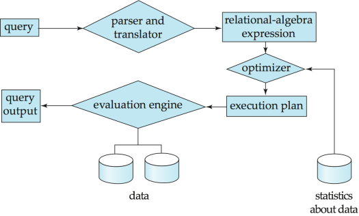
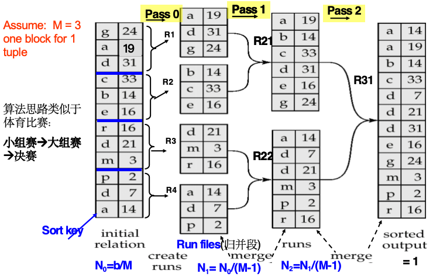

# 查询处理

!!! quote "Quote"
    1. CPU 无法直接操作磁盘中的数据
    2. 磁盘数据读/写（传输）速度的增长率远低于磁盘容量的增长率
    3. 磁盘寻道速度的增长率远低于磁盘数据传输速度的增长率

## 基本步骤

{style="width:50%;display: block;margin: 20px auto"}

1. **语法分析与翻译**：得到解析树和关系代数
    - 语法分析器**检查语法**，**验证关系**
    - 将查询翻译成其内部形式——<mark>**扩展关系代数**</mark>
2. **优化**
    - **原因**：
        - 对于一个给定的 SQL 查询语句，可能存在很多**等价的关系表达式**
        - 每个关系代数操作都可以使用几种**不同的算法**来执行
    - **目标**：<mark>从所有等价的执行计划中选择代价最低的一个</mark>，衡量代价时**考虑两个因素**：
        - 执行所使用的算法
        - 来自数据库目录的统计信息 **e.g.** 每个关系中的元组数量、元组的大小等
3. **执行**（evaluation）：查询执行引擎接收查询**执行计划**，执行该计划，并返回查询的答案
    - <mark>**执行计划**</mark>：规定了详细执行策略的带注释表达式
        - 精确定义每个操作所使用的**算法**
        - 以及操作执行如何进行协调

---
## 查询成本的度量

1. 代价通常衡量为响应查询所需的**总耗时**（total elapsed time）
2. **total elapsed time = disk access + CPU + network communication**
3. **disk access**：主要代价，且相对容易估算
    - 衡量**考虑因素**：
        - 执行的**寻道**操作次数
        - 读取的块数 $\times$ 平均块读取代价
        - 写入的块数 $\times$ 平均块写入代价

        !!! info "Info"
            写入一个块的代价**大于**读取一个块的代价：数据在写入后**会被读回**，以确保写入成功

4. **计算公式**：为简单起见，仅使用**从磁盘传输的块数和寻道次数**作为代价衡量指标
    - $t_T$：传输一个块的时间（$\approx 0.1ms$）
    - $t_S$：一次寻道的时间（$\approx 4ms$）
    - <mark class="orange">**$b$ 次块传输加上 $S$ 次寻道的代价**：$b * t_T + S * t_S$</mark>

    !!! info "Info"
        1. 为简单起见，**忽略了 CPU 代价**（但实际系统中确实会将 CPU 代价考虑在内）
        2. 在代价公式中，不包括**将最终结果写回磁盘**的代价

!!! abstract "代价影响因素：主存中缓冲区的大小"
    1. 拥有更多内存可以**减少**对磁盘访问的需求
    2. 可用于缓冲的实际内存量取决于**其他并发的 OS 进程**，且在实际执行前**难以确定**
    3. 我们经常使用**最坏情况估计**，即假设只有该操作所需的最小内存量可用，同时也进行**最好情况估计**
    4. 所需数据可能**已经驻留在缓冲区中**，从而避免磁盘 I/O，但这在代价估算中**很难考虑在内**

## SELECT

### 等值比较
#### file scan
**文件扫描**：搜索定位并检索满足选择条件的记录的算法，**不使用索引**

=== "**A1: linear search**"
    1. **线性搜索**：扫描每个文件块并测试所有记录是否满足选择条件
    2. **代价估计** 
        - <mark class="cyan">$b_r$ 表示包含关系 $r$ 中记录的块数</mark>
        - **非键属性**：<mark class="orange">代价</mark> = $b_r$ 次块传输 + 1 次寻道 
        - **键属性**：<mark class="orange">代价</mark> = $(b_r / 2)$ 次块传输 + 1 次寻道
            - 由于使用的**主键具有唯一性**，<mark>可以在找到记录后停止</mark>
            - $(b_r / 2)$ 是平均代价估算
    3. **适用条件**：无论选择条件、文件中的记录排序或索引可用性如何，**都可以应用线性搜索**

=== "**A2: binary search**"
    1. **适用条件**
        - 针对**排序**属性的**等值比较** **e.g.** `WHERE a = 5`
        - 关系的块在磁盘上是**连续存储的**
    2. **代价估计**
        - **键属性**：<mark class="orange">代价</mark> = $\lceil \log_2(b_r) \rceil$ 次块传输 + $\lceil \log_2(b_r) \rceil$ 次寻道 
        - <mark>**非键属性**：需要加上包含满足选择条件的记录的**块数**</mark>
            
            - **块传输** = $\lceil \log_2(b_r) \rceil + \lceil sc(A, r) / f_r \rceil - 1$
            - 其中 <mark class="cyan">$sc(A, r)$ 是满足选择条件的记录数，$f_r$ 是每个块的记录数</mark>

            !!! info "解释"
                - 如果选择属性不是码属性，意味着可能**有多条**满足条件的记录
                - 由于文件是有序的，这些匹配记录必定在物理上**连续存放**
                - 因此，在二分搜索定位到第一条记录后，还需要顺序读取后续包含匹配记录的块（**不会有新的寻道次数**）

#### index scan
1. **索引扫描**：使用索引的搜索算法
2. **前提**：选择条件必须基于**该索引的搜索码**

=== "主索引"
    1. **A3: 键上的等值比较**：检索满足相应等值条件的**单条记录**
        - <mark class="orange">**代价**</mark> = $(h_i + 1) * (t_T + t_S)$，其中 $h_i$ 为**索引树高**（层数）
        - 遍历索引树的每一层找到指向数据块的指针，读取数据块
    2. **A4: 非键上的等值比较**：检索满足相应等值条件的**多条记录**
        - 记录将位于**连续的块**中（主索引存在于**顺序文件**中）
        - <mark class="cyan">包含匹配记录的**块数**：$b = \lceil sc(A, r) / f_r \rceil$</mark>
        - <mark class="orange">**代价**</mark> = $h_i * (t_T + t_S) + t_S + t_T * b$ = $(h_i + b) * t_T + (h_i + 1) * t_S$

=== "A5: 辅助索引"
    1. **搜索码是候选码**：检索单条记录
        - <mark class="orange">**代价**</mark> = $(h_i + 1) * (t_T + t_S)$
    2. **搜索码不是候选码**：检索多条记录       
        - 遍历索引树，找到对应的辅助索引
        - 最坏情况下，存储桶中 $n$ 条匹配记录中的每一条都可能位于不同的块中，**都需要进行一次块传输和寻道**
        - <mark class="orange">**代价**</mark> = $(h_i + n) * (t_T + t_S)$
        - 代价可能非常高，可能比线性扫描更糟糕

### 非等值比较
1. 比较符：$>, >=, <, <=, <>$，与等值比较的不同之处在于**选择范围大**
2. 形式为 $\sigma_{A \le V}(r)$ 或 $\sigma_{A \ge V}(r)$ 的选择的**实现方式**：
    1. 线性文件扫描（A1）
    2. 二分搜索（A2）
    3. 使用索引（下述两种方法）
        
        === "A6: 主索引"
            1. 对于 $\sigma_{A \ge V}(r)$，使用索引找到第一条 $A \ge V$ 的元组，并从此开始**顺序扫描关系**
            2. 对于 $\sigma_{A \le V}(r)$，只需**顺序扫描关系**直到遇到第一条 $A > V$ 的元组（**不使用索引**）

        === "A7: 辅助索引"
            1. 对于 $\sigma_{A \ge V}(r)$，使用索引找到第一个 $\ge V$ 的索引项，并**顺序扫描索引**以获取指向记录的指针
            2. 对于 $\sigma_{A \le V}(r)$，只需顺序扫描索引的**叶节点页面**以查找指向记录的指针，直到遇到第一个 $> V$ 的项
            3. 在这两种情况下检索被指向的记录，每条记录都需要一次 I/O，**线性文件扫描可能会更便宜**

### 复杂选择

=== "AND"
    1. **A8: 使用单个索引**
        - 从 $n$ 个条件 $\theta_1 \dots \theta_n$ 中选择**代价最小**的 $\theta_i$ 先执行
        - 返回元组提取到内存缓冲区后，对元组测试其他条件
    2. **A9: 使用复合索引**：如果有合适的**复合（多码）索引**可用，则使用它
    3. **A10: 通过标识符交集实现**
        - **前提**：参与合取的条件**都有带记录指针的索引**
        - 对每个条件使用相应的索引得到满足条件的指针，并**取交集**
        - 再从文件中提取记录
        - 如果**某些条件没有索引**，则先对有索引的条件取交集并提取记录到内存，再**在内存中测试那些没有索引的条件**

=== "OR"
    **A10: 通过标识符并集实现**：
    
    - **前提**：所有条件**都有可用索引**（否则使用**线性扫描**）
    - 对每个条件使用相应的索引，并取所有获得的记录指针集合的**并集**，再从文件中提取记录

=== "NOT"
    1. 对文件使用**线性扫描**
    2. 如果满足 $\neg\theta$ 的**记录非常少**，且**索引**适用于 $\theta$：**使用索引**找到满足条件的记录并从文件中提取

---
## \* Sorting
1. 数据排序的**两种情况**：
    - 输出请求 **`order by`**
    - 可以**快速实现 `join`** 操作

    !!! warning "Warning"
        我们可以在关系上建立索引，然后使用**该索引按排序顺序**读取关系。但这**只是在逻辑上、而非物理上**对关系进行了排序，并可能导致每个元组**都要进行一次磁盘块访问**。

2. **做法**
    - 对于适合放入内存的关系：使用**快速排序**等技术
    - <mark>对于**无法放入内存**的关系：**外部归并排序**</mark>

### **外部归并排序**

1. <mark class="cyan">M 表示内存大小（以页面为单位）</mark>
2. 创建**排序好的归并段** runs：令 i 初始为 0，重复执行以下操作直到关系结束（**i 的最终值为 N**）
    1. 将关系的 M 个块读入内存
    2. 对内存中的**块**进行排序
    3. 将排序后的数据写入归并段 $R_i$；将 i 加 1
3. **归并**

    === "$N < M$"
        1. 使用 $N$ 个内存块来**缓冲输入段**
        2. <mark>使用 1 个块来**缓冲输出**</mark>
        3. 将每个段的**第一块**读入其对应的缓冲页
        4. **重复**：
            1. 在所有缓冲页中选择**第一条记录**并按排序顺序
            2. 将该记录写入输出缓冲区
            3. **如果输出缓冲区已满，则将其写入磁盘**
            4. 从其输入缓冲页中删除该记录
            5. **如果该缓冲页变为空**，则将该段的**下一块**（如果有）读入缓冲区
            6. **直到所有输入缓冲页均为空**

    === "$N > M$"
        1. **需要进行多次归并阶段** passes
        2. <mark>在每个阶段中，**合并 $M - 1$ 个连续的归并段组**</mark>
        3. 一个阶段将归并段的数量减少到原来的 $1/(M - 1)$，并产生长度增加相同倍数的归并段
        4. 重复执行多个阶段，直到所有归并段都被合并为一个

    ??? example "Example"
        {style="width:80%;display: block;margin: 20px auto"}

4. **代价分析**

    1. **块传输次数**
        1. **构建 runs 阶段**：$2b_r$（读入+输出）
        2. **归并阶段**：
            1. **merge passes**：$\lceil \log_{M-1}(b_r / M) \rceil$
            2. 每一次  merge passes **块传输次数**均为 $2b_r$（读入+输出）
            3. <mark>**注意：**最后一个阶段不计算写入代价（无需写入磁盘）</mark>
        3. <mark class="orange">**总块传输次数**：$b_r ( 2 \lceil \log_{M-1}(b_r / M) \rceil + 1)$</mark>
    2. **寻道次数**：
        1. **构建阶段**：$2 \lceil b_r / M \rceil$（读取和写入每个归并段都需要一次寻道）
        2. **归并阶段**：
            1. <mark class="cyan">**缓冲区大小**：$b_b$</mark>（一次读/写 $b_b$ 个块）
            2. 每个归并阶段需要 $2 \lceil b_r / b_b \rceil$ 次寻道（最后一个阶段除外）
        3. <mark class="orange">**总寻道次数**：$2 \lceil b_r / M \rceil + \lceil b_r / b_b \rceil (2 \lceil \log_{M-1}(b_r / M) \rceil - 1)$</mark>

---
## JOIN
### Nested-loop join
1. **嵌套循环连接**
    1. **外层循环**：遍历外层关系 $r$ 的每一条记录
    2. **内层循环**：<mark>对于 $r$ 的每一条记录，都扫描一遍内层关系 $s$</mark>，寻找满足连接条件的记录

    ```c
    for each tuple tr in r do begin
        for each tuple ts in s do begin
            test pair (tr, ts) to see if they satisfy the join condition θ
            if they do, add tr · ts to the result.
        end
    end
    ```

2. **优点**：不需要索引，并且可以与任何类型的连接条件一起使用
3. **缺点**：代价高昂（需要检查两个关系中的每一对元组）
4. <mark class="orange">**代价分析**</mark>
    1. <mark>**最坏情况**：内存仅够容纳**每个关系**的一个数据块</mark>
        1. $n_r * b_s + b_r$ 次数据块传输
        2. $n_r + b_r$ 次磁盘寻道
    2. **最好情况**：两个关系都**全部**在**内存中**
        1. $b_r + b_s$ 次数据块传输
        2. 2 次寻道

    !!! info "变量含义"
        $n_r$：外层关系 $r$ 的行数      $b_r$：外层关系 $r$ 的块数

        $n_s$：内层关系 $s$ 的行数      $b_s$：内层关系 $s$ 的块数

5. 如果**较小**的关系可以完全装入内存，则将其作为**内层关系**，只需要读一次


#### Block nested-loop join

1. **块嵌套循环连接**：以<mark>数据块</mark>为单位处理（内层关系的数据块针对外层关系的每个数据块只读取一次）

    ```c
    for each block Br of r do begin
        for each block Bs of s do begin
            // 在内存中高效处理
            for each tuple tr in Br do begin
                for each tuple ts in Bs do begin
                    Check if (tr, ts) satisfy the join condition
                    if they do, add tr · ts to the result.
                end
            end
        end
    end
    ```

2. <mark class="orange">**代价分析**（可从下边的普遍公式推导）</mark>
    1. **最坏情况**：$b_r * b_s + b_r$ 次数据块传输 + $2 * b_r$ 次寻道
        1. **条件**：内存中只有 3 个 block：$Br, Bs, Bout$
        2. **优化**：让数据块数量较少的关系作为外层关系
    2. **最好情况**：$b_r + b_s$ 次数据块访问 + 2 次寻道   
        1. **条件**：s 全部且始终在内存中，只读一次
        2. **优化**：让数据块数量较少的关系作为内层关系
3. **优化**
    1. 当 $M > 3$，但 $M < b_s$ 且 $M < b_r$ 时：（其中 $M$ = 以块为单位的内存大小）
        1. 使用 $M - 2$ 个磁盘块作为外层关系的块单位
        2. <mark>使用剩余的两个块来缓冲内层关系和输出</mark>
        3. <mark class="orange">**代价**：$\lceil b_r / (M-2) \rceil * b_s + b_r$ 次数据块传输 + $2 \lceil b_r / (M-2) \rceil$ 次寻道</mark>
    2. 如果**等值连接**属性构成了内层关系上的**主键**，则在第一次匹配成功后即可**停止内层循环**
    3. **交替向前和向后扫描内层循环**，以充分利用残留在缓冲区中的数据块（使用 LRU 替换策略时，能直接复用上一轮残留在内存尾部的缓存块）
    4. 如果内层关系上有可用索引，则**使用索引**（索引嵌套循环连接）

#### Indexed nested-loop join
1. **索引嵌套循环连接**：对于外层关系 $r$ 中的每一个元组 $t_r$，<mark>**使用索引去查找内层关系 $s$ 中**</mark>满足与元组 $t_r$ 连接条件的元组
2. **使用条件**：
    1. <mark>连接是**等值连接或自然连接**</mark>
    2. 内层关系 $s$ 有可用索引
3. **最坏情况**：
    1. 缓冲区只能够容纳关系 $r$ 的一个页面（数据块），并且对于 $r$ 中的每一个元组，都要对 $s$ 执行一次索引查找
    2. <mark class="orange">**连接成本**：$b_r (t_T + t_S) + n_r * c$</mark>
    
    !!! info "$c$" 
        1. <mark>指对于外层关系 $r$ 的一个元组，遍历索引并获取所有匹配的内层关系 $s$ 中元组的成本</mark>
        2. **$c$ 可以估算为**：使用该连接条件在关系 $s$ 上执行单次选择（条件查询）的成本
        3. <mark>可以使用 **SELECT 中的索引查询**来计算 $c$</mark>

4. 如果在关系 $r$ 和 $s$ 的连接属性上**都有**可用索引，应选择**元组数量较少的关系作为外层关系**

### Merge-join
#### Sort-merge join
1. **排序归并连接**：
    1. 将两个关系按照其连接属性进行排序
    2. **合并**：
        1. 在内存中维护**两个指针**，分别指向关系 $r$ 和 $s$ 的当前元组
        2. 依次比对连接属性的值，若相等则输出
2. <mark>**只能用于等值连接和自然连接**</mark>
3. **优点**：每个数据块只需要被读取一次（假设连接属性上任意给定值的全部元组都能装入内存）
4. <mark class="orange">**成本**：$(b_r + b_s)$ 次数据块传输 + $(\lceil b_r / b_b \rceil + \lceil b_s / b_b \rceil)$ 次寻道</mark>（如果关系未排序，则还需加上排序的成本）

#### Hybrid merge-join
1. **前提**：如果一个关系**已排序**，而另一个关系在连接属性上具有**辅助 $B^+$ 树索引**
2. **步骤**：
    1. 将已排序的关系与 $B^+$ 树的叶节点条目进行合并
    2. 将结果按照**未排序关系的元组地址**进行排序
    3. 按照物理地址顺序扫描未排序的关系，并与之前的结果进行合并，用实际的元组替换地址

### Hash-join

{style="width:40%;display: block;margin: 20px auto"}

1. **适用于等值连接和自然连接**
2. **步骤**：
    1. 使用哈希函数 $h$ 对两个关系的元组进行**分区**：<mark>1 个 input buffer + M−1 个 buffer 用来写不同分区</mark>
    2. 对于每个 $i$：
        1. 将 $s_i$ 加载到内存中，并使用连接属性在其上构建一个<mark>**内存哈希索引**</mark>
        2. 从磁盘中逐个读取 $r_i$ 中的元组，利用内存哈希索引定位 $s_i$ 中每个匹配的元组 $t_s$

    !!! success "Abstract"
        1. **$r_i$ 中的 $r$ 元组只需要与 $s_i$ 中的 $s$ 元组进行比较，不需要与任何其他分区中的 $s$ 元组进行比较**
        2. 关系 $s$ 被称为构建输入（build input），而 $r$ 被称为探测输入（probe input）
        3. **最多 partition 数 $n_h = M - 1$**
        4. 每个 build partition 大小 **$b_s / n_h$，和 M - 2 比较**，判断是否递归（1 个 input buffer 和 1 个 output buffer）
        5. <mark class="green">如果分区数 $n_h$ 大于内存的页数 $M$，则需要进行**递归分区**</mark>
    
        !!! info "Info：实际需要分几个区"
            通常将 $n_h$ 选择为 $\lceil b_s / M \rceil * f$，其中 $f$ 是一个修正因子（fudge factor），通常在 1.2 左右

3. **成本**：
    1. <mark class="orange">**如果不需要递归分区**：$3(b_r + b_s) + 4 * n_h$ 次数据块传输 + $2(\lceil b_r / b_b \rceil + \lceil b_s / b_b \rceil) + 2 * n_h$ 次寻道 </mark>
    2. **如果需要递归分区**：
        1. 对构建关系 $s$ 进行**分区所需的趟数**：$\lceil \log_{M-1}(b_s) - 1 \rceil$（最好选择**较小**的关系作为构建关系）
        2. <mark class="orange">**总开销估计为**：</mark>
            1. $2(b_r + b_s)\lceil \log_{M-1}(b_s) - 1 \rceil + b_r + b_s$ 次数据块传输
            2. $2(\lceil b_r / b_b \rceil + \lceil b_s / b_b \rceil) \lceil \log_{M-1}(b_s) - 1 \rceil$ 次寻道
    3. 如果整个构建输入可以全部保存在主内存中，则**不需要进行分区**：$b_r + b_s$（**最佳情况**）

---
## \* 其他操作
1. **去重**可以通过 hash 或 sort 来实现
2. **投影**：对每个元组执行投影，随后进行去重
3. **聚集**可以通过类似于去重的方式来实现

...

!!! quote "Quote"
    其他具体内容请查看 PPT

---
## \* 表达式求值

### 实例化
1. **Materialization**：一次只执行一个操作，利用实例化到<mark>临时关系</mark>中的**中间结果**来执行下一层的操作
2. **代价**：各操作代价 + 临时关系写入磁盘的代价
3. **（改进）双缓冲**：为每个操作使用两个输出缓冲区
    1. 当一个缓冲区填满时将其写入磁盘，同时填充另一个缓冲区
    2. 允许磁盘写入与计算重叠（并行），从而减少执行时间

### 流水线
1. **流水线**：在某个操作正在执行时，就<mark>将元组传递给其父操作</mark>（同时执行多个操作，将一个操作的结果直接传递给下一个操作）
2. **优点**：比实例化要便宜得多：不需要将临时关系存储到磁盘中
3. **缺点**：可能并不总是可行（取决于下一个操作的类型，以及输出是否排序等）
4. **通过两种方式执行**：需求驱动（demand driven）和生产者驱动（producer driven）
    1. **demand driven/lazy evaluation**：
        1. 每个操作根据需要向其子操作请求下一个元组
        2. 每个操作都被实现为一个迭代器
    2. **producer driven/eager evaluation**：
        1. 在操作符之间维护缓冲区
        2. 操作符急切地产生元组并将其向上传递给它们的父操作
