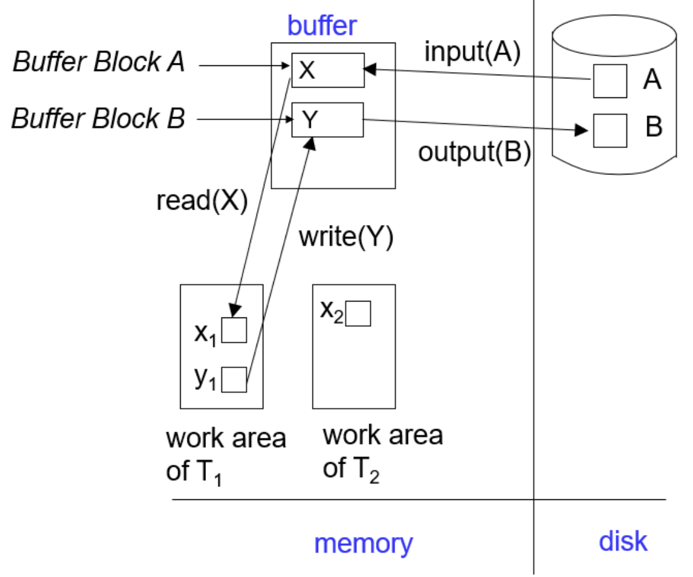
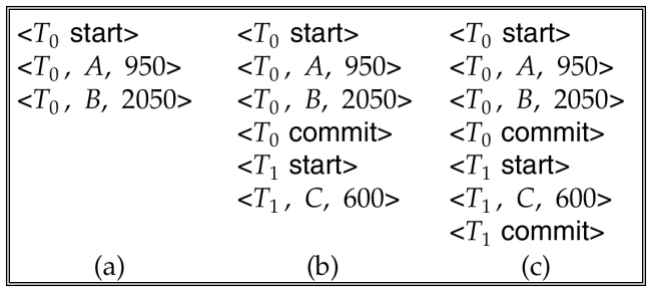
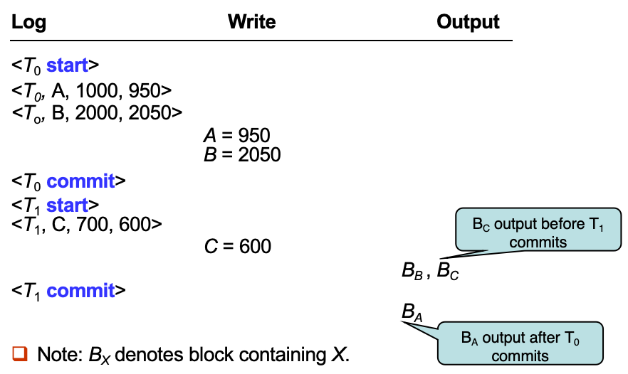
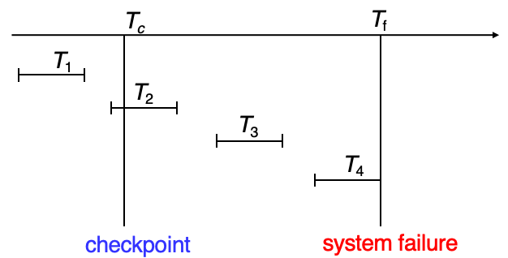
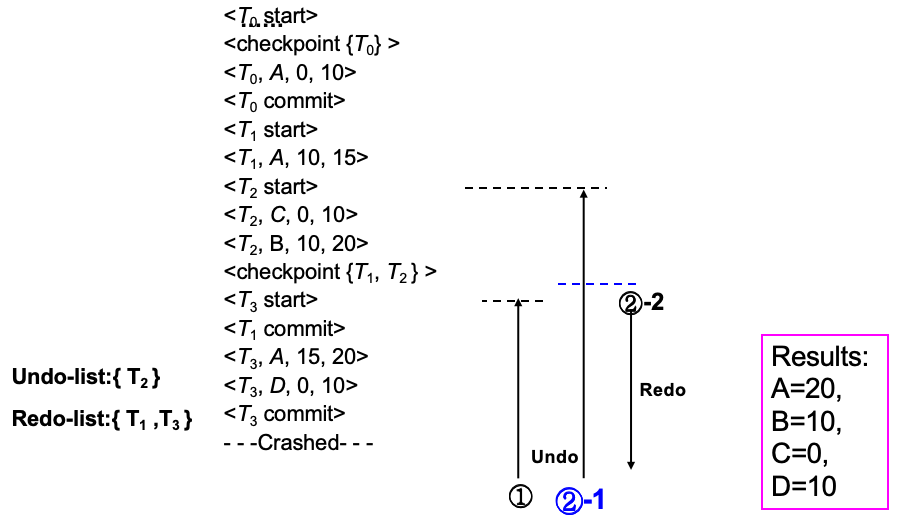
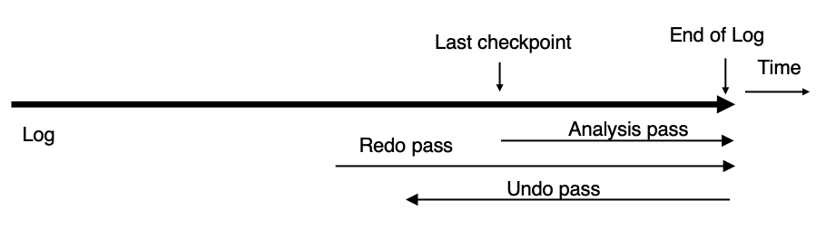

# 恢复系统

## 故障分类
1. **事务故障**（Transaction Failure）
    1. **逻辑错误**（Logical Errors）：由于某些**内部**错误条件，事务无法完成执行，例如：溢出（overflow）、错误输入（bad input）、数据不存在（data not found）等
    2. **系统错误**（System Errors）：由于错误条件（例如死锁），数据库系统必须终止一个正在执行的事务
2. **系统崩溃**（System Crash）：电源故障或其他硬件、软件故障导致系统崩溃
    
    !!! abstract "失效停止假设（Fail-stop Assumption）"
        假设**非易失性存储**中的内容不会因系统崩溃而损坏。
        
        数据库系统具有大量完整性检查机制，以防止磁盘数据损坏。

3. **磁盘故障**（Disk Failure）
    1. 磁头损坏或类似的磁盘故障会破坏全部或部分磁盘存储内容
    2. 假设这种破坏是可检测的：磁盘驱动器使用**校验和（checksums）**来检测故障

!!! tip "恢复算法"
    恢复算法包含两个部分：

    1. 在正常事务处理期间采取的措施：以确保**存在足够的信息**用于故障恢复
    2. 在故障发生后采取的措施：将数据库恢复到满足原子性（Atomicity）、一致性（Consistency）和持久性（Durability）的状态

---
## \* 存储结构
1. Stable storage（稳定存储）：一种理论上的存储形式，能抵御所有故障
2. **实现**：可通过在不同非易失性介质上**维护多份副本**来实现近似

!!! warning "WARNING：**数据传输过程中发生故障仍可能导致副本不一致**"
    **防止**数据传输过程中存储介质故障的一种方案：（假设每个块有两个副本）：
    
    1. 将信息写入第一个物理块
    2. 当第一次写入成功完成后，再将相同的信息写入第二个物理块
    3. **只有当第二次写入也成功完成后**，输出操作才算完成

    从故障中**恢复**的方法：

    1. 首先找出不一致的块
        1. 代价较高的方法：比较每个磁盘块的两个副本
        2. 更好的方法：
            1. 在非易失性存储（非易失性 RAM 或磁盘的专用区域）中记录正在进行的磁盘写操作
            2. 恢复时利用这些信息找出可能不一致的块，仅比较这些块的副本
            3. 该方法用于硬件 RAID 系统
    2. 修复不一致的块：
        1. 如果发现某个不一致块的任一副本存在错误（校验和错误），则用另一个副本覆盖它
        2. 如果两个副本都没有错误，但内容不同，则用**第一个块覆盖第二个块**

### **数据访问**
{style="width:50%;display: block;margin: 20px auto"}

1. **物理块**（Physical Blocks） 是驻留在磁盘上的块
2. **缓冲块**（Buffer Blocks） 是暂时驻留在主存中的块
3. **磁盘与主存之间**的块移动通过以下两个操作完成：
    1. **input(B)**：将物理块 B 从磁盘传输到主存
    2. **output(B)**：将缓冲块 B 从主存传输到磁盘，并替换磁盘上对应的物理块
4. 每个事务 Ti 都有自己的**私有工作区（private work-area）**，其中保存该事务访问和更新的所有数据项的本地副本
    1. 数据项 X 在事务 Ti 中的本地副本称为 xi
5. **系统缓冲区块与事务私有工作区之间**的数据传输通过以下操作完成：
    1. **read(X)**：将数据项 X 的值赋给本地变量 xi
    2. **write(X)**：将本地变量 xi 的值写入缓冲区块中的数据项 X

    !!! tip "TIPs"
        1. **output(BX)** 不一定要紧跟在 **write(X)** 之后执行，系统可以在认为合适的时候再执行 **output** 操作
        2. **事务规则**：
            1. 第一次访问数据项 (X) 时，必须先执行 **read(X)**（之后再次读取时，可以直接从本地副本读取）
            2. **write(X)** 可以在事务提交（commit）之前的任意时刻执行

!!! abstract "\* 恢复与原子性"
    为确保在故障情况下的原子性，首先将描述修改内容的信息输出到稳定存储，而不修改数据库本身

    1. 基于日志的恢复机制
    2. 使用较少的替代方法：影子分页

## 基于日志的恢复
1. 日志保存在**稳定存储（stable storage）**中，是一系列**日志记录**组成的序列，用于记录数据库上的更新活动
2. **日志记录**
    1. 当事务 Ti 开始时，会写入一条日志记录来登记自身：**&lt;Ti start&gt;**
    2. 在 Ti 执行 write(X) 之前，必须先写入一条日志记录：**&lt;Ti, X, V1, V2&gt;**
        1. 其中：V1 是写入前 X 的值（旧值），V2 是将要写入 X 的值（新值）
    3. 当 Ti 执行完最后一条语句时，会写入日志记录：**&lt;Ti commit&gt;**
    4. 当 Ti 完成回滚时，会写入日志记录：**&lt;Ti abort&gt;**
3. **使用日志的两种恢复方法**：
    1. 延迟数据库修改（Deferred Database Modification）
    2. 立即数据库修改（Immediate Database Modification）

### 延迟数据库修改
1. **方案**：将所有修改记录到日志中，但把所有**实际写**数据库的操作**推迟到部分提交之后执行**
2. 假设事务**串行执行**
    1. 执行 write(X) 时，产生如下日志记录：**&lt;Ti, X, V&gt;** **（该方案中不需要记录旧值）**
    2. 此时不会真正修改 X，而是将写操作延迟执行
    3. 最后**读取日志记录，并根据日志文件执行之前被延迟的写操作**

!!! example "Example"
    **三个时刻的日志状态：**

    {style="width:50%;display: block;margin: 20px auto"}

    (a) 不需要执行任何 redo 操作

    (b) 由于存在 **&lt;T0 commit&gt;** 必须执行 redo(T0)

    (c) 由于同时存在 **&lt;T1 commit&gt;** 和 **&lt;T0 commit&gt;**，必须先执行 redo(T0) 再执行 redo(T1)

### 立即数据库修改
1. **方案**：未提交事务的更新在事务提交之前就写入缓冲区，甚至直接写入磁盘

    !!! tip "Tips"
        1. 更新日志记录必须**先于**数据库项写入
        2. 更新后的数据块可以**在提交之前或之后**写入稳定存储
        3. 数据块输出顺序不要求与写入顺序一致

    !!! example "Example"
        {style="width:50%;display: block;margin: 20px auto"}

2. **恢复过程需要两种操作**：
    1. **undo(Ti)**：将 Ti 更新过的所有数据恢复为**旧值**；从 Ti 最后一条日志记录**开始向前**扫描
    2. **redo(Ti)**：将 Ti 更新过的所有数据设置为**新值**；从 Ti 第一条日志记录**开始向后**扫描

    !!! success "注意"
        两种操作都必须满足**幂等（Idempotent）**，即：即使执行多次，效果也与执行一次相同。
        
        原因：恢复过程中可能重复执行。

3. **崩溃后的恢复规则**
    1. **需要 Undo**：若日志中存在 **&lt;Ti start&gt;** 但不存在 **&lt;Ti commit&gt;**
    2. **需要 Redo**：若日志中同时存在 **&lt;Ti start&gt;** 和 **&lt;Ti commit&gt;**
    3. **先做 Undo，再做 Redo**

!!! abstract "原因"
    对日志中的所有事务执行 redo 和 undo 会**非常慢**，引入检查点
    
    **原因**：系统运行时间越长，日志越大，处理整个日志非常耗时；很多事务的修改实际上已经写入数据库，再次 redo 是不必要的。

4. **检查点（checkpoint）**：定期执行检查点操作
    1. **执行步骤**：
        1. 将**主存**中的所有**日志记录**写入**稳定存储**
        2. 将所有已修改缓冲块写入**磁盘**
        3. 写入日志记录：**&lt;checkpoint L&gt;**，其中 L 是检查点时仍然活跃的事务集合
        4. 执行检查点期间**暂停**所有更新操作
    2. 恢复时只需要考虑：
        1. 最近一次检查点之前开始、但尚未结束的事务
        2. 检查点之后开始的事务

        !!! example "Example"
            T1 忽略；T2 和 T3 Redo；T4 Undo

            {style="width:50%;display: block;margin: 20px auto"}

---
## \* 影子页
1. 影子分页是基于日志恢复的替代方案，适用于**事务串行执行**的场景
2. **核心思想**：在事务生命周期内维护**两张页表**：
    1. 当前页表
    2. **影子页表**：保存在非易失性存储中，用于**保存事务执行前**的数据库状态
3. **提交事务**时：将当前页表写入磁盘，使当前页表成为**新的影子页表**
    1. 磁盘固定位置保存着**影子页表指针**，只需修改该指针，使其指向当前页表
    2. 当该指针成功写入后，事务**正式提交**
4. **系统崩溃后**：
    1. 无需恢复过程，新事务可以立即开始，**直接使用影子页表**
    2. 任何未被当前页表、影子页表引用的页面，都应该被释放（垃圾回收）
5. **优点**：相对于日志恢复：
    1. 不需要写日志记录
    2. 恢复过程非常简单
6. **缺点**：
    1. **复制**整个页表代价极高（可以利用 B+ 树结构页表降低开销：无需复制整棵树，只需复制通向被修改叶节点的路径）
    2. **提交**开销仍然很高（刷新所有更新页面/刷新页表）
    3. 数据容易**碎片化**，相关页面可能分散在磁盘不同位置
    4. 每次事务完成后，旧版本页面都需要**垃圾回收**
    5. **很难扩展到并发事务**（基于日志的恢复机制更容易支持并发）

---
## 并发事务恢复

!!! info "并发事务恢复"
    1. 为了支持多个事务并发执行，需要对前面的日志恢复方案进行修改
    2. 所有事务共享：一个磁盘缓冲区、一个日志文件
    3. 一个缓冲块中的数据项可能被一个或多个事务更新
    4. 假设采用**严格两阶段锁协议**

==**系统崩溃后的恢复**==：

1. **第一阶段**
    1. 首先初始化：undo-list = {}、redo-list = {}
    2. 从日志末尾开始向前扫描，直到找到最近的 **&lt;checkpoint L&gt;**
        1. 遇到 **&lt;Ti commit&gt;** 则 Ti 加入 redo-list
        2. 遇到 **&lt;Ti start&gt;** 若 Ti 不在 redo-list 中，Ti 加入 undo-list
        3. 遇到 **&lt;Ti abort&gt;** 则 Ti 加入 undo-list
        4. 对于 L 中每个事务 Ti，若 Ti 不在 redo-list，Ti 加入 undo-list
2. **第二阶段**：恢复继续执行：
    1. **从日志末尾向前扫描**，直到 undo-list 中每个事务的 **&lt;Ti start&gt;** 都被找到
    2. 扫描过程中对于属于 undo-list 的日志记录，执行 undo
    3. 找到最近的 **&lt;checkpoint L&gt;**，从该检查点开始**向后扫描，直到日志末尾**
    4. 扫描过程中对于属于 redo-list 的日志记录，执行 redo

!!! example "Example"
    {style="width:60%;display: block;margin: 20px auto"}

---
## 缓冲区管理
1. 日志记录不会立即写入稳定存储，而是先**缓存在主存**中

    !!! abstract "Abstract"
        日志记录在以下情况下被写入稳定存储：
        
        1. 日志缓冲区中的日志块**已满**
        2. 执行了 **log force 操作**，例如执行检查点（Checkpoint）时

!!! info "该部分内容详见 PPT"
    1. 缓冲区管理的部分内容
    2. 非易失性存储丢失时的故障（Failure with Loss of Nonvolatile Storage）
    3. \* 高级恢复技术
    4. \* 远程备份系统（Remote Backup Systems）

---
## \* ARIES 恢复算法
1. ARIES 是目前先进的恢复方法之一，包含大量优化技术：降低正常运行期间的开销；加快恢复速度
2. **特点**：
    1. 使用日志序列号（**LSN**）标识日志记录
    2. 在数据页中保存 LSN，用于判断哪些更新已经应用到页面
    3. 使用生理重做（Physiological Redo）
    4. 使用 **Dirty Page Table** 避免不必要的 Redo
    5. 使用模糊检查点（**Fuzzy Checkpointing**），检查点时不要求把脏页写出
3. **生理重做**：指重做事务操作时，页面定位使用物理方式（确定哪一页需要修改），而页内具体操作可以用逻辑方式描述（只记录变更的具体操作，而不是整个页面内容）
    1. 减少日志存储和 I/O 开销，同时保持恢复操作的幂等性和正确性

### **数据结构**
1. **日志序列号（LSN）**用于唯一标识每条日志记录
    1. **要求**：单调递增、顺序编号
    2. 通常 LSN 是日志文件起始位置的偏移量，便于快速定位日志记录，也容易扩展到多个日志文件
2. **Page LSN**：最近一次**已经反映到该页面**上的日志记录对应的 LSN
    1. **作用**：恢复时利用 PageLSN 判断某条日志是否已经应用过，从而避免重复 Redo，保证幂等性
3. **日志记录**
    1. **PrevLSN**：同一事务上一条日志记录的 LSN
    2. **日志结构**：`| LSN | TransID | PrevLSN | RedoInfo | UndoInfo |`
    3. ARIES 引入特殊日志：**补偿日志记录（CLR）**
        1. 用于记录恢复过程中执行的 **Undo 操作**
        2. **CLR 本身只需要 Redo，永远不需要 Undo**
        3. **UndoNextLSN** 表示下一条需要**继续 Undo 的日志记录**
        4. **结构**：`| LSN | TransID | UndoNextLSN | RedoInfo |`
4. **Dirty Page Table**：记录缓冲区中已经修改过的页面
    1. 对于每个脏页保存**两个重要信息**：
        1. **PageLSN**：页面当前的 PageLSN
        2. **RecLSN**
            1. 当页面**第一次**进入脏页表时：RecLSN 被设置为当前日志末尾位置
            2. RecLSN 会被记录到**检查点**中
            3. **作用**：减少恢复时需要执行的 Redo 工作量
5. **检查点日志**
    1. 检查点日志记录**包含**：
        1. DirtyPageTable
        2. 活动事务列表：
            1. 所有尚未结束的事务
            2. **LastLSN**：该事务最近一条日志记录的 LSN
        3. 磁盘固定位置保存最近一次完成检查点的 LSN
    2. 与传统检查点不同，ARIES **在检查点时不写出脏页**，脏页由后台持续刷新，因此检查点代价非常低，可以频繁执行检查点

### 恢复算法
**ARIES 恢复包含三个阶段**：

{style="width:80%;display: block;margin: 20px auto"}

=== "**Analysis Pass**"
    1. **目标**：确定：
        1. **undo-list**：其中所有事务都需要回滚
        2. **DirtyPageTable**：用于减少 Redo 工作量
        3. **RedoLSN**：Redo 起点
    2. 从最近一次完成的**检查点**日志记录开始
        1. 读取脏页表
        2. 计算 **RedoLSN**：
            1. RedoLSN = 所有 RecLSN 中的最小值
            2. **如果没有脏页**：RedoLSN = Checkpoint记录的LSN
        3. **初始化 undo-list** 为检查点中记录的活动事务列表
        4. 读取每个活动事务对应的 LastLSN
    3. 继续从检查点**向后扫描**
        1. 如果发现某事务出现日志记录，但不在 undo-list 中，则加入 undo-list
        2. 发现更新日志记录，如果该页不在 DirtyPageTable 中，则将其加入脏页表，并设置 RecLSN = 当前更新日志记录的LSN
        3. 发现事务结束记录，从 undo-list 删除该事务，同时持续维护每个事务的 **LastLSN**

=== "**Redo Pass**"
    1. 从 RedoLSN 开始**向后扫描**，重新执行所有尚未反映到磁盘页面上的更新
    2. 当遇到更新日志记录时
        1. **需要 Redo**：Page LSN < 当前日志记录 LSN
        2. **不需要 Redo**：
            1. 页面不在 DirtyPageTable 中
            2. 日志记录的 LSN < 该页的 RecLSN

=== "**Undo Pass**"
    1. 对 undo-list 中的所有事务进行回滚，**从日志尾部向前扫描**
    2. 当需要对更新日志执行 Undo 时，生成 CLR
    3. 对于每个事务，下一条需要 Undo 的日志设为 **LastLSN**
    4. 每一次，选择所有待撤销 LSN 中**最大**的一个执行 Undo

