# 关系数据库设计

## 第一范式

如果关系模式 $R$ 的所有属性域都是**原子的**，则称该关系模式**符合第一范式** (1NF)

!!! note "原子性"
    1. 如果域的元素被认为是不可分割的单元，则该域是**原子的**

    2. **非原子域的示例**：复合属性、多值属性、复杂数据类型

    3. **如何处理**非原子值
    
    - 复合属性：使用多个属性
    - 多值属性：**使用多个字段，使用一张独立的表**，使用单个字段但通过特殊符号分隔（不推荐）
    
    4. **非原子性的缺点**：存储复杂、查询复杂、数据冗余

    5. 原子性实际上是关于**域元素如何被使用**的属性

        **e.g.** 学号 CS0012 如果提取前两个字符来查找系别，那么学号的域就不是原子的

## 关系数据库设计陷阱
!!! abstract ""
    有两种设计方法：自顶向下、自底向上（泛关系 $\Rightarrow$ 分解 $\Rightarrow$ 好的数据库模式）

1. **缺陷**

- **冗余**：浪费空间，并可能导致数据不一致
- **更新异常**：使更新操作复杂化，引入了不一致的可能性

2. **判断特定关系 $R$ 是否处于“好”的形式**：无冗余
3. 如果关系 $R$ 不处于“好”的形式，将其**分解为一组关系**，该分解满足

- **无损连接分解**
- **保持依赖的**（函数依赖）
- 每个关系 $R_i$ 都处于“好”的形式：BCNF 或 3NF（无冗余）

---
## 函数依赖 FD
1. **定义**：设 $R$ 为一个关系模式，$\alpha$ 和 $\beta$ 为属性集，即 $\alpha \subseteq R$ 且 $\beta \subseteq R$

- 当且仅当对于 $R$ 的任何合法关系 $r(R)$，**只要 $r$ 中的任意两个元组 $t_1$ 和 $t_2$ 在属性 $\alpha$ 上取值相同，它们在属性 $\beta$ 上也一定取值相同时**，称函数依赖 $\alpha \to \beta$ 在 $R$ 上成立，即：

    $$
    t_1[\alpha] = t_2[\alpha] \implies t_1[\beta] = t_2[\beta]
    $$

- **读作**：$\beta$ 函数依赖于 $\alpha$，$\alpha$ 函数决定 $\beta$

!!! abstract "Example"
    $A \to B$ 不成立，$B \to A$ 可能成立

    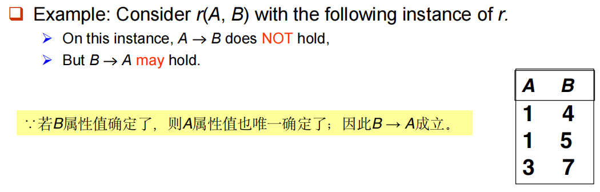{style="width:60%;display: block;margin: 20px auto"}

2. **函数依赖 vs 码** ：函数依赖是码概念的泛化

- $K$ 是关系模式 $R$ 的**超码**，当且仅当 $K \to R$
- $K$ 是 $R$ 的**候选码**，当且仅当：$K \to R$，且不存在 $\alpha \subset K$ 使得 $\alpha \to R$（即 $K$ 的真子集均不能决定 $R$）

3. **函数依赖的使用**

- **测试关系**：如果关系 $r$ 在函数依赖集 $F$ 下是合法的，我们说 **$r$ 满足 $F$**
- **在合法关系集上指定约束**（模式层面）：如果 $R$ 上**所有**合法关系 $r$ 都满足函数依赖集 $F$，我们说 **$F$ 在 $R$ 上成立**

!!! warning "Warning"
    可以说关系 $r(R)$ 满足 $F$，但不能仅根据一个 $r(R)$ 就说 $F$ 在模式 $R$ 上成立（关系中的数据可能会变）

    容易判别一个 $r$ 是否满足给定的 $F$；**不易判别 $F$ 是否在 $R$ 上成立**（不能仅由某个 $r$ 推断出 $F$）

4. 通常情况下，如果 $\beta \subseteq \alpha$，则 $\alpha \to \beta$ 是**平凡的**，否则是非平凡的 

### **函数依赖闭包**

1. 给定一个函数依赖集 $F$，存在某些被 $F$ 逻辑蕴含的其他函数依赖 
    
    **e.g.**：如果 $A \to B$ 且 $B \to C$，那么可以推断出 $A \to C$

2. **定义**：被 $F$ 逻辑蕴含的所有函数依赖的集合称为 **$F$ 的闭包**，记作 **$F^+$**
3. **阿姆斯特朗公理**：提供了寻找 $F^+$ 的推理规则

- **自反律**：如果 $\beta \subseteq \alpha$，则 $\alpha \to \beta$ （平凡依赖）
- **增补律**：如果 $\alpha \to \beta$，则 $\gamma\alpha \to \gamma\beta$ 或 $\gamma\alpha \to \beta$
- **传递律**：如果 $\alpha \to \beta$ 且 $\beta \to \gamma$，则 $\alpha \to \gamma$ 
- **特点**：可靠的：只生成实际成立的函数依赖；完备的：生成所有成立的函数依赖

!!! abstract "附加规则"
    1. **合并律**：如果 $\alpha \to \beta$ 且 $\alpha \to \gamma$ 成立，则 $\alpha \to \beta\gamma$ 成立
    2. **分解律**：如果 $\alpha \to \beta\gamma$ 成立，则 $\alpha \to \beta$ 且 $\alpha \to \gamma$ 成立
    3. **伪传递律**：如果 $\alpha \to \beta$ 且 $\gamma\beta \to \delta$ 成立，则 $\alpha\gamma \to \delta$ 成立

??? example "Example"
    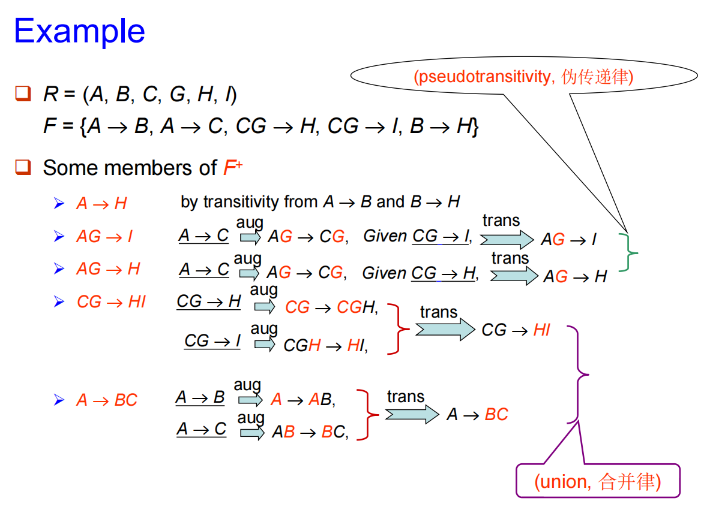{style="width:60%;display: block;margin: 20px auto"}

4. **计算函数依赖集 $F$ 的闭包**：重复执行以下操作（**太复杂**，用属性集闭包代替）

- 对每个函数依赖 $f$ 应用自反律和增补律，将得到的结果函数依赖添加到 $F^+$ 中
- 对每对函数依赖 $f_1$ 和 $f_2$ 使用传递律进行组合，将结果函数依赖添加到 $F^+$ 中

### 属性集闭包

1. **定义**：给定一个属性集 $\alpha$，在 $F$ 下 $\alpha$ 的闭包记作 $\alpha^+$，它是在 $F$ 下由 $\alpha$ **函数决定**的所有属性的集合（在 $F$ 下由 $\alpha$ 所直接和间接**函数决定**的属性的集合称为 $\alpha^+$）

2. **用途**：

- **测试 $\alpha \to \beta$ 是否在 $F^+$ 中**：$\beta \subseteq \alpha^+$
- **测试 $\alpha$ 是否为超码**：$\alpha \to R$ 是否在 $F^+$ 中，即 $R \subseteq \alpha^+$
- **计算 $F$ 的闭包**：对于每个 $S \subseteq \gamma^+$，函数依赖 $\gamma \to S$ 包含在 $F^+$ 中

3. **属性集闭包的计算**（避免了找 $F^+$（反复使用公理）的麻烦）

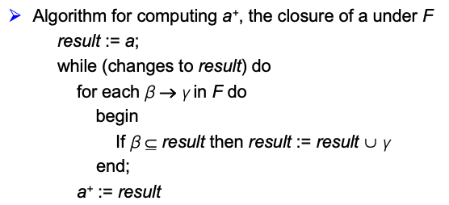{style="width:50%;display: block;margin: 20px auto"}

!!! example "属性集闭包求解"
    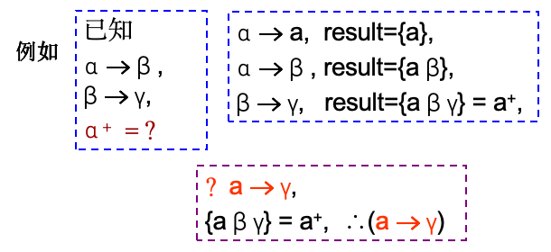{style="width:50%;display: block;margin: 20px auto"}

??? example "利用属性集闭包判断候选码和超码"
    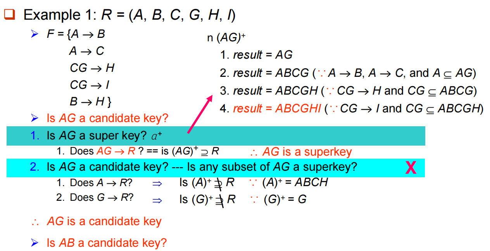{style="width:60%;display: block;margin: 20px auto"}

    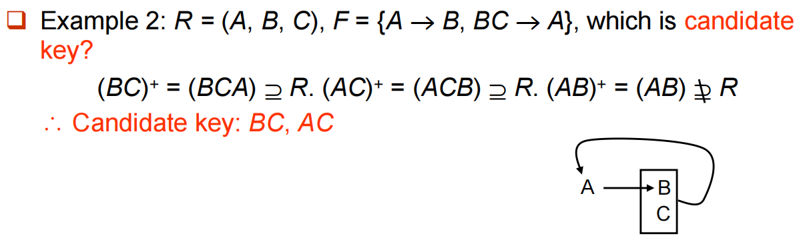{style="width:60%;display: block;margin: 20px auto"}

### 正则覆盖

1. **$F$ 的正则覆盖**是一个与 $F$ **逻辑等价**的**最小**函数依赖集，记作 $F_c$

2. **正则覆盖的计算**：删除无关属性

- 函数依赖集中可能存在可以**从其他依赖推导出来**的冗余依赖
   
    $$
    F = \{A \to C, A \to B, B \to C\} \implies F_c = \{A \to B, B \to C\}
    $$

- 函数依赖**左侧**的部分属性可能是冗余的

    $$
    F = \{A \to B, B \to C, AC \to D\} \implies \{A \to B, B \to C, AC \to D, A \to D\} \implies \{A \to B, B \to C, A \to D\}
    $$

- 函数依赖**右侧**的部分属性可能是冗余的

    $$
    F = \{A \to B, B \to C, A \to CD\} \implies \{A \to B, B \to C, A \to C, A \to D\} \implies \{A \to B, B \to C, A \to D\}
    $$

- **正则覆盖算法**：重复执行以下步骤：
    - 使用合并律将 $F$ 中所有形如 $\alpha_1 \to \beta_1$ 和 $\alpha_1 \to \beta_2$ 的依赖替换为 $\alpha_1 \to \beta_1\beta_2$
    - 寻找在 $\alpha$ 或 $\beta$ 中包含无关属性的函数依赖 $\alpha \to \beta$，如果找到了无关属性，将其从 $\alpha \to \beta$ 中删除
    - 直到 $F$ 不再发生变化

??? example "正则覆盖求解"
    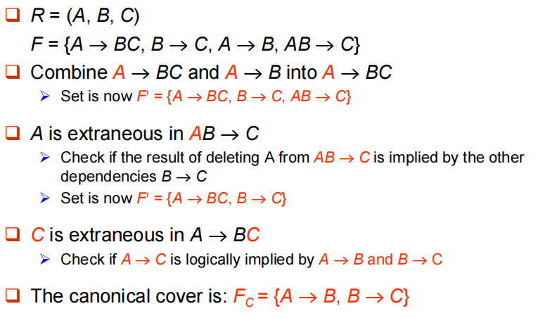{style="width:60%;display: block;margin: 20px auto"}

---
## 分解
**分解的要求**：

- 原始模式 $(R)$ 的所有属性必须出现在分解后的模式 $(R_1, R_2)$ 中，即 $R = R_1 \cup R_2$
- **无损连接分解**：
    - 对于模式 $R$ 上所有可能的关系 $r$
    
        $$
        r = \Pi_{R1}(r) \bowtie \Pi_{R2}(r)
        $$

    - **判定准则**：$F^+$ 中至少包含以下依赖之一（**无损连接分解的条件**：分解后的两个子模式的共同属性必须是 $R_1$ 或 $R_2$ 的码）
        
        $$
        \{R_1 \cap R_2\} \to R_1 或 \{R_1 \cap R_2\} \to R_2
        $$

- **依赖保持**：$(F_1 \cup F_2 \cup \dots \cup F_n)^+ = F^+$

    !!! abstract "依赖保持的测试"
        为了检查在将关系 $R$ 分解为 $\{R_1, R_2, \dots, R_n\}$ 的过程中，函数依赖 $\alpha \to \beta$ 是否得到了保持，可以应用以下**简化测试算法**：
        
        - 初始化结果集：$result = \alpha$
        - 循环直至 $result$ 不再变化：
            - 遍历分解后的每一个子模式 $R_i$
            - 计算 $t = (result \cap R_i)^+ \cap R_i$
            - 更新结果集：$result = result \cup t$
        - **判定结论**：如果最终的 $result$ 包含 $\beta$ 中的**所有属性**，则函数依赖 $\alpha \to \beta$ 是保持的

??? example "Example"
    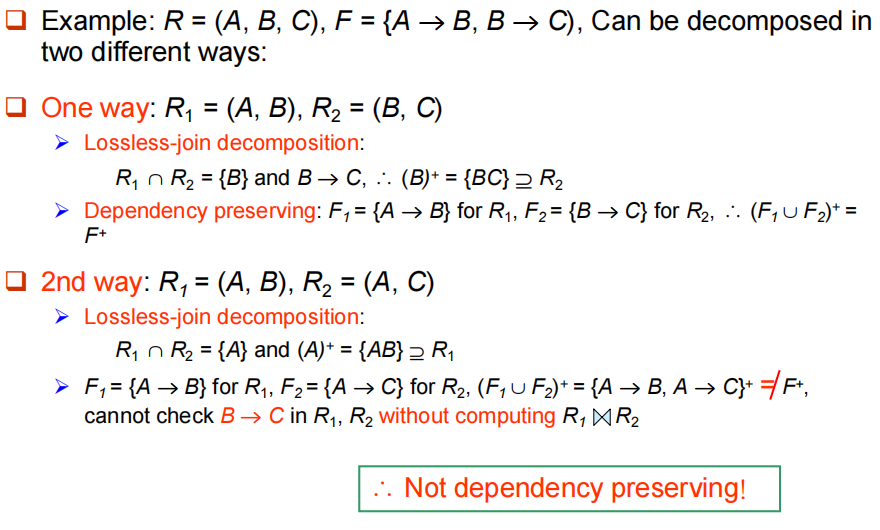{style="width:60%;display: block;margin: 20px auto"}

## Boyce-Codd 范式

1. **定义**：关系模式 $R$ 对于函数依赖集 $F$ 处于 BCNF，当且仅当对于 $F^+$ 中所有形如 $\alpha \to \beta$ 的函数依赖（其中 $\alpha \subseteq R$ 且 $\beta \subseteq R$），下面条件**至少有一个成立**：

- $\alpha \to \beta$ 是**平凡的函数依赖**（即 $\beta \subseteq \alpha$）
- $\alpha$ 是模式 $R$ 的一个**超码**

!!! abstract "BCNF 判定"
    1. 要检查一个关系模式 $R$ 是否符合 BCNF，只需检查给定集合 $F$ 中的依赖**是否违反 BCNF**，而**不需要检查 $F^+$ 中**的所有依赖
    2. 但是在测试 **$R$ 分解后的关系** $R_i$ 时，仅使用 $F$ 进行测试可能是错误的，**需要使用 $F^+$**

2. **BCNF 分解**：

- 寻找**不符合 BCNF 两个条件**的函数依赖 $\alpha \to \beta$
- 将 $R_i$ **分解为两个子模式**：$R_{i1} = (\alpha, \beta)$ 和 $R_{i2} = (R_i - \beta)$，$\alpha$ 是 $R_{i1}$ 和 $R_{i2}$ 的共同属性
- 最终，每个子模式**都符合 BCNF，**且该分解是**无损**连接的

??? example "Example1"
    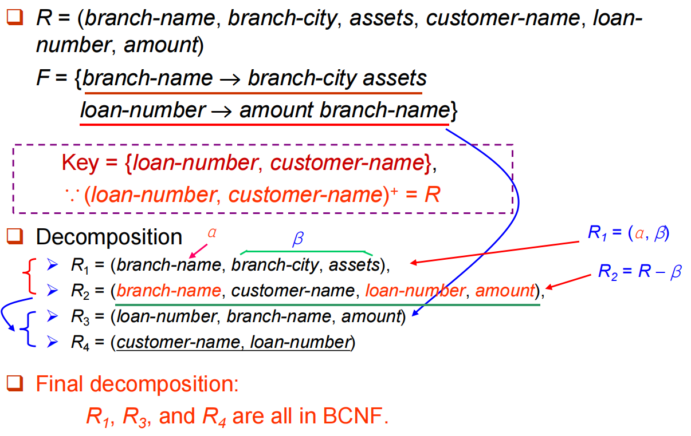{style="width:60%;display: block;margin: 20px auto"}

!!! example "Example2"
    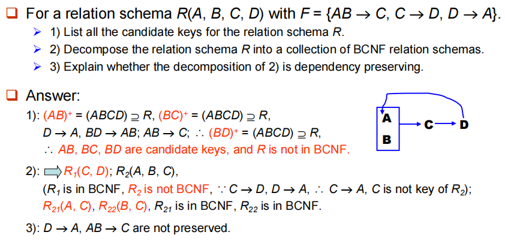{style="width:60%;display: block;margin: 20px auto"}

!!! warning "Warning"
    不一定能够获得一个既符合 BCNF **又保持依赖**的分解

    !!! example "Example"
        $R = (J, K, L)$ 其中 $J$ 学生、$K$ 课程、$L$ 教师
        
        $F = \{JK \rightarrow L, L \rightarrow K\}$
        
        两个候选码 = $JK$ 和 $JL$
        
        - $R$ 不符合 BCNF：因为对于 $L \rightarrow K$，$L$ 不是码
        - 对 $R$ 的任何分解都将无法保持 $JK \rightarrow L$ **e.g.** $R_1 = (L, K), R_2 = (J, L)$，属于 BCNF，但不保持依赖

    **因此，我们无法始终同时满足所有三个设计目标：无损连接、BCNF、保持依赖**

## 第三范式
!!! info "第三范式"
    为了解决分解为 BCNF 不能保持依赖的问题，定义一种较弱的范式，称为第三范式

    - 允许一定程度的**冗余**（及其产生的问题）
    - 但函数依赖可以在单个关系上进行检查，而无需计算连接，即保持依赖
    - **总能找到一种无损连接且保持依赖的 3NF 分解**

1. **定义**：一个关系模式 $R$ 处于 3NF，如果对于 $F^+$ 中所有的 $\alpha \rightarrow \beta$，至少满足以下条件之一：

- $\alpha \rightarrow \beta$ 是平凡的（即 $\beta \subseteq \alpha$）
- $\alpha$ 是 $R$ 的一个超码
- **$\beta - \alpha$ 中的每个属性 $A$ 都包含在 $R$ 的一个候选码中**（即 $A \in \beta - \alpha$ 是主属性；若 $\alpha \cap \beta = \emptyset$，则 $A = \beta$ 是主属性）

!!! tip "Tips"
    1. **如果一个关系处于 BCNF，则它一定处于 3NF**
    2. 第三个条件是对 BCNF 的最小化放宽，以**确保保持依赖**

!!! example "Example"
    $R = (J, K, L)$ 其中 $J$ 学生、$K$ 课程、$L$ 教师
        
    $F = \{JK \rightarrow L, L \rightarrow K\}$

    该实例处于 3NF，但是会存在一定的冗余（不需要分解，所以可能会存在信息重复的问题）

2. **3NF 测试**

- 只需检查 $F$ 中的函数依赖，无需检查 $F^+$ 
- 使用属性闭包检查每个依赖 $\alpha \rightarrow \beta$，以判断 $\alpha$ 是否为超码
- 如果 $\alpha$ 不是超码，必须验证 $\beta$ 中的每个属性是否包含在 $R$ 的候选码中

!!! warning "Warning"
    这种测试开销较大，因为它涉及查找所有候选码：**测试 3NF 已被证明是 NP-hard 问题**（但是分解为第三范式可以在多项式时间内完成）

3. **3NF 分解**

- 求正则覆盖 $F_c$
- 遍历 $F_c$ 中的每一个函数依赖 $\alpha \to \beta$，**组合成一个子模式** $R_i = (\alpha, \beta)$（保持以来）
- 如果没有任何子模式包含候选码，则选出 $R$ 的**任意一个候选码，创建一个新的子模式**

??? example "Example"
    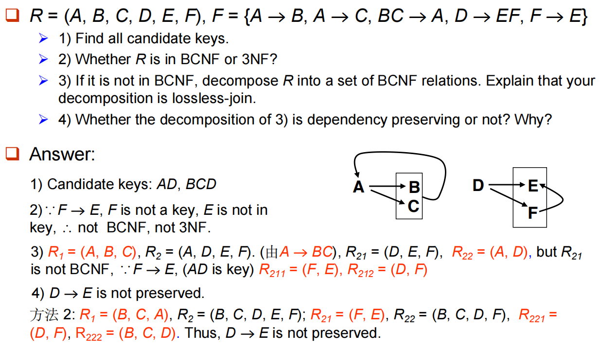{style="width:60%;display: block;margin: 20px auto"}

---
## 多值依赖
!!! warning "Warning"
    即使满足 BCNF ，仍然可能存在数据冗余

    ??? example "Example"
        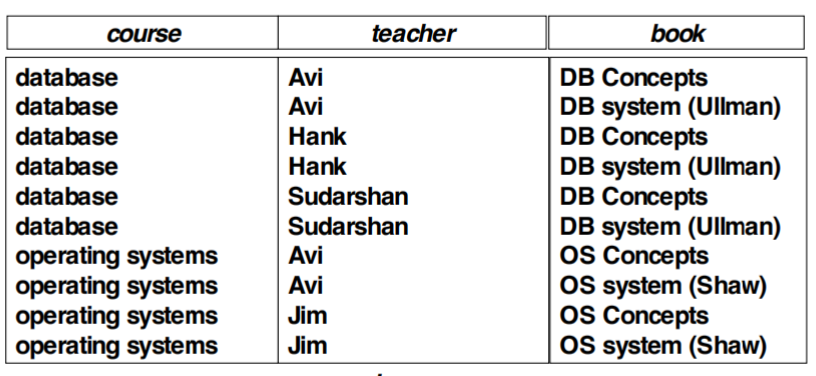{style="width:60%;display: block;margin: 20px auto"}

        **最好分解为：**（分解之后也满足 4NF）

        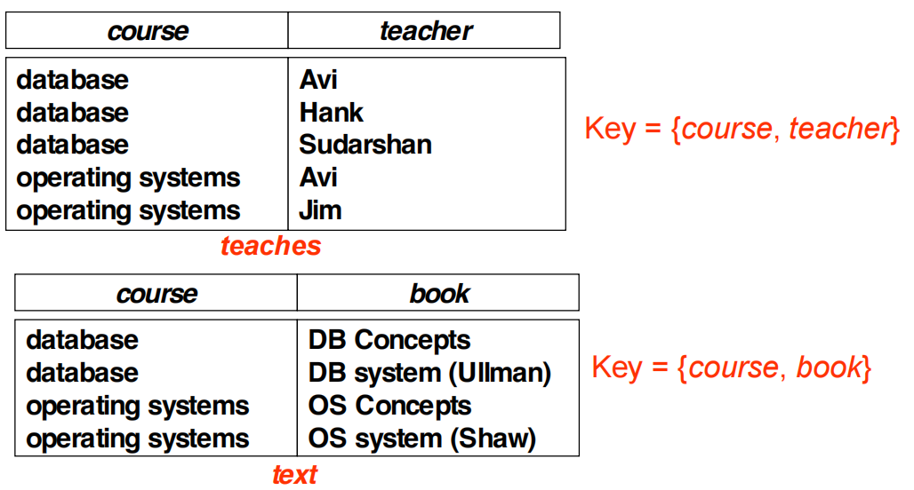{style="width:60%;display: block;margin: 20px auto"}

1. **定义**：令 $R$ 为一个关系模式，$\alpha \subseteq R$ 且 $\beta \subseteq R$
    
    若在 $R$ 的任何合法关系 $r(R)$ 中，对于 $r$ 中所有满足 $t_1[\alpha] = t_2[\alpha]$ 的元组对 $t_1$ 和 $t_2$，在 $r$ 中都存在元组 $t_3$ 和 $t_4$ 满足：
    
    - $t_1[\alpha] = t_2[\alpha] = t_3[\alpha] = t_4[\alpha]$
    - $t_3[\beta] = t_1[\beta]$ & $t_4[\beta] = t_2[\beta]$
    - $t_3[R - \alpha - \beta] = t_2[R - \alpha - \beta]$ & $t_4[R - \alpha - \beta] = t_1[R - \alpha - \beta]$

    则称多值依赖 $\alpha \twoheadrightarrow \beta$ 在 $R$ 上成立

!!! quote "通俗易懂"
    当一个属性（人）能对应多组独立的信息（爱好、鞋号）时，这些信息之间就像平行线一样互不相关，但却被迫塞在同一个表里相互“连累”重写

2. **理论**：如果 $\alpha \to \beta$，那么 $\alpha \twoheadrightarrow \beta$

---
## 第四范式
1. **定义**：一个关系模式 $R$ 关于函数依赖和多值依赖集 $D$ 属于 4NF，是指对于 $D^+$ 中所有形如 $\alpha \twoheadrightarrow \beta$ 的多值依赖（其中 $\alpha \subseteq R$ 且 $\beta \subseteq R$），至少满足以下条件之一：

- $\alpha \twoheadrightarrow \beta$ 是平凡的（即 $\beta \subseteq \alpha$ 或 $\alpha \cup \beta = R$）
- $\alpha$ 是模式 $R$ 的一个超码

2. **如果一个关系属于 4NF，则它一定属于 BCNF**
3. **分解**：识别并提取不满足 4NF 的多值依赖 $\alpha \twoheadrightarrow \beta$，将原模式分解为包含 $(\alpha \cup \beta)$ 和 $(R - \beta)$ 的两个子模式