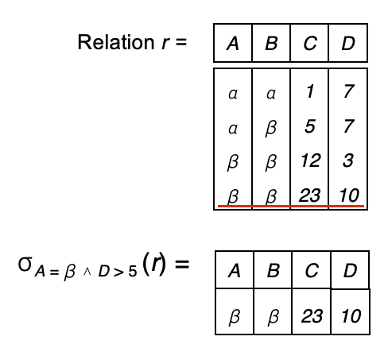
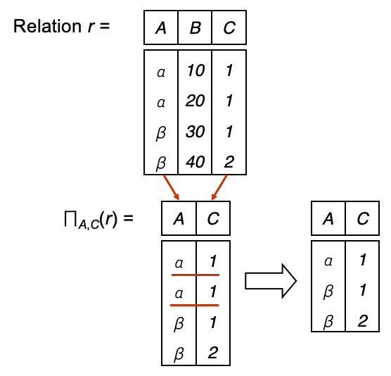
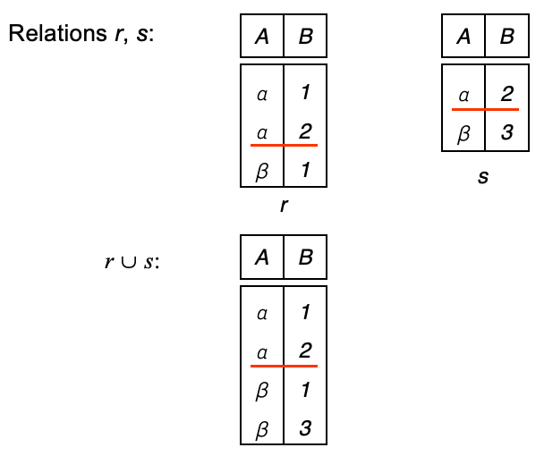
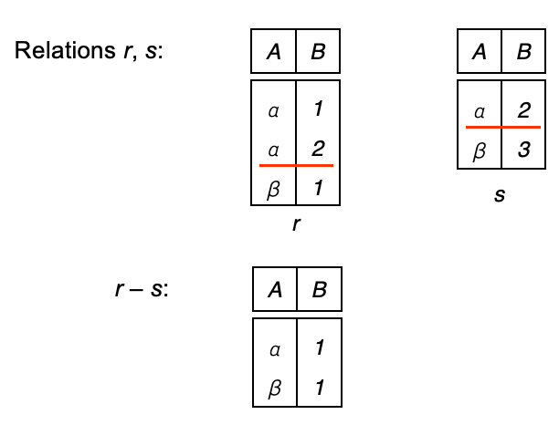
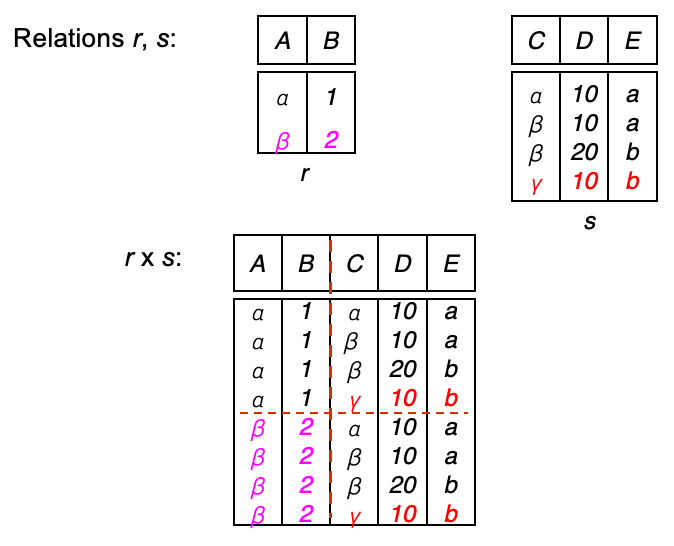
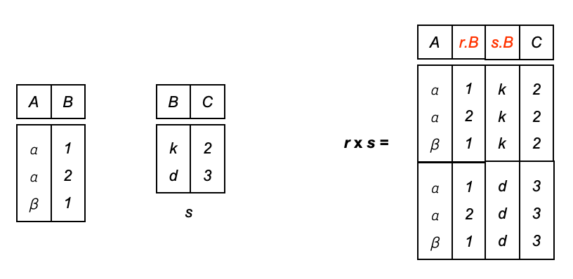
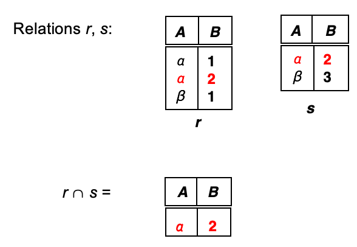
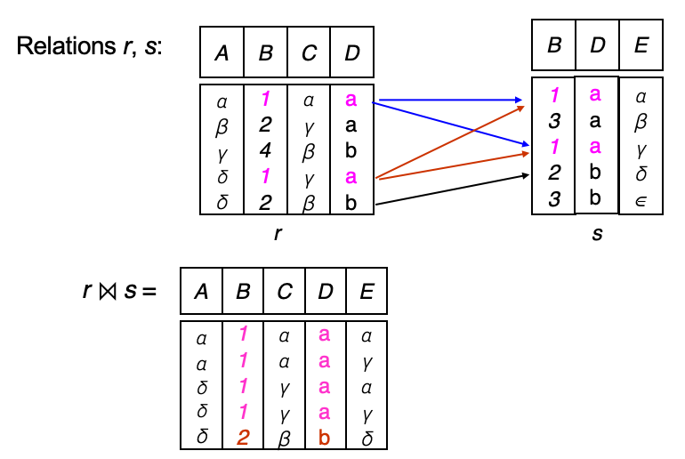
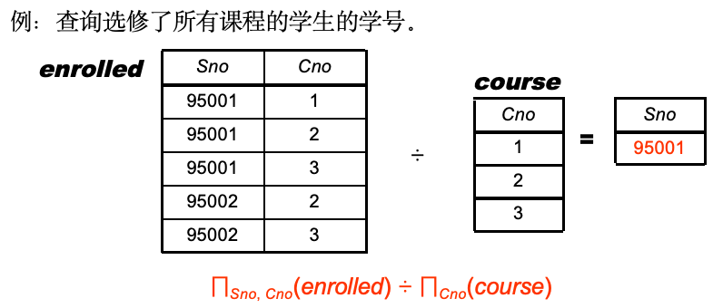
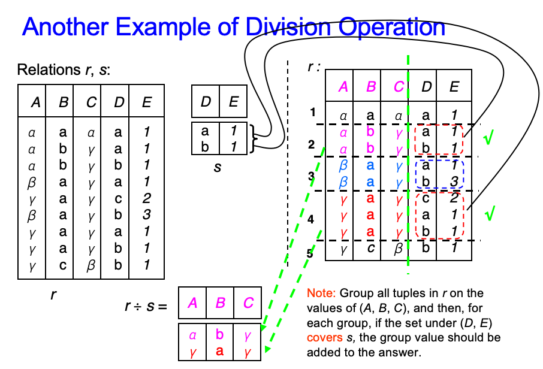

# 关系模型

**优点**：直观，简单

## 关系数据库的结构

1. **属性类型**

- 关系的每个属性都有一个名称
- 每个属性允许的值的集合称为该**属性的域**（特殊值`null`是每个域的一个成员）
- 属性值（通常）要求是**原子的，即不可分割的**（多值和复合属性不是原子的）

2. **形式化表达**

- 假设 $A_1, A_2, …, A_n$ 是属性（列）
- $R = (A_1, A_2, …, A_n)$ 是一个关系模式 
    
    **e.g.** `instructor = (ID, name, dept_name, salary)`

- $r(R)$ 是在关系模式 R 上的一个关系 
    
    **e.g.** `instructor(instructor-schema)= instructor(ID, name, dept_name, salary)`

- r 的一个元素 t 是一个元组，由表中的**一行**表示
- `t[name]` 表示 t 在 name 属性上的值

3. **关系的性质**

- 元组可以**任意顺序**存储
- 关系中**没有重复的元组**
- 属性值是原子的

4. **码**

- **超码**：K 的值足够识别每个可能的 r(R) 中的唯一一个元组
- **候选码**：最小超码
- **主码**：
    - K 是一个候选码并且**由用户显式定义**
    - 通常用**下划线**标记
- **外码**：
    - 假设存在关系 r 和 s 满足 r(A, B, C)，s(B, D)，则**关系 r 中的属性 B 是引用 s 的外键**
    - r 是参照关系，s 是被参照关系
    - **参照关系中外码的值必须在被参照关系中实际存在，或为 null**
- 主键和外键是完整性约束

## 基本关系代数运算

1. **六个基本运算符**

- 选择、投影、并、差（集合差）、笛卡儿积、改名（重命名）
- 这些运算符**接受一个或两个关系**作为输入，并返回一个新的关系作为结果

2. **选择** $\sigma_p(r)$：提取满足条件的行（其中 $p$ 称为选择谓词）

??? example "Example"
    {style="width:40%;display: block;margin: 20px auto"}

3. **投影** $\Pi_{A_1, A_2, \ldots, A_k}(r)$：提取满足条件的列（去除重复行）

??? example "Example"
    {style="width:45%;display: block;margin: 20px auto"}

4. **并**：合并两个关系，去除重复行

??? example "Example"
    {style="width:50%;display: block;margin: 20px auto"}

5. **差**：从第一个关系中删除第二个关系中存在的行

??? example "Example"
    {style="width:50%;display: block;margin: 20px auto"}

6. **笛卡儿积**：生成所有可能的组合

??? example "Example"
    {style="width:50%;display: block;margin: 20px auto"}

!!! warning "注意"
    当不同表中属性名字相同时，则需要使用**表名.属性名**来区分

    {style="width:60%;display: block;margin: 20px auto"}

7. **改名**：给关系（$X$）和属性（$A_1, ..., A_n$）重新命名 $\rho_{X(A_1, ..., A_n)}(E)$

!!! abstract "Exercise"
    见 ppt p32-39   !!!

## 附加关系代数运算

1. **四个基本运算符**：交、自然连接、除、赋值

2. **交**：两个关系中都存在的行

??? example "Example"
    {style="width:50%;display: block;margin: 20px auto"}

3. **自然连接** $r \bowtie s$

- r, s必须含有**共同属性**(名和域都对应相同)
- 连接二个关系中**同名属性值相等**的元组
- 结果属性是二者属性集的并集, 但**消去重名属性** 

??? example "Example"
    {style="width:50%;display: block;margin: 20px auto"}

4. **除**：从关系中提取满足条件的行

??? example "Example"
    {style="width:60%;display: block;margin: 20px auto"}
    {style="width:80%;display: block;margin: 20px auto"}

5. **赋值**：给关系中的属性赋值 $\leftarrow$

!!! success "Summary"
    1. 并、集合差、集合交为双目、等元运算
    2. 笛卡儿积、自然连接、除为双目运算
    3. 投影、选择为单运算对象（即单目运算）
    
    **操作的优先级：**投影 > 选择 > 笛卡儿积（乘） > 连接、除 > 交 > 并、差

## 扩展关系代数运算

1. **广义投影**

## Modification of the Database 
