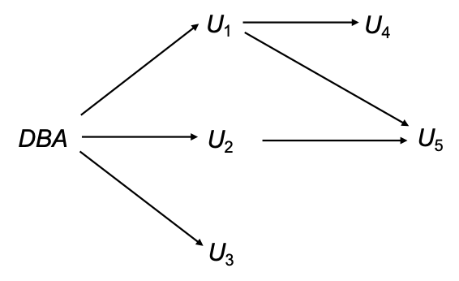

# SQL 进阶

## SQL 数据类型与模式
1. **数据类型**：

- **内置数据类型**
- **用户定义数据类型**
    - **结构化数据类型**：

        ```sql
        CREATE TYPE Address_Type AS (
            street VARCHAR(50),
            city VARCHAR(20),
            zip_code CHAR(6)
        );
        ```

    - **非重复类型**：基于内置基本类型创建的独立新类型
    
        ```sql
        CREATE TYPE person_name AS VARCHAR(20);

        CREATE TABLE student (
            sno CHAR(10) PRIMARY KEY,
            sname person_name,         -- 使用自定义类型
            ssex CHAR(1),
            birthday DATE
        );

        DROP TYPE person_name;
        ```

2. **域**

```sql
CREATE DOMAIN Dollars AS NUMERIC(12, 2) NOT NULL;
CREATE DOMAIN Pounds AS NUMERIC(12, 2);

CREATE TABLE employee (
    eno CHAR(10) PRIMARY KEY,
    ename VARCHAR(15),
    job VARCHAR(10),
    salary Dollars,           -- 使用 Dollars 域
    comm Pounds               -- 使用 Pounds 域
);
```

!!! warning "Warning"
    域不是**强类型**，它们只是对数据进行约束，可以和基本数据类型交互

    但是 type 是强类型，它不能和基本数据类型交互（不能进行赋值）


3. **大对象**：如照片、视频、CAD文件等

- **`BLOB`**：存储未解释的二进制数据（如图片、音频）
- **`CLOB`**：存储大量的字符数据（如长篇文档、电子书）
- 当查询返回大对象时，返回的是**指针**，而不是大对象本身
 
```sql
CREATE TABLE students (
    sid CHAR(10) PRIMARY KEY,
    name VARCHAR(10),
    gender CHAR(1),
    photo BLOB(20MB),   -- 定义 20MB 上限的二进制大对象
    cv CLOB(10KB)       -- 定义 10KB 上限的字符大对象
);
```

## 完整性约束
1. **作用**：完整性约束用于**防止意外破坏数据库**，确保对数据库的授权更改不会导致数据一致性丢失

2. **分类**：实体完整性、参照完整性和用户定义的完整性约束

3. 完整性约束是数据库实例**必须**遵循的规则

4. 完整性约束由**数据库管理系统（DBMS）**维护

### 域约束
1. **单一表上的约束**：`Not null` (非空)、`Primary key` (主键)、`Unique` (唯一)、`Check (P)`
   
2. `check` 子句允许**限制域**：

```sql
CREATE DOMAIN hourly-wage NUMERIC(5, 2)
    -- 为约束命名为 value-test，并设置校验逻辑：值必须 >= 4.00
    CONSTRAINT value-test CHECK (VALUE >= 4.00);
```

- `CONSTRAINT value-test` 子句是可选的，有助于指示哪个约束被违反了

### 参照完整性
1. 参照完整性约束也称为子集约束
   
2. 假设存在关系 r(A, B, C), s(B, D)，我们说 r 中的属性 B 是来自关系 r 的**外键**，r 称为**参照关系**，s 称为**被参照关系**

!!! warning "Warning"
    1. 参照关系中外码的值必须在被参照关系中**实际存在**，或为 `null`
    2. 参照完整性**仅在事务结束**时检查！

3. **插入**：向参照关系中插入元组，必须确保该外码的值在参照关系中存在
4. **删除**：删除被参照关系中的元组，需要查看参照关系中引用该元组的集合，如果这个集合不为空，那么：

- 要么拒绝删除命令作为错误
- 要么必须删除参照关系中引用该元组的元组（**级联删除是可能的**）

5. **更新**：更新外键的值，需要进行与插入类似的检查

6. **外键**：

```sql
FOREIGN KEY (account-number) REFERENCES account
-- 简写
acccount-number REFERENCES account
```

- 一般引用非参照关系中的主键
- 可以显式指定被引用表中的引用列，但**这些列必须被声明为主键/候选键**

    ```sql
    FOREIGN KEY (account-number) REFERENCES account (number)
    ```

7. **级联操作**

```sql
CREATE TABLE loan (
    ...
    FOREIGN KEY (branch-name) REFERENCES branch (name) 
    [ON DELETE CASCADE]
    [ON UPDATE CASCADE]
    ...
);
```

- `ON DELETE CASCADE`：如果删除了参照关系中的元组，则**级联删除其在被参照关系中的引用**
- 级联操作**可以沿着约束链传递**
- 但是如果中途存在约束违反，则整个级联操作的更改将被撤销

!!! abstract "**替代方案**"
    `ON DELETE SET NULL` or `ON DELETE SET DEFAULT`

    1. 外键属性中的空值会使 SQL **参照完整性语义复杂化**，最好使用 `not null` 来防止
    2. 如果外键的任何属性为 `null`，则元组被定义为**满足外键约束**！

### 断言
1. **断言**是一个谓词，表达了我们希望数据库**始终满足**的条件，用于**多个关系**上的复杂检查条件

```sql
CREATE ASSERTION <assertion-name>
CHECK (<predicate>);
```

2. 当做出断言时，系统在**每次**可能违反断言的更新时测试其有效性

3. **缺点**：可能会引入**大量开销**，因此应非常谨慎地使用断言

??? question "示例 1"
    每个分支的所有贷款总额必须小于该分支的所有账户余额总和。

    ```sql
    CREATE ASSERTION sum-constraint CHECK 
    (not exists (select * from branch B
                 where (select sum(amount) from loan
                        where loan.branch-name = B.branch-name)
                        >
                        (select sum(balance) from account
                        where account.branch-name = B.branch-name)));
    -- SQL 没有提供直接断言 for all X, P(X) 的构造，所以需要使用 exists
    ```

    示例 2 请查看 PPT

### 触发器

1. **触发器**是当数据库发生修改时，由系统**自动执行**的语句

2. 设计触发器机制时，必须指定触发器执行的**条件**以及触发器执行时要采取的**动作**

```sql
CREATE TRIGGER <trigger-name>
AFTER <event> ON <table-name>
REFERENCES <reference-table>
FOR EACH ROW
WHEN <condition>
BEGIN <action> END;
```

3. **触发事件**：`insert`、`delete`、`update`

- `update` 上的触发器可以**限制到特定属性**

    ```sql
    CREATE TRIGGER <trigger-name>
    BEFORE UPDATE OF <column-name> ON <table-name>
    ...
    ```

- 可以引用**更新前和后**的属性值：
    - `REFERENCING OLD ROW AS <alias>`：用于**删除**和更新
    - `REFERENCING NEW ROW AS <alias>`：用于**插入**和更新

4. **语句级 vs 行级触发器**

- **语句级**：`FOR EACH STATEMENT`
    - 对于事务影响的所有行，**只执行一次**触发器
    - **过渡表**：包含受影响行的临时表
        - `REFERENCING OLD TABLE AS <alias>`
        - `REFERENCING NEW TABLE AS <alias>`
    - 在处理更新大量行的 SQL 语句时**效率更高**
- **行级**：`FOR EACH ROW`
    - 触发器的执行次数等于影响的行数，为每个受影响的行执行**单独的操作**

## 授权

1. **对数据库部分**的授权形式：读授权、插入授权、更新授权、删除授权

2. **修改数据库模式**的授权形式：

- 索引授权：允许创建和删除索引
- 资源授权：允许创建新关系
- 修改授权：允许在关系中添加或修改属性
- 删除授权：允许删除关系

3. **视图的授权**

- 用户可以获得对视图的授权，而无需获得对视图定义中使用的任何关系的授权
- 创建视图**不需要资源授权**，因为没有创建真实的关系
- 视图创建者在视图上获得的权限，取决于其在**底层基础表**上已有的权限

4. 授权从一个用户到另一个用户的传递可以用**授权图**表示（节点是用户，根是数据库管理员）

??? example "Example"
    {style="width:40%;display: block;margin: 20px auto"}

    1. 授权图中的所有边必须是从数据库管理员出发的某条路径的一部分
    2. 如果 DBA 撤销对 U1 的授权，必须撤销对 U4 的授权；但是**不得撤销对 U5 的授权**，因为 U5 通过 U2 还有另一条来自 DBA 的授权路径
    3. **必须防止没有从根出发路径的授权循环**：DBA 授予 U7 授权 -> U7 授予 U8 -> U8 授予 U7，DBA 撤销对 U7 的授权，必须撤销 U7->U8 和 U8->U7 的授权，因为不再有从 DBA 到 U7 或 U8 的路径

5. **授予权限**

```sql
GRANT <privilege list>
ON <table / view>
TO <user list>
WITH GRANT OPTION;
```

- **`<user list>`**：用户ID、`public`（表示允许所有有效用户获得被授予的权限）、角色
- **`WITH GRANT OPTION`**：允许获得权限的用户将该**权限传递**给其他用户
- 权限的授予者必须已经持有对指定项的权限

!!! abstract "角色"
    1. 角色允许**为一类用户指定通用权限**，只需创建相应的角色**一次**
    2. 权限可以像授予用户一样授予角色或从角色撤销
    3. 角色可以分配给用户，**甚至其他角色**

    ```sql
    CREATE ROLE teller;
    GRANT SELECT ON account TO teller;
    GRANT teller TO mgr;
    ```

6. **撤销授权**

```sql
REVOKE <privilege list>
ON <table / view>
FROM <user list> [restrict / cascade]
```

- **`restrict`**：防止级联撤销
- **`cascade`**：撤销级联（从用户撤销权限可能导致其他用户也失去该权限）

!!! tip "Tip"
    如果撤销的权限包括 `PUBLIC`，则除了那些被显式授予的用户外，所有用户都将失去该权限

!!! abstract "缺点"
    1. SQL 不支持 元组级别的授权 **e.g.** 不能通过授权限制学生只查看他们自己成绩的元组
    2. 一个应用程序的所有最终用户可能被映射到**单个数据库用户**，造成身份丢失
    
    - 在上述情况下，**授权的任务落在了应用程序身上**，SQL 不提供支持
        - **优点**：细粒度的授权（对单个元组）可以由应用程序实现
        - **缺点**：授权必须在应用程序代码中完成，并且可能分散在整个应用程序中，检查是否存在授权漏洞变得**非常困难**，因为这需要阅读大量应用程序代码

## 审计追踪
1. **审计追踪**是所有更改（插入/删除/更新）的**日志**，以及诸如哪个用户执行了更改、何时执行更改等信息

2. **用途**：跟踪错误/欺诈性更新

3. **实现**：可以使用触发器实现，但许多数据库系统提供**直接支持**

4. **语句审计**

```sql
AUDIT <st-opt> [BY <users>] [BY SESSION | ACCESS] [WHENEVER SUCCESSFUL | WHENEVER NOT SUCCESSFUL]
```

- **`<st-opt>`**：TABLE, VIEW, ROLE, INDEX 等
- **`BY <users>`**：指定要审计的用户（如果不指定，则审计所有用户）
- **`BY SESSION`**：只审计当前会话中的语句，相同类型的需审计的 SQL 语句仅记录一次
- **`BY ACCESS`**：每次执行均记录
- **`WHENEVER SUCCESSFUL`**：只记录成功的语句

5. **对象审计**

```sql
AUDIT <obj-opt> ON <obj> | DEFAULT [BY SESSION | BY ACCESS] [WHENEVER SUCCESSFUL | WHENEVER NOT SUCCESSFUL]
```

- **`<obj-opt>`**：SELECT, INSERT, UPDATE, DELETE, EXECUTE 等
- **`<obj>`**：审计对象表、视图名
- **`DEFAULT`**：对其后创建的所有对象起作用
- **实体审计对所有的用户起作用**

6. **取消审计**： `NOAUDIT ...`

7. **查看审计结果**

- 审计结果记录在**数据字典表 `sys.aud$`** 中
- 也可从`dba_audit_trail`、`dba_audit_statement`、`dba_audit_object`中获得有关情况
- **访问权限**：仅 DBA 用户 (SYSTEM) 可见

## 嵌入式 SQL
1. **目的**：弥补 SQL 在复杂计算和系统资源调用上的非完备性

2. **宿主语言**：嵌入 SQL 的编程语言（C, Java, 等）

3. **基本用法**： `EXEC SQL <embedded SQL statement> END_EXEC`

**注**：不同语言语法略异，如 `Java` 使用 `# sql { ... }`

4. **单行查询**

```c
// 声明宿主变量
EXEC SQL BEGIN DECLARE SECTION;
char V_an[20], bn[20];
float bal;
EXEC SQL END DECLARE SECTION;
……
scanf(“%s”, V_an);          // 读入账号, 然后据此在下面的语句获得 bn, bal 的值
EXEC SQL SELECT branch_name, balance
         INTO :bn, :bal     // 给宿主变量赋值
         FROM account
         WHERE account_number = :V_an;
END_EXEC
printf(“%s, %s, %s”, V_an, bn, bal);
……
```

- `:V_an, :bn, :bal` 是宿主变量，可**在宿主语言程序中赋值**，从而将值带入 SQL
- 宿主变量在宿主语言中使用时**不加 `:` 号**

5. **单行更新**

```sql
……
scanf(“%s, %d”, an, &bal);   // 读入账号及要增加的存款额
EXEC SQL update account set balance = balance + :bal
         where account_number = :an;
……
```

6. **多行查询**

- **Step 1**：用 SQL 指定查询并为其**声明一个游标**

    ```sql
    EXEC SQL
    DECLARE c CURSOR FOR
    SELECT customer_name, customer_city
    FROM depositor D, customer B, account A
    WHERE D.customer_name = B.customer_name
        and D.account_number = A.account_number
        and A.balance > :v_amount
    END_EXEC
    ```

- **Step 2**：`OPEN` 执行查询并**生成结果集**

    ```sql
    EXEC SQL OPEN c END_EXEC
    ```

- **Step 3**：`FETCH` 将查询结果中一个元组的值**放入宿主语言变量**，并移动指针到下一行（重复调用以获得后续元组）

    ```sql
    EXEC SQL FETCH c INTO :cn, :ccity END_EXEC
    ```

- **Step 4**：`CLOSE` 释放结果集占用的临时资源

    ```sql
    EXEC SQL CLOSE c END_EXEC
    ```

!!! abstract "状态监测"
    ```sql
    Exec SQL include SQLCA; 
    ```
    
    SQL 通讯区，是存放语句的执行状态的数据结构，其中有一个变量 `sqlcode` 指示每次执行 SQL 语句的返回代码（success, not_success）

7. **多行更新**：通过将游标声明为 `for update` 来更新游标获取的元组

- **游标**

    ```c
    Exec SQL DECLARE csr CURSOR FOR
        SELECT *
        FROM account
        WHERE branch_name = ‘Perryridge’
        FOR UPDATE OF balance;      // 
    ……
    ```

- **更新**

    ```c
    EXEC SQL OPEN csr;
    while (1) {
        EXEC SQL FETCH csr INTO :an, :bn, :bal;
        if (sqlca.sqlcode <> SUCCESS) BREAK;
        ……                  // 由宿主语句对 an, bn, bal 中的数据进行相关处理 (如打印)
        EXEC SQL update account
            set balance = balance + 100
            where CURRENT OF csr;
            // 或删除当前行
            // EXEC SQL delete from account where current of csr
    }
    ……
    EXEC SQL CLOSE csr;
    ……
    ```

## 动态 SQL

```c
// 定义动态 SQL 程序
char *sqlprog = “update account
                  set balance = balance * 1.05
                  where account_number = ?”
// 准备：将 SQL 程序编译成可执行代码
EXEC SQL PREPARE dynprog FROM :sqlprog;
char v_account[10] = “A_101”;
……
// 执行：将参数绑定到 SQL 程序，并执行
EXEC SQL EXECUTE dynprog USING :v_account;
```

1. **动态 SQL 的本质**是将 SQL 语句视为一个字符串，在程序运行过程中**动态构建**，并通过 `PREPARE` 和 `EXECUTE` 两个阶段交给数据库处理

2. 上述程序包含一个 **`?`**，这是一个**占位符**，用于替换在执行 SQL 程序时通过 **`USING`** 变量提供的值

## ODBC 与 JDBC

1. **ODBC 开放数据库互连**：应用程序与数据库服务器通信的标准 API

2. **特点**

- 具有 **DBMS 无关性**（不特定于某种数据库，而嵌入式 SQL 特定数据库）
- 不需要预编译

!!! tip "Tip"
    该部分具体请查看 PPT Lecture 4