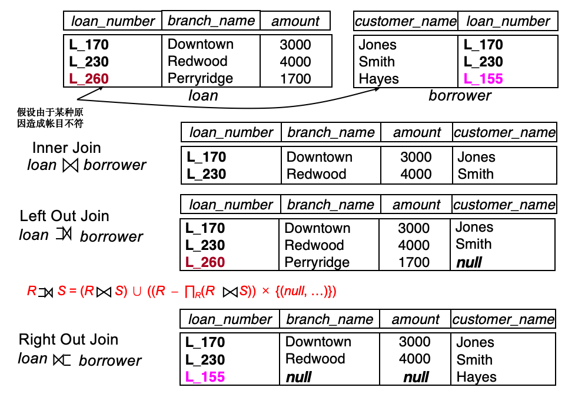
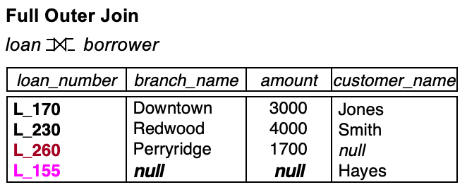

# SQL 基础
---

**SQL 标准符合度**：入门级、过渡级、中间级、完全级

## 数据定义语言 DDL

```sql
CREATE TABLE branch(
    branch_name   char(15) not null, 
	branch_city	  varchar(30), 
	assets	      numeric(8, 2),  
    primary key (branch_name)
);
```

1. **主要功能**：定义每个关系的模式、属性值的域、完整性约束、物理存储结构、索引以及视图
2. <mark>**域类型**</mark>
    - `char(n)`：**固定长度**的字符串，长度由用户指定
    - `varchar(n)`：**可变长度**字符串，最大长度由用户指定为 `n`
    - `int`：整数
    - `smallint`：小范围整数
    - `numeric(p, d)`：定点数，`p` 表示数字的总位数（精度），`d` 是小数点右边的位数
    - `real/double precision`：浮点数和双精度浮点数
    - `float(n)`：浮点数，精度至少为 `n` 位
    - `null`：`not null` 禁止该属性出现空值
    - `date`：**日期**（年、月、日）
    - `time`：时间（小时、分钟、秒）
    - `timestamp`：日期加上时间
3. **创建表**

    ```sql
    CREATE TABLE table_name (
        A1 D1,          -- A1是属性名，D1是属性的域类型
        A2 D2,
        ...
        An Dn
        (integrity_constraint_1)
        ...
        (integrity_constraint_n)
    );
    ```

    !!! abstract "完整性约束"
        1. **`not null`**
        2. **`primary key (A1, ..., An)`**：必须唯一且不为空
        3. **`check (P)`**，其中 `P` 是一个谓词


4. **删除表** `DROP TABLE table_name;`
5. **修改表**

    ```sql
    -- 添加列A，类型为D
    ALTER TABLE table_name
    ADD A D;
    -- 删除列
    ALTER TABLE table_name
    DROP A;
    -- 修改列A的数据类型
    ALTER TABLE table_name
    MODIFY A D;                 -- MySQL
    ALTER TABLE table_name
    ALTER COLUMN A TYPE D;      -- PostgreSQL
    ```

6. **索引**

    ```sql
    -- 创建索引
    CREATE INDEX index_name
    ON table_name (A1, ..., An);
    -- 创建唯一索引（用于指定候选键）
    CREATE UNIQUE INDEX index_name
    ON table_name (A1, ..., An);
    -- 删除索引
    DROP INDEX index_name;
    ```

## 基本结构

```sql
SELECT A1, A2, ..., An      -- A1, A2, ..., An是属性名
FROM r1, r2, ..., rm        -- rm是表名
WHERE P                     -- P是一个谓词
```

1. **`SELECT` 子句**：选择属性
    - **`select *`**： 选择所有属性
    - 可以包含**算术表达式**，以及对**常量或元组属性**的操作
    - SQL 名称**不区分大小写**
2. **`FROM` 子句**：选择表
    - <mark>如果在 `FROM` 子句中指定了多个关系，对应于关系代数的**笛卡尔积**操作</mark>
    - <mark>加入 `WHERE` 子句，逻辑上等于**自然连接**</mark>
3. **`WHERE` 子句**：
    - 指定结果**必须满足的条件**
    - 比较结果可以使用**逻辑连接词**组合，包括 `AND`、`OR` 和 `NOT`
4. **重命名操作** `AS`

    ```sql
    SELECT A1 AS new_name, A2, ..., An
    FROM r1 AS t1, r2 AS t2, ..., rm AS t_m
    WHERE P
    ```

5. **字符串操作**

    ```sql
    -- 找出名字中包含子串“泽”的所有客户的姓名
    WHERE customer_name LIKE '%泽%'     
    -- 匹配名称 "Main%"
    WHERE customer_name LIKE 'Main\%'
    ```

    - <mark>实现**模糊匹配**：放置在 `WHERE` 子句中，且必须与 **`LIKE` 操作**结合使用</mark>
    - `%`：匹配任意子串
    - `_`：匹配任意单个字符
    - `||`：连接两个字符串
        
        ```sql
        SELECT '客户名=' || customer_name       -- 客户名=Lucy
        FROM customer
        ```

    - 函数 `lower( )` 和 `upper ( )` 转换大小写

6. **显示元组的排序**

    ```sql
    SELECT A1, A2, ..., An
    FROM r1, r2, ..., rm
    ORDER BY A1, A2, ..., An ASC        -- 升序(DESC: 降序)
    ```

7. **重复元组**
    - SQL 允许关系和查询结果中**出现重复**
    - `select distinct`：强制消除重复
    - `select all`：允许重复（默认值）

---
## 集合操作

1. <mark>集合操作包括 `UNION`、`INTERSECT` 和 `EXCEPT`，对应于关系代数运算 $∪$、$∩$ 和 $−$</mark>

2. **操作实例**

    ```sql
    -- 找出所有有贷款或有账户的客户
    ( SELECT customer_name FROM depositor )
    UNION
    ( SELECT customer_name FROM borrower )

    -- 找出所有既有贷款又有账户的客户
    ( SELECT customer_name FROM depositor )
    INTERSECT
    ( SELECT customer_name FROM borrower )

    -- 找出所有有账户但没有贷款的客户
    ( SELECT customer_name FROM depositor )
    EXCEPT
    ( SELECT customer_name FROM borrower )
    ```

    !!! tip "Tips"
        集合操作**默认去重**，需要加入 `ALL` 保留重复

---
## 聚合函数

1. **`GROUP BY` 子句**：将结果分组

    ```sql
    -- 找出每个支行的平均账户余额
    SELECT branch_name, avg(balance) avg_bal
    FROM account
    GROUP BY branch_name        -- 按支行分组(必须)
    ```

    !!! warning "警告"
        1. `SELECT` 子句中**聚合函数之外的属性**必须出现在 `GROUP BY` 列表中
        2. 如果没有 `GROUP BY` 时，整张结果表被看成一个大组，此时如果 `SELECT` 中只有聚合函数是合法的，如果还有其他属性则不合法

2. **`HAVING` 子句**：过滤分组结果

    ```sql
    SELECT A.branch_name, avg(balance) 
    FROM account A, branch B 
    WHERE A.branch_name = B.branch_name and branch_city =‘Brooklyn’ 
    GROUP BY A.branch_name 
    HAVING avg(balance) > 1200      -- 分组之后的谓词
    ```

!!! success "Tips"
    1. <mark class="green">**SELECT 执行顺序**：FROM → **where → group → having** → select → distinct → order by</mark>
    2. <mark class="orange">**聚合函数不能直接在 `where` 子句中使用**</mark>
    3. 除了 `count(*)` 以外，所有的聚合函数都会忽略 `null` 值
    4. 如果集合为空，`count` 返回 0，其他聚合函数返回 `null`

---
## NULL

1. 涉及 `null` 的任何算术表达式的结果是 `null`
2. 与 `null` 的任何比较返回 **`unknown`**

    ??? abstract "unknown 三值逻辑"
        1. `OR`: 
            - (unknown or true) = true
            - (unknown or false) = unknown
            - (unknown or unknown) = unknown
        2. `AND`: 
            - (true and unknown) = unknown
            - (false and unknown) = false
            - (unknown and unknown) = unknown
        3. `NOT`: (not unknown) = unknown

3. <mark>谓词 `is null`、`is not null` 可用于**检查空值**</mark>

---
## 嵌套子查询

```sql
SELECT account_number AN, balance  
FROM account A                    
WHERE balance >= (        -- 每遍历一行就执行一次子查询             
    SELECT max(balance) 
    FROM account B             
    WHERE A.branch_name = B.branch_name
) 
ORDER BY balance;  
```

1. **嵌套查询的用途**：集合比较、测试空关系、测试重复元组的缺失
2. **集合比较**
    1. **`some`**：集合中至少有一个元素满足条件

        ```sql
        -- 大于 Brooklyn 支行其中一个资产的所有支行
        SELECT distinct branch_name
        FROM branch
        WHERE assets > SOME (
            SELECT assets
            FROM branch
            WHERE branch_city = 'Brooklyn'
        );
        ```

    2. **`all`** ：集合中所有元素都满足条件

        ```sql
        -- 大于 Brooklyn 支行所有资产的所有支行
        SELECT distinct branch_name
        FROM branch
        WHERE assets > ALL (
            SELECT assets 
            FROM branch 
            WHERE branch_city = ‘Brooklyn’
        );
        ``` 
    
    3. **`in`** & **`not in`**

    !!! tip "Tips"
        <mark class="green">在同一 SQL 语句内，除非外层查询的元组变量引入内层查询，否则内层查询只进行一次</mark>

        **相关子查询**：内层查询引用了外层查询的变量

        ```sql
        SELECT c.customer_name
        FROM customer c
        WHERE EXISTS (
            SELECT *
            FROM depositor d
            WHERE d.customer_id = c.customer_id  -- 外层查询的变量引入内层查询
        );
        ```

3. **测试空关系**：如果作为参数的子查询非空，则 <mark>**`exists`** 结构</mark>返回真值 `true`

    ```sql
    SELECT distinct S.customer_name 
    FROM depositor as S 
    -- 条件：不存在一所分行，它既属于 Brooklyn，而客户 S 在那里又没有账户
    WHERE not exists ( 
        (SELECT branch_name 
        FROM branch 
        WHERE branch_city = ‘Brooklyn’) 
        EXCEPT
        (SELECT distinct R.branch_name 
        FROM depositor as T, account as R 
        WHERE T.account_number = R.account_number 
            and S.customer_name = T.customer_name)) 
    ```

4. **测试重复元组的缺失**：<mark>**`unique`** 结构</mark>用于测试子查询的结果中是否存在重复元组

    ```sql
    -- 查找在 Perryridge 分行至多拥有一个账户的所有客户
    SELECT customer_name
    FROM depositor as T
    WHERE unique            -- 查找账户是否唯一
        (SELECT R.customer_name
        FROM account, depositor as R
        WHERE T.customer_name = R.customer_name 
            and R.account_number = account.account_number
            and account.branch_name = 'Perryridge')
    -- 至少两个账户 not unique
    ```

---
## 视图

1. **视图**：提供了一种机制，可以**隐藏某些数据**，使其对某些用户不可见
2. **好处**：安全性；易于使用，支持逻辑独立性
3. **创建视图**：

    ```sql
    CREATE VIEW view_name (c1, c2, ..., cn) AS
    SELECT A1, A2, ..., An
    FROM r1, r2, ..., rm
    WHERE P
    ```

4. **删除视图**：`#!sql DROP VIEW view_name;`

---
## 派生关系

```sql
SELECT branch_name, avg_bal 
FROM (SELECT branch_name, avg(balance) 
    FROM account 
    GROUP BY branch_name) 
    as result (branch_name, avg_bal) 
WHERE avg_bal > 500 
```

1. **派生关系**：其元组并不直接物理存储在数据库中，而是根据定义的规则从底层表中提取、组合或计算出来的<mark>**虚拟表**</mark>
2. 派生关系**最常见的形式**：视图或派生表（派生表必须有自己的别名）
3. <mark>**`WITH` 子句**：允许为查询**局部**定义视图，而不是全局定义</mark>

    ```sql
    WITH derived_table_name(A1, A2, ..., An) AS 
        SELECT A1, A2, ..., An
        FROM r1, r2, ..., rm
        WHERE P
    SELECT A1, A2, ..., An
    FROM derived_table_name
    WHERE Q
    ```

---
## 数据库的修改

1. **删除**

    ```sql
    DELETE FROM table_name
    WHERE P
    ```

2. **更新**

    ```sql
    UPDATE table_name
    SET A1 = E1, A2 = E2, ..., An = En
    WHERE P
    ```

    - 视图只基于一张表时（行列视图），**视图的更新**会**自动更新**基表
    - <mark class="orange">视图基于多个表时，视图不能进行更新</mark>

    !!! abstract "用于条件更新的 Case 语句"
        ```sql
        UPDATE table_name
        SET balance = CASE
                        WHEN balance > 1000 THEN balance * 0.95
                        ELSE balance * 1.05
                    END
        ```


3. **插入**

    ```sql
    INSERT INTO table_name (A1, A2, ..., An)
    VALUES (E1, E2, ..., En)
    ```

4. **事务**
    - 事务是作为一个单一逻辑单元执行的一系列查询和数据更新语句
    - `COMMIT WORK`：使事务的所有更新在数据库中**永久生效**（成功执行则自动提交）
    - `ROLLBACK WORK`：**撤消**事务所执行的所有更新
    - **四个属性**：原子性、隔离性、一致性、持久性

---
## 连接关系
```sql
Select * 
from loan inner join borrower on loan.loan_number = borrower.loan_number
```

1. **连接条件**：定义两个关系中的哪些元组匹配，以及结果中存在哪些属性
    - **自然连接** `natural`： 两个关系中具有相同属性的行匹配
    - **`on`**：容许**不同名**属性的比较，且<mark>结果关系中**不去重**</mark>
    - **`using`**：类似于 `natural `连接，但**仅以 `using` 列出的公共属性**为连接条件 
2. **连接类型**：
    - **内连接 inner join**：<mark>只保留满足连接条件的元组</mark>
    - **左外连接 left outer join**：保留左侧表的所有行，匹配右侧的表
    - **右外连接 right outer join**：保留右侧表的所有行，匹配左侧的表
    - **全外连接 full outer join**：保留所有行，匹配的空列用 `NULL` 填充


??? example "连接"
    {style="width:70%;display: block;margin: 20px auto"}

    {style="width:50%;display: block;margin: 20px auto"}

??? question "问题"
    Example: Find all customers who have either an account or a loan (but not both) at the bank. 

    ```sql
    SELECT customer_name 
    FROM (depositor natural full outer join borrower) 
    WHERE account_number is null or loan_number is null 
    ```

